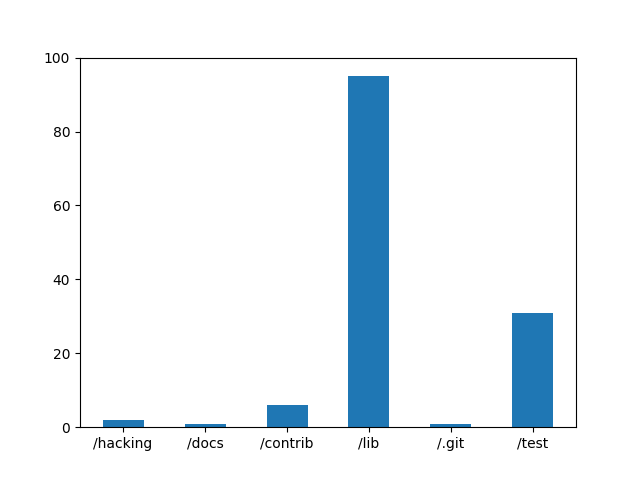
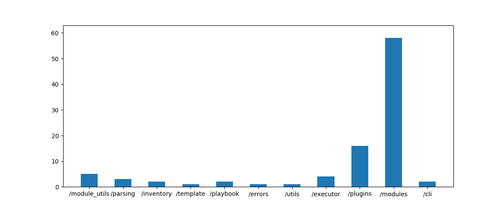
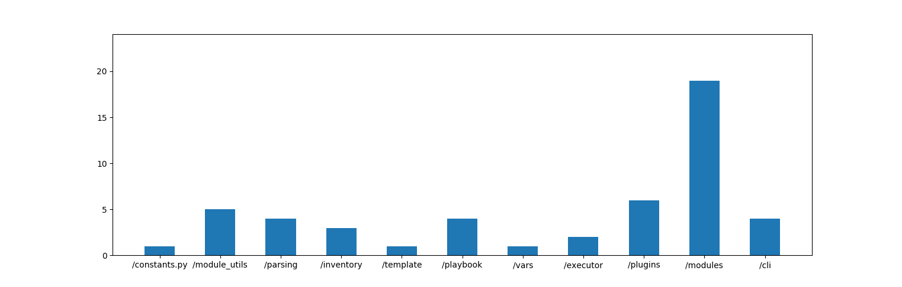

By [Ivo van Kreveld](https://github.com/ivo2357), [Jens Voortman](https://github.com/RyuuTDF), [Matthijs Amesz](https://github.com/Metamess) and [Wouter van der Zwan](https://github.com/Woutrrr)

## Abstract

*Ansible is an IT automation system that can be used to automate repetitive tasks on remote hosts that would otherwise have to be done manually.
It's an open source project with contributors varying from developers employed by Ansible to users wanting a specific feature in Ansible.
This chapter hopes to give the reader an insight in the architecture of Ansible so that the project can be understood more easily.
To accomplish this, the architecture of Ansible is analysed with different perspectives in mind.
This analysis involves Stakeholders, the Technical Debt, the Context View, the Functional View, the Development View, and the Usability Perspective.*


## Introduction
In the modern day, nearly every company needs some sort of IT infrastructure; firewalls, servers both remote and local; for internal use, hosting websites and apps, or for product deployment.
Deploying all these systems, keeping them running and up to date is an enormous amount of tedious work.
Ansible seeks to make this a thing of the past, by providing an easy way to automate the deployment and management of all your systems.

First created in 2012 by Michael DeHaan (@[mpdehaan](https://github.com/mpdehaan)), Ansible has grown into a widely used platform counting some of today's largest IT companies among its users.
The core system of Ansible resides on GitHub as an open source project, and is always under active development.
Developers and users, both private and from third party companies, work on Ansible every day to add new features and improve Ansible for their use case.
Though the core system only contains a command line interface, Red Hat Inc. provides Ansible Tower; a graphical user interface with additional functionality to make Ansible as user friendly as possible.
However, since Ansible Tower is a proprietary project and a paid product, it falls outside the scope of this chapter.

A team of four TU Delft students from the Delft Students on Software Architecture group has made a thorough analysis of the software architecture of the Ansible system.
Their findings are presented in this chapter.
The chapter starts with a Stakeholders Analysis, followed by a Context View and Functional View.
A Development Model is provided, along with the Usability Perspective.
Finally, the Technical Debt is analysed, followed by some closing remarks on the overall findings.


## Stakeholders
This section gives an overview of the types of stakeholders that can be identified for the Ansible project. 
Relevant types were taken from the classification explained by Rozanski and Woods [[1](#rw)].
The sources are the [Ansible GitHub repository](https://github.com/ansible/ansible), the [Ansible Website](https://www.ansible.com/) and the [Red Hat Website](https://www.redhat.com/en).


### Stakeholders Analysis
#### Acquirers
The Acquirers are the overseers of the procurement of the system or product.
Ansible was created in February 2012 by @[mpdehaan](https://github.com/mpdehaan).
Shortly after, in 2013, Ansible Inc. was founded to sponsor the development of Ansible.
In October 2015 Red Hat Inc. acquired Ansible Inc., currently making them the sole acquirer.
As owners of Ansible, it is in the interest of Red Hat Inc. to make Ansible the best possible platform, so they can keep selling Ansible Tower.

#### Developers & Maintainers
As stakeholders, the Developers construct and deploy the system from specifications, while Maintainers manage the evolution of the system once it is operational.
As Ansible is being developed and maintained at the same time, they can be considered as the same stakeholder group.
This group can be divided into two types of people.

The first type are the developers working for Red Hat.
All employees have the same interest, i.e. to make Ansible (Tower) into the best possible product so as to attract more sales.
A couple of developers can be identified who have been very active over the past years.
The person with the most commits made is still the original author @[mpdehaan](https://github.com/mpdehaan).
But since he has not made a single commit since the beginning of 2015, he is not considered an active stakeholder in this class anymore.
When looking at the commits made between January 1st 2015 and January 1st 2017, there are three people that have made over a thousand commits, and have at least double the amount of commits of the number four.
These people are Brian Coca (@[bcoca](https://github.com/bcoca)), Toshio Kuratomi (@[abadger](https://github.com/abadger)) and James Cammarata (@[jimi-c](https://github.com/jimi-c)).

The other type of Developer/Maintainer that can be identified is the GitHub Community.
As Ansible is an open source project, everyone can contribute to it.
The community contributors are not paid by Red Hat, so they don't have a monetary interest.
Instead, their interest is to help a project they like to keep evolving; fixing bugs or adding features they want Ansible to have.
Some of the community developers work for third party companies, who want to develop their own Ansible modules.
These community developers do have a monetary interest, namely making an Ansible module that best services their company's use case.


#### Testers
The Testers are responsible to test the system, so that it is suitable for use.
A GitHub project board was created in the Ansible repository where all pull requests and issues related to testing are combined.
From the project description it can be derived that John R Barker (@[gundalow](https://github.com/gundalow)) and Matt Clay (@[mattclay](https://github.com/mattclay)) have the responsibility for this.
As they both are employees of Red Hat, they have the same main interest as the other Red Hat employees, with the additional interest of achieving and maintaining test coverage.


#### Communicators
The communicators are responsible for the documentation and training materials to explain the system to other stakeholders.
The members of this group are the same as the Developers & Maintainers group.
As Communicators, their additional interest is in the documentation; the better it is, the more the other stakeholders can do on their own.
As a result the Developers are able to spend more time on the system, instead of having to answer questions. 


#### Suppliers, Users & System Administrators
As Ansible is a server configuration tool, the Users supply the hardware Ansible runs on and the software which it manages.
This makes the Users not only the Suppliers, but also the System Administrators, as they run the system when deployed.
Therefore these three groups of stakeholders can all be rolled into one.

A couple of different interests can be identified.
First of all Ansible needs to cater to their needs of server configuration and management, and make it as easy and automated as possible.

A different interest for them is scalability.
Some Users use Ansible to just manage a handful of servers.
Other notable Users of Ansible include Twitter, PayPal, eBay, and NASA.
The amount of servers they have to manage is a lot higher, and Ansible needs to work properly for both situations.


#### Support Staff
The Support Staff is described as the provider of support to users for the product or system.
In the case of Ansible, this is [Red Hat Support](https://access.redhat.com/products/ansible-tower-red-hat/).
Since Red Hat Inc. makes money by selling Ansible Tower, the interest of their support team is the same as the Red Hat Developers.

A second group of Support Staff is the GitHub community.
Instead of using the mailing list for support, some users create issues on Ansible's GitHub issue tracker.
Sometimes these issues are answered by other users on GitHub instead of the Ansible team.
This makes the GitHub Community also a Support Staff stakeholder.
Their interest could be to support a community they care about.


#### Cooperators
Cooperators are stakeholders that work with Red Hat Inc. to make their own services easier to use by using Ansible.
They have an interest in Ansible as they have more potential customers if the software is available to them. 

There are two types of Cooperators.
The first type are the cloud providers, who want to ensure that Ansible seamlessly integrates with their cloud services.
These cloud providers are Amazon Web Services, Google Cloud Platform, Microsoft Azure, OpenShift and Rackspace.

The second type are the OpenStack Partners. They want to make OpenStack easier to deploy and manage by using parts of Ansible.
These partners are CSC, Cisco, HP and, again, Rackspace.


#### Competitors
Competitors are companies or people that sell software that supplies more or less the same services as Ansible.
The competitors are also stakeholders, as the better Ansible is doing, the more potential customers they are losing. 
The main three competitors for Ansible are [Puppet](https://puppet.com/) by Puppet Labs, [Salt](https://saltstack.com/) by SaltStack and [Chef](https://www.chef.io/chef/) by Chef.
Of these competitors Puppet Labs has the most to lose, as Puppet currently has the biggest market share of the four products.


### Integrators
Integrators have the challenge to manage the pull requests of all contributors.
Looking at the issues and pull requests of the project and the information found on the website, the main integrators seem to be @[mattclay](https://github.com/mattclay), @[gundalow](https://github.com/gundalow) and @[bcoca](https://github.com/bcoca).
There are also others that have merge rights, but who are less prolific.

Ansible contains a lot of modules, most of which make it possible for companies to work with Ansible.
Therefore, a lot of people from those companies contribute to those modules of Ansible.
The integrators have the task to review these contributions, and rate their value to the Ansible project.
Many of the contributors may not have much experience with Ansible, because they only make a certain module for it.
As a result, the integrators frequently have to explain something about the project or its guidelines to maintain the quality.

The integrators seem to care most about the quality, the style and testing.
Most comments made by them are about the way of programming, not following the guidelines or not passing the tests.
They seem to care less about the importance of the contribution and if it fits with Ansible.
This may be because the contributions are the ones customers want, and are also the ones made by the contributors of customer companies, so it may not be as important for the integrators to look at this.
As can be seen, the challenges and strategies of the integrators follow largely from the type of company Ansible is.


## Context View
In this section we look at how Ansible relates to other programs, companies, and software systems.
It is a high level view, looking at what entities interact with Ansible.
In figure 1, a Context View Diagram can be found that gives an overview of most major parties.

### Development
Important groups to interact with Ansible are the developers and maintainers. 
This group consists of Red Hat employees and other contributors as described in the Stakeholders Analysis.
Ansible is written almost entirely in Python 2, and is slowly future-proofing itself to work with Python 3.
As such, the Ansible project is also impacted by developments in Python.
All of the development happens via GitHub, and therefore git is used as version control system.
The code of Ansible is licensed under the GNU General Public License, like most open source projects.

### Deployment
Apart from the development, there are of course users and systems that make use of Ansible.
The list of companies that make use of Ansible is long, and includes many large and well-known companies.
For example Twitter, PayPal, eBay, and even NASA are counted among the many users of the Ansible core system.
To support the requirements of such a large and diverse group of users, Ansible is available on many different platforms.
For starters, it runs on both Windows and Linux, as well as other UNIX based systems.
And of course, Ansible is also guaranteed to run on Red Hat Enterprise Linux.
Besides operating systems, there is a long list of cloud platforms that Ansible interacts with.
All the major cloud platforms are supported: the Google Cloud Platform, Microsoft's Azure, Amazon Webservices as well as Rackspace and OpenShift.
As such, there are many parties who either have an impact on or are impacted by Ansible.


|  |
|:-------------------------:|
| *Figure 1: Context View* |


## Functional View
The Functional View gives a high level overview of what Ansible does
It defines some components with a specific function as well as the interface through which the components are accessed.
Also, it covers the interactions between those components and the interface.
These components and interactions are summarized in figure 2.

##### Command line interface
The command line interface lets the user interact with the system.
It can be used to execute tasks or a playbook containing multiple tasks.
It is the only available interface with which users can interact with the other components (with the exception of Ansible Tower, which is a separate product)

##### Playbook
A playbook can be used to execute a series of Ansible tasks in order.
It is written by a user in YAML-format to automate the process of executing a number of specific tasks.
It can then be executed using the command line interface.

##### Inventory
An inventory is a file containing connection details for the hosts and other variables.
The playbook uses this to execute tasks in a specific way.

##### Task
A task is the execution of an Ansible Module using certain input parameters.
It can be executed as part of a playbook or as a separate task given via the command line interface.

##### Node
A node is where a task gets executed and can be for example a server or networking appliance.
A task connects to a node.

|  |
|:-------------------------:|
| *Figure 2: Functional View* |

## Development Model
### Module Structure Model
The source code of the Ansible project is ordered in several folders. 
These folders are in general a good separation of the different modules that can be found in the project.
This is because each of the folders has a specific function (as explained below), so that they can easily be categorised in modules.
Additionally, since these functions need other functions to do their work, the dependency between the modules is easily seen as well.
With this in mind, the Module Structure Model can be made, which is shown in figure 3 below.

|  |
|:-------------------------:|
| *Figure 3: Module Structure Model* |

First the modules will be identified and explained.
After all modules are identified the dependencies between them will be discussed.


##### Interface
The Ansible community version is controlled through various command line programs.
These programs mainly differ how the input is given to Ansible; `ansible-playbook` expects a playbook where the `ansible` program expects a task description right from the console.
These programs can be found in the `cli` folder.

Another interface is Ansible Tower.
However, Ansible Tower is not part of the open-source project as it is a paid service by Red Hat Inc.


##### Configuration
Ansible has several sources from where configuration can be retrieved.
The files in `inventory` organise the list of predefined hosts the user wants to connect to.
The `vars` folder manages the handling of variables, which can come from different places and files.
Finally, the `parsing/vault` folder is a place for the secure storage of secrets, which are required to connect to remote targets and on the remote target during execution of a task.


##### Parser
To instruct Ansible what tasks to execute users can write playbooks.
Interpreting these written playbooks is done by the Parser module found in the `parser` folder.


##### Compilation
Compilation or packaging is the process of preparing the tasks to be executed on the remote target.
The `playbook` folder holds the files used for preparing the execution files.


##### Execution
The work horse of Ansible is the executor module.
This module orchestrates the actual execution of tasks on remote targets. 
Most of the code is found in the `executor` folder, but execution is also heavily influenced by the loaded plugins.


##### Ansible Modules
This group consists of the so called 'Ansible Modules'.
The Ansible Modules are small programs that perform a specific task on the remote target.
There are a lot of these modules neatly categorised in subfolders of the `modules` folder.


##### Plugins
Ansible enables plugins to alter the behaviour of almost any part of the program.
A plugin could for instance add new connection types, new credential/variable stores, or caching.
These plugins are located in the `plugins` folder.


##### Ansible Module Utilities
Ansible Module Utilities provide helper functions that Ansible modules can use with their functioning.
These Ansible Module Utilities are located in the `module_utils` folder


##### Layer dependencies
Looking at these modules, a layered model could be made by looking at the dependencies between the modules.
At the top of this model, there is the interface layer.
The interface layer is the first thing that is used when running an Ansible command.
It contains the interface module and, if it would be part of Ansible, Ansible Tower as well.
Then, the behaviour of the commands needs to be determined.
The interface layer is therefore dependent on the behaviour layer.
The behaviour layer consists of the configuration module and the parser module.
These modules are in the same layer because they have a similar function.
After that, the commands should be compiled and executed.
This happens in the execution layer, which consists of the compiler module and the executor module.
Again, since these modules have a similar function, they are in the same layer.
Finally, the execution layer needs the Ansible modules layer to execute the Ansible commands which contains such a module.
Each of these Ansible modules is a module, but since there are so many of them, they are not named in the model.

Apart from those layers, there is the extension layer, which is standard code that helps with the functioning of the rest of the code.
This layer consists of the Ansible plugins module, the third party plugins module and the Ansible module utilities module.
Because the other layers use these modules to perform their function, those layers are dependent on the extension layer.


### Common Design Model
This model contains some design constraints on the defaults and standard libraries for the elements of the system.
By making all elements adhere to these constraints, the coherence and maintainability of the system increases.
Three different sets of constraints will be described: the Common Processing that is required, the Standard Design across elements, and the Standard Software Components that are to be used.


#### Common Processing Requirements
##### Message logging and instrumentation
Ansible takes a very light approach to logging. 
It is turned off by default.
To enable logging, the `ansible.cfg` file must contain the variable log_path and have the desired logging location as a value.
Logging is not done directly by the code, but done via the Display class in `utils/display.py`.
Plugins, Ansible modules and other community contributions are encouraged to use the Display class, but are allowed to generate their own logging directly via the built-in python logging library.
However, if this library is used, these components must use their own, clearly named Logger instance.


##### Security and encryption
All passwords and other types of sensitive data are to be securely stored using the Ansible vault class, instead of as plaintext entries in user playbooks or roles.
The vault class is built to properly handle encryption and decryption of data.
Rather than risk making mistakes in the implementation of security in multiple places, the vault focusses all the efforts in one place.


#### Standard Design
##### Ansible Modules
Ansible modules are scripts that can be used by Ansible in the command line or in a playbook.
They control system resources and return certain information.
The output of Ansible modules must be in a JSON format.


##### Initialisation
Ansible tasks are initialised in an interface such as the console or the playbook.
Tasks are things Ansible should do and contain an action, which specifies which modules to run with which arguments.
This interface then makes sure the task will be executed.


##### Security and encryption
Any and all modules must take the necessary security precautions, such as:
- User input should not be passed to the shell, and the shell should be used as little as possible.
- All user input must be extensively validated.
- If a subprocess is required, start it via the `module.run_command` wrapper instead of the built-in Python functions for subprocesses.
More specific module security guidelines can be found in the Ansible Coding Guidelines [[3](#do)][[4](#co)].


##### Language Restrictions
All the code on Ansible must be written in Python 2.X, specifically 2.6+ for the core code and 2.4+ for Ansible modules.
Python 3 is not officially supported, and users will need to write their own modules if they wish to port it.
Users are allowed to write Ansible modules or inventory scripts in other languages, but these are highly unlikely to get merged into the official Ansible project.
Module docstrings, configuration files and other loaded files must be in YAML format. 
These documents may have either no extension, or be a '.yaml'  or '.yml'.


#### Standard Software Components
##### Ansible Module Utilities
Ansible has a folder containing Ansible module utilities.
These can be imported to use them when developing Ansible modules.
At the very least, each Ansible module should import from the Ansible module utility `basic.py`.


##### Third Party Libraries
Ansible uses the following third party libraries where applicable:
- *Jinja* 2 as the (HTML) templating engine
- *PyYAML* for the serialization of data to and from YAML format
- *Paramiko* for SSH
- *pywinrm* for WinRM
- *Pycrypto* version >= 2.6 for all basic encryption (to be done only in the vault class)
- *Setuptools* for packaging
- Optionally: *Cryptography* for extra encryption options

Ansible Modules have a very diverse set of functions. They use different third party libraries if needed.


### Codeline Model
Code quality is an important aspect of a project.
In a closed source project by a company, the turnover of contributors (the employees) will generally be low.
This can lead to a more consistent code style.
However, as in an open source project anyone can contribute, you have no idea what quality of code you might get.
Therefore it is important to make guidelines on what the code should look like and how it should be delivered. 

#### Guidelines
Ansible provides guidelines that can be found in the repository [[2](#an)] and the online documentation [[3](#do)][[4](#co)].
The preferred style guide is PEP8, although generally it is not enforced. 
However, there are exceptions to this; for example the four space indenting for Python is strictly enforced.

There are also guidelines for documenting Ansible modules. 
They should be documented in YAML and contain ANSIBLE\_METADATA, DOCUMENTATION, EXAMPLES and RETURN blocks.


#### Directory Organisation
The root directory contains a variety of folders, files and documentation.
The focus of this section will be on the folders and their purposes.
Empty directories and directories without code have been omitted from the tables.

| Folder        | Purpose       |
| ------------- | ------------- |
| /contrib      | Community Inventory Scripts |
| /examples     | Usage examples, now deprecated [[4](#an)] |
| /hacking	| Developer Tools |
| /lib/ansible  | Core code and Ansible Modules |
| /packaging 	| Release builders |
| /test 	| Tests |

It can be seen that the core code resides in the `lib/ansible`.
So let's take a closer look at this folder.

##### /lib/ansible Organisation
| Folder        | Purpose       |
| ------------- | ------------- |
| /cli 		| Command Line Implementation |
| /compat 	| Compatibility code for Python 3 |
| /errors 	| YAML Error parsing (Handling and Messages) |
| /executor 	| Code for parsed Playbooks execution |
| /galaxy 	| Galaxy API code |
| /inventory 	| Inventory scripts parsing |
| /module_utils | Ansible Module Utilities |
| /modules 	| Ansible Modules, grouped in subfolders by type |
| /parsing 	| YAML and JSON parsing |
| /playbook 	| Playbooks parsing |
| /plugins 	| Plugins |
| /template 	| Code for Playbook and Remote Target templating |
| /utils 	| Ansible Core Utilities |
| /vars 	| Variable related code |

The `lib/ansible` folder is very neatly organised.
This includes a very structured `modules` folder for the Ansible Modules.
There are a lot subfolders, so the modules can be grouped by type.
Examples of these types are `crypto`, `messaging`, `monitoring` and `network`.

One of the special folders is `compat`. Ansible does not officially support Python 3, so the compatibility code for this goes in here.
The Ansible module developers and users are responsible for writing compatibility code themselves if they want to run a module in Python 3.


### Releases
Ansible uses a four month release schedule, with support provided to the two most recent stable major releases. 
The release schedule is flexible and can be extended for major changes in the code.
For every release a Release Candidate 1 (RC1) is made available.
If there are no major bugs after five days, it becomes a finalised release.
Otherwise, after bugfixing RC2 is released and is run for two days.
If more major bugs are found, this process is repeated with an increased candidate number.

Currently Ansible has package builders for Arch, Debian, FreeBSD, Gentoo and MacPorts.
Each package builder has a separate folder in `packaging`.
Alternatively users can download a release as a .tar.gz [[5](#re)].


## Usability Perspective
### User Interaction
User interaction is an important thing to define. 
It shows you where a user is and is not supposed to be able to provide input or receive output.
There are two points of interaction that can be identified for Ansible.

The first one is via the CLI. 
The user is supposed to be able to do quick, atomic interactions via Ad-Hoc commands.
Examples of these are checking whether a package is installed or starting a service. 

The second one is via a playbook.
There are a lot of options that can be set in a playbook.
Examples include setting up specific cloud storages or configuring a complete firewall.
The possibilities for interaction here are very extensive. 

A third point of interaction would be Ansible Tower.
However, as stated earlier, it is not part of Ansible's core, so it will not be discussed here.


### System Context and User Capabilities
Ansible aims to help DevOps and SysOps automate repetitive tasks.
The goal is to make setting up and managing servers easier and less time-consuming.
This means Ansible is to be used internally in a very specific context.

Users should be able to setup a server without help and know their way around the CLI and programming.
They should be experienced enough to figure out how to use Ansible with the extensive available video library [[6](#vl)].
In case a user needs more help, Red Hat holds an introduction training every month as well as webinars on various topics for more advanced users [[7](#tw)].


## Technical Debt
Technical Debt is what makes future development on a system harder.
It arises when coding guidelines are ignored or quick workarounds are employed over actual fixes.
This section analyses the Technical Debt present in Ansible.

### TODO and FIXME analysis
Firstly, it can be noted that Technical Debt is not or barely discussed via GitHub issues.
Various search terms as "todo", "fixme", "debt" and "bug" lead to almost no discussions.
The few times it was discussed, a workaround was given as an answer.
The developers mentioned they would not look into a better solution for it.
Other than that, Technical Debt is seen mainly by TODO's and FIXME's in the code.
TODO's are used to note missing functionality or features that should be added at a later date.
FIXME's are used to note bugs or broken code that needs fixing.

Just before version 2.3 was released there were 136 files with TODO's and 102 files with FIXME's.
Figure 4 and 5 show the locations of TODO's and FIXME's respectively, grouped by folder.
From these figures the observation can be made that the `lib` and the `test` folders are responsible for the lion's share of the TODO's and FIXME's.

This makes sense if you take the directory structure, discussed in the Development View section, into account.
The `lib` folder is where all the source code and all modules and plugins are stored.
The majority of the code files are in this folder.
The `test` folder holds all the tests for the whole Ansible system.
The reason for this debt will be discussed in the Testing Debt section.

 | 
:-------------------------:|:-------------------------:
*Figure 4: TODO chart*   | *Figure 5: FIXME chart*

Looking closer into the `lib/ansible` folder, it can be seen that it contains 95 files with TODO's and 50 with FIXME's.
Figure 6 and 7 show the breakdown of TODO's and FIXME's into the subdirectories of `lib/ansible`.
Figure 6 shows that more than three-quarter of the files with TODO's are from third party code files (`inventory`, `modules` and `plugins`).
Ansible's core code files actually have very little TODO's.
They do contain Technical Debt from FIXME's, as figure 7 shows half the files with FIXME's are from Ansible's core code.
A possible explanation for this difference is that in Ansible modules the focus lies on missing features, while in the core code it lies on marking bugs.

|  |
|:-------------------------:|
| *Figure 6: TODO chart for `lib/ansible`* |

|  |
|:-------------------------:|
| *Figure 7: FIXME chart for `lib/ansible`* |

### Testing Debt
Ansible developer @[bcoca](https://github.com/bcoca) stated in an IRC conversation that Ansible originally had a lot of Testing Debt.
Therefore, the development team specifically hired @[mattclay](https://github.com/mattclay) to extend the amount of testing done.
According to @[bcoca](https://github.com/bcoca), he has succeeded in greatly reducing that debt.
However, recently Ansible changed their testing framework from nose2 to PyUnit.
This meant that all tests had to be ported over to the new framework.
Therefore the current Testing Debt has increased again, as can be seen in the amount of files in figure 4 and 5 that have TODO's or FIXME's in the testing code.
However, once the transition period is over and all tests have been correctly ported, the Testing Debt should be low again.

The tests for Ansible can be divided into unit tests and integration tests.
The integration tests can also be divided into multiple subsets.
There are for example destructive subsets that are allowed to install or remove packages among other things.

The focus will lie on the code coverage report for unit tests, which can be generated running the following commands:
```
test/runner/ansible-test units -v --python 2.7 --cov
test/runner/ansible-test coverage html
```
Different python versions can be used to run the unit tests depending on which number is specified after the python parameter.

The following results are based on a unit test run which completed in 291.68 seconds and contained 1347 passed and 3 skipped tests.
The total coverage of unit tests is 60 percent, which is on the low end.
However, they are still in their framework transition.
The coverage is a combination of both core and third-party folders.
Third-parties are responsible for their own tests, which can lead to fluctuations in the coverage as they all need to update their tests.
Furthermore, Ansible states that the focus lies on integration tests instead of unit tests, which are not taken into account in these results.
Once all tests have been ported over to PyUnit, the general coverage should see a rise again.
For example, if we look at the parsing folder, which is important as it contains the code that parses the playbooks, it actually shows a decent coverage of 85 percent.

## Conclusion

Ansible is an IT automation system that lets users automate their server configuration and provision needs that would otherwise have to be done manually.
A lot of big companies use Ansible to save time.
Ansible has a small team of core developers working for Red Hat Inc., the owner of Ansible.
Since Ansible uses separate Ansible modules to do its work, companies are interested in creating and maintaining these modules to fit their specific needs.
Some of Ansible's contributors work at other companies and are mainly interested in the Ansible Modules working with the product of their own company.
As a result, the core developers of Ansible have a lot of work reviewing new modules and maintaining and improving the core code at the same time.

Because of this, Ansible suffers from Technical Debt.
The project contains a large number of FIXME and TODO statements, indicating work is needed to make the code more readable and maintainable.
Next to that, there is also Testing Debt, which means code is not or only partly tested.
The core developers acknowledge this Testing Debt is in Ansible, and they have taken actions to reduce it.

That being said, Ansible is still a well working application that is very useful for companies.
Since automation of system deployment and maintenance will remain an issue in the future, Ansible is expected to stay relevant and useful for many years to come.


## References
1. <div id="rw"/>Nick Rozanski and Eoin Woods. Software Systems Architecture: Working with Stakeholders using Viewpoints and Perspectives. Addison-Wesley, 2012.
2. <div id="an"/>https://github.com/ansible/ansible.
3. <div id="do"/>https://github.com/ansible/ansible/blob/devel/CODING_GUIDELINES.md.
4. <div id="co"/>http://docs.ansible.com/ansible/community.html#i-d-like-to-learn-how-to-develop-on-ansible.
5. <div id="re"/>http://releases.ansible.com/ansible/.
6. <div id="vl"/>https://www.ansible.com/videos.
7. <div id="tw"/>https://www.ansible.com/webinars-training.
