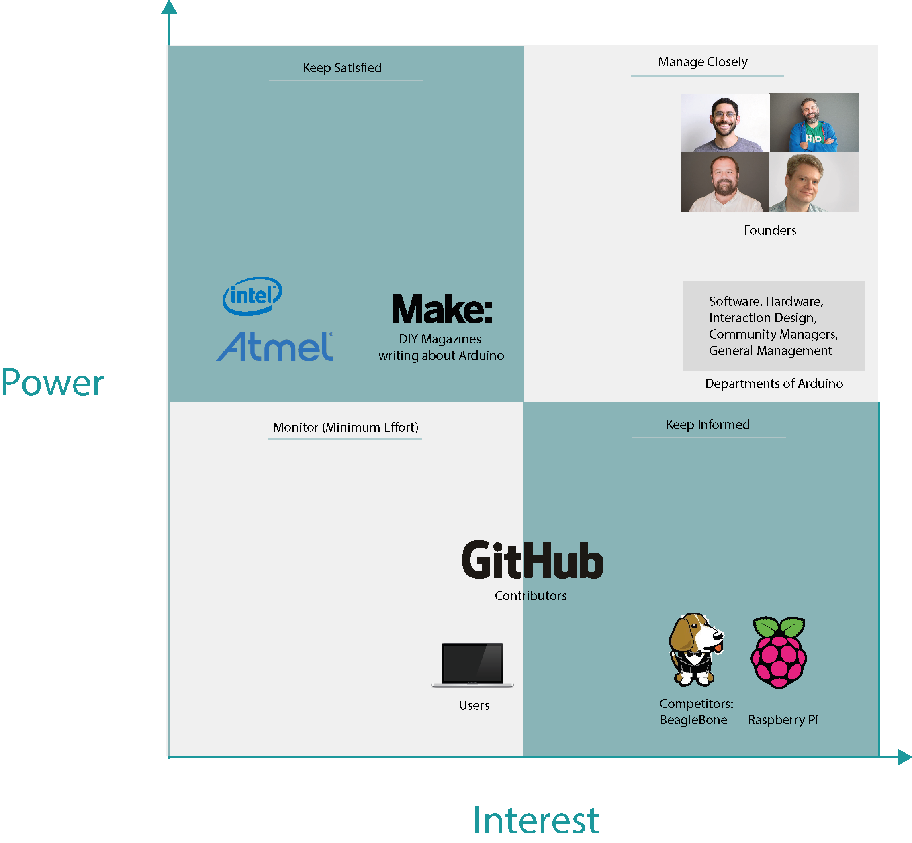
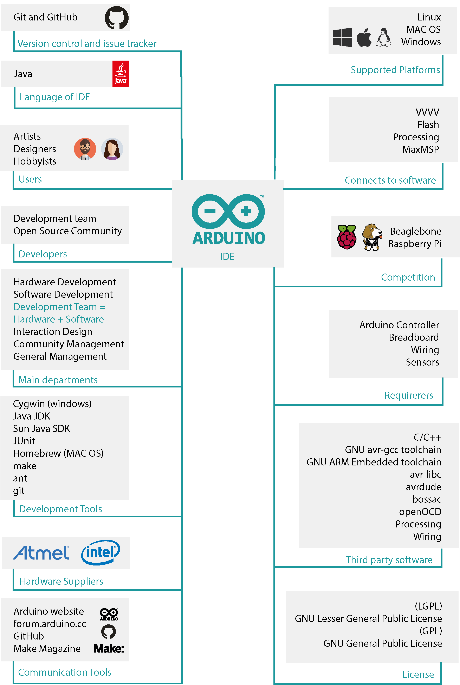
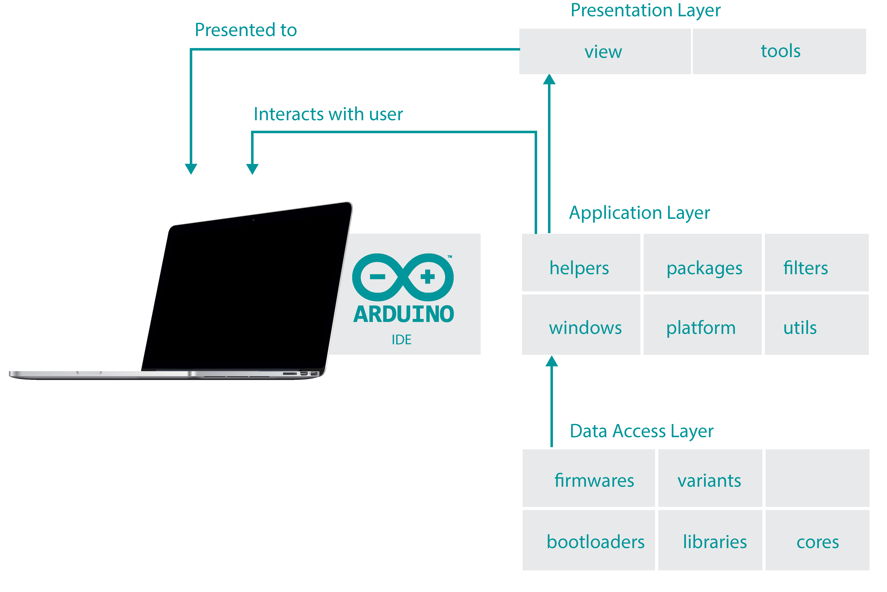
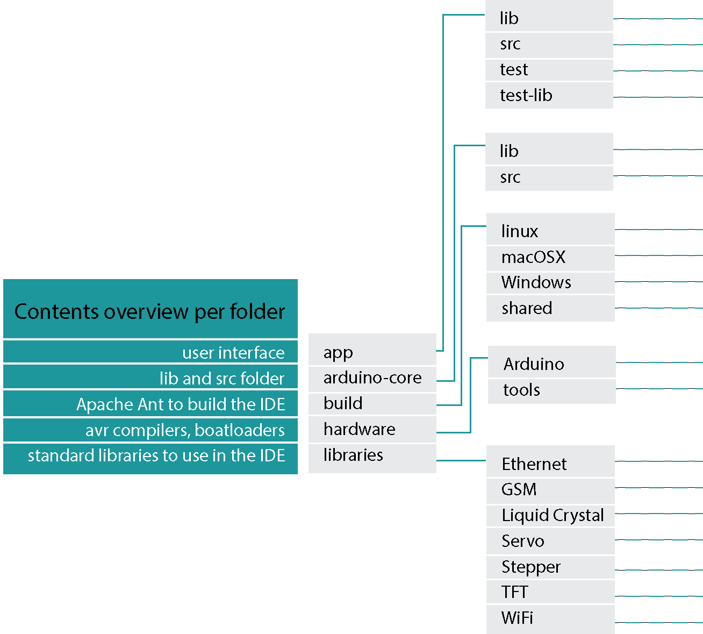
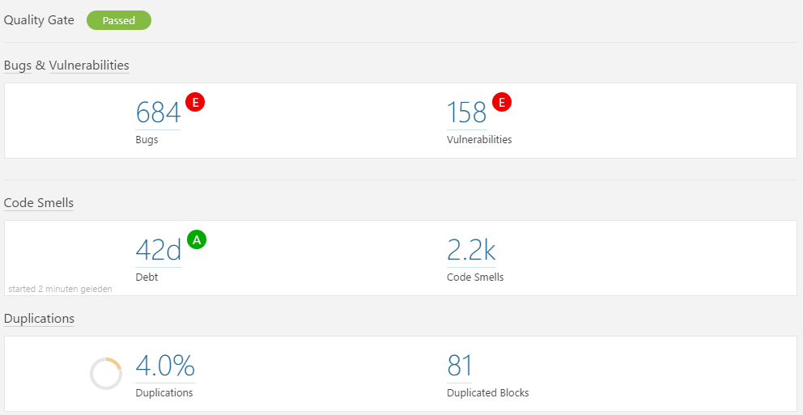
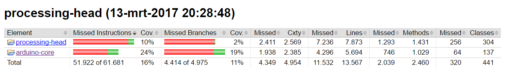
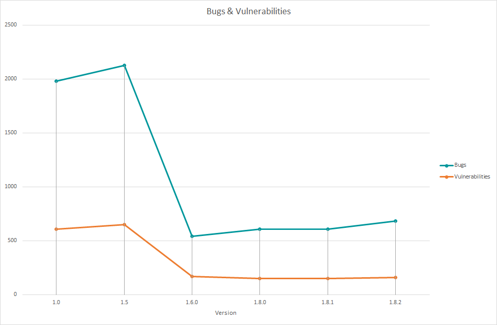
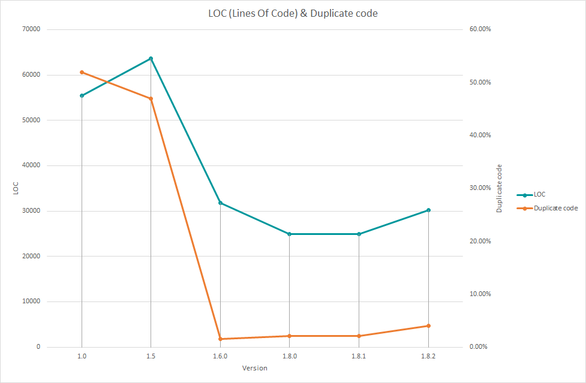
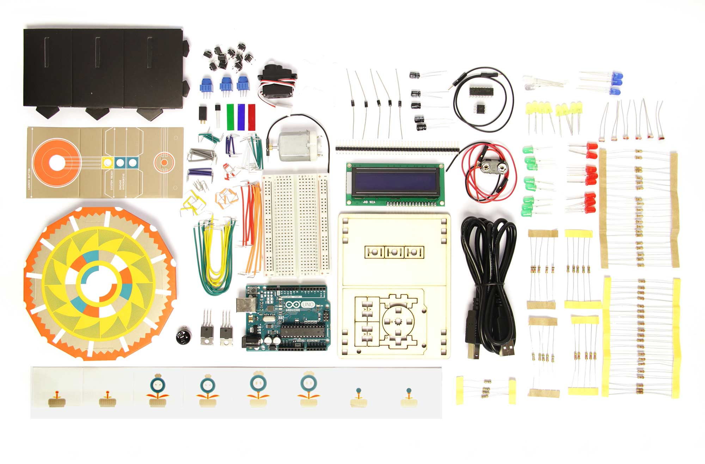
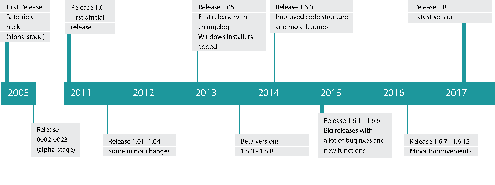

# Arduino - The Open-Source IDE

**By [Jeroen Overman](https://github.com/jeroenoverman), [Lourens Pool](https://github.com/LourensPool), [Laura Kreuk](https://github.com/lkreuk) and [Thijmen Ketel](https://github.com/thijmenketel)**

_Delft University of Technology_

## Abstract

_Arduino is a fast and easy prototyping platform based around a small microcontroller and designed for students, artists, hobbyists and developers. The system was created by four engineers to make programming and prototyping easier and cheaper. While the development is open-source, the amount of documentation about contributing is limited. This results in a project where programming is not done through conventions or guidelines but with a strong focus on getting things to work. In this chapter Arduino is analysed through the people that are involved, the development process and the architectural design of the project. Furthermore, issues that slow down or stop the development process are discussed._

## Introduction

When we look at the current state of technology it is clear that it is an amazing time to be alive. The speed of technological advancements has never been so high and electronics and gadgets can be found everywhere. What starts out as an idea can be made real in no time through the help of crowdfunding and fast prototyping. A big role in that last part is played by the subject of this chapter: Arduino.

Arduino is an Italian company specialized in making prototyping and tinkering with electronics accessible for the masses. Started by four engineers with the goal to make programming and prototyping easy and, most important, affordable. The system is originally based around Atmels 8-bit microcontroller platform but quickly evolved to be a staple in the projects of students, hobbyist, artists and even professionals. Arduino now has over 700 000 official boards in the hands of its users and almost the same amount of clones (copies of official boards) [[1](#arduinofaq)].

While the hardware is created by Arduino itself, the IDE (Integrated Development Environment) written in Java is an open-source effort. This easy to use app is created, added to and improved by a community of enthusiastic developers and users. This makes the Arduino project accessible and fuels innovation through a large pool of ideas from which the IDE can be improved. Prototypes, which are programmed in a C/C++ dialect, can realise innovating ideas like [Moistly](https://hwstartup.wordpress.com/2013/09/27/moistly-the-journey-from-arduino-idea-to-product/) by easy integration through Arduino.

In this chapter the open-source project of the Arduino IDE is reviewed by four TU Delft students from the DESOSA (Delft Students on Software Architecture). The analysis is done through different aspects of the Arduino system, mostly based on the code, documentation and activity on the open-source Arduino repository on GitHub. Stakeholders, Architecture overview, the existence of Technical Debt, a development-view, and of course an explanation of the Arduino system and its evolution are some of the subjects analysed in this chapter.

## Stakeholders

Many stakeholders are involved with Arduino, these are explained according to the most important stakeholders identified by Rozanski and Woods [[2](#rw)]. Arduino is a company that specializes in hardware boards which are plug and play programmable with their own IDE (Integrated Development Environment). This is reflected by structure of the company, which is divided into five different departments:

- Hardware
- Software
- Interaction Design
- Community Managers
- General Management

_Table 1: Summary most important stakeholders._

Stakeholders  | Description
------------- | ----------------------------------------------------------------------------------------------------------------------------------------------------------------------------------------------------------------
Acquirers     | The founders of Arduino are the ones that authorize funding for the products and system developement. The funding is generated by crowdfunding [[11](#pitchbook)].
Assessors     | Rules and regulations that apply to the Arduino product portfolio are handled by the General Management team.
Communicators | The Community Management team explains the system via documentation and training materials.
Users         | The Arduino Suite is used by a lot of students, artists, hobbyist as well as by professionals who want a prototype working in no time.
Testers       | All bugs in the software can be posted on the Arduino forum, emailed or issued on Github. Bugs and problems are picked up by the software and hardware staff employees of Arduino or the contributors on Github.
Developers    | The people working on the code for the end product are both the hard- and software team.
Support staff | The website forum.arduino.cc plays a central role in staying in tough with users that report bugs as well as happily explaining nice projects that can be built with the products.
Suppliers     | Intel and Atmel are the main suppliers for the hardware. Furthermore, multiple tools and packages are used for both the software and the hardware.
Maintainers   | Software solutions are assessed by the Software development team in order to maintain the programming standards and architectural choices.

The four founders of Arduino are actively pushing and developing the long term strategy of the company [[4](#arduinoabout)].

_Table 2: Founders of Arduino and their role within the company._

Founders          | Role
----------------- | -----------------------------------------------------------------------------------------------------------------------------------------------------------------------------------------------
Massimo Banzi     | Is the CEO and has the most broad role. He gets advice from the three other founders.
David Cuartielles | Co-CEO and researcher on education projects, also maintains relationships with education policy makers in the European Union [[11](#pitchbook)]. Educational use is a large share of the sales.
Tom Igoe          | Responsible for user experience design in both software and hardware.
David Cuartielles | Focusses on the development of the Arduino software, mainly the IDE.

In most of the departments there is one person responsible for the communication to the stakeholders. One of the founders, Tom Igoe, advises on issues about the documentation, whereas Mikeal does this in the design team. Finally, the most important communicator is the Community Management team. The Community Management teaches Arduino and writes documentation and tutorials. They also speak at conferences and exhibitions.

Arduino has a team of engineers dedicated to both hard- and software. This chapter focuses on the software side of the development. The team is responsible for the end product and it works closely with the open source community on GitHub to constantly improve the product.

Anyone can join in designing the software and is encouraged to use the mailing list to get in touch with the software development team. In table 3 a small ranking of the most active contributors is shown in terms of number of commits. It does not reflect the most recently active contributors. It can be seen that most non-employees stay active for three years or so [[5](#contributors)].

_Table 3: Most active contributors in trems of number of commits._

Contributor       | Roles                     | Commits | LOC++     | LOC--     | Active during
----------------- | ------------------------- | ------- | --------- | --------- | --------------
Christian Maglie  | Software Engineer Arduino | 1.220   | 1.449.973 | 1.334.641 | 2011 - present
David A. Mellis   | Founder                   | 1.034   | 1.100.356 | 1.557.719 | 2005 - 2015
tigoe             | Contributor               | 330     | 1.024.956 | 25.437    | 2009 - 2013
Martino Facchin   | Firmware Engineer Arduino | 226     | 10.570    | 3.829.094 | 2015 - present
Matthijs Kooijman | Contributor               | 225     | 6.575     | 5.791     | 2013 - 2016
zeveland          | Contributor               | 187     | 37.586    | 32.097    | 2011 - 2013
Thibaut Viard     | Contributor               | 115     | 4.413.074 | 1.328.159 | 2011 - 2013

On the software side Arduino has the following suppliers. It uses the following packages: GNU avr-gcc toolchain, GCC ARM Embedded toolchain, avr-libc, avrdude, bossac, openOCD and code from Processing and Wiring. Arduino targets embedded applications, so the development of the Arduino IDE is also aided by the hardware design tools.

The management division takes responsibility for the strategy of the company. It works closely with all cores of the company: Hardware, Software, Interaction designers and Community Managers to create a clear and complete overview of the brand Arduino.

  

  

  

  <em>Figure 1: Power Interest Graph of the Arduino IDE.</em>

  <h2 id="context-view">Context view</h2>
  
The context view shows the different relations, dependencies and interactions Arduino has with its environment. Important for the context view are the people, systems and external entities with which the system interacts [<a href="#rw">2</a>]. The context view can be seen in figure <a href="#context-view">2</a> and the relations will be explained shortly.

  

  

  
<em>Figure 2: Arduino context model.</em>

  
In order to understand the context model of Arduino, the role of the external entities with respect to Arduino is explained.

  
<strong>IDE</strong>

  
The core of Arduino is written in Java. The users that work with the Arduino software can write programs, called sketches, to upload to their Arduino board in a form of C or C++. The software of Arduino can be installed on multiple platforms: Linux, Mac OS and Windows. The users of Arduino are mostly artists, designers or hobbyists.

  
<strong>Communication Tools</strong>

  
Arduino uses Github and Git for version control to help developers collaborate and track issues related to the software. Contributions in the repository come from the Arduino software development team, as well as from the open-source community. In order to stay in contact with developers and users the following communication tools are used: the <a href="https://www.arduino.cc/">Arduino website</a>, the <a href="forum.arduino.cc">Arduino forum</a> and Github.

  
Arduino's community managers also need to maintain a good relationship with magazines like <a href="http://makezine.com/">Make</a> who write about Arduinos products and competitors.

  
<strong>Development Tools</strong>

  
When you are developing software for Arduino you can make your life easier by using at least the following tools: Cygwin, Java JDK and Homebrew [<a href="#ardbuilding">7</a>].

  
<strong>Third party software</strong> The IDE can be connected to third party software: Flash, VVVV, Processing or Max/MSP. Finally, Arduino has some dependencies during run-time [<a href="#ardreame">8</a>]. These can be found in the top right corner of figure <a href="#context-view">2</a>.

  
<strong>Hardware Boards</strong>

  
When using the Arduino IDE you also need some hardware to start a project, for this an Arduino controller, breadboard, wiring and sensors are needed. Arduino has two main suppliers of the hardware: Intel and Atmel.

  
Some of the competitors of Arduino are Beaglebone and the Raspberry Pi. The Pi and Beaglebone are equipped with a faster processor and can be connected to the internet and HDMI displays out of the box. While the Arduino boards are using a simple processor and need another shield (hardware board) in order to be connected to the internet or a monitor.

  
Although Arduino lacks computational power compared to the Pi and the Beaglebone, it compensates this with its focus on simplicity and ease of use. The Arduino boards are also more suitable for hardware related projects. The smooth learning curve, extensive tutorials and lively community allows anyone to start programming.

  <h2 id="development-view">Development view</h2>
  
This section gives an overview of the structure of the Arduino project from the perspective of the developers. Concerns like module organisation, standardization of design and codeline organisation are addressed. Due to the lack of technical documentation for the structure of the project, some parts cannot be described into depth.

  <h3 id="module-organization">Module organization</h3>
  
Modules are used to create an overview in the thousands of lines of code that the Arduino IDE has. These modules allow for a clear overview of a complex piece of software.

  
The Arduino repository does not have a specific naming convention that gives a clear overview of the underlying structure. Certain folder names (e.g. edazdarevic) make it unclear what it contains. In addition, not every folder contains an explanation file describing the role or function of the module.

  
The core modules are the GUI, IDE and hardware. In addition to these main components of the system there is also a module for building the software and a module that stores the libraries.

  
<em>Table 4: Core modules and their role.</em>

  <table><thead><tr><th>Module</th><th>Role</th></tr></thead><tbody><tr><td><code>app</code></td><td>This folder contains the Graphical User-Interface (GUI)</td></tr><tr><td><code>arduino-core</code></td><td>This folder contains the main parts for the IDE</td></tr><tr><td><code>build</code></td><td>This directory is meant for building the Arduino IDE to test added code</td></tr><tr><td><code>hardware</code></td><td>This folder contains everything for the hardware that is supported by Arduino</td></tr><tr><td><code>libraries</code></td><td>The standard libraries that are used by Arduino are stored here</td></tr></tbody></table>
  <h3 id="module-structure-model">Module structure model</h3>
  
The module structure model gives an overview of the systems source files. It uses modules into which source files are collected and lists the dependencies between the modules.

  

  

  

  

  <em>Figure 3: Module Structure Model.</em>

  
As can be seen in the module structure model (figure <a href="#modulestruct">3</a>) the Arduino system consists of three layers: the <em>presentation layer</em>, the <em>application layer</em> and the <em>data access layer</em>. The <em>presentation layer</em> consists of the classes that are used to output information to the user via the GUI. The user interacts with the <em>application layer</em>. Finally, the <em>data access layer</em> is responsible for accessing the data that is used in the system.

  <h3 id="standardization-of-design">Standardization of design</h3>
  
Because Arduino is developed by a <em>team</em> of software developers, it is necessary to standardize some key aspects of the design. Furthermore, it is important for the development team to provide a well-designed, maintainable, and stable platform for the future. To achieve these goals, the following design standards are used:

  <ul>
  <li>Emphasizing API design.</li>
  <li>Offering a small but easily-extendable core.</li>
  <li>Sacrificing (when necessary) <em>elegance of implementation</em>, in favour of <em>ease-of-use</em>.</li>
  <li>Emphasizing real use cases over theoretical possibilities.</li>
  <li>Focusing on the official Arduino hardware (Make sure official Arduino hardware works neatless instead of making a feature of a clone board work).</li>
  <li>Recognizing that documentation is as important as code.</li>
  <li>Trying to get things right the first time (even if this takes longer).</li>
</ul>
  
Main design decisions concerning Arduino:

  <ul>
  <li>Uses Apache Ant as a building tool.</li>
  <li>Code is written in Java.</li>
  <li>Uses Github as main code repository and for version control.</li>
  <li>Uses a lot of code from <a href="https://github.com/processing/processing">Processing</a>. This is an IDE for so called sketchbooks. This IDE enables users to learn programming in a visual context. .</li>
  <li>Based on same set of abstractions as <a href="https://github.com/WiringProject/Wiring">Wiring</a>, to make programming easier. Uses Wiring as an example for attaching microcontroller boards to software.</li>
  <li>Uses <a href="http://junit.org/junit4/">JUnit</a> as a testing framework.</li>
</ul>
  
As mentioned before Arduino chooses ease-of-use over elegance of implementation. When inspecting the code of the Arduino IDE very few design patterns can be found.

  <h3 id="standardization-of-testing">Standardization of testing</h3>
  
The standardization of testing helps to speed up the testing process and ensures a consistent result for each newly released product. Arduino uses the following standardization of testing:

  
When a developer wants to contribute to Arduino, a pull-request should be made on GitHub. The <a href="https://github.com/ArduinoBot">Arduino bot</a> makes an automated build of the IDE based on these pull-requests. The Arduino bot replies in the pull-request if the build is successful and links to files that should be tested. After this, the developers of Arduino will comment on the pull-request and discuss if there should be more changes.

  
The tests in the Arduino software are created using the Arduino test-suite library, they are developed as standard sketches. There are two kind of tests that are constructed for the software. Firstly, tests that are targeting specific issues, these should be made when a contributor fixes a specific Github issue in order to test the solution's correctness. Once the issue is integrated in the project, the test targeting the issue will be added to the automated test runs.

  
The other kind of tests that are constructed are the test-suite coverage tests. These tests are designed to test the functions in the code and its libraries, they run automatically and are version controlled. Furthermore there is a list of tests, made by identifying the features and issues of a new release. This list of tests should be passed before a new release can be made.

  
Despite the tests that are written, bugs exists in the Arduino project. A lot of bugs are found by users of the IDE and either communicated through the <a href="https://forum.arduino.cc">Arduino Forum</a> or by means of a GitHub issue.

  
Arduino does not seem to advocate the use of tools that test the code. For example, to look for duplicate code, naming conventions, unused code, etc. Good analysis of the code can benefit in finding problems and bugs early on and should be advocated as much as possible.

  <h3 id="instrumentation">Instrumentation</h3>
  
Inserting special code in order to log information, record system states or resource use about step executing is called instrumentation. This instrumentation is used to debug problems in the IDE [<a href="#rw">2</a>]. Arduino uses the <em>Java logger</em> class to log this information.

  
In the GUI module, a class for a console logger and a class for a log formatter is found. Thus, the logging is done in two ways, directly to the console and saved in a file which can be checked when necessary.

  <h3 id="codeline-organization">Codeline organization</h3>
  
The codeline organization is the way that the source code is stored in a directory structure, managed via configuration management and how it is built and tested regularly [<a href="#rw">2</a>]. In an open source project, it is important to organize the source code in a way that everyone can understand it and can add to it. An organized repository attracts enthusiastic programmers to start working on the code.

  
The source code of the Arduino IDE is spread over different directories also different Eclipse projects are present in the repository. This makes it hard for new developers to get familiar with the project. It is however easy to make your own build of the Arduino project. The Apache ANT automated software build tool is used to build the project. This works on all platforms where Arduino is supported.

  
Apache Ant is also configured to run the JUnit tests, which makes that easy to do because there is no needs to resolve all the external dependencies. The downside of using Apache Ant to build and test the project is that it is hard to debug the project using your own IDE. It is only possible to run the program en read the debug information. Step-by-step debugging is not easily achieved.

  
In figure <a href="#directoryim">4</a> below, a simple overview of the repository is shown. The directories at the repository are in grey and the contents of the root folders are listed in green to the left:

  

  

  
<em>Figure 4: One level unfolding of Arduino repository</em>

  <h2 id="technical-debt">Technical debt</h2>
  
Suppose there is a piece of functionality that needs to be added to the system. There are two ways of doing this, the quick "hacky" way and the slow and tedious but more clear and secure way. A lot of the time when a feature, fix or improvement is added to a project, this is done in the first way. The problem with this way of coding is that code might be unclear or too complex and can leave a project hard to contribute to. So in the future when a new feature or improvement needs to be added or a bug needs fixing, the code might require a lot of adjustments to become functional. This problem, regarding nasty code, is called technical debt. This technical debt needs to be managed and kept at a reasonable level to make sure that the developers can keep on contributing to the project. Furthermore, avoiding technical debt can keep the cost for maintenance lower, increase productivity and prevent unwanted surprises. In this section the technical debt that exists in the Arduino project is analysed.

  <h3 id="sonarqube-analysis">SonarQube analysis</h3>
  
One of the ways to find technical debt in a system is to use specialised software. The software that is used to analyse the debt in Arduino is called SonarQube. This tool is designed to analyse code for bugs, vulnerabilities and report on technical debt based on code smells (ugly code).

  <h4 id="overview-assessment">Overview &amp; Assessment</h4>
  
When the tool is executed on the Arduino project, it produces an overview of the issues it found. This overview also contains a metric that judges the project on its possibility for successfull release: quality-gate. The overview can be seen in figure <a href="#sonarqubeim">5</a>.

  

  

  

  

  <em>Figure 5: Overview produced by SonarQube of the Arduino project.</em>

  
SonarQube reported a large amount of bugs, vulnerabilities and code smells during its analysis. The issues ranged from severe (<em>Blocker</em>) to harmless (<em>Info</em>) and affected almost every part of the system.

  

  <em>Table 5: Issues reported by SonarQube and their assessment.</em>

  <table>
  <thead><tr><th>Issue</th><th>Assessment</th></tr></thead>
  <tbody><tr><td>Bugs</td><td>The 684 bugs that were found by SonarQube were mostly harmless, they might block the productivity of the developer but not the behavior of the system. About 50 were actually more severe and could cause problems like deadlocks or resource leaks.</td></tr><tr><td>Vulnerabilities</td><td>Similar to the bugs, most of the 158 vulnerabilities flagged by SonarQube were harmless and could only impair the productivity of the developer. Four were wrongly labelled as hardcoded password which were not accurate.</td></tr><tr><td>Code smells</td><td>The number of code smells that were found was pretty high (2228). This meant that the code was confusing, complicated and generally ugly. No coding guidelines or conventions were followed and large parts of the code is not documented.</td></tr></tbody>
</table>
  
The total calculated time to resolve all the issues found by SonarQube would be 65 days (this includes 42 days for the technical debt and another 23 days for the bugs and vulnerabilities). It is, however, not necessary to resolve all bugs, vulnerabilities and code smells to reduce the technical debt to a lower level.

  
The analysis already gives a very big hint about the state of the project and the way Arduino is developed. No guidelines or conventions are followed and large parts of the code is not documented.

  <h3 id="manual-analysis">Manual analysis</h3>
  
The next step is to look at the technical debt of the project manually. Multiple sources can indicate technical debt.

  

  <em>Table 6: Summary of issues found by manual identification of technical debt.</em>

  <table>
  <thead><tr><th>Indicator</th><th>Assessment</th></tr></thead>
  <tbody><tr><td>Documentation</td><td>Documentation that is provided with the Arduino software on the repository is very limited. Most documentation on the repositories wiki are about the end product (programming the hardware). No contribution-guide or coding guidelines are available.</td></tr><tr><td>Defects</td><td>When looking at the issues that are labeled <code>bug</code> on the repository and the age of the issue, it indicates that technical debt exists. Some of the bugs are dated back to 2012 which is very old and gives an indication of technical debt.</td></tr><tr><td>Refactoring</td><td>Multiple commits can be found that refactor the code and even some issues can be found that request refactoring of the code. Most of the issues are fixed or closed, but it is hard draw a conclusion from this fact as the number of commits containing a refactor are 49 of the more than 6000.</td></tr></tbody>
</table>
  
When looking at the indicators it does hint at technical debt. Especially documentation is an issue with Arduino. No clear guidelines and rules exist for contributing.

  <h3 id="testing-debt">Testing debt</h3>
  
Testing debt is concered with the testing of altered and existing code. To ensure that functions will keep on working with new changes, the code needs to be tested well enough.

  <h4 id="test-coverage">Test coverage</h4>
  
The test coverage of the Arduino project was measured by using the EclEmma plugin for Eclipse. The results of this coverage report can be seen in figure <a href="#testcovim">6</a>. The processing-head is the project that contains the graphical user interface which is based upon the <a href="https://github.com/processing/processing">Processing-project</a>. Arduino-core is the core of the Arduino IDE.

  

  

  
<em>Figure 6: Test coverage report of the Arduino project.</em>

  
As can be seen the test coverage of both Eclipse projects are not that high. The total covered instructions are 10% for the processing-head and 24% for the arduino-core. The total coverage of the branches is 2% for the processing-head and 19% for the arduino-core. These results are very low as most project consider 70%-80% more reasonable. Most of the errors can be attributed to the documentation debt. Trying to build the Arduino project requires a lot of googling due to the lack of a clear guide.

  
A total of 57 test are run on the Arduino project, which is not a high number. This indicates that the Arduino project probably has testing debt. However, this also relates to the problem of documentation debt.

  <h3 id="todo-s-and-fixme-s">TODO's and FIXME's</h3>
  
To get an indication of the policy about technical debt at Arduino, multiple sources are investigated. If developers discuss technical debt on the Github repository (in issues or pull-requests) this is more general, other stakeholders than the developers can contribute in the discussion. Whereas if there are TODO's (marker for later work) and FIXME's (marker for broken code) in the source code this is a discussion between the developers of the software.

  
The amount of "TODO" markers that pop up in the code for Arduino is 94, while the amount of "FIXME" markers is a lot lower with 18\. A third marker (XXX) indicates that some part of the code needs attention but does work, which there are 22 of. The number of FIXME's compared to the amount of TODO's does give a positive indication of how broken code is handled at Arduino. Most of the FIXME's are, however, about adding documentation, which further indicates documentation debt.

  <h3 id="debt-evolution">Debt evolution</h3>
  
To get a better perspective about the evolution of the technical debt in the project over time, we looked at the different releases of Arduino. The project has a total of 73 releases since 2005 (version 0002), with a release every few months. The releases do not contain any changelogs until the release of version 1.0.5 in 2013\. Arduino does release versions for beta testing by the community to fix bugs early on. Checking the issue list of Arduino there are 4252 issues closed and 719 still open. 43 open issues are tagged with the label bug and the largest part of those are open more than a year already. These issues definitely contribute to technical debt in the future.

  
To visualise the debt evolution over time SonarQube is executed over six Arduino verions: 1.0 (first release), 1.5 (first large BETA), 1.6 (large overhaul), 1.8.0, 1.8.1 (latest release) and 1.8.2 (current development) [<a href="#release">3</a>]. Two parts are visualised: Bugs &amp; Vulnerabilities (figure <a href="#bugstimeim">7</a>) and Technical debt in days (figure <a href="#debtim">8</a>). Furthermore, the amount of code and duplicated code is visualised to give an indication of the size of the project (figure <a href="#LOCim">9</a>).

  

  

  

  

  <em>Figure 7: Amount of Bugs and Vulnerabilities over the different releases found by SonarQube.</em>

  

  

  
<em>Figure 8: Amount of Technical debt in days over the different releases found by SonarQube.</em>

  

  

  

  

  <em>Figure 9: Lines of code and duplicate code over the different verions of Arduino.</em>

  
The increase of debt after the first release can be seen, after which it drops off sharply with release 1.6\. The same can be said about the bugs and vulnerabilities, this is also attributed to the number of lines of code. The sharp decrease might be a refactoring of the code and project in a whole. The bugs, vulnerabilities and technical-debt is generally stable (but still quite substantial) over the last few releases. The size of the project is increasing again in the latest (unreleased) version.

  
It can be concluded that technical debt in Arduino has been present from the start and has evolved over time along with the project. The biggest issues concerning technical debt are the missing of documentation, the tests that are not working because the building of the project is not documented and multiple bugs that are old. There is no indication the developers actively think about technical debt, except for commenting on pull-requests. As long as there is almost no documentation the technical debt can only grow.

  <h2 id="deployment-view">Deployment view</h2>
  
The deployment view defines the aspects of the system that are important after the system has been built. At this moment it needs to pass validation tests in order to transition it to live operation [<a href="#rw">2</a>]. For the Arduino software this contains the runtime dependencies the system has and the hardware that is needed for the system to run.

  
<strong>Third-party dependencies:</strong> During runtime Arduino has several third-party software dependencies. However, the user does not see these dependencies and does not have to download anything else then the Arduino software. The dependencies are all built into the Arduino software.

  

  <em>Table 7: Third party dependencies during runtime</em>

  <table>
  <thead><tr><th>Third party dependencies</th><th>Role</th></tr></thead>
  <tbody><tr><td>C and C++</td><td>Language used for the programs that can be written.</td></tr><tr><td>GNU toolchain</td><td>Compiling and linking with a program stub the main() to an executable cyclic executive program.</td></tr><tr><td>avrdude</td><td>Converts the executable code into a text file in hexadecimal encoding.</td></tr><tr><td>Bossa</td><td>Flash programming utility for Atmel's SAM family of flash-based ARM microcontrollers.</td></tr><tr><td>AVR Libs</td><td>C library for use with GCC on Atmel AVR microcontrollers.</td></tr><tr><td>OpenOCD</td><td>Open on-chip debugger.</td></tr><tr><td>Java</td><td>Some standard Java JDK libraries are imported. For example a bug concerning the save-as window shows Arduino is dependent on Java updates [<a href="#saveasfixed">6</a>].</td></tr></tbody>
</table>
  
<strong>Hardware needed:</strong> In order to work with Arduino several hardware tools are needed. Without this hardware the user would have no use of the Arduino software, only the combination of the software and the hardware is valuable. For the most basic project only an Arduino or Genuino board is needed. However, when the user wants to create a useful project the following components might be needed:

  <ul>
  <li>Arduino boards</li>
  <li>Breadboard</li>
  <li>Set of resistors</li>
  <li>Jumper wires</li>
  <li>Diodes</li>
  <li>LEDs</li>
  <li>Buttons</li>
</ul>
  
This list is only an example of what can be needed. Based on the project an user wants to carry out, the user would need different supplies. Also, there are a lot of different versions of the de Arduino board which can be chosen from [<a href="#boards">9</a>]. Arduino offers serveral basic kits containing useful components, see figure <a href="#arduinokit">10</a>. An example of an Arduino project is making a simple Arduino alarm system, the hardware components you need for this are an Arduino boards, a ping sensor, a pieze buzzer and a LED strip light [<a href="#exampleproject">10</a>].

  

  

  
<em>Figure 10: Example of hardware needed for Arduino, Arduino basic kit</em>

  <h2 id="evolution-perspective">Evolution perspective</h2>
  
The evolution perspective deals with concerns related to evolution during the lifetime of a system. This is relevant to Arduino because it is a system where a large amount of change needs to be handled [<a href="#rw">2</a>].

  
Throughout the years, Arduino has evolved a lot. At this moment Arduino has 73 releases, which started with release 0002 in October 2005 and the latest release 1.8.1 in January 2017\. However the real first release is 0001, but this can't be found on the Github repository anymore. This is probably because it was an alpha version and "it's a terrible hack" as is described in version 0002\. In order to understand the changes in the various releases, the changelogs and release notes have been analysed. These were found on the Arduino release page on Github [<a href="#release">3</a>].

  
The changes to a new Arduino release are divided into four categories by the developers:

  
<strong>Core:</strong> Most changes in the core are related to the architecture of the project. The architecture is divided into three groups AVR, SAM and SAMD. The improvements are listed to be in one of these groups. The three architecture groups refer to the different microcontroller boards that can be used. Another important change in the core is the updating of libraries used by Arduino. Finally, there are also some changes in the core related to refactoring.

  
To sum up, the following labels are used in Core:

  <ul><li>AVR</li><li>SAM</li><li>SAMD</li><li>Libraries</li><li>Refactoring</li></ul>
  
<strong>IDE:</strong> The IDE is what the users work with and a lot of changes are made here regarding the GUI. These changes have a direct benefit for the users. The power of the users is substantial as stated in our <a href="#power-interest">power interest matrix</a>.

  
Changes to the IDE are for example: improving the layout, updating the sketch build process, fixing command-line dependency issues and fixing cross-platform dependency problems. These problems are quite often posted by users on the <a href="http://forum.arduino.cc/">Arduino Forum</a> or on the <a href="https://github.com/arduino/Arduino/issues">Issue Tracker</a> on GitHub.

  
<strong>Libraries:</strong> Arduino uses a lot of libraries to provide extra functionality in the sketches. (Recall that: Arduino uses sketch files in which the users write their code) The changes in the library category are thus updating to a new version, adding new libraries, bug fixes and adding support for libraries.

  
<strong>Firmware:</strong> This is the category that changes the least. Firmware needs to be maintained in order to upload code to the Arduino boards correctly. The changes to the firmware are often small and not noticed by the users of the IDE.

  

  

<em>Figure 11: Releases of Arduino.</em>

  
The releases of Arduino started in 2005 with a "hack just getting everything to work". It took them until 2011 to construct the first official release. After that a lot of releases followed. With a peak of big releases in 2015.

  
The next release is 1.8.3 which will probably contain the <a href="https://github.com/arduino/Arduino/pull/6070">CONTRIBUTING.md</a> file but surely will have the solution to the <a href="https://github.com/arduino/Arduino/pull/6041">Save-as Bug</a> since it is merged and assigned as a Milestone for Release 1.8.3.

  <h2 id="conclusion">Conclusion</h2>
  
This chapter summarised and analysed the ins and outs of the Arduino system and what keeps it running. Stakeholders in the project, company-wise as well as users and external developers are identified. The strategy is created with functionality, ease of use and cheap hardware in mind. This is found in the way the code is written: no guidelines or code conventions are used and focus on functionality.

  
During the analysis of the system it is found that, although the technical debt has decreased compared to the first few releases, there is still a lot of debt left. The single biggest problem that is encountered during the analysis is documentation. The repository only has minimal information on how to build Arduino and no information on how to contribute. There are no real code guidelines and the code only gets tested on functionality.

  
Some suggestions that could be made to help developers in the future include:

  <ul>
  <li>Improve the documentation on coding, pull-requests, building and testing;</li>
  <li>Improve the test coverage of the project to reduce the chance of faulty functions or code breaking;</li>
  <li>Reduce the technical debt by fixing code smells and coding guidelines, this will improve readability of the code which in turn can improve productivity.</li>
</ul>
  
Despite the bad documentation and ugly code, the Arduino system is very popular. The simplicity and ease of use together with the low price make this platform very appealing. This is very visible on the forum as well as on the repository, both places get lots of traffic every day.

  <h2 id="references">References</h2>
  <ol>
  <li>
<a href="http://medea.mah.se/2013/04/arduino-faq">http://medea.mah.se/2013/04/arduino-faq</a>. FAQ by Arduino founder David. (2017).
</li>
  <li>
 Nick Rozanski and Eoin Woods. Software Systems Architecture: Working with Stakeholders using Viewpoints and Perspectives. Addison-Wesley, 2012.
</li>
  <li>
<a href="https://github.com/arduino/Arduino/releases">https://github.com/arduino/Arduino/releases</a>. Arduino release page. (2017).
</li>
  <li>
<a href="https://www.arduino.cc/en/Main/AboutUs">https://www.arduino.cc/en/Main/AboutUs</a>. Arduino about page. (2017).
</li>
  <li>
<a href="https://github.com/arduino/Arduino/graphs/contributors">https://github.com/arduino/Arduino/graphs/contributors</a>. GitHub contributors graph. (2017)
</li>
  <li>
<a href="https://github.com/arduino/Arduino/issues/5191">https://github.com/arduino/Arduino/issues/5191</a>. Example dependency on Java. (2017).
</li>
  <li>
<a href="https://github.com/arduino/Arduino/wiki/Building-Arduino">https://github.com/arduino/Arduino/wiki/Building-Arduino</a>. Description on how to install development tools. (2017).
</li>
  <li>
<a href="https://github.com/arduino/Arduino/blob/master/README.md">https://github.com/arduino/Arduino/blob/master/README.md</a>. README of Aruino, lists the third-party software dependencies. (2017).
</li>
  <li>
<a href="https://www.arduino.cc/en/main/boards">https://www.arduino.cc/en/main/boards</a>. Different Arduino board versions. (2017).
</li>
  <li>
<a href="http://www.makeuseof.com/tag/how-to-make-a-simple-arduino-alarm-system/">http://www.makeuseof.com/tag/how-to-make-a-simple-arduino-alarm-system/</a>. Exampe of an Arduino project, how to make an Arduino alarm system. (2017).
</li>
  <li>
<a href="https://pitchbook.com/profiles/arduino-profile-investors-funding-valuation-and-analysis">https://pitchbook.com/profiles/arduino-profile-investors-funding-valuation-and-analysis</a>. Company profile Arduino on Pitchbook. (2017).
</li>
</ol>

