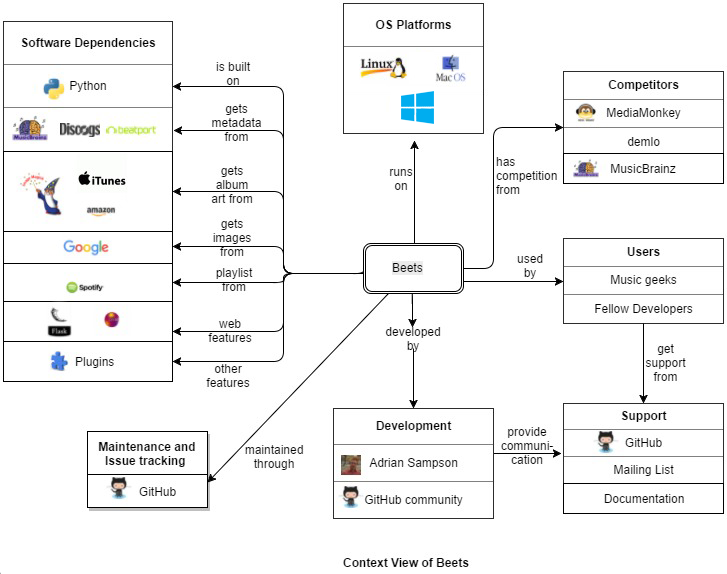
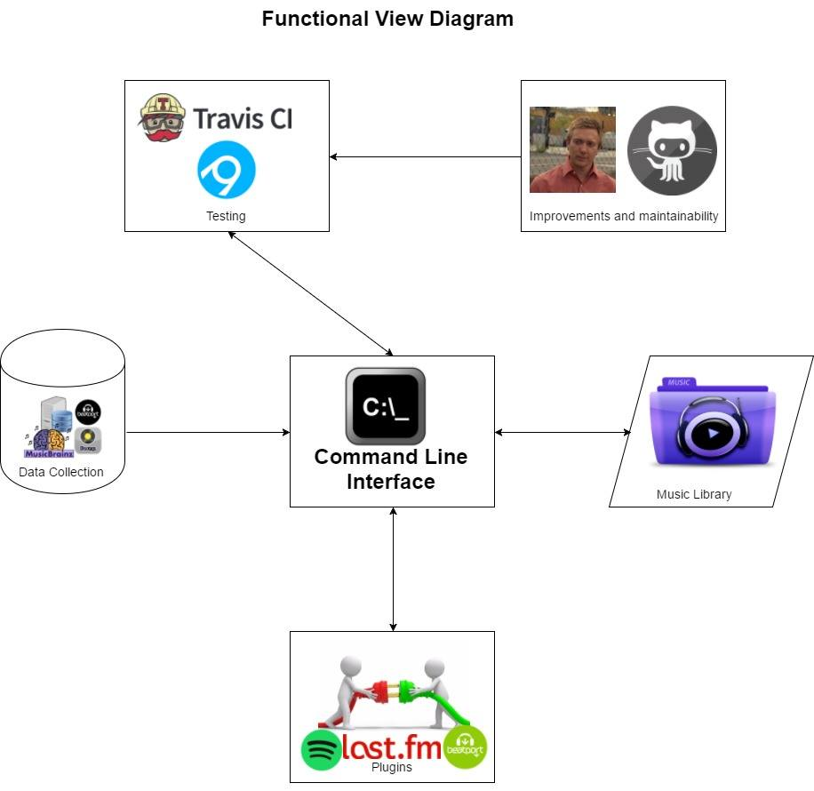
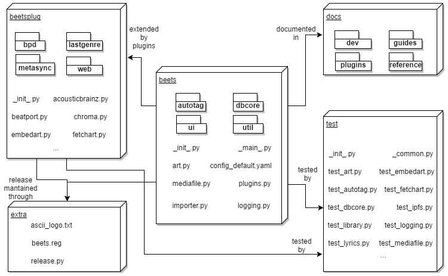
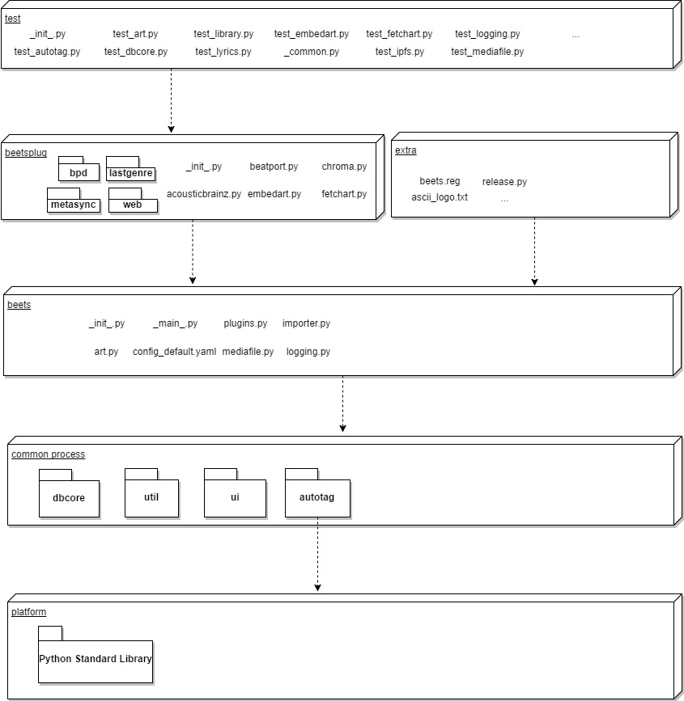

# Beets
*Abigail de la Rosa, Aniket Dhar, Sergio Soto, Ozan Dogu Tuna*

**Delft University of Technology**


`“Music brings a warm glow to my vision, thawing mind and muscle from their endless wintering.” ~ Haruki Murakami`

## Abstract
Beets is the media library management system for obsessive-compulsive music geeks. It catalogs your collection, automatically improving its metadata as it goes. It provides a bouquet of tools for manipulating and accessing your music. Beets is designed as a library, and can be extensively extended to do wonders through plugins. This chapter, as a product of the Software Architecture course, provides a concise overview of Beets by presenting an analysis of the project through multiple perspectives and viewpoints as presented in the book *Software Systems Architecture* by Rozanski and Woods. [[1](#rw)]

## Table of Contents

<!-- MarkdownTOC -->

- [Introduction](#introduction)
  - [Beets Project](#beets-project)
  - [Method of Approach](#method-of-approach)
- [Stakeholders](#stakeholders)
- [Context View](#context-view)
  - [Concerns](#concerns)
    - [OS Platforms](#os-platforms)
    - [Software Dependencies](#software-dependencies)
    - [Developers](#developers)
    - [Maintenance & Issue Tracking](#maintenance--issue-tracking)
    - [Users](#users)
    - [Support](#support)
    - [Continuous Integration](#continuous-integration)
    - [Main Competitors](#main-competitors)
- [Functional View](#functional-view)
  - [Concerns](#concerns-1)
    - [Functional Capabilities](#functional-capabilities)
    - [External Interfaces](#external-interfaces)
    - [Internal Structure](#internal-structure)
    - [Functional Design Philosophy](#functional-design-philosophy)
  - [Component Descriptions](#component-descriptions)
    - [Command Line Interface](#command-line-interface)
    - [Data Collection](#data-collection)
    - [Improvements and Maintainability](#improvements-and-maintainability)
    - [Testing](#testing)
    - [Plugins](#plugins)
    - [Music Library](#music-library)
- [Development View](#development-view)
  - [Concerns](#concerns-2)
  - [Models](#models)
    - [Module Structure Model](#module-structure-model)
    - [Common Design Model](#common-design-model)
    - [Codeline Model](#codeline-model)
- [Technical Debt](#technical-debt)
  - [Identifying Technical Debt](#identifying-technical-debt)
  - [Identifying Testing Debt](#identifying-testing-debt)
  - [Management of Technical Debt](#management-of-technical-debt)
    - [Discussions of Technical Debt Through Code](#discussions-of-technical-debt-through-code)
    - [Discussions of Technical Debt Through Issues](#discussions-of-technical-debt-through-issues)
  - [Technical Debt Conclusions](#technical-debt-conclusions)
- [Performance Perspective](#performance-perspective)
  - [Concerns](#concerns-3)
    - [Response Time](#response-time)
    - [Throughput](#throughput)
    - [Scalability](#scalability)
    - [Predictability](#predictability)
    - [Hardware Resource Requirements](#hardware-resource-requirements)
  - [Perfomance Issues and Management](#perfomance-issues-and-management)
- [Conclusion](#conclusion)
- [References](#references)

<!-- /MarkdownTOC -->


<a name="introduction"></a>
## Introduction
[Beets](https://github.com/beetbox/beets) is an open source music management tool that automatically improves local music collections. Beets is capable of fixing and completing file metadata tags by using online databases such as MusicBrainz, Discogs and Beatport to automatically retrieve information such as song, album and artist names, genre, lyrics, album art and much more; acoustic fingerprinting via Chromaprint's web services to automatically identify songs and provide more accurate and up to date information about tracks; transcoding audio to different file formats; organizing, renaming and removing duplicate songs; providing a graphical interface to browse through the music collection via any HTML5 enabled browser and performing fuzzy searches on the music catalog. Many other features can be powered by an extensible list of plugins. Beets is a multiplatform project compatible with most of the commonly used operating systems. 

<a name="beets-project"></a>
### Beets Project
The project was initially started in May 14, 2008, led and developed by [Adrian Sampson](http://www.cs.cornell.edu/~asampson/). It was originally hosted in a Subversion repository on Google Code (back when Github was only 4 days old!) and later on migrated to Github in 2013. The project is open for the Github community for contributing to the code and adding extra plugins. More information on the project can be found in the main [repository on GitHub](https://github.com/beetbox/beets) and in the project's [website](http://beets.io). The project is also mirrored as a [Mercurial repository on Bitbucket](https://bitbucket.org/adrian/beets).

<a name="method-of-approach"></a>
### Method of Approach
This chapter in the book Delft Students on Software Architecture (DESOSA) first provides an in-depth analysis of the stakeholders involved in the Beets project. Then it discusses the project in terms of context, development and logical views. Finally, it describes the usability, performance and scalability perspectives. In conclusion, it summarizes how Beets evolved over time in terms of its technical debt.

<a name="stakeholders"></a>
## Stakeholders
A stakeholder is any person who has some vested interest in the project. In this section, we categorize the stakeholders for Beets and analyse their involvement and influence on its evolution. Stakeholders are categorised according to [*Rozanski and Woods*](http://www.viewpoints-and-perspectives.info/home/stakeholders/) and categories relevant to Beets are identified below. 

| Type          | Stakeholder|  Description |
|:--------------|:-----------|:-------------|
| Assessors     |[Adrian Sampson](https://github.com/sampsyo)| Beets uses open/non-proprietary codecs and databases, so there is no hardly defined role of an accessor; Adrian being the architect takes up this responsibility when needed.   |
| Communicators |[Adrian Sampson](https://github.com/sampsyo)| Adrian created the [technical documentation](http://beets.readthedocs.io/en/v1.4.3/index.html) as well as the Beets [website](http://beets.io/) in order to let users understand how the software works.  |
| Developers    |[Adrian Sampson](https://github.com/sampsyo), [Beetbox](https://github.com/beetbox)(parent community of Beets) members, GitHub Community| Adrian is the principal developer of the project, while he is supported by other members of the [beetbox](https://github.com/beetbox) team and contributors from the GitHub community  |
| Maintainers   |[Adrian Sampson](https://github.com/sampsyo), [Jack Wilsdon]((https://github.com/jackwilsdon)), [Johnny Robeson](https://github.com/jrobeson), GitHub community| It is mainly the GitHub community contributing to Beets who have kept and maintained the project since it was launched and placed in the public repository. |
|  Integrators  |[Adrian Sampson](https://github.com/sampsyo), [Jack Wilsdon]((https://github.com/jackwilsdon))| Adrian reviews most of the pull-requests himself, suggests modifications where needed, and accepts and merges the changes if and when they are ready to be integrated. |
| Testers       |[Thomas Scholtes](https://github.com/geigerzaehler), [Adrian Sampson](https://github.com/sampsyo), GitHub community | Thomas wrote down most of the testing modules for Beets, Adrian with his dual role of integrator-tester approves or rejects new implementations or improvements of the system.  |
| Users         |Music lovers   |Music geeks who have considerable music collections in their computers and are interested in keeping it tidy make up the user base for Beets.  |

Beets, being an open source, community driven and maintained project, has no *acquirer* stakeholder. Support is provided mainly via a discussion board and a bug tracker which is the Github repository's issue list. It is difficult to draw a clear line if people acting or moderating in these resources can be considered *support staff* stakeholders since it is the developers themselves who are interested in solving bug issues. Adrian Sampson, being the main architect and developer of Beets takes on the responsibility of multiple stakeholder categories in conjunction with the GitHub community for the development and maintenance of the project. The next image shows the Power-Interest Grid related to the stakeholders.


<a name="context-view"></a>
## Context View
The system context is a fundamental and important artefact in the software architecture of a system. The context view defines the boundary between the system, or a part of the system, and its external environment and shows the entities that interact with it. In this section, we introduce the context view of Beets to showcase the dependency and interoperabilty of the system in consideration with the software/hardware dependencies, service and data consumer actors along with the user base to which the product can be marketed.


<a name="concerns"></a>
### Concerns
As per the definitions of Rozanski and Woods [[1](#rw)], the concerns of a context view comprises of the following :

* **System Scope and Responsibilities** : In case of Beets, the scope and responsibilities are defined by its functionality as a music library organizer. The hardware scope is defined by its compatibility with different OS platforms.

* **Identity of External Entities and Services and Data Used** : External services and data used are identified in its software dependencies with respect to metadata, album art, thumbnails, image searches etc.

* **Nature and Characteristics of External Entities** : External entities or dependencies are found mostly to be software based, mostly non-proprietary and open source.

* **Identity and Responsibilities of External Interfaces** : External interfaces are generally data providers or service providers through Python plugins.

* **Nature and Characteristics of External Interfaces** : Most external interfaces are integrated as plugins.

* **Other External Interdependencies** : Codec support, acoustic analysis software, music play on web etc. can be defined as external dependencies for Beets.

* **Overall Completeness, Consistency, and Coherence** : Overall completeness comprises of maintenance of the software and continuous support to client issues.


The context view of Beets is shown below



<a name="os-platforms"></a>
#### OS Platforms 
Beets is available on the following platforms:

* macOS
* Debian and Ubuntu
* Arch Linux
* Gentoo Linux
* FreeBSD
* OpenBSD
* Slackware
* Fedora
* NixOS
* Windows

<a name="software-dependencies"></a>
#### Software Dependencies 
The code is written in Python. Python plugins are used to implement various features. Other open source and non-proprietary software are used for services and data like MusicBrainz for metadata, Google image search for images, ImageMagick for album art etc.

<a name="developers"></a>
#### Developers 
Github is used as the development platform for the project. Adrian Sampson is the main developer of the project while contributions are made from several other developers in the GitHub community.

<a name="maintenance--issue-tracking"></a>
#### Maintenance & Issue Tracking 
Github's repository is used for development and maintenance of the project, logging issues, reviewing fixes and merging them.

<a name="users"></a>
#### Users 
Users comprise of the wide band of music enthusiasts and also developers or contributors to the project.

<a name="support"></a>
#### Support 
Support is provided to the users through the Beets documentation and mailing list along with the GitHub platform. Adrian Sampson is mainly responsible for communicating with the users and providing support.

<a name="continuous-integration"></a>
#### Continuous Integration 
Two tools are used for continuous integration on GitHub:

* Travis CI : used for testing if the build runs on Linux and Mac OS
* AppVeyor : used for running the build test on Windows.

<a name="main-competitors"></a>
#### Main Competitors 
A few of the competitors to this software are MediaMonkey, demlo, and MusicBrainz.

<a name="functional-view"></a>
## Functional View
The Functional view of a system defines the architectural elements that deliver the functions of the system being described. In accordance with *Rozanski and Woods* [[1](#rw)], this section presents Beets in terms of its functional structure, key elements, responsibilities, interfaces and interactions among them.

<a name="concerns-1"></a>
### Concerns
<a name="functional-capabilities"></a>
#### Functional Capabilities
Functional capabilities define functionalities with respect to their scope of consideration. All core functions in Beets (such as import, export, create list, modify, update etc) are implemented within the architecture . However, all the functions proposed by the users outside the scope of the core functions are integrated as plugins. 

<a name="external-interfaces"></a>
#### External Interfaces
External interfaces are the data, event and control flows between the system and others. They can be inward (usually resulting in an internal change of system state) and/or outward (usually as a result of internal changes of system state). In Beets platform, the information exchange occurs when the user interacts with the database metadata or plugins.

<a name="internal-structure"></a>
#### Internal Structure
This structure is defined by the internal elements, their functionality and interactions. It is a reflection of the system quality properties such as availability, resilience, ability to scale, security etc. As it is mentioned above, Beets owns all the core functions within the software.

<a name="functional-design-philosophy"></a>
#### Functional Design Philosophy
The functional design has to cater to various interests from various stakeholders. Thus it is important to take into account the design philosophy, which Beets manages to follow successfully in terms of the following characteristics:

* Cohesion (related functions are grouped together into modules)
* Coupling (while the core is tightly bound, plugins provide flexibility) 
* Simplicity (code simplicity is maintained in design and also when a new issue/pull request is fixed)

However, there are some characteristics that still has scope of improvement such as Extensibility in functionality through plugins; and Scalability which runs into trouble due to the query lookup process explained in the [Performance Concerns](#performance-concerns). 

The diagram below describes the Beets functional view structure.



<a name="component-descriptions"></a>
### Component Descriptions

<a name="command-line-interface"></a>

<a name="command-line-interface"></a>
#### Command Line Interface
Command Line Interface (CLI) is the main system component . CLI is responsible for all user inputs into the system. Depending on what  users want with their personal music collections, CLI sends commands to create lists, import, remove, modify, move, write, update, configure etc.

<a name="data-collection"></a>
#### Data Collection
Beets is able to retrieve metadata from MusicBrainz, Discogs and Beatport. Thus users are able to perform the auto tagger function and organize their music.

<a name="improvements-and-maintainability"></a>
#### Improvements and Maintainability 
[@sampsyo](https://github.com/sampsyo), the Beets founder, keeps track of all possible new features and issues related to the system. With support from the GitHub community, it is possible for him to maintain the platform, solve issues and create new plugin ideas proposed by the users.

<a name="testing"></a>
#### Testing 
As testing tools the Beets team decided to use [AppVeyor](https://www.appveyor.com/) and [Travis CI](https://travis-ci.org/). Thus each time that a new plugin is developed or a bug is fixed, the testing tools make sure that everything is working properly.

<a name="plugins"></a>
#### Plugins
The main purpose of plugins is to extend the Beets functions. The plugins add new commands, fetch additional data during import, provide new metadata sources etc. Generally the plugins exist to add flexibility to the platform. Thanks to this component, users can create their own features.

<a name="music-library"></a>
#### Music Library 
Represents the user’s music input/output, ready to be managed by Beets. 


<a name="development-view"></a>
## Development View
The development view of a software illustrates the system from a programmer's perspective and describes the architecture for the software development process. The following section address the concerns of a developer and illustrates the development view models like module organization, common processes  and codeline organization for the project Beets.

<a name="concerns-2"></a>
### Concerns
The concerns of development view of Beets is categorized under the following headers:

**Module Organization** : Beets code has been properly categorized based on their functionality and operability into four major hierarchial modules : core (called `beets` in folder structure), `beetsplug`, `extra` and `test`.   

`beets` module category includes initialization (*_\_init.py_\_*) and main (*_\_main.py_\_*) modules as well as modules for different functionalites including but not limited to importing (*importer.py*), library management (*library.py*) and logging (*logging.py*). Moreover, there are other subcategories dedicated to database management, UI, autotag functionality and an `util` category containing various functionalities needed by higher level modules. 

`beetsplug` module consists of the various plugins which extend the functionality of Beets. The plugins are written in Python and provide diversified scalability to the operational scope of Beets.

`extra` module category includes release process automation and miscellaneous extras such as an ASCII logo and a reg file to add relevant keys to Windows Registry.

`test` module category includes seperate testing code for a number of different core functionalities (eg. metasync, player, library import) and a routine that automates the testing process by calling all the test routines in the directory (*testall.py*). 


**Common Processing** : Although the code is generally modularized, there are certain processes and resources which are shared among modules, or certain control functionality which holds the modules together. Such areas of common processing are identified and bundled as a common processing module. 

Module subcategory `util` of `Core` contains the common processing elements of Beets. For example, the album art resizing routine (*artresizer.py*) is a common processing that is imported by a variety of routines, eg. artwork fetching, thumbnail creation, artwork embedding. These modules, although possibly differing in runtime and abstraction layer, all may need to resize an artwork at some point of their execution and this process (and more) is provided by `util` module subcategory.

**Standardization of design** : Beets' design is standardized as a library so that it can provide a wide range of functionalities, enabling the user to do 'almost anything they can imagine' with their music collection. Moreover, plugin structure is standardized so that the user can exend Beets by writing plugins. The API design is standardized around a Library class; the central repository of data for Beets. A Library represents the database containing item instances (individual songs) and group instances (Album).

**Standardization of testing** : Although Beets doesn't have fixed testing/release cycles, strict rules checking and testing regime is followed before every release and pull-request approval. The `test` module consists of testing code for all functionalities.

**Instrumentation** : Instrumentation is the practice of inserting special code for logging information about step execution, system state, resource usage, and so on that is used to aid monitoring and debugging. *logging.py* in `beets` folder takes care of all the debug log functionality. Each plugin object has a `_log `attribute, which is a Logger from the standard Python logging module. The logger is set up to PEP 3101, str.format-style string formatting. The verbosity can be increased with `--verbose (-v)` flags.

**Codeline Organization** : Codelines are specific source codes files organized in a definite structure which automates the build, test and release of the source code. Files for automating the release process of Beets are included in the `extra` folder of the project.

The modular view of Beets is shown in the following schematic :



<a name="models"></a>
### Models
The different development models in software architecture, as defined by Rozanski and Woods [[1](#rw)] are described in this section.

<a name="module-structure-model"></a>
#### Module Structure Model
The module structure model helps to organize the source code files into a defined structure by clustering related source files into modules and grouping modules at similar abstraction levels into layers. This model describes the interdependency between modules in a layer and dependencies between the layers themselves. 

A proposed layered model of the modular structure for Beets is shown in the following schematic:



<a name="common-design-model"></a>
#### Common Design Model
The goal of this model is to maximize commonality across element implementations. A common design model comprises of the following:

* **Common processing** : This process implies to identify recurrent task and information files used by the system like initialization and recovery, termination, message logging, security, interfacing, etc. The Beets team decided to define which are the most common tasks, attributes and data needed by developers. Therefore the team created standard files to retrieve information by users and developers. Among these files and recurrent methods, reference can be made to some special files such as the [configuration file](http://beets.readthedocs.io/en/v1.4.3/reference/config.html), necessary to set up the initial parameters in order to suit the user expectations, [default storage locations ](http://beets.readthedocs.io/en/v1.4.3/reference/config.html), which give a standard to the developers to know where the information will be located depending on the operate system or [standard path’s](http://beets.readthedocs.io/en/v1.4.3/reference/config.html#path-format-configuration) to let developers know how to search for certain attribute. Generally defined common processing task or information files help to minimize search job and improve maintainability for the future. 
* **Standard Design approach** : This refers to the standard structures developed in order to increase readability, in case that a future stakeholder will need to read old information made by someone else years later. Taken into account the previous stage, the Beets team has special terms and conditions to approve pull request from the GitHub community. They have several design standards to create files and make improvements in the code. One example is the [structure to report issues](https://github.com/beetbox/beets/issues/new), created to efficiently understand the user’s concerns or the [plugin structure file](http://beets.readthedocs.io/en/v1.4.3/dev/plugins.html), which guides developer’s in order to let them understand what kind of structure they should follow, while they are working on their own plugin codes.
* **Common Software** : The common software refers to what kind of third-party utilities were defined as official standard support by Beets. In this case, it can be inferred that [SQLite](https://www.sqlite.org/) is the main method to retrieve and store information from the user’s computer. Furthermore, there are several extra resources that have been included throughout the years, thanks to the developer’s plugins. This category belongs to improvements such as [Subsonic API](http://www.subsonic.org/pages/api.jsp), responsible for the web data streaming; [Spotify Web API](https://developer.spotify.com/web-api/), which gives users the opportunity to create playlist from their own music; [Beatport API](https://oauth-api.beatport.com) to match music from [Beatport](https://www.beatport.com/) and retrieve it from somewhere else and many others.


<a name="codeline-model"></a>
#### Codeline Model
The model describes the overall structure of the codeline and how the code is configured, managed and how automation tools are set up for build, test and release process. The codeline model emphasizes on the following aspects:

* **Source Code Structure:** The directory hierarchy of the Beets is partly based on its module structure. Functional modules are in `beetbox/beets/` folder and test modules are in `beetbox/test` folder. Documentation (`beetbox/docs`) and extras (`beetbox/extra`) are also at the same hierarchical level with the folders containing these modules. An important aspect of Beets is that the plugins, including the users may create for themselves are in the same directory hierarchy (`beetbox/beetsplug`) with the core code. This reflects the emphasis that is put on plugin extensibility of the software. The core code is divided into further folder hierarchies, seperating Musicbrainz support, database management, UI handling and common design from the rest.

* **Build, Integration and Test Approach:** Builds of the project are done via GitHub and integration approach defined for this project. The test approach is to implement individual routines that are based on real use cases such as editing entries, converting files, using the player and so on. The test routines are populated under the test module category and an automation routine that executes all the tests in the category is provided. 

* **Release Process:** Release process is handled via GitHub. Usually, the process involves drafting a release using a version number and the master branch and providing a description of the release specifying the new features and fixes that it provides.

* **Configuration Management:** Beets has an extensive configuration system that lets the user customize nearly every aspect of its operation. To configure Beets, *config.yaml* is used. The location of the file is platform dependent.


<a name="technical-debt"></a>
## Technical Debt

*"Shipping first time code is like going into debt. A little debt speeds development so long as it is paid back promptly with a rewrite... The danger occurs when the debt is not repaid. Every minute spent on not-quite-right code counts as interest on that debt. Entire engineering organizations can be brought to a stand-still under the debt load of an unconsolidated implementation, object-oriented or otherwise."
— Ward Cunningham, 1992*

<a name="identifying-technical-debt"></a>
### Identifying Technical Debt

For project Beets, the Python code analysis tool `Pylint`[[3](#Pylint)] is run on the source code to get an analysis of the technical debt incurred. The complete analysis of the tool can be found [here](https://github.com/delftswa2017/team-beets/tree/master/Files/beets_pylint_output.txt). This tool analyzes the program in order to look for errors, verifies the programming structures and implementation integrity. Pylint helps to improve coding standard and code quality.

The technical debts of project Beets can be classified and analysed under the following headers:

<a name="code-duplication"></a>
##### Code Duplication
Duplicate or copy-pasted code is usually expressed as the ratio of duplicated lines to the total lines of code within a range of 0% to 100%. The pylint output on project Beets source code, shows very few instance of code duplication. 

|  code duplication    | results |
|----------------------|---------|
|   duplicated lines   |     7   |   
| % duplicated lines   |   0.040 |  

Further inspection into the code shows that few instances are not duplicated code but some same item keys listed in two different files. Thus, it can be said that Beets does considerably well in terms of code duplication. A percentage of *0.04* is definitely within accepted limits.

<a name="code-complexity"></a>
##### Code Complexity
Code complexity is generally expressed as cyclomatic complexity of a module which defines the total different number of logical paths the code can take. The complexity metrics differ depending on the platform and language used. The pylint analysis considers a complexity below 12 to be acceptable. The code analysis shows *17* instances of exceeding safe code complexity level. 

Few instances are shown below:

```
Module beets.util.functemplate
R:333, 4: Too many branches (13/12) (too-many-branches)

Module beets.util.confit
R:1426, 0: Too many branches (14/12) (too-many-branches)

Module beets.util.bluelet
R:218, 0: Too many branches (22/12) (too-many-branches)
R:140, 0: Too many branches (18/12) (too-many-branches)   
```

<a name="dependency-cycles-and-coupling"></a>
##### Dependency Cycles and Coupling 
Cyclic dependencies in code or module structure is generally not accepted and may cause linking and build issues. An example of cyclic import in Beets has been captured by the tool run as shown below:
```
************ Module beets.util
R:  1, 0: Cyclic import (beets.util -> beets.util.hidden) (cyclic-import)
R:  1, 0: Cyclic import (beets.autotag.hooks -> beets.plugins) (cyclic-import)
R:  1, 0: Cyclic import (beets.library -> beets.plugins) (cyclic-import)
R:  1, 0: Cyclic import (beets.autotag.hooks -> beets.autotag.mb) (cyclic-import)
R:  1, 0: Cyclic import (beets.ui -> beets.ui.commands) (cyclic-import)
```

<a name="documentation-and-rules"></a>
##### Documentation and Rules 
A software code needs to be very well documented for proper usage, testing, mantainance and issue-fixing. There are multiple instances in Beets source code where source code is not well documented, like missing doc string specification in functions and methods, unclear TODO and FIXME etc. Few examples from the Pylint run are shown below:
```
************ Module beets************
C:  1, 0: Missing module docstring (missing-docstring)

************ Module beets.art************
C: 41, 0: Missing function docstring (missing-docstring)

************ Module beets.importer************
C:  1, 0: Missing module docstring (missing-docstring)

************ Module beets.util.artresizer************
C:124, 0: Missing function docstring (missing-docstring)
C:160, 4: Missing method docstring (missing-docstring)
```
The complete statistics for Beets is shown below:

|type     |%documented |
|---------|------------|
|module   |88.89       |
|class    |92.51       |
|method   |95.27       |
|function |83.56       |


<a name="identifying-testing-debt"></a>
### Identifying Testing Debt
A code without testing process tends to be broken. It is necessary to follow a continuous integration process, while working with the development in order to avoid further complicated situations. 

In the Beets projects there are several contributor testers such as [@Jrobeson]( https://github.com/jrobeson) and [@nathdwek]( https://github.com/nathdwek). The main tool used by the team Beets to test the improvements is a combination of [Travis]( https://travis-ci.org/ ) and [Flake 8]( https://pypi.python.org/pypi/flake8). The first one is an open source software, which can easily synchronize github repositories and automatically build each pull request in order to check compatibility issues. On the other hand [Flake 8]( https://pypi.python.org/pypi/flake8) is a generic virtualenv management and test command line tool that Beets uses to check if packages are installed correctly with different Python versions and interpreters. It is useful to run tests in each of the environments and acts as a frontend to Continuous Integration servers. 

In the pull request [#2118: Add gstreamer deps to travis config](https://github.com/beetbox/beets/pull/2118) the user [@jackwilsdon](https://github.com/jackwilsdon) reports a missing [@Gstreamer]( https://gstreamer.freedesktop.org/ ) file during a test. According to [@Jrobeson]( https://github.com/jrobeson), this happens because the [Flake 8]( https://pypi.python.org/pypi/flake8) environment cannot detect the file, furthermore there is no [Gstreamer]( https://gstreamer.freedesktop.org/ ) package only libraries and plugins. In the end the issue with the Flake 8 environment wasn't solved and instead an alternative approach was followed. 

In [#2183: add site-packages tests to the travis build matrix](https://github.com/beetbox/beets/pull/2183), the tester found out a way to add the [Gstreamer]( https://gstreamer.freedesktop.org/ ) dependencies. Thanks to the [Travis]( https://travis-ci.org/ ) configuration file .yml, it was possible to add the feature. The advantage of this configuration is to catch issues when Beets is installed as a distro package and be able to make the tests work with pygobject dependent parameters. However the [Flake 8]( https://pypi.python.org/pypi/flake8) issue is still open.

In the pull request [#2345: Cleanup zero plugin](https://github.com/beetbox/beets/pull/2345 ), where the tester [nathdwek]( https://github.com/nathdwek ) found that one of the plugin methods ```add_item_fixture()``` was not optimal when users need to perform test with plugins triggered by a written event.  Also, the method ```unload_plugins()```, did not remove the listener. In the end, he modifies the methods to "Add manually triggered mode for zero plugin" and fixed the ```unload_plugin()``` method. 

Overall the Beets technical debt is difficult to quantify. The continuous changes from python 2 to python 3 causes it to increase. It is well known that they still have issues with some testing processes related to [Flake 8]( https://pypi.python.org/pypi/flake8). Thanks to the github community and [Travis]( https://travis-ci.org/ ) the technical debt has been properly fixed. Travis is a continuous integration tool, which helps to track versions within the project, it gives Beets the ability to automate their builds based on more than 60 [testing files]( https://github.com/beetbox/beets/tree/master/test ) developed by the Beets testers in order to create automated deployments. Thus, the testing process is generated automatically once a user sends a pull request. Since the project's beginning, Beets has been able to manage around 867 pull requests including programming and documents improvements. Therefore, their testing method can be classified as a success. 

<a name="management-of-technical-debt"></a>
### Management of Technical Debt
There are two main media to discuss technical debt: through code and through issue discussions. Discussions through code are more implicit and almost exclusively between the developers, where the information is conveyed in code comments with the commonly used prefixes such as TODO and FIXME. On the other hand, discussions through issues are more explicit, where other stakeholders such as users can get involved through comments on issues. This allows a more complex and multi-faceted discussion on the technical debt. 

Discussions through code seem to be mainly about the debt which can be "paid off" with relative ease, and results fast pay off times (in scale of months) for TODOs and FIXMEs in code. However, analyzing the open issues reveals that there is some technical debt that has not been paid for years, almost since the beginning of the project.

<a name="discussions-of-technical-debt-through-code"></a>
#### Discussions of Technical Debt Through Code
A repository search on Beets reveals 25 TODOs from 18 files and 13 FIXMEs in 9 files.

<a name="todos"></a>
##### TODOs
The most recurring TODO topic in code discussions is migration of Beets from Python 2 to Python 3. Some issues related to this transition could be described as low hanging fruit (beets/util/\_init\_.py) whereas some others (dbcore/query.py) point to more convoluted types of technical debt . 

Furthermore, a quick analysis of the code shows that some of the issues are pretty well defined in code comments, whereas some others are not. A well defined comment includes a clear description of the problem and possibly a first idea about the solution, and uses a clear language. A not so well defined comment can be vague about the problem, solution and/or timeframe to pay off the technical debt, and usually is contaminated by vague words such as "stuff", "something", "eventually, and so on. A not well defined comment about techical debt can be particularly hazardous, as the most important part of handling the debt is to clearly identify it. 

<a name="fixmes"></a>
##### FIXMEs
Out of the 9 files including at least one FIXME comment in the code, 5 of them are about test routines, 3 about functional routines and one is about the release method. From both the number of FIXME occurances and severity of FIXME issues, it is clear that the developers of Beets are suffering from the common pitfall of engineering: functional implementation takes priority over testing.

<a name="discussions-of-technical-debt-through-issues"></a>
#### Discussions of Technical Debt Through Issues
The issue comments provide deeper insight to how different stakeholders perceive, suffer from and handle technical debt. Therefore analyzing issue discussions is crucial for assessing technical debt of project Beets. Please note that the ones below are by no means an exhaustive list of open or closed issues about technical debt.

<a name="1409-use-pathlib-everywhere-in-beets"></a>
##### [#1409: Use pathlib everywhere in Beets](https://github.com/beetbox/beets/issues/1409)
A path manipulation implementation that provided the necessary functionality in the beginning starts to become problematic as the project grows bigger. Utilization of a new abstraction layer is proposed, however the technical debt accumulated until that time proves difficult to be paid off, and even impossible for some issues arising from the debt.

<a name="1531-finish-disentangling-dbcore-from-beets-globals"></a>
##### [#1531: Finish disentangling dbcore from Beets globals](https://github.com/beetbox/beets/issues/1531)
This issue is about a particular kind of technical debt, where an integrated approach has been replaced with a modular one. However, splitting an integrated implementation into modules is not an easy task. The issue has been open since July 2015.

<a name="1702-switch-to-ruemelyaml"></a>
##### [#1702: Switch to ruemel.yaml](https://github.com/beetbox/beets/issues/1702)
The developers want to delegate some of the technical debt they accumulated to another project, assuming that it will be maintained further by a a team specifically dedicated on that functionality. While this sounds like a good idea to have your debt paid by others, the obvious risk is that Beets loses some control on this part of their debt. In case of a future problem, going back to their own implementation may even mean an increase in debt.

<a name="2467-importfeeds-configuration-error-due-to-handling-of-dir-option-on-python-3"></a>
##### [#2467: importfeeds: Configuration error due to handling of "dir" option on Python 3](https://github.com/beetbox/beets/issues/2467)
One of the big TODOs of the Beets project is to make Beets Python 3 compatible while maintaining support for Python 2 as an interim solution, ultimately dropping support for legacy and make Beets a Python 3 only project. A platform change is a major example of expensive but crucial technical debt payoff. A transition of this kind is painful for both users and developers, as demonstrated in this issue. 

<a name="technical-debt-conclusions"></a>
### Technical Debt Conclusions

In conclusion, issues related to functionality of Beets are fixed immediately. However it can be safely assumed that the technical debt in project Beets have evolved over time along with the project. There is a significant amount of debt that has been constantly present since the beginning in terms of missing documentation, imperfect features and missing dependencies. And they have gradually increased and evolved over time. The shift from Python 2 to Python 3[[2](#python)] has introduced a lot of changes in the code and a significant amount of new issues. As long as the project does not completely shift to Python 3 and manatains backward compatibility, the existing debt is not removed while new debts are gradually added on with new development work. 

<a name="performance-perspective"></a>
## Performance Perspective

A software is expected to handle tasks efficiently and respond in time; and thus, it is structured in a way that its performance keeps up with the increasing load as the software evolves. This section analyzes the performance perspective of the project Beets. First the performance concerns are described and then an analysis is presented on how Beets as a project manages these concerns.

<a name="concerns-3"></a>
### Concerns

Performance of Beets can be evaluated on the basis of the following concerns:

<a name="response-time"></a>
#### Response Time 
For Beets, response time specifies the time needed to execute a certain user command on the CLI. Since, Beets has numerous different functionalities to be called upon from the command line, the response times of tasks vary widely depending upon the complexity it entails. No optimum or hard response time specifications are documented, which makes it difficult to analyse. But different plugins/modules suffer from slow execution times as found from GitHub issues. 

Few examples of slow performers are [random (# 1795)](https://github.com/beetbox/beets/issues/1795), [stats (# 2370)](https://github.com/beetbox/beets/issues/2370), [ftintitle (#2281)](https://github.com/beetbox/beets/issues/2281) and more.

<a name="throughput"></a>
#### Throughput
Throughput is defined as the amount of workload the system is capable of handling in a unit time period. Beets performs badly in terms of throughput when it comes to making database calls and matching albums which have a large number of songs. 

Two such examples, in the words of the main architect Adrian Sampson are presented below:

`It's actually the time taken to evaluate a single candidate album, when that candidate itself is very large.` [(# 2466)](https://github.com/beetbox/beets/issues/2446)

`Here, I think the issues is the way that we've designed the query and lookup process in beets.dbcore, which is simple and elegant but terrible for performance.` [(# 2388)](https://github.com/beetbox/beets/issues/2388)

<a name="scalability"></a>
#### Scalability
Scalability refers to performance of the system in wake of increasing workload. Beets has constantly evolved through new plugins increasing its functionality, while it has also scaled up its capacity to handle bigger and complex queries and workload. For example, the Beatport plugin which originally supported 10 tracks, was scaled up to handle 100 tracks. [(# 2469)](https://github.com/beetbox/beets/issues/2469).

Beets still has bottlenecks in its implementation as the assignment of candidate tracks to actual tracks [(# 2487)](https://github.com/beetbox/beets/issues/2487) and query lookup process in `beets.dbcore` , for example, which caps its ability to scale up easily.

<a name="predictability"></a>
#### Predictability
Predicatbility means that similar commands complete in very similar amounts of time regardless of when they are executed. Beets generally mantains predictability as in it takes similar response time for similar dataset, except in cases of possible candidate matching problems on individual song tracks.

<a name="hardware-resource-requirements"></a>
#### Hardware Resource Requirements
Beets does not tightly depend on any hardware requirements and is compatible with most commonly available OS platforms.

<a name="perfomance-issues-and-management"></a>
### Perfomance Issues and Management

Beets suffers from problem of slow performance. The common operations are slow because of the inherent structuring of the database calls and hence, many plugins tend to fall short of fast response. This section highlights the different architectural decisions that are taken or debated over for consideration in Beets in response to its performance enhancement.

* **Reuse and Optimize Repeated Processing:** While the AST compiler in the `functemplate` module is written for a dramatic speedup in `beet list` time, the code invokes the compiler every time instead of just once and hence degrades performance. The developers discuss the need to reuse compiled templates, at least for the list command if not for all commands. Otherwise, they consider caching to improve the same. 

* **Multithreading:** Beets introduced multithreading in the `import` stage for faster execution of tasks as the functionality was running slower than expected. There was also consideration of implementing multithreading in `command` stage.

* **Caching:** Caching is implemented (and considered for implementation) in multiple modules in order to reduce sunbsequent query handling and thus reduce the response time.

* **Use Asynchronous Processing:** In certain plugins, developers considered using async methods to handle commands since the tools just needed to wait on IO (either a subprocess execution or an HTTP request). 

The analysis of Beets' performance issues reveal that most of their bottlenecks are either IO-bound or due to poor structuring of the `beets.dbcore` which provides simplicity to the code but compromises on the performance. There are many open issues regarding slow performing plugins; while most of them are analysed and solutions have been discussed and debated, there are a handful of those issues that are actually fixed. In conclusion, it can be safely pointed out that Beets does not meet expectations in performance and there is a large scope of development in that respect.

<a name="conclusion"></a>
## Conclusion

The chapter analyzes Beets as a music organizer with lots of functionalities. The project is still evolving and extending through its plugin structure with continuous contribution from the GitHub community. The modular design of Beets is simple and dependencies are not heavily clustered. The functionalities have been properly defined and implemented. The technical debt, however, tends to weigh down its evolution process from Python 2 to Python 3. The performance in terms of speed, is also a major concern for the developers of Beets. Having said that, the Beets team seems to be handling their issues and development process quite prudently. Beets can definitely be considered as a very well-designed and properly-mantained software project in its field.

<a name="references"></a>
## References

1. <div id="rw"/>Nick Rozanski and Eoin Woods. Software Systems Architecture: [Working with Stakeholders using Viewpoints and Perspectives](http://www.viewpoints-and-perspectives.info). Addison-Wesley, 2012.
2. <div id="python"/>The beets blog: beets and Python 3. Retrieved from http://beets.io/blog/py3k.html
3. <div id="Pylint"/>Pylint. (2017, March 26). Retrieved from https://en.wikipedia.org/wiki/Pylint

