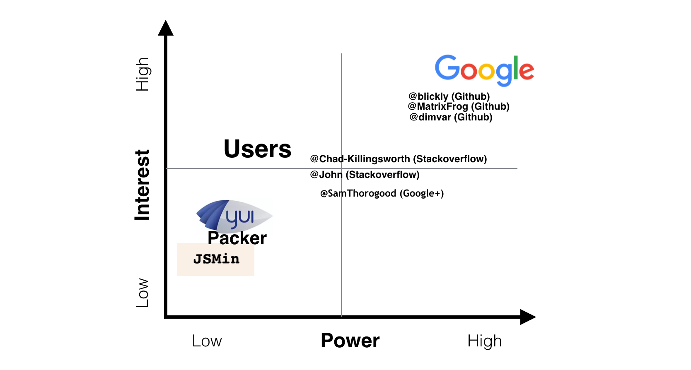
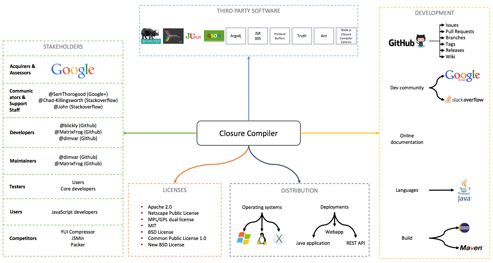
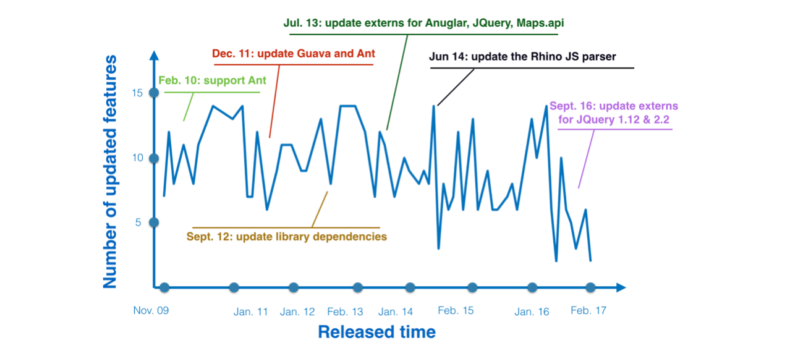
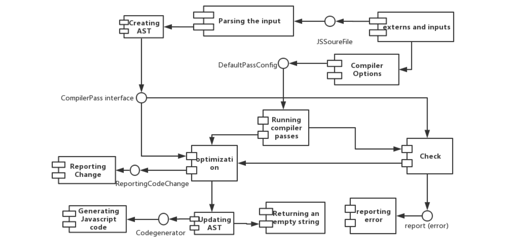
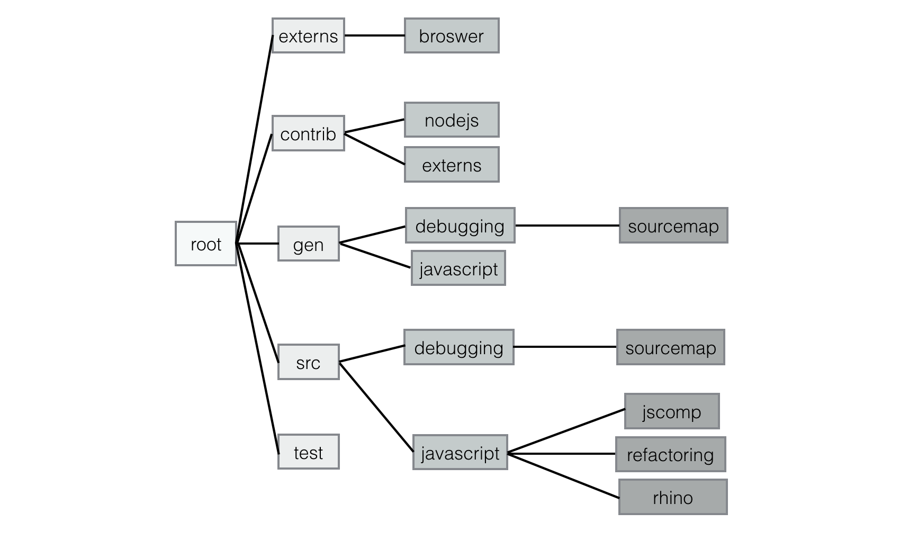
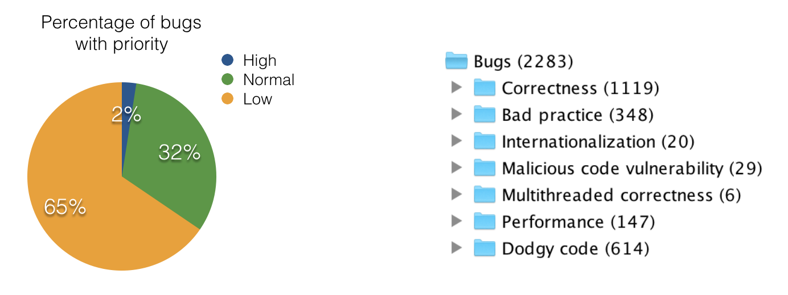
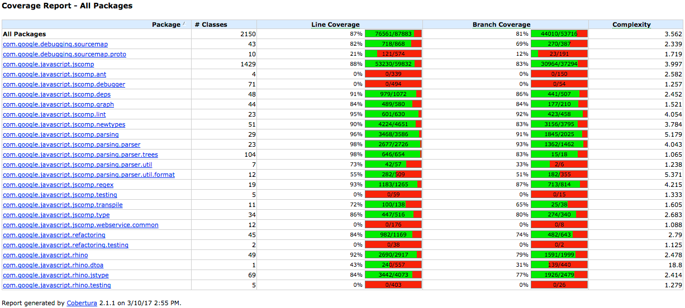
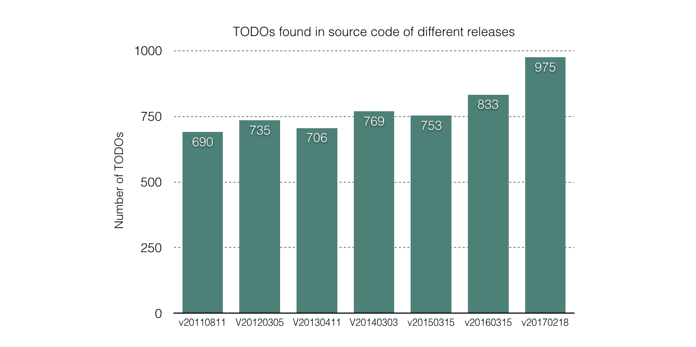

# Closure Compiler: A JavaScript compiler


## Abstract
In this chapter, we research the architecture of the Closure Compiler. The Closure Compiler is a JavaScript compiler, created and made open source by Google, which compiles JavaScript to better JavaScript. The project is written in Java and it allows the user to input a JavaScript file and get an optimized and minimized version back from the application. The Closure Compiler performs operations like dead code elimination, code optimization, removal of whitespaces and other formatting styles. Moreover, it does syntax checking, variable reference checking, and type checking. This chapter discusses the software architecture inside of Google's Closure Compiler, by analyzing the existing architecture, as well as identifying flaws and suggesting possible changes to the project. When analyzing the software architecture behind the Closure Compiler we explain the functionality of the project in detail and show that Google is a major stakeholder, but also that, for instance, the users and the developers related to the project are important stakeholders as well. We give an overview of the project and its code structure and show that the Closure Compiler can be divided into a number of modules. Additionally, we explore the technical debt in the project code, as well as the evolution of the project. The conclusion we draw is that the Closure Compiler has a solid software architecture, but that there are some minor improvements that can be made.

## Table of Contents
* [1. Introduction](#1-introduction)
* [2. Functionality](#2-functionality)
    * [2.1 Overview of the functionality](#21-overview-of-the-functionality)
    * [2.2 Detailed analysis of the functionality](#22-detailed-analysis-of-the-functionality)
        * [2.2.1 Functional capabilities](#221-functional-capabilities)
        * [2.2.2 External interfaces](#222-external-interfaces)
* [3. Stakeholders](#3-stakeholders)
    * [3.1 Identified stakeholders in the Closure Compiler](#31-identified-stakeholders-in-the-closure-compiler)
    * [3.2 Relationships between the stakeholders and the system](#32-relationships-between-the-stakeholders-and-the-system)
* [4. System overview](#4-system-overview)
    * [4.1 System elements](#41-system-elements)
    * [4.2 Context view](#42-context-view)
* [5. Common design model](#5-common-design-model)
    * [5.1 Common processing required](#51-common-processing-required)
    * [5.2 Standardization of design](#52-standardization-of-design)
    * [5.3 Standardization of testing](#53-standardization-of-testing) 
* [6. Evolution](#6-evolution)
    * [6.1 Evolution needs](#61-evolution-needs)
* [7. Code overview](#7-code-overview)
    * [7.1 Module based structure](#71-module-based-structure)
    * [7.2 Source code structure](#72-source-code-structure)
* [8. Technical debt](#8-technical-debt)  
    * [8.1 General technical debt](#81-general-technical-debt)
    * [8.2 Testing debt](#82-testing-debt)
        * [8.2.1 Code coverage](#821-code-coverage)
        * [8.2.2 Improvements to the testing](#822-improvements-to-the-testing)
    * [8.3 Evolution of the technical debt](#83-evolution-of-the-technical-debt)
* [9. Conclusion](#9-conclusion)
* [References](#references)

## 1. Introduction
Google has a couple of well-known JavaScript intensive web applications, such as Gmail, Google Docs and Google Maps [[11](#11)]. These applications have a lot of users every day, and to make them perform better Google introduced the Closure Compiler, which is a tool to improve JavaScript files making applications with huge user bases scale better. The Closure Compiler transforms JavaScript to optimized and minimized JavaScript with the same functionality. This is done by dead code elimination, code optimization and removal of whitespaces and other formatting styles. Moreover it does syntax checking, variable reference checking and type checking. The project is written in Java, and it was created and made Open Source in November 2009 [[11](#11)].  The code is today available on [GitHub](https://github.com/google/closure-compiler) for anyone to use and extend.

This report aims to analyze the architecture of the Closure Compiler project. We start with describing the functionality to give a detailed understanding of what the Closure Compiler does. Then we give a list of stakeholders related to the Closure Compiler, since they play a great role in the development of the compiler. Next, we show an overview of the system around the project in combination with the involved stakeholders, followed by providing the insight into how the project transformed over time. Finally, we describe the code structure and the presence of technical debt in it.

## 2. Functionality
This section explains the functionality of the Closure Compiler from a more in-debt perspective, in order to give a clear picture of how the Closure Compiler works. This is done by first giving an overview of the functionality, followed by a more detailed analysis. It is important to know how the project functions and how it is being used to get a good understanding of the software architecture in the project.

### 2.1 Overview of the functionality
The Closure Compiler allows the user to input JavaScript code into the Java application, and the application will then output a minimized and optimized version with the same functionality. By using different settings in the Java application the code elimination can then be more or less advanced. The advanced run mode includes functionality such as replacing common patterns with minimized alternatives, replacing variable names with shorter names and replacing methods that are only used a few times with inline code. Note that a type cannot be declared in JavaScript, and one solution is using "comments in the code to specify the data type [[12](#12)]".

### 2.2 Detailed analysis of the functionality
In this part, we will look more deeply into the functionality of the Closure Compiler, by using a viewpoint inspired by the Functional View (Rozanski and Woods) [[1](#1)]. This is done by discussing the functional capabilities and the external interfaces of the Closure Compiler.

#### 2.2.1 Functional capabilities
Functional capabilities describe the function of a system [[1](#1)]. The main functional capability of the Closure Compiler is to make JavaScript download and run faster. "It parses your JavaScript, analyzes it, removes dead code and rewrites and minimizes what's left. It also checks syntax, variable references, and types, and warns about common JavaScript pitfalls [[2](#2)]." To be more precise, there are three capabilities that the Closure Compiler is required to possess when compiling JavaScript code: "reducing code size, catching errors at compile time, and protecting code from obfuscation [[3](#3)]". Reducing code size is about optimization and minimalization of the source code. Catching errors at compile time includes errors such as returning a value with the wrong type, reassigning a constant or calling a method that does not exist. Protecting code through obfuscation is achieved by renaming functions and variables [[3](#3)]. 

#### 2.2.2 External interfaces
The external interfaces are the ways of accessing the program from a user perspective. Table 1 below shows the four external interfaces that are present in the Closure Compiler project. Note that these APIs ultimately call the same Closure Compiler core.

| External interface | Description |
| ------------------ |-------------|
| Command Line Interface | The suggested method for running the Closure Compiler is to download the executable JAR file and run it locally from the command line. Via the command line, a user can input the JavaScript source code and specify different compiling options, such as compilation levels (*WHITESPACE_ONLY*, *SIMPLE_OPTIMIZATIONS*, and *ADVANCED_OPTIMIZATIONS*) and warning levels (*QUIET*, *DEFAULT*, and *VERBOSE*) [[3](#3)].  |
| Closure Compiler Service UI | There exist a web user interface of the Closure Compiler, which is called Service UI and can be reached by the [following link](http://closure-compiler.appspot.com/home). Being easy to assess and operate, it is a good way to start for a new developer who wants to experiment with the Closure Compiler [[3](#3)].  |
| Closure Compiler Service API | The Closure Compiler has a REST API, which works by sending HTTP POST requests to the Closure Compiler Service UI, which is described above [[3](#3)].  |
| Programmatic Java API | This API provides an efficient way of using the Closure Compiler to compile several JavaScript files. It can be used when writing a Java program that repeatedly calls the compiler, avoiding costs of multiple start-ups when doing this via the command line for example [[3](#3)].  |

*Table 1: The external interfaces identified in the Closure Compiler project.*

## 3. Stakeholders
In this section, we analyse the stakeholders of the Closure Compiler project. This is done by first listing the stakeholders we identified, followed by an overview of how the relationships between the project and the stakeholders look like. Since the people and organizations around the system are very important for the development and maintenance of the system they are also important from a software architecture perspective.

### 3.1 Identified stakeholders in the Closure Compiler
Table 2 shows the stakeholders that are recognized by us in the Closure Compiler project, after analyzing Pull Requests and Issues in the GitHub repository. The stakeholders are divided into different stakeholder categories, which are defined by Rozanski and Woods [[1](#1)]. 

| Stakeholder class | Description | In the Closure Compiler |
| ----------------- |-------------| ----------------------- |
| Acquirers and Assessors | The acquirers are the owners of a system while assessors make sure that "standards and legal regulation" are followed [[1](#1)].  | The Closure Complier is created by Google. Google can, therefore, be regarded as both the acquirer and assessor. |
| Communicators | Communicators need to communicate what a system is doing to other stakeholders and need to provide the documentation of a system [[1](#1)].  | Writers of the documentation on [GitHub](https://github.com/google/closure-compiler) and the [official website](https://developers.google.com/closure/compiler/), as well those who update the [blog](https://developers.googleblog.com/search/label/closure%20tools): mainly @[SamThorogood](https://plus.google.com/+SamThorogood), the Developer Programs engineer at Google. |
| Competitors | Competitors have a similar product with similar functionalities to offer. | Competitors are [YUI Compressor](http://yui.github.io/yuicompressor/), [JSMin](http://www.crockford.com/javascript/jsmin.html) and [Packer](http://dean.edwards.name/packer/). Note that these are all open source too. |
| Developers | Developers build and deploy a system [[1](#1)]. | As an open source project of Google, the Closure Compiler attracts hundreds of [contributors](https://github.com/google/closure-compiler/graphs/contributors) from GitHub during the development process. The top 3 committers on GitHub are: @[blickly](https://github.com/blickly) (2,227 commits), @[MatrixFrog](https://github.com/MatrixFrog) (1,038 commits) and @[dimvar](https://github.com/dimvar) (719 commits). These three developers are all part of the Closure Compiler team and employees of Google. |
| Maintainers | Maintainers (or integrators) take care of the maintenance of a system once it is running and integrators test new changes and bring them in [[1](#1)]. | The maintainers are @[matrixfrog](https://github.com/matrixfrog), @[dimvar](https://github.com/dimvar) and @[blickly](https://github.com/blickly). They are able to merge changes (Pull Requests) with the internal repository. |
| Suppliers and System Administrators | Suppliers are responsible for supplying "the hardware, software, or infrastructure on which the system will run" [[1](#1)]. System Administrators are responsible for that the systems keeps running [[1](#1)]. | When running the tool locally the user himself is the supplier and also system administrator. For the service UI and the REST API Google is system administrator and supplier, because Google hosts these services. |
| Support Staff | Support staff is in charge of giving support once a system is running [[1](#1)]. | Support is provided through [Google Forum](https://groups.google.com/forum/#!forum/closure-compiler-discuss) and [Stack Overflow](http://stackoverflow.com/questions/tagged/google-closure-compiler). The active answerers are @[chad-killingsworth](http://stackoverflow.com/users/1211524/chad-killingsworth) and @[John](http://stackoverflow.com/users/873003/john). |
| Testers | Testers are in charge of writing tests for and to perform the testing of the system [[1](#1)]. | The developers of the Closure Compiler are writing unit tests for each change they make (as is in the [guidelines for contributing](#52-assessment-of-the-evolution)). Additionally, the main users also test the system when they use it and some of the users report bugs to the issue tracker on GitHub if they find any. |
| Users | The users use the actual system [[1](#1)]. | Google uses the compiler for their JavaScript intensive web applications and other web developers that work on JavaScript intensive web applications use it as well. |

*Table 2: An overview of the stakeholders identified in the Closure Compiler project.*

### 3.2 Relationships between the stakeholders and the system
In figure 1 below the stakeholders are displayed in a power-vs-interest graph, to show the relationships between the stakeholders and the system.

<br>
*Figure 1: Power-vs-interest graph containing the stakeholders of the Closure Compiler.*

It is safe to say that the stakeholder with the highest interest and highest power is Google, the owner of the product. @[dimvar](https://github.com/dimvar), @[MatrixFrog](https://github.com/MatrixFrog) and @[blickly](https://github.com/blickly), which all work for Google, are core developers and maintainers, so they have high interest and power, while communicators @[SamThorogood](https://plus.google.com/+SamThorogood)，@[John](http://stackoverflow.com/users/873003/john)，@[ChadKillingsworth](https://github.com/ChadKillingsworth) have lower interest and lower power, because they are not developers, maintainers or integrators, they provide documentation. Users care a lot about the tool they are using, but getting involved in the development of the product is not their primary task and they may not have the right skills, thus they have a high interest and low power. The competitors may not care much about the Closure Compiler, since they all are nonprofit tools, and therefore they are placed in the bottom left corner which means the lowest power and lowest interest.

## 4. System overview
This section is intended to give an overview of how the system around the Closure Compiler looks like, by investigating which elements are related to the project from a non-technical perspective and outside of the actual project. This is done by first discussing which different elements around the system exists, followed by a Context View (Rozanski and Woods) to show how they are related to the system [[1](#1)]. A good understanding of the system around the project is important from a software architecture perspective, since it provides insights into all the external relationships that exist, which is needed to understand why the system is shaped the way it is.

### 4.1 System elements
A key element related to the system of the Closure Compiler is the development process. The Closure Compiler's development process is monitored and administrated through GitHub. GitHub's issue system is used for reporting bugs, but also for suggesting new features. When developers want to contribute, they need to create a Pull Request from their own fork. An internal reviewer is assigned and he or she will optionally give feedback and say what a developer should change in order to get the change merged. The final step is squashing all commits into one. This is necessary, because the Pull Request is merged and tested internally and the script to merge with the internal repository can handle only one commit. Once it is merged internally, the master branch is synced with the internal repository and the change is on GitHub.

As mentioned previously in this chapter, the programming language used for the compiler is Java. This means that the application can be built with any Java environment, but it is specifically intended to be built with Maven. As for the Community of the Closure Compiler, it exists in [Google Groups](https://groups.google.com/forum/#!forum/closure-compiler-discuss) and [Stackoverflow](http://stackoverflow.com/questions/tagged/google-closure-compiler). These websites are used for reporting bugs, suggesting new features and other discussions regarding the project. The documentation of the project is hosted on the [online resources](https://developers.google.com/closure/compiler/) as well as the GitHub wiki pages. A final piece of the development process is a common design model, which defines the coding guidelines for the project. More information about the common design model can be found in [5. Common design model](#5-common-design-model).

The deployment process of the system is also an important element. The Closure Compiler can be ran on different platforms, such as Windows, OS X and Linux. The main usage is to run it as a Java application in any Java environment that is supported. However, several other external interfaces were identified in [2.2.2 External interfaces](#222-external-interfaces). These different versions of the compiler are all supported through the project's release process. In March 2017 the Closure Compiler had 62 versions, so the Closure Compiler updates quite frequently. The release process of the Closure Compiler can be found by studying the workflow on the project's GitHub. Approved changes to the project are merged to the master branch first. But before submitting new changes the tests are ran, and the test results must be successful for the changes to be merged. The Closure Compiler is released on GitHub, but also in Maven's Central Repository. Each release has its own branch on GitHub, which is named after the Maven version released in the Central Repository.

Another important element related to the system is the third-party software that is being used. The Closure Compiler uses a lot of third party libraries, which are listed below [[4](#4)]. 

* [Ant](http://ant.apache.org/bindownload.cgi)
* [Args4j](https://args4j.dev.java.net/)
* [GSON](https://github.com/google/gson)
* [Guava](https://github.com/google/guava)
* [JSR 305](https://github.com/findbugsproject/findbugs)
* [JUnit](http://sourceforge.net/projects/junit/)
* [Node.js Closure Compiler Externs](https://github.com/dcodeIO/node.js-closure-compiler-externs)
* [Protocol Buffers](https://github.com/google/protobuf)
* [Rhino](http://www.mozilla.org/rhino)
* [Truth](https://github.com/google/truth)

Due to the fact that the Closure Compiler uses all these different third party software, the compiler is dependent on several licenses. These licenses are listed below [[4](#4)].

* Apache 2.0
* BSD License
* Common Public License 1.0
* MIT
* MPL/GPL dual license
* Netscape Public License
* New BSD License

These licenses are all considered elements related to the system as well.

### 4.2 Context view
To show how different elements of the system are connected, we use a view inspired by the Context View (Rozanski and Woods), which can be seen in figure 2 [[1](#1)]. 

<br>
*Figure 2: The Context View containing the different elements related to the project.*

Figure 2 contains all the elements related to the Closure Compiler project and its system. The elements shown in the context view are all described in section 4.1, except for the stakeholders which are described in section 3. The stakeholders are also important elements of the system, since the developers have to consider the stakeholders when developing the software, so that they can achieve the overall goal of the software and meet all of the requirements.

## 5. Common design model
This section describes the common design model of the Closure Compiler. The purpose of a common design model is to define the standards and the constraints of a system's software elements [[1](#1)]. In this section we analyse the common design model by first introducing the common processing required, followed by the standardization of design and standardization of testing. This is relevant from a software architecture perspective since it shows how structured the process of allowing multiple contributors to work on the same project is, and how these guidelines affect the project's code quality.

### 5.1 Common processing required
Rozanski and Woods discuss that in a software project common processing is required [[1](#1)]. This includes both message logging, instrumentation and the use of third party libraries. In the Closure Compiler, messages can be logged at one of the following levels: OFF, SHOUT, SEVERE, WARNING, INFO, CONFIG, FINE, FINER, FINEST, ALL. When the log level is set to, for example, WARNING, only potential problems are logged, while when the log level is set to FINEST "highly detailed tracing message(s)" are logged [[3](#3)].

Rozanski and Woods define instrumentation as "the practice of inserting special code for logging information about step execution, system state, resource usage, and so on that is used to aid monitoring and debugging [[1](#1)]." The instrumentation in the Closure Compiler is allowed by the ability to log messages generated by the application in a specific file or database, so that the result can be looked at a later stage. More specifically, M. Bolin shows that a logging message "is passed to a `goog.debug.Logger`, which serves as a conduit to one or more user interfaces for displaying logging information [[3](#3)].". So the Logger file is responsible for storing and displaying logging messages.

Finally, the Closure Compiler is developed with a lot of third-party libraries. The list of third party software can be found in section [4.1 System elements](#41-system-elements). The usage of these software components decreases the development time and prevents reinvention of the wheel.

### 5.2 Standardization of design
Because the Closure Compiler is an open source project on GitHub, there exist many contributors who are not employees or staff of Google. To be able to standardize the design procedures, the core developers have set rules for other contributors to follow. For example, rules regarding how to submit patches are shown in the list below:

> + All contributors must sign a contributor license agreement (CLA).
> + To make sure changes are of the type that will be accepted, ask question about the patch on the Closure Compiler Discuss Group
> + Fork the repository.
> + Make changes and make sure the code is in the correct style.
> + Submit a pull request for your changes. A project developer will review your work and then merge your request into the project.

*[[4](#4)]*

Since the Closure Compiler is a project hosted by Google, developers asked to follow Google's Java Style Guide. Some of the conventions specified in Google's Java Style Guide are shown in the list below:

> + All files must begin with the standard Apache License 2.0 header.
> + Only Java 7 features can be used. Cause Java 8 lambdas cannot be used in this codebase.
> + Use `google-java-format`for fixing up formatting, which takes care of using correct indentation, wrapping at 100 characters, etc. Only reformat the lines changed, so that pull request isn't filled with lots of unrelated formatting changes.

*[[5](#5)]*


### 5.3 Standardization of testing
To help to ensure a consolidated way to testing and speed up the whole testing process, test approaches, technologies and conventions should be standardized [[1](#1)]. In the codebase, there is a folder named *test* containing all testing files for every function and feature in the Closure Compiler. The main form of testing is unit testing, which is testing of specific code units. Apart from unit testing, there are other test methods like integration testing, which as the name suggests, tests how parts of the system work together.

Since the Closure Compiler is written in Java, *JUnit* is used as its unit testing and integration testing framework. After a developer adds a new feature or modifies a part of the source code, a unit test, or possibly an integration test, will be written to demonstrate the modification. These tests are also a good way to ensure that future contributors do not break the code accidentally. In fact, in order to implement more effective testing, some other tools such as *Mockito* and *Truth* are also utilized to be combined with *JUnit*.

## 6. Evolution
In this section, we explain how the Closure Compiler has evolved during the years since it was first created. This is done by analysing the project from a perspective inspired by the Evolutionary Perspective (Rozanski and Woods), by first characterizing the evolution needs and then assess the current ease of evolution [[1](#1)]. The evolution of a project is important when analysing the projects software architecture, since it provides insight into how the project transforms over time and how the project's architecture transforms over time as well.

### 6.1 Evolution needs
Functional evolution is about changes of what a system is doing, i.e. changing its functionality [[1](#1)]. Typical functional evolution in the Closure Compiler is to improve the compilation performance, by for instance adding additional optimization options and faster compilation, fixing the bugs in the system and making the system easier to use. Functional evolution is one of the most important kinds of evolution and requires most effort in different releases. According to the releases page available on GitHub, most of the updated features are the type of functional evolution.

A running system needs to adapt to the system it is running on, i.e. hardware and software, which is referred to as platform evolution [[1](#1)]. However, any platform that runs Java can run the Closure Compiler, the Java platform itself changes, i.e. new versions of Java come out. At the time of writing the Closure Compiler requires Java 7 or higher, according to the documentation [[4](#4)]. 

Environment evolution is the need for change that is needed when the environment around a system changes [[1](#1)]. The Closure Compiler depends on lots of third party software and it contains many external files for common API. When those third party software or APIs change, some efforts are needed to update the relevant code in the Closure Compiler for keeping compatibility. We observed that very few changes are of the environment evolution type, which could mean that there was no great need for environment evolution.

From November 2009 to February 2017, the Closure Compiler team released 62 versions of the Closure Compiler. A lot of improvements were made, which can be seen on the releases page on GitHub. In figure 3 below, the evolution of the Closure Compiler in regards to different released versions is shown.


<br>
*Figure 3: The evolution of the Closure Compiler with regards to different released versions.*

## 7. Code overview
In this section, the code structure of the Closure Compiler is analysed. This is done by first giving an overview of the code structure, which is then followed by an identification of a Common Design Model and a shared Codeline Model, which are all concepts inspired by the book from Rozanski and Woods [[1](#1)]. The code structure is one of the key concepts regarding the software architecture, since it provides insight into how the different code modules have been designed and how they work with each other. The actual code and how it is designed from a higher perspective can be considered the core of the architecture.

### 7.1 Module based structure
In this section, the internal code structure of the system is represented by a functional structure model, which is a model defined by Rozanski and Woods [[1](#1)]. A functional structure model contains functional elements, which may be software code modules holding specific features [[1](#1)]. We express the model in the fashion of a UML component diagram as shown in figure 4 below.


<br>
*Figure 4: The functional structure model of the Closure Compiler (based on the information in reference [[3](#3)]).*

The project could, for instance, be ran with the class `CommandLineRunner.java`, which is represented by the "externs and inputs" component in figure 4. The inputted JavaScript file that is provided through the user interface is first parsed to an AST. The next step is to run the Checks and Optimizations on the parsed ASTs. "Checks identify problems by examining the AST and optimizations improve the input by modifying the AST" [[3](#3)]. Finally, the ASTs are generated to new minimized JavaScript through the generator. The "compiler options" component is keeping track of the user input, since there are a lot of different settings the user can choose from. When performing the Checks, if any error is discovered, the compilation is halted, no Optimizations are performed and an error is reported, as shown in the figure. The "reporting change" component helps the compiler to identify when a fixed point has been reached, so that it can stop applying Optimizations. This is needed since the Optimizations will be ran over and over, and when they do not do any more changes optimization should be halted. Finally, the "returning an empty string" component represents the result of the compilation if anything goes wrong during the compilation. Then an empty string is returned to the user [[3](#3)].

### 7.2 Source code structure
In this section, the source code structure of the Closure Compiler is analysed. While doing this, the focus is on looking at the directories the source code is divided into, without digging too deep into which exact classes are placed into each directory.


<br>
*Figure 5: Graph of the source code structure.*

Figure 5 shows the source code structure of the Closure Compiler. The *externs* and *contrib* folder define the browser APIs and externs file for common API (like Google Map API) respectively.  The *gen* folder contains files generated by the protocol buffer compiler. The *src* folder is the most important folder in the root directory cause it provides the implementation of the main functionalities of the Closure Compiler. Its subfolder *jscomp* includes the main entry point, `CommandLineRunner.java` and other functions like checking, optimizing the ASTs and producing the optimal JavaScript code. The subfolder *rhino* is used to parse the code and creates ASTs. The subfolder *refactoring* contains the *Refaster* tool which is a tool for "refactoring JavaScript that leverages the Closure Compiler's AST and type information to make refactoring easier [[6](#6)]". The *debugging* folder is used for debugging. Its subfolder *sourcemap* defines the mapping between lines of source code and lines of compiled code which makes debugging possible. Finally, the *test* folder contains the files for testing. It can be concluded that the source code is well divided into a logical folder structure and that the most important folder is the src/javascript/jscomp folder, which contains the main functionalities.

## 8. Technical debt
In this section the technical debt of the Closure Compiler is analysed and discussed, to give an understanding of how well the system is working. This is done by analysing the general technical debt, the testing debt and the evolution of the technical debt of the Closure Compiler. These are all concepts inspired by the book by Rozanski and Woods [[1](#1)]. The technical debt in the project will give an indication of how well the software architecture is working as a whole, and provide insights into how the code quality is maintained.

### 8.1 General technical debt
This section aims to explain the general technical debt in the Closure Compiler project, by analysing the quality of the code. To get an overview of the code quality we decided to use Findbugs, since is a free and popular static analysis tool that can analyze the software and find bugs without actually running it. It works by looking for known instances of "bug patterns" in the Java code. It reports nearly 300 different "bug patterns [[13](#13)]", and can indicate where the possible defects are located in the source code. The analysis report of Findbugs shows that 2283 bugs of different types are detected in the Closure Compiler, as shown in figure 6 below. It also shows that 6 bugs have high priority, 732 bugs have normal priority and 1495 bugs have low priority.


<br>
*Figure 6: Bugs detected by Findbugs.*

According to the report from Findbugs the Closure Compiler has quite a lot of technical debt in the code and lots of bugs that need to be considered. An example of high priority bugs is named *Nullcheck value previously dereferenced*. The value of `type` is checked whether it is null in the method `recordInvalidatingType` from class `DisambiguateProperties`, but this value was already accessed before. If its value is null, an error will occur in the previous process, so this nullcheck might be redundant. Although 2283 bugs are reported by Findbugs, according to manual analysis, a considerable part of bugs is of the type "false positive", which might not be actual bugs. 

### 8.2 Testing debt
This section analyses the testing debt of the Closure Compiler project, which can be considered a specific part of the technical debt. The Closure Compiler uses the JUnit testing framework to test the application. They use JUnit 4, however, they use the JUnit 3 style of testing, i.e. by extending `junit.framework.TestCase` while in JUnit 4 annotations should be used. We asked about this in the [Closure Compiler Discuss Group](https://groups.google.com/forum/#!forum/closure-compiler-discuss) and Tyler Breisacher, one of the core developers, responded: "As far as I know, JUnit will support both styles indefinitely so we'll probably stick with the existing style to reduce code churn, until we run into a case where we need to switch for some reason [[7](#7)]." So they are aware of the testing debt, but they will eventually have to pay for it when they "need to switch for some reason". The testing debt is further divided into sections about code coverage and how the testing could be improved.

#### 8.2.1 Code coverage
Figure 7 below shows the code coverage in the Closure Compiler. The code coverage analysis is made by using the analysis tool *cobertura*. Cobertura works well with *maven test* and *JUnit*, and it automatically calculates how much of the code is tested by running the unit tests.


<br>
*Figure 7: Overview of the code coverage in Closure Compiler (generated by cobertura).*

We see that the *testing* folders all have 0% code coverage, which is understandable since tests themselves are never tested. The rhino module is fairly well tested, except for the *dtoa* folder. The *dtoa* folder contains one class that is responsible for converting decimals to ASCII characters. Our hypothesis is that this class is unnecessary complex and not all functions are used and thus tested. Overall, many packages are well tested, for instance, the *parsing* packages is very well tested. However, some packages lack testing, such as the *util* subpackages of *parsing*, which might be because most of these classes are very simple.

#### 8.2.2 Improvements to the testing
One obvious improvement to the testing in the Closure Compiler is of course to extend the code coverage. In the previous section about *Code coverage* we see examples of packages that could need a better testing coverage. Another big improvement that could be made to the testing process is to try to make the testing classes less complex, and make better use of the memory. When running the tests inside of Eclipse, and using the built-in JUnit plugin some of the tests throw the following exception:

> java.lang.OutOfMemoryError: GC overhead limit exceeded

Which means that the garbage collector is not making any progress when trying to free memory, and that most of the time spent for that test is inside of the garbage collector [[8](#8)]. This causes tests to fail that would not normally fail, because of the fact that too much memory is allocated by the testing process, or that there are severe memory leaks in the code. To fix this error is a time consuming and difficult process, since it requires a lot of unit tests to be rewritten. This technical debt is not a very big issue, however, since `mvn test` still works without any memory issues, which is considered to be the main approach to run the tests. One of the integrators @[ChadKillingsworth](https://github.com/ChadKillingsworth), even wrote that "most of us have moved away from Eclipse [[9](#9)]".

A final remark on the existing testing process, is that it may be beneficial to increase the readability of the test cases. The following code is an example taken from one of the classes in the Closure Compiler:

```java
public void testUpdateGlobalVarReferences_UpdateScriptNewVar() {
    Map<Var, ReferenceCollection> scriptMap = new HashMap<>();
    final String var4 = "var4";
    globalScope.declare(var4, new Node(Token.NAME), INPUT2);
    ReferenceCollection newVar3Refs = new ReferenceCollection();
    Reference newVar3In2Ref = createRefForTest(INPUT2);
    newVar3Refs.references = ImmutableList.of(newVar3In2Ref);
    scriptMap.put(globalScope.getVar(var4), newVar3Refs);
    map.updateGlobalVarReferences(scriptMap, scriptRoot);
    ReferenceCollection refs = map.getReferences(globalScope.getVar(var4));
    assertThat(refs.references).hasSize(1);
    assertEquals(newVar3In2Ref, refs.references.get(0));
} 
```
*[[10](#10)]*

On one hand, the size of the code is vastly reduced by creating compact test classes like the above example. On the other hand, the readability is drastically reduced. Since the amount of size saved by not including extra newlines in the test code is very small, we argue that it would be more beneficial with test cases that are easier to read and comprehend.

### 8.3 Evolution of the technical debt
In this section, it is discussed how technical debt evolved in the Closure Compiler. Generally, the evolution of the technical debt has been very slow. We looked through hundreds of Issues and Pull Requests by searching keywords such as *DEBT*, *FIX*, and *TODO*, finding that the latest Issue related to technical debt was opened several months ago, which is [Issue #1525 Allow OTI + NTI warnings](https://github.com/google/closure-compiler/issues/1525) and the process of fixing TODOs is however not done on a regular basis. The TODO comments require changes in the code, which are not done so far and it tends to be harder to implement changes later on as time passes by. To see the overall process of evolution of technical debt in the Closure Compiler we downloaded different historical versions of source code, from 2011 to 2017. Since there are a lot of released versions in GitHub every year, only one version per year was analyzed. We then used Eclipse to search for the keyword "TODO" in every edition of the source code, and the result is shown in Figure 8 below.


<br>
*Figure 8: TODOs found in the source code for different releases.*

It can be concluded that generally the quantity of technical debt is getting larger over the years. Although a few TODOs were fixed as we discussed in the previous section, more TODOs were added in the development process.

## 9. Conclusion
In this chapter, we analysed the software architecture in Google's Closure Compiler. In the beginning of the chapter, we explained the functionality and introduced a list of stakeholders, in which we showed that Google, of course, is one of the biggest stakeholders, but that there are many other important stakeholders as well, such as the users and the developers contributing to the project. Then we showed an overview of the system around the Closure Compiler and the common design model. Furthermore, we discussed the evolution of the project, the code structure and technical debt.

The code in the Closure Compiler is well structured, and it is easy to get an overview of the project and its structure by looking at the code. In the code structure part of this chapter, we showed that the project consists of different modules that work with each other in a structured way, and that with this structure it is easy to overview the project and its components. The development and distribution process of the project is clearly defined, and GitHub together with Google Groups allows a structured development process, while Maven creates a straightforward build process. The are strict coding standards, with rules regarding the format of the code as well as on how to make contributions, which allows a consistent code base, even though many contributors from different backgrounds work on the same code.

Even though the project has some technical debt, and even though we showed in [8.3 Evolution of the technical debt](#83-evolution-of-the-technical-debt) that some of the technical debt increases every year, the code has a good quality. The remarks we had after analysing the code were that the tests require a lot of memory, that the readability of tests can be low and that there exists a lot of TODOs in the code. These are all however quite small remarks in the bigger context, and the application, in general, is of a high quality with low technical debt, as you would expect from a big software company like Google.

Finally, in this chapter we showed the evolution of the Closure Compiler, and that the project has released a lot of versions since 2009. However, the number of features updated in the last couple of years seems to be decreasing, which might indicate that the project is near a finished state, even though it will always need maintenance when new bugs are discovered, or when new JavaScript features are developed.


## References

<div id="1"/>

[1] Rozanski and Woods. Software Systems Architecture: Working With Stakeholders Using Viewpoints And Perspectives. Upper Saddle River NJ: Addison-Wesley, 2011.

</div>

<div id="2"/>

[2] What is the Closure Compiler? [Online] Available: https://developers.google.com/closure/compiler/. [Accessed: 19 March 2017].

</div>

<div id="3"/>

[3] M. Bolin, Closure: The Definitive Guide. USA: O'Reilly Media, 2010.

</div>

<div id="4"/>

[4] GitHub.google.closure-compiler.README.md [Online]. Available: https://github.com/google/closure-compiler. [Accessed: 4 March 2017].

</div>

<div id="5"/>

[5] Guidelines for submitting pull requests to Closure Compiler. Coding Conventions [Online]. Available: https://github.com/google/closure-compiler/wiki/Contributors#coding-conventions. [Accessed: 4 March 2017].

</div>

<div id="6"/>

[6] Mknichel. 'RefasterJS'. 2014. [Online]. Available: https://github.com/google/closure-compiler/wiki/RefasterJS. [Accessed: 4 March 2017].

</div>

<div id="7"/>

[7] Tyler Breisacher. 2017. [Online]. Available: https://groups.google.com/forum/#!topic/closure-compiler-discuss/Jp2bF1Mru-Q. [Accessed: 13 March 2017].

</div>

<div id="8"/>

[8] J. Sauer. Error java.lang.OutOfMemoryError: GC overhead limit exceeded. 2009. [Online]. Available: http://stackoverflow.com/questions/1393486/error-java-lang-outofmemoryerror-gc-overhead-limit-exceeded. [Accessed: 11 March 2017].

</div>

<div id="9"/>

[9] C. Killingsworth. Aug. 30th commit broke importing project into eclipse. 2016. Available: https://github.com/google/closure-compiler/issues/2028. [Accessed: 13 March 2017].

</div>

<div id="10"/>

[10] Closure Compiler Team. GlobalVarReferenceMapTest.java. 2011. [Online]. Available: https://github.com/google/closure-compiler/blob/master/test/com/google/javascript/jscomp/GlobalVarReferenceMapTest.java [Accessed: 11 March 2017].

</div>

<div id="11"/>

[11] Closure Tools team. Introducing Closure Tools. 2009. [Online]. Available: http://googlecode.blogspot.nl/2009/11/introducing-closure-tools.html. [Accessed: 31 March 2017].

</div>

<div id="12"/>

[12] E. Neumann. Annotating JavaScript for the Closure Compiler 2017. [Online]. Available: https://github.com/google/closure-compiler/wiki/Annotating-JavaScript-for-the-Closure-Compiler. [Accessed: 1 April 2017].

</div>

<div id="13"/>

[13] Ayewah N, Pugh W, Morgenthaler J D, et al. Evaluating static analysis defect warnings on production software[C]. Proceedings of the 7th ACM SIGPLAN-SIGSOFT workshop on Program analysis for software tools and engineering. ACM, 2007: 1-8.

</div>
