# Gradle: adaptable, fast automation for all

	

**[Lars van de Kamp](https://github.com/larsvandekamp), [Ingmar Wever](https://github.com/IWever), [Julian Hols](https://github.com/jthols) & [Hugo Bijmans](https://github.com/HugooB)**

## Abstract
Gradle is a build automation tool that builds upon the concepts of Apache Maven and Ant. The tool, written in Java and Groovy, allows packaging of software to be deployed on any platform. The open source project that started in 2007 now contains over 400.000 lines of code, almost 1400 plugins made by 266 different contributors. Gradle flourished and instantiated the company Gradle Inc. consisting of most of the core developers of the open source project. In this chapter, the overarching architecture of Gradle is analysed using different views and perspectives as defined by Rozanski and Woods [[1]](#rozanski). It concludes that Gradle has a very up-to-date architecture and values proper design and testing to preserve long-term maintainability of the project. The chapter as a whole can serve as a helpful introduction to prospective developers looking to better understand the architecture to which they might contribute.

## Table of contents

- [Introduction](#Introduction)
- [Stakeholders view](#Stakeholders)
- [Context view](#Context)
- [Evolution view](#Evolution)
- [Deployment view](#Deployment)
- [Development view](#Development)
- [Technical debt](#TechnicalDebt)
- [Conclusion](#Conclusion)
- [References](#References)

## Introduction
Every year, the size of software projects increases rapidly. This increase demands a more flexible build strategy. In 2007, the founders of Gradle came up with an innovative way of performing software builds that suits the needs of these larger projects. They use a Groovy-based domain-specific-language (DSL) instead of XML in combination with directed acyclic graphs as the fundamentals of their system [[2]](#wiki). The Gradle build tool is able to determine which tasks to run in what order, and identify which sections remained stable and do not need to be rebuilt. By doing so, build time can be drastically reduced for small changes.

	

*Figure 1: The history of Gradle*

As shown in [Figure 1](#history) Gradle started as a two-man project in 2007, and has grown to become a tool used by industry renowned players like Google and Netflix [[3]](#gradleorg). [Gradle Inc.](https://gradle.com/), the company that evolved from the project, is now the employer of a dozen developers all dedicated to improving the platform [[4]](#gradleabout). In 2015, the company received an investment of $4.2 million [[5]](#businesswire) to expand the company and improve its product. Nowadays, the Gradle build tool is used by a wide group of users, ranging from individual developers to major software development companies such as LinkedIn, PayPal and Adobe. In addition, an extensive user manual, video tutorials and integration with IDEs like IntelliJ IDEA and Eclipse make it easy for developers to integrate the tool into their workflow.

This chapter gives an overview of the overarching architecture of the Gradle project. It sets the scene by introducing the project and discussing its stakeholders. It then takes on different viewpoints and perspectives to analyse Gradle's performance, in addition to discussing the technical debt hidden in the depths of the codebase.

## Stakeholders view
In a large open source project like Gradle, multiple types of stakeholders can be identified. [Table 1](#stakeholdertable) introduces the stakeholders involved in the Gradle project.

|   Stakeholder class   |                                                                                                                                                                                        Description                                                                                                                                                                                       |
|:---------------------:|:----------------------------------------------------------------------------------------------------------------------------------------------------------------------------------------------------------------------------------------------------------------------------------------------------------------------------------------------------------------------------------------|
| Acquirers             | [Gradle Inc.](https://gradle.com/) sells cloud services, based on the Gradle project. [Trueventures](https://trueventures.com/) and [DCVC](http://www.dcvc.com/) are both investment companies with mostly financial influence and interest. [Heavybit Industries](https://www.heavybit.com/program/) provides a program to bring development products to market and scale the company, in return for a small percentage of equity. |
| Communicators         | The developers in the core development team of Gradle are also the major communicators. [Hans Dockter](https://github.com/hansd)  and [Adam Murdoch](https://github.com/adammurdoch) are responsible for most of the user guide. [[6]](#userguide)                                                                                                                                           |
| Development & Testing | Most of the developers and testers are employees of Gradle Inc. However, individual GitHub contributions and extensions made by others in the industry are present as well. For example, Google [[7]](#googleplugin) and Netflix [[8]](#netflixplugin) made plugins for Gradle.                                                                                                                                                   |
| Suppliers             | Gradle is built upon Java and Groovy, heavily supported by its Spock testing framework and several code quality tools (e.g. Checkstyle, PMD, FindBugs and Codenarc).                                                                                                                                                                                                                                        |
| Support               | An active community of both users and [moderators](https://discuss.gradle.org/groups/moderators) are part of the support staff. This support is mostly provided through the Gradle [discuss page](https://discuss.gradle.org/).                                                                                                                                                                                                     |
| Users                 | Gradle has a very broad user base which can be separated into three categories: individual programmers, small projects needing insights into their builds, and companies which need insight into their software development. Since users are predominately developers, they can also be considered as system administrators of their own particular build.                                                                                                                                                                                                                                 |
| Competitors           | Other parties delivering similar services are for example [Maven](https://maven.apache.org/) and [Ant](http://ant.apache.org/).                                                                                                                                                                                                                                                                                                   |
| Maintainers           | The in-house developers together with the Gradle community of users, contribute to the maintenance of the system. Overall, [Benjamin Muschko](https://github.com/bmuschko) and [Cédric Champeau](https://github.com/melix) seem to invest the most effort in maintaining the project.                                                                                                                                                                                                                                                                                             |

*Table 1: Stakeholders of the Gradle project*

The stakeholders are visualized in [Figure 2](#stakeholders), their respective power and interest in the Gradle project are shown in [Figure 3](#powerinterest).

	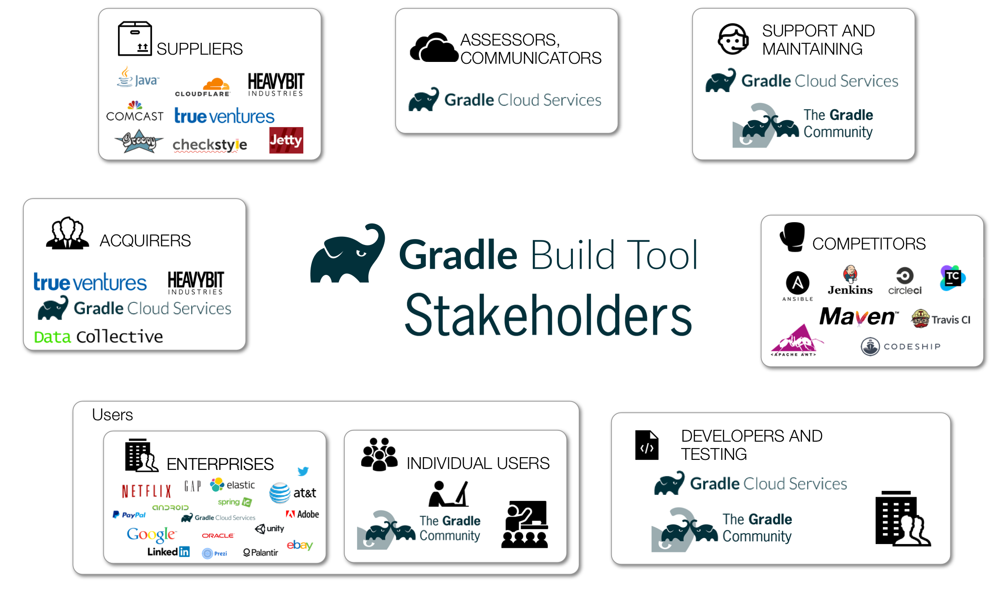

*Figure 2: An overview of all the stakeholders involved in the Gradle project*

### Power-Interest grid
In the stakeholder analysis, many different actors with different roles, power and interest have been analysed and visualised in [Figure 3](#powerinterest). The main stakeholder of Gradle with the most power and interest platform is Gradle Inc. Which key executives have the most influence, and Adam Murdoch and Hans Dockter, are considered to be the main architects of the platform. The venture capital companies that invested in Gradle have been assigned as having high power, but moderate interest. The diversified portfolios owned by these firms limits the interest in the company to only a moderate status.

Since Gradle is built upon Java and Groovy, these programming languages can be seen as more powerful actors than other suppliers, having very little interest. Heavybit industries can also be seen as a supplier, and since they possess a warrant and house the company, they are presumed to have more power and interest than most suppliers. The developers, testers and maintainers can be placed in the middle of the spectrum, all with some power and interest.

The two least powerful stakeholders are the individual users and the competitors. Whereas the last one has the highest interest, since every mistake made by Gradle could be in favour of them. Companies who use Gradle are considered to have more power than individual users, since they have the knowledge and manpower to put pressure on the development of Gradle, contributing themselves or by demanding extra features by the development team inside Gradle Inc.

	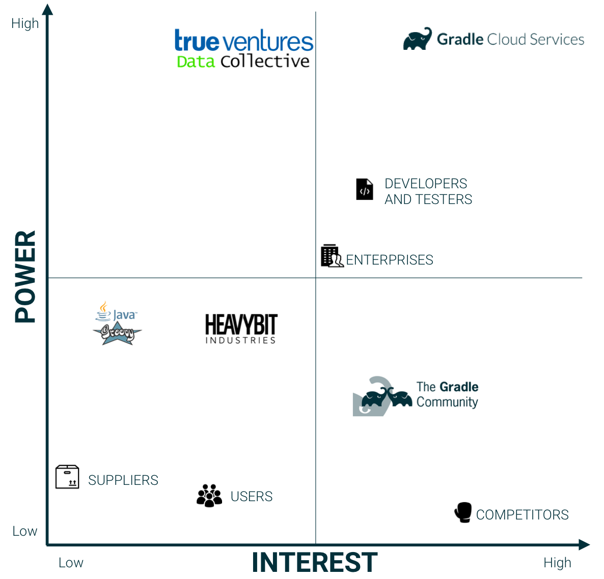

*Figure 3: Power-Interest grid for the stakeholders of Gradle*

## Context view

The context view describes the relationships, dependencies, and interactions between the system and its environment (the people, systems, and external entities with which it interacts) [[1]](#rozanski). This section examines Gradle's scope, its dependencies on others and the interaction with other parties.

### System scope & responsibilities
Gradle aims to build anything, automate everything and deliver faster [[3]](#gradleorg). The goal of the system is to create an environment which allows developers to code as flexible as they want, and to let them build their software as fast as possible. Since more players (competitors) are in the field, Gradle strives to deliver the best performance. Therefore, Gradle introduced incremental build strategies, allowing smart algorithms to speed up the building process. Thus, the scope of Gradle is to provide developers with a flexible and easy to use building tool to deliver their software faster.

### External entities and interfaces
Gradle is a widely-used build tool out of which a company, Gradle Inc., emerged. As one can imagine, a software project like this cannot be developed without external libraries, tools and frameworks. On the other hand, many companies cannot develop their software without Gradle. These external relations are examined in this section. Below, these are elaborated upon and afterwards visualised in [Figure 4](#context).

- Written in Java and Groovy
- Windows, Linux and macOS are all supported
- Built by itself, using the Gradle Build Tool
- Supports many programming languages, enabled by their respective plugins [[10]](#gradleplugins)
- Plugins also allow editing in an IDE of choice
- Active development team of 30-40 core developers and more than 200 contributors from the open source community
- A diverse spectrum of users, from individual developers to major enterprises such as Google and Netflix
- Continuous integration using [TeamCity CI](https://builds.gradle.org/)
- A GitHub repository filled with code, plugins and many issues is used to host the code base [[9]](#gradlegit)
- Communication and support is provided via [Github](https://github.com/gradle), [Gradle discuss](https://discuss.gradle.org/) and [Twitter](https://twitter.com/gradle)
- For testing purposes, the [Spock Framework](http://spockframework.org/) is used, which provides enterprise testing, behaviour driven testing and mocking and stubbing
- The project is licensed under the [Apache License, Version 2.0](https://www.apache.org/licenses/LICENSE-2.0), a free software license written by the Apache Software Foundation (ASF)

	

*Figure 4: The Context View of Gradle*

## Evolution perspective
This section analyses the evolution of the Gradle Build Tool. The evolution perspective focuses on identifying the ability to be flexible in the face of inevitable change. As discussed by Rozanski and Woods, a flexible system should be able to deal with all possible types of changes that it may experience during its lifetime [[1]](#rozanski). Therefore, the changes throughout the lifetime of the project are analysed, and the mechanisms in place to provide flexibility are discussed.

Gradle updates their current version number according to the semantic versioning convention [[19]](#semver).
Most Gradle releases can be categorised into two main categories: major updates that symbolize a new backwards compatibility baseline, and new versions containing novel features and bug fixes. The first one corresponds to the *major* indicator in the semantic version convention, the latter corresponds to the *minor* type. There might also be a third version number that represents a *patch*, which is incremented by small bug fixes that are merged into the Master branch.

The first type has only occurred three times in the history of Gradle. The latter on the other hand, has an average frequency between 6-8 weeks [[20]](#discussrelease) despite efforts to decrease this to 4-6 weeks as stated in the release notes of Gradle 2.7 [[21]](#releasenotes27). [Figure 5](#evoluationimg) gives an overview of the different releases and mentions the changes with the largest magnitude of change.

	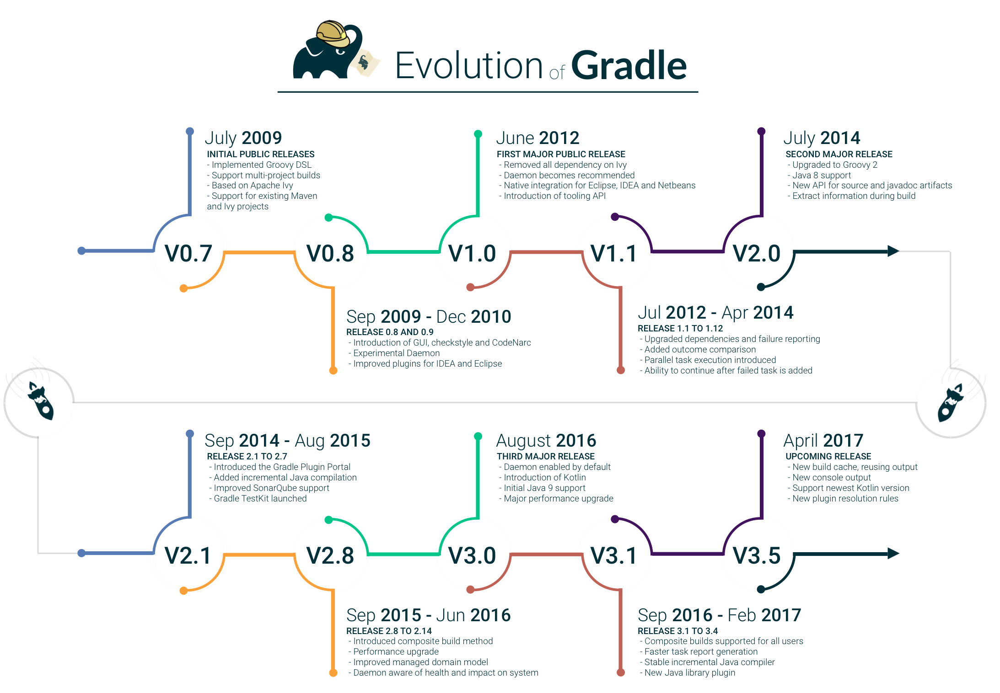

*Figure 5: The Evolution Perspective of Gradle [[24]](#releasepage)*

The main reason for Gradle to innovate and change the project structure is to improve the product. In every iteration, it attempts to add new features and improve performance and user experience significantly. They aim to stay flexible by using their plugin orientated architecture. Gradle has explicitly chosen to limit the features provided by the core module. As stated in the online user guide:

>  All of the useful features, like the ability to compile Java code, are added by plugins. Plugins add new tasks (e.g. JavaCompile), domain objects (e.g. SourceSet), conventions (e.g. Java source is located at src/main/java) as well as extending core objects and objects from other plugins [[22]](#userguideplugins).

The described plugins can be implemented in any language, as long as the implementation ends up compiled as byte code[[22]](#userguideplugins). The choice for a plugin based model improves several critical aspects of the software project.
First of all, the overhead of maintaining similar logic across multiple projects is reduced. Furthermore, it enhances comprehensibility and organisation of the project due to a higher degree of modularization. Finally, it encapsulates imperative logic, allowing the build scripts to be as declarative as they can be [[22]](#userguideplugins).

Most importantly, it seems that this strategy has allowed Gradle to be a front runner in the industry. The fast development of a strong and innovative core, combined with a very flexible plugin architecture will allow Gradle to keep moving in the future when facing inevitable change.

## Deployment view
In the book Software Systems Architecture, Rozanski and Woods [[1]](#rozanski) define the deployment view as *"Describes the environment into which the system will be deployed, including the dependencies the system has on its runtime environment"*. Gradle will be deployed on the computer system of the users (developers), or on a continuous integration server on which a project will be built.

The Java Runtime Environment (JRE) is a third-party software requirement for Gradle, and needs to be installed on the system where the project will be utilised. The use of Java makes Gradle deployable on a huge variety of operating systems such as Windows, macOS and Linux as well as different hardware architectures such as x86, x64 and ARM. Java decouples Gradle from the operating systems' environment and hardware components and thus makes Gradle independent of the system and type of hardware on which it is deployed.

A particular issue may arise in the deployment due to the possibility that Gradle projects can be created using a different version of Gradle than the user might have installed. To aid the user in building a Gradle project independent of the original system environment on which the project was deployed, Gradle provides the option to make use of the Gradle Wrapper. The wrapper will take care of the installation of additional tools required, and will make sure to install the right version. A project that includes the Gradle Wrapper can be built on any system that has Java installed. The wrapper is invoked using the `./gradlew <task>` command and works by downloading and installing the version of Gradle the project requires and will thus take care of the deployment for the user. The wrapper is able to verify the downloaded files by calculating and comparing the expected file checksum against the actual one. This feature increases security and protects the software from tampering with the downloaded Gradle distribution. The Gradle Wrapper is the preferred way of starting a Gradle build [[17]](#wrapper) and is visualised in [Figure 6](#wrapperfig), this also shows the parallelization of Gradle processes.

	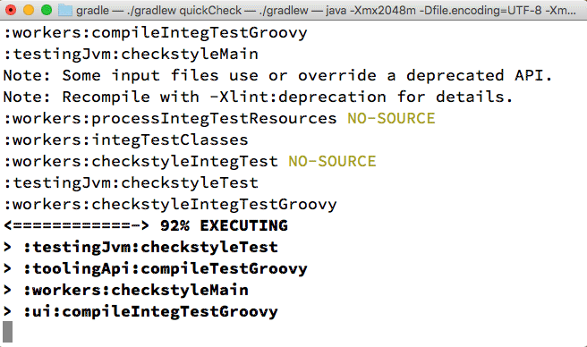

*Figure 6: The Gradle wrapper in action*

The Java Virtual Machine (JVM) requires a non-trivial initialization time. As a result, it can take a while to launch a Gradle build process. As a solution, Gradle provides the Gradle Daemon. The Gradle Daemon is a long-lived background process that will execute builds much quicker than invoking the Gradle process the normal way [[18]](#deamon). This is possible by avoiding the JVM start-up costs, as well as by maintaining a build cache that stores data about the project in memory. This build cache enables Gradle to make use of incremental builds to improve its performance. By using these incremental builds Gradle identifies input or output sections of the build process that have not changed. If these are present, Gradle can skip the build of that task and reuse the existing output from the previous build. The daemon is now enabled by default, but is recommended to be disabled for Continuous Integration (CI) and build servers.

## Development view
This particular view highlights the concerns and interests of the developers and testers of the project. The different modules in the project have been identified, the file structure has been researched and important standardisations of processes are discussed.

### Modules structure
The top layer division can be seen in [Figure 7](#modules). It shows that the Gradle core and the plugins rely on different external dependencies. The plugins are dependent on the API provided by Gradle to connect to the core modules. All three of these different components are controlled by the Gradle build tool that manages the interaction between these subsections. Finally, the Gradle core also has internal dependencies which will be discussed next.

	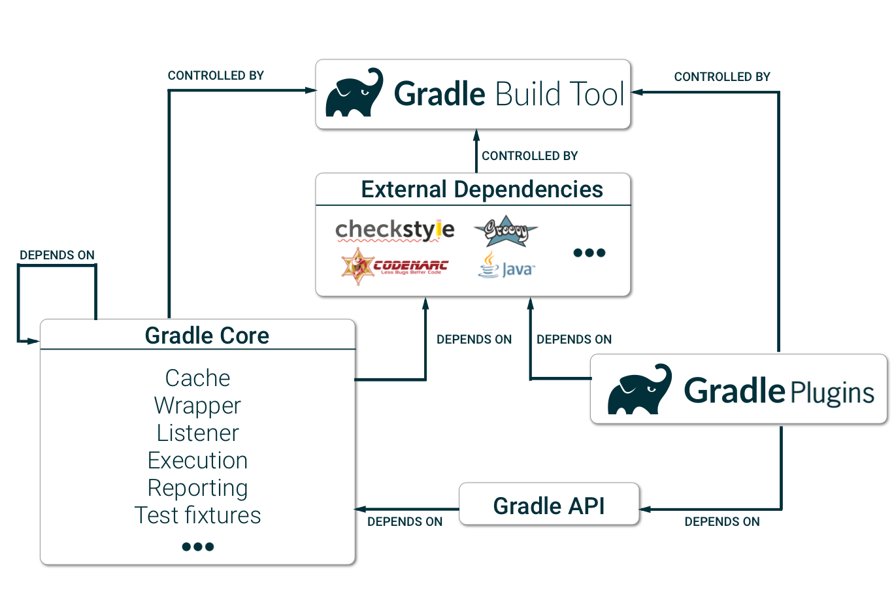

*Figure 7: The module structure view of Gradle*

A more detailed view of modules in the source code can be found in [Figure 8](#sourcecodeview). Due to the flexibility of the Gradle build tool, the core part of the source code is also very flexible, thus fragmented. The main building blocks are the `exhaustion`, `process`, `internal` and `initialization` blocks, which all use elements of the `cache` and `caching` modules to perform their tasks. Common processing parts, like `reporting`, `util` and the Gradle `API`, are also used by the main blocks of source code. The actual behaviour of those core building blocks is influenced by settings located in the `configuration` folder. Finally, all plugins are accessed through the `API` in order to work with the core source code.

	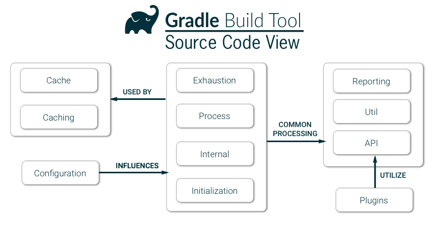

*Figure 8: A more detailed view at the core source code of Gradle*

### Common processing
Just like any other large system, Gradle has separate code modules for tasks which are common to other modules. A few of Gradle's common used modules have been identified in the `subprojects/core` folder:

- A central, common logger is used. The [Simple Logging Facade for Java (SLF4J)](https://www.slf4j.org/) is used to keep track of all the logs made by Gradle. This is also used by the `-debug` option to allow the user to easily debug their code.
- Moreover, multiple utilities are made by the team to be used throughout the project. In the `src/util` folder, many utilities are listed, such as a `nameMatcher`, a `clock` and a `swapper`, which can be easily used by other modules.
- Because of Gradle's high dependency on external plugins, its API can also be considered as common process. The `tooling-api` provides the user with the needed dependencies on those plugins.

### Standardization of design
Since Gradle is an open source platform, everyone is free to contribute to the repository on GitHub. Seeing as multiple contributors are influencing Gradle, the core developers have standardised aspects of the design of the system to make it as maintainable, reliable and technically cohesive as possible. There is not a lot of information available about the general design of the platform, but the core developers have made some guidelines for new contributors to keep the overall code quality high and the licences applicable. The most important aspects of contributing to Gradle are discussed in the [`CONTRIBUTIONS.MD`](https://github.com/gradle/gradle/blob/master/.github/CONTRIBUTING.md) file:

- Contributors have to use git and have a GitHub account to be able to fork the GitHub repository `gradle/gradle`
- Use a text editor or IDE (IntelliJ IDEA CE is recommended) to make changes
- Document changes in the User Guide and DSL Reference (under `subprojects/docs/src/docs`)
- Users are not allowed to put in their names in `@author` Javadoc field
- Write a solid commit message, explaining what has been done in the proposed change
- Sign the [CLA](https://gradle.org/cla), which defines the terms under which the intellectual property has been contributed to Gradle
- Make a pull request using the [`PULL_REQUEST_TEMPLATE.md`](https://github.com/gradle/gradle/blob/master/.github/PULL_REQUEST_TEMPLATE.md) and wait for their code to be reviewed by a Gradle core developer

There are no concrete guidelines of using design patterns in the development of Gradle. However, when examining the code, the *factory*, *builder*, *Singleton* or a combination of these design patterns have been identified many times. For example, the `GroovyCompilerFactory.java` and `DefaultDirectoryFileTreeFactory.java` are two classes built according to the *factory* design pattern.

The implementation workflow is flexible. Core Gradle developers are allowed to commit directly into the master, other contributors have to use pull requests. These pull requests are labelled by developers, assigned to issues (if applicable) and categorised before merging.

### Standardisation of Testing
By standardising the test approaches, technologies and conventions, the overall testing process remains consistent and has a higher pace. In this section, Gradle’s efforts to achieve this are reviewed.

The Gradle project uses its own Gradle build tool as its build tool of choice, which initiates all tests. All new contributions need to include two things in terms of testing. First of all, it needs to provide new Unit Tests, using the Spock framework for any novel logic introduced. In addition, integration test coverage of the new bug/feature should also be provided. Afterwards, TeamCity automatically checks the compatibility of the introduced code, preventing any unexpected failures. To give some indication of the number of tests that are run by TeamCity, for Windows with Java 1.8, 23.709 tests have been passed successfully [[11]](#gradlebuilds).

In order to verify existing tests manually, the untested code can be introduced in the `/subproject` folder after which the `./gradlew :<subproject>:check` command can be run. During the build Gradle also executes Checkstyle and Codenarc tests that perform static code analysis. The use of PMD throughout the development process is also encouraged.

Finally, simple contributions are only merged into the project when the build succeeds, the tests are all passed and new test material is provided and reviewed to be in good order. Complex changes must face the promotion pipeline, in which they will be tested more thoroughly in different environments and levels to assure quality [[23]](#gradleqa).

#### The Spock Framework
Gradle uses the Spock Framework as their testing framework of choice. The framework was initiated by [Peter Niederwieser](https://github.com/pniederw) who joined the Gradle team in 2011 and remained an active employee until late 2014. Peter received help from [Luke Daley](https://github.com/alkemist) who is still part of the core development team of Gradle Inc. Therefore, the Spock Framework is made by a (former) Gradle employee, but can be considered as an independent piece of software used by Gradle in their development process.

The open source project Spock integrates enterprise testing, mocking, stubbing and does this in a behaviour driven way [[12]](#spockframework). It covers a diverse spectrum of test types, ranging from unit testing to integration testing and even functional testing. [Figure 9](#spock) shows the different tools that can be replaced by integrating the Spock framework.

	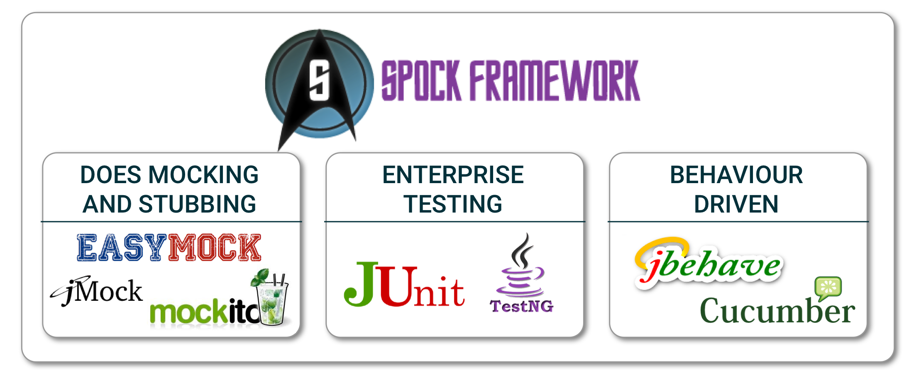

*Figure 9: The Spock framework*

The framework uses the JUnit runner which allows for easy integration into the system and even facilitates parallel usage of Spock and JUnit tests. Simplicity and readability are key aspects of the framework. The tests can be read like plain text English and the results of a test come in a very clear reporting format, as shown in [Figure 10](#test_report).

	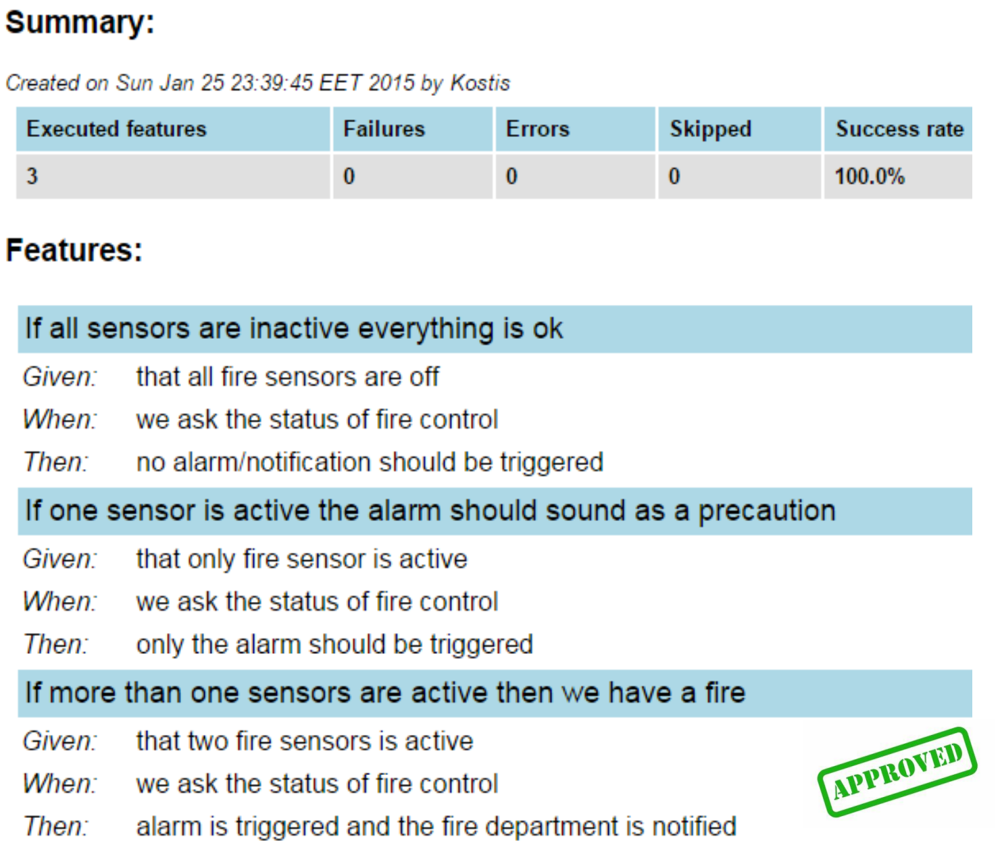

*Figure 10: Spock output report summary*

Another very important advantage is the ability of Spock to understand the context in failed tests while using data driven testing. As can be seen in [Figure 11](#testcontext), the values of the different variables of the failed assert are shown to give a clear overview of the reasoning why the test failed. According to the creators of Spock, only their framework knows the context of the failed test, whereas others do not [[13]](#spockdata). The fact that Gradle uses this framework, which promotes company wide testing and understandability, enforces the idea that testing and code quality is the foundation of their development process.

	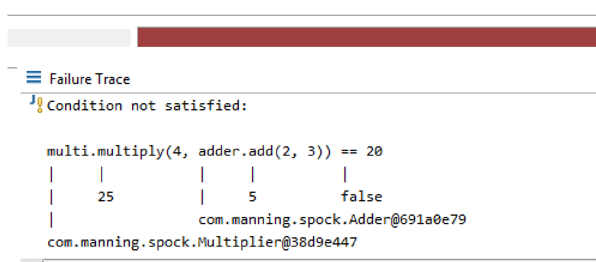

*Figure 11: Simple test visualization by Spock*

## Technical debt
This section focuses on the technical and testing debt present inside the Gradle project. The definition of technical debt according to Techopedia is:

> Technical debt is a concept in programming that reflects the extra development work that arises when code that is easy to implement in the short run is used instead of applying the best overall solution. [[14]](#technopedia)

To identify technical debt within Gradle, a wide range of options have been used. First, (static) code analysis tools are used to assess code quality. Afterwards manual inspection took place to examine the evolution of technical debt.

### Code quality tools
During the development of Gradle, many tools are used to keep the quality high. Static analysis tools are used to detect errors in the source code without running it, and Continuous Integration tools are used to prevent integration problems and allow external build tests. Checkstyle, PMD, Codenarc, Findbugs, and JaCoCo are all incorporated in the process. Gradle takes quality and testing very serious. As discussed before, contributors have to write additional tests and are subjected to code review by core developers in order to get their pull request merged. The Gradle Core developers have even developed their own [Gradle Quality Plugin](https://github.com/xvik/gradle-quality-plugin) to standardise the output of code quality tools. This tool combines results from CheckStyle, FindBugs, PMD and CodeNarc and categorises them into one summary.

### SonarQube analysis
[SonarQube](https://www.sonarqube.org/) is a platform for continuous software quality monitoring. This platform is able to analyse a large software project like Gradle in a matter of minutes. It provides the user with crucial insights about bugs, security and technical debt within the project. Running the SonarQube analysis tool on the latest version of Gradle (v3.4.1) has given the following insights about technical debt. SonarQube reports a vast amount of bugs (1500), vulnerabilities (87) and code smells (7900), ranging from refactor recommendations to limiting the large number of lines in a class to the amount of duplicated code (which represents only 0.6% of the entire code base). Many of the indicated bugs are only minor faults, style issues or false positives.

The technical debt analysis however, provides a rather good insight into this phenomenon. SonarQube uses the [SQALE methodology](http://www.sqale.org/), which is a method to support the evaluation of source code independent of language or code analysis tools.
The resulting findings include 113 days worth of technical debt. Moreover, when combining this with the age of the project (8 years as of now) and the fact that it contains over 400.000 lines of code, a  [maintainability ratio](https://docs.sonarqube.org/display/SONAR/Metric+Definitions) of 0.7% is derived. This results in the highest possible grade, namely an A. An overview visualisation, showing the time needed to fix the discovered code smells can be seen in [Figure 12](#techdebt).

	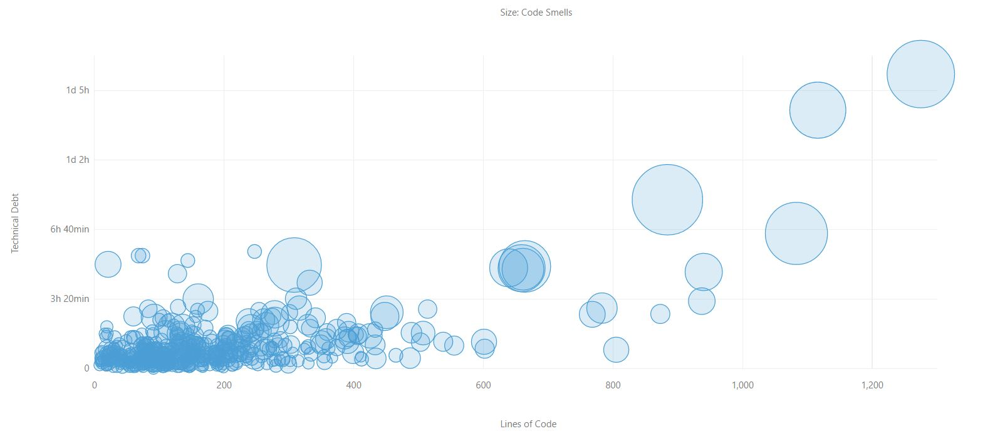

*Figure 12: Technical debt in the source code, categorised by lines of code and time to fix*

Furthermore, the cyclomatic complexity measure is often used as a metric to assess the complexity of a code base. This measure is calculated by accruing the different possible paths through the source code. In [Figure 13](#complexity) the complexity breakdown of different functions and files is given. The total complexity of the entire code base is 47.408 and the average per class is 6.9. Overall, the complexity is relatively low when comparing the values to those suggested by codecentric [[15]](#codecentric). According to SonarQube there is not a single method that exceeds the unmaintainable threshold, with the highest having a complexity of 18.

These insights give additional indications that developers working for Gradle are highly focused on generating long-term, maintainable software.

	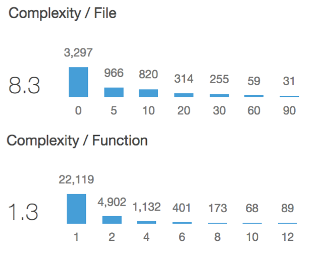

*Figure 13: The Cyclomatic complexity per function and per file*

### Evolution of Technical Debt
Despite the extensive code review and testing at Gradle, technical debt in the project has grown over the years. This section elaborates about this debt and tries to quantify it. First, an analysis of the code base is presented, followed by the number of TODOs in code and how this has changed through time.

#### Code base analysis
The Gradle Build Tool started in 2009 with the release of [Gradle 0.7](https://services.gradle.org/distributions/gradle-0.7-all.zip). With only 597 files and 40.528 lines of code, the tool was not as big as it is today. The size of the Gradle source code has grown steadily to almost 400.000 lines of code in the most recent version. A visualisation of this growth can be seen in [Figure 14](#numberoflines). While the number of lines increased over the years, the percentage of comments in code has decreased slowly. From over 20% in 2009 to less than 15% in 2017, as is shown in [Figure 15](#perccoments). This probably means that comments about possible changes needed or suggestions about new features in the code have been resolved faster than they have been introduced. The growth of Gradle can also be seen in the amount of statements per method. Method size has grown over the years from containing 2,4 statements per method to 2,8 statements per method.

	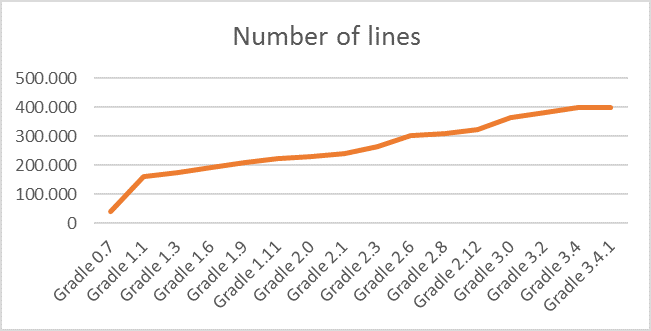

*Figure 14: The number of lines for each Gradle release*

	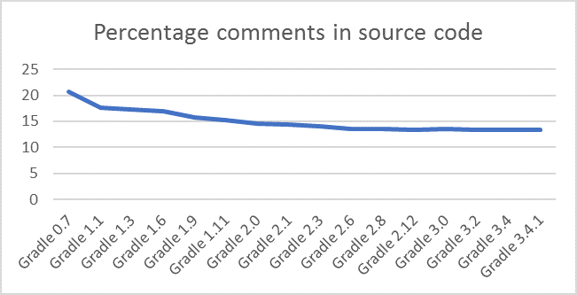

*Figure 15: The percentage of comments in the source code for each Gradle release*

#### Todos in code

The frequently used TODO annotation could hint at technical debt, indicating postponed tasks. Therefore, in order to perform further analysis on the growth of technical debt, the occurrence of the word TODO in the source code has been analysed. The results of this analysis are shown in [Figure 16](#todooccur), showing that the development team attempts to solve as many TODO's as possible before the next major release, while on the other hand introducing additional TODOs when adding new features. Despite the major spike in TODOs due to the high occurrence rate in the user guide in the versions 2.0-2.12, the total number of TODOs is steadily rising through time at a slow pace. However, when comparing this growth rate to the increase in lines of code, this always remains a limited portion of the total code base.

	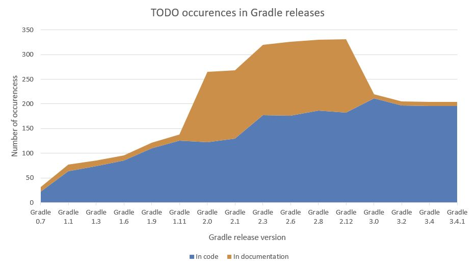

*Figure 16: The amount of TODOs per Gradle release*

An example of a TODO left in the source code can be found in the [snippet](#todolegacy) below. The file `BuildableJavaComponent.java` is part of the Gradle API and contains some legacy code, as commented by Adam Murdoch himself two years ago. This resembles a perfect example of a postponed task that will improve the efficiency of the project when fulfilled.

	/**
	 * Meta-info about a Java component.
	 *
	 * TODO - this is some legacy stuff, to be merged into other component interfaces
	 */
	public interface BuildableJavaComponent {
	    Collection<String> getRebuildTasks();

	    Collection<String> getBuildTasks();

	    FileCollection getRuntimeClasspath();

	    Configuration getCompileDependencies();
	}

### Main findings
Overall, Gradle has proven to take code quality and technical debt very seriously and invests a lot of time and effort in building a truly long-term viable project. This is also highlighted by [Hans Dockter](https://github.com/hansd) [[16]](#discussblog) in a blogpost on the old Gradle forum regarding the release of version 1.0 stating:

> The main reason why milestone-5 took so long to be released is that we found out that a lot of stuff we have been using Ivy for needed to be fully rewritten to give it the capabilities we want. This was a huge investment and we were basically paying back a huge technical debt. We paid back most of it. This will also enable us to provide many innovations in the area of dependency management in the future.

Even though, Gradle version 3.4.1 was recently released, this philosophy is still at the core of the project. The different integrated code quality tools ensure constant code quality and reduces the number of new bugs introduced. There are some improvements to be made such as publishing their Github to Coverity, to use more generic tools that might indicate improvements based on a different vision of technical debt that these tools might maintain. Fuzz testing could also be a good addition to the test suite, allowing unexpected input values to uncover unexpected bugs.

The evolution of technical debt shows an upward trend and Gradle should not allow their growth to change their current process and leave the technical debt increase uninhibited. Gradle should maintain the awareness throughout the company in order to be successful in the long-term, technical debt should always be a priority.

## Conclusion
This chapter summarised the Gradle Build Tool in many architectural views and perspectives, helping the reader to be able to understand and contribute to the project. The analysis of the Gradle project has led to the conclusion that Gradle has an interesting, yet complex architecture.

In the first section, the stakeholder analysis discussed the various classes of stakeholders involved in the project. Gradle is used by a very broad spectrum of users, but made by a relatively small group of developers at Gradle Inc., supported by contributions from the community. In general, the Gradle team aims to build anything and automate everything faster than is currently possible. This requires a highly flexible piece of software, which can be modified and expanded using a variety of plugins. The context view showed the dependencies on external libraries, tools and frameworks Gradle uses to deliver its product. After which, the development of the project is further analysed showing a very fragmented source code, providing the developers of Gradle with a flexible architecture. A relatively small core interacts with a vast number of plugins, which all have their respective test suites included. Testing is given the highest priority by the Gradle developers, as discussed in the section dedicated to the Spock framework. Literally thousands of tests are written to assess the project using TeamCity CI. In addition, every contribution needs to pass an assorted test suite named quick test, while also adding their own tests for novel code.

The Gradle Build Tool is now eight years old and the project has evolved significantly over time. Constant innovation, could lead to a growing amount of technical debt in the project. However, Gradle has proven to take code quality and technical debt very seriously by investing a large amount of time and effort in building a truly long-term viable project. The overall analysis of Gradle shows that projects like this truly benefit greatly from the open-source environment. The flexible architecture, a group of passionate developers and contributors and a focus on testing have gotten Gradle where it is today, while making it ready to evolve even further throughout the years to come.

## References

1. 
Nick Rozanski and Eoin Woods. Software Systems Architecture: Working with Stakeholders using Viewpoints and Perspectives. Addison-Wesley, 2012.
2. 
Wikipedia. Gradle. https://en.wikipedia.org/wiki/Gradle, 2017.
3. 
Gradle.org. Gradle Build Tool. https://gradle.org/, 2017.
4. 
Gradle.com. About. https://gradle.com/about, 2017.
5. 
Business Wire. "Gradle Inc. Raises $4.2M With True Ventures And Data Collective". Businesswire.com, http://www.businesswire.com/news/home/20151210005335/en/Gradle-Raises-4.2M-True-Ventures-Data-Collective, 2017.
6. 
Gradle.org. Gradle User Guide. https://docs.gradle.org/3.4.1/userguide/userguide.html, 2017.
7. 
GitHub.com. google/osdetector-gradle-plugin. https://github.com/google/osdetector-gradle-plugin, 2017.
8. 
GitHub.com nebula-plugins/gradle-netflixoss-project-plugin. https://github.com/nebula-plugins/gradle-netflixoss-project-plugin, 2017.
9. 
GitHub.com gradle/gradle. https://github.com/gradle/gradle, 2017.
10. 
Gradle.org. Plugins. https://plugins.gradle.org/, 2017.
11. 
 Gradle.org. Builds. https://builds.gradle.org/, 2017.
12. 
Spock. Spock Framework. http://spockframework.org/, 2017.
13. 
Spock. Data driven testing. http://spockframework.org/spock/docs/1.1-rc-3/data_driven_testing.html, 2017.
14. 
Technopedia. Technical debt. https://www.techopedia.com/definition/27913/technical-debt, 2017.
15. 
Codecentric. Why good metrics values do not equal good quality. https://blog.codecentric.de/en/2011/10/why-good-metrics-values-do-not-equal-good-quality/, 2011.
16. 
 Gradle Discuss. Status of the 1.0 release. https://discuss.gradle.org/t/status-of-the-1-0-release/7735, 2011.
17. 
 Gradle.org. Gradle User Guide: The Gradle Wrapper. https://docs.gradle.org/current/userguide/gradle_wrapper.html, 2017.
18. 
 Gradle.org. Gradle User Guide: The Gradle Daemon. https://docs.gradle.org/current/userguide/gradle_daemon.html, 2017.
19. 
 Semver.org. Semantic Versioning 2.0.0. http://semver.org/, 2017.
20. 
 Gradle Discuss. Gradle release distribution Link. https://discuss.gradle.org/t/gradle-release-distribution-link/21033, 2017.
21. 
 Gradle.org. Gradle Release Notes. https://docs.gradle.org/2.7/release-notes.html, 2015.
22. 
 Gradle.org. Gradle User Guide: Gradle Plugins. https://docs.gradle.org/current/userguide/plugins.html, 2017.
23. 
 GitHub.com. Gradle Design Docs: QA and release automation. https://github.com/gradle/gradle/blob/master/design-docs/done/qa-and-release-automation.md, 2012.
24. 
 Gradle.org. Gradle Release page. https://gradle.org/releases, 2017.
