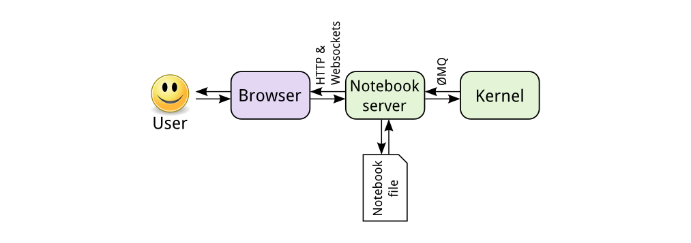
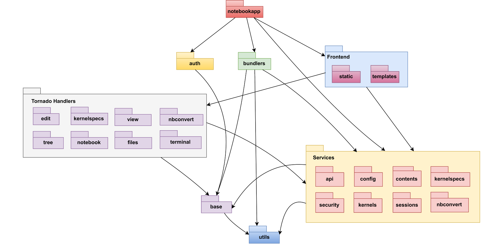
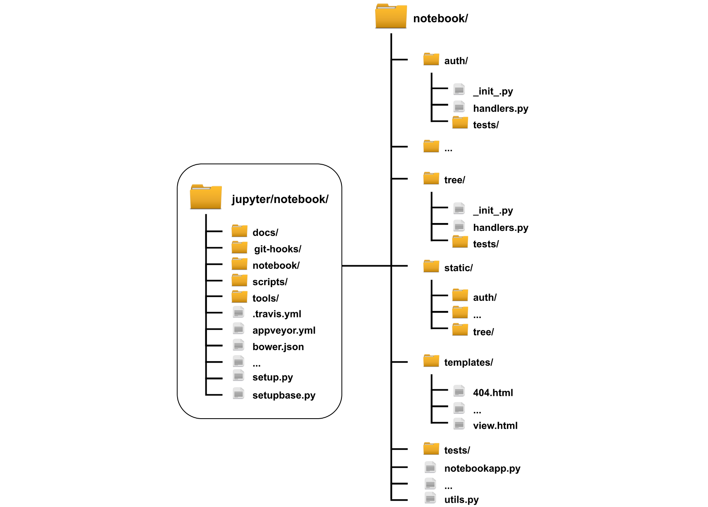
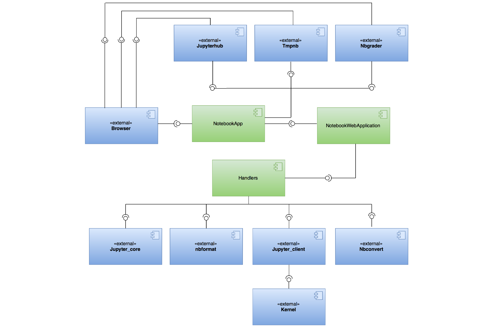
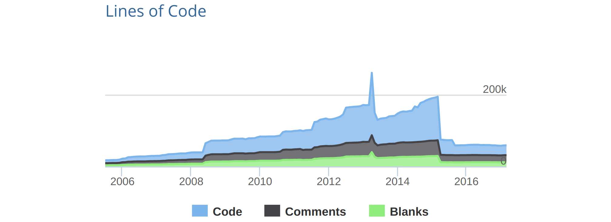
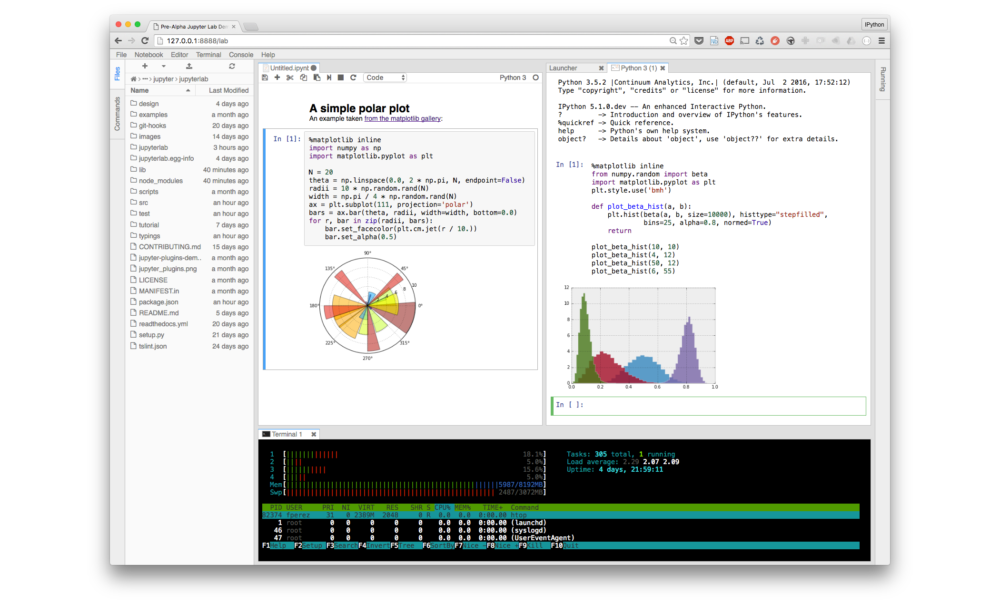

# Jupyter Notebook
**By [Lorenzo Gasparini](https://github.com/joined), [Ajay Adhikari](https://github.com/ajayaadhikari), [Giannis Papadopoulos](https://github.com/John-Pap) and  [Anelia Dimitrova](https://github.com/adimitrova)**

***Delft University of Technology***

### Abstract

*Jupyter notebook, the next generation of IPython, is an open-source web-application that allows the user to create and share documents containing live code, comments, formulas, images and more, all in one place.
The current chapter analyses this project in depth. 
Our team was able to make six pull requests regarding technical debt and bug fixes, which were accepted.
A good overview of the whole project is given by analysing stakeholders and the context view.
Next, various viewpoints and perspectives on the architecture of the project are investigated.
This chapter aims to help people who would like to join the Jupyter community and make contributions, by providing extensive analysis of the project.*

### Table of Contents

* [Introduction](#intro)
* [Organization](#org)
	*  [Stakeholders](#stake)
	*  [Context View](#cont)
* [Architecture](#arch)	
	*  [Development Viewpoint](#dev)
	*  [Functional Viewpoint](#fun)
* [Technical Debt](#debt)
* [Evolution Perspective](#evo)
* [Conclusion](#concl)
* [References](#ref)

## Introduction

Jupyter Notebook is a cross-platform open source web application which allows running code, visualising its output (such as plots, images, tables etc.) and writing explanations in natural language, accompanied by equations and all this in one so-called Notebook file. It provides the opportunity to process large amount of data and supports **Ju**lia, **Pyt**hon, **R** (origin of the name **Jupyter**) and many other programming languages. It is intuitive, easy to install and use, which makes it suitable for scientists, programmers and learners. 

It is adopted by teachers in universities such as [UC Berkeley](https://developer.rackspace.com/blog/deploying-jupyterhub-for-education/) where they use JupyterHub (server, hosting Notebooks where users log in and immediately start coding) in which students do their assignments. Furthermore, Github supports the rendering of Notebook `.ipynb` files. Entire books have been written with Notebook and published on Github. Multiple online courses on Machine Learning, Computer Science, Python programming, Data Analysis and others can be found in [this Github repository](https://github.com/jupyter/jupyter/wiki/A-gallery-of-interesting-Jupyter-Notebooks). 
 
This chapter aims to give users a quick understanding of how Jupyter Notebook is organised, developed and maintained. First, the Stakeholders and Context view are analysed to provide insights into the organisation of the project. Furthermore, detailed analysis of the architecture is presented in order to understand its structure. In addition, technical debt in terms of code, testing and documentation was also found throughout the analysis of the system and is presented in the chapter. This is followed by the evolution of the project explaining how Notebook emerged from IPython and discussing the JupyterLab project which is considered as the future of Notebook. Finally, the chapter concludes with our findings of the project.

## Organization
This section discusses the parties that are involved in the development, maintenance, testing and building of the system. These stakeholders are then visualised using a context-view diagram.

### Stakeholders
A number of different types of stakeholders exist as defined by Rozanski & Woods [[1](#rw)] and this section goes through them w.r.t. Jupyter Notebook.

#### **Assessors**
As Jupyter Notebook's team consists of fifteen core developers who oversee the conformance of the (programming & other) standards. They are responsible for handling pull requests and communicate them between each other to decide whether or not to merge. Furthermore, they do the planning of future releases and/or sub-systems of the Notebook. 

#### **Communicators**
Communicators are people who explain the system and the architecture to other stakeholders via documentation or training materials. A [number](https://www.slideshare.net/mbussonn/jupyter-a-platform-for-data-science-at-scale) [of](https://www.slideshare.net/BigDataColombia/ipython-jupyter) [presentations](https://www.slideshare.net/Plotly/plotcon-nyc-the-architecture-of-jupyter-protocols-for-interactive-data-exploration-and-visualization-across-languages) are available online, prepared and presented by Fernando Perez and Matthias Bussonier. Jupyter Notebook communicators are also all the developers who have written the documentation. They are a small team and all of them update the documentation when necessary. The documentation is useful as well for developers and contributors to the system. 

#### **Developers**
Two major types of Developer stakeholders were identified in Jupyter Notebook: core and contributors.
* **Core**: Core developers work actively to write, fix, test and improve the system. Their main job is to also go through the open pull requests on Github and  ensure that the contribution proposals are well tested and do not interfere with the current system in any way other than to improve it. 
Core developers are @[carreau](https://github.com/carreau), @[takluyver](https://github.com/takluyver), @[jasongrout](https://github.com/jasongrout), @[rgbkrk](https://github.com/rgbkrk), @[minrk](https://github.com/minrk) and @[blink1073](https://github.com/blink1073).
* **Contributors** are important for open source projects as they often solve issues the core team has no time for or implement new features making the product even better. They contribute also by improving documentation, bug fixes and even by writing their own kernel supporting a new programming language. Examples of these contributors are @[vidartf](https://github.com/vidartf) and @[yuvipanda](https://github.com/yuvipanda).

#### **Maintainers** 
The **Steering Council** consists of Project Contributors writing substantial code of high quality and quantity for over one year. Working with the BDFL (Benevolent Dictator for Life) Fernando Perez the council ensures the long-term progress and existence of the project. The [NumFOCUS Foundation](http://numfocus.org) serves as the projects' fiscal sponsor and acts as a parent legal entity. The NumFOCUS Subcommittee consists of four Council and one external member. 

#### **Support Staff**
As per the book [[1](#rw)], support staff are the people who provide support to the users. Therefore Jupyter Notebook members taking care of issues in their Github repository could be considered support staff. These users are usually @[minrk](https://github.com/minrk) and @[takluyver](https://github.com/takluyver). In case they are not sure about something, they know who to get involved. 

#### **Testers**
Testers are people who test the system to ensure it is suitable to use. Since the Notebook team consists of only fifteen core developers, each of them has to write tests whenever they implement a new feature or improve the current code. All of them can thus be considered testers as well. However, while going through the project a few members were identified who wrote new or updated the old tests frequently: @[jdfreder](https://github.com/jdfreder) (no longer active), @[minrk](https://github.com/minrk) (core dev),  @[ssanderson](https://github.com/ssanderson) (contributor) and others.

#### **Users**
The two biggest categories of users are the following:

* **Scientists:** Jupyter is mainly used by data scientists working with R and Python on daily basis, however, it is not only aimed at them but is generally used by other types of users as well. 
* **Learners** are stakeholders who, for example, use Notebook for study & teaching purposes. 

#### **Sponsors**
Sponsors are an additional stakeholder class to the main ones, related to the project. It consists of companies and universities that support the project financially. Some of them are [Google](https://jupyter.org/assets/google-color.svg), [Microsoft](https://jupyter.org/assets/microsoft-color.svg), [Rackspace](https://jupyter.org/assets/rackspace-color.svg), [Leona M. and Harry B Helmsley Charitable Trust](https://jupyter.org/assets/helmsley.svg), [Gordon and Betty Moore Foundation](https://www.moore.org/) etc.  They do not take decisions about the projects' progress, however, they may influence these decisions. 

### Context View
In this section, the context viewpoint of Jupyter Notebook is described. The context view describes and visualises the relationships and interactions between Jupyter Notebook with the environment.

#### System Scope
According to the Jupyter foundation [website](http://jupyter.org/), the Jupyter Notebook is

> an open-source web application that allows you to create and share documents that contain live code, equations, visualisations and explanatory text. 

The Notebooks are typically used for data cleaning and transformation, numerical simulation and machine learning tasks; the target audience is the broad tech audience, spanning from high school students to the most advanced researchers of the world.

Jupyter Notebook is the main application of the broader Jupyter project, which focuses on interactive and exploratory computing that is reproducible and multi-language.

#### Context Model

**Figure 1** - *Context Model of Jupyter Notebook.*

In [Figure 1](#contextmodel), the context model of Jupyter Notebook is displayed. A short description of the most important entities in the diagram follows.

The project, which is a complex web application mainly **used by** *researchers* and *students*, can be conceptually separated in *front-end* and *back-end*. For what concerns the **programming languages**, *Python* is used for the back-end while the *LESS* stylesheet language is used in combination with *HTML* and *Javascript* for the front-end.

Thanks to the interoperability of Python, the project can run on most **platforms**, including *Windows*, *Mac OS X* and other *Unix-like* systems. There are no clear indications of officially supported **browsers**, but the documentation recommends the usage of *Chrome*, *Firefox* or *Safari*.

In terms of **testing frameworks**, *Nose* is used for the Python back-end while *CasperJS* is used for the front-end. Tests are executed automatically at each pull request, thanks to **continuous integration**. To this regard, *Travis CI* is used for testing on Linux and *AppVeyor* for Windows. Code coverage is analysed by *Codecov*. *ESLint* is used to enforce the **code quality** on the Javascript sources.

The system has multiple external **dependencies**, both in the front-end and in the back-end. In the former case, the key ones are *Bootstrap*, *Backbone.js*, *CodeMirror*, *Marked* and *MathJax*. In the latter, they are *Jinja2* and *Tornado*. The dependencies are managed using **package managers**, in particular, *Bower* is used for the front-end and *NPM* is used for the building tools.

**Sponsoring** occurs in two ways: directly from companies like *Google*, *Microsoft* and *Rackspace* or by employing members of the Steering Council. The latter is the case for companies like *Bloomberg*, *Netflix* and for the *Berkeley University of California*. The **development** is carried on by the members of the Steering Council, including the BFDL Fernando Pérez, and by the Github community.

As far as the **documentation** goes, it is maintained using the *Sphinx* documentation generator and published on the *Read The Docs* hosting platform.

The main **competitors** are the *Beaker Notebook* and *Apache Zeppelin*, both of which have shorter history and have not yet reached the maturity level of Jupyter.

Jupyter Notebook is **licensed** using the *3-clause BSD license*, while the **copyright** of the code belongs to the respective authors

## Architecture

### Development Viewpoint

The development view describes the architecture of a project from the viewpoint of the developers. According to Rozanski and Woods [[1](#rw)], the development view is responsible for addressing different aspects of the system development process such as code structure and dependencies, build and configuration management of deliverables, system-wide design constraints, and system-wide standards to ensure technical integrity. In the following sections, the development view of Jupyter Notebook is presented based on the three models that Rozanski and Woods [[1](#rw)] define in their book: Module Structure Model, Common Design Model and Codeline Model. In addition to this, a high-level view of Jupyter Notebook is included in order to ensure a thorough understanding of the project in different granularity.

#### High-level view

**Figure 2** - *High-level view of Jupyter Notebook.* [[2](#global_view)]

First, the user interacts with the browser, consequently, a request is sent to the Notebook server. This can be either HTTP or WebSocket request. If user code has to be executed, the notebook server sends it to the kernel in [ZeroMQ](http://zeromq.org/) messages. The kernel returns the results of the execution. At last, the notebook server returns an HTML page to the user.
When the user saves the document, it is sent from the browser to the notebook server. The server saves it on disk as a JSON file with a `.ipynb` extension. This notebook file contains the code, output and markdown notes. [[2](#global_view)]

#### Module Structure Model

The module structure model defines the organisation of the system's code clustering related source code files into modules and determining the dependencies between them [[1](#rw)]. In this section first the modules of the project are briefly described and then the dependencies between them are visualised in a diagram. It should be also noted that this section focuses only on the internal modules of the project and not the external dependencies.

Here follows a short description of the modules that make up the project:

- **notebookapp**: it is the entry point of the web application, including the Tornado-based server; it is responsible for the configuration of the server, including the mapping of requests to the handlers classes.
- **auth**: it manages the authentication to the notebook and other security-related features.
- **base**: it contains the base Tornado handlers that are extended by the other ones throughout the structure of the directory hierarchy; moreover, the handlers for the ZeroMQ sockets, which are responsible for the communication with the kernel, are included.
- **bundler**: it is used in order to bundle the notebook documents, packaging them in tarballs or zip archives.
- **edit**, **kernelspecs**, **nbconvert**, **view**, **files**, **terminal**, **tree**, **notebook**:
they contain the handlers for rendering the text editor interface, handling the views that are displayed to the user, converting notebook files to other formats, serving files via the content manager, rendering the terminal interface, displaying the tree view and controlling the live notebook view respectively.
- **frontend**: this module contains the code related to the user interface; in particular, `static` contains the Javascript & CSS sources while `templates` consists of the Jinja2 HTML templates rendered by Tornado.
- **services**: it contains the handlers for the backend services, including kernels, kernel specifications and contents web services; all the handlers registered here start with the `/api/` prefix and communicate with the frontend using JSON whereas the other handlers render the HTML views.

The module structure and dependencies are shown in [Figure 3](#modulediagram).

**Figure 3** - *Module dependencies diagram.*

Furthermore, it should be noted that the figure above shows high-level dependencies between the most significant modules of the system. In this graph modules that share a similar role in the system are grouped together for the convenience of the reader. The same purpose serve the colours of each of the modules. The diagram starts from the top with the `notebookapp` module which constitutes the entry point of the web application. It is worth mentioning that there are no [circular dependencies](https://en.wikipedia.org/wiki/Circular_dependency) which makes the system easier to understand and maintain.

#### Source code structure
The overall structure of the directory hierarchy of the Jupyter Notebook is organised as follows. The root folder consists of several files that are used to configure the system. More specifically, the root folder contains YAML files that are responsible for configuring the continuous integration of the project such as `.travis.yml` and `appveyor.yml`. Other important configuration files that are included in the root folder are `bower.json`, `setup.py` and `setupbase.py`. The `bower.json`  manifest file keeps track of the right versions of the front-end packages that are needed for the system. The `setup.py` and `setupbase.py` files are essential for configuring the installation of packages and their dependencies. 

Furthermore, the root folder is divided into five separate folders: the `docs/` folder where all the documentation files that are built using Sphinx are located, the `git-hooks/` which consists of custom git hooks that are available for Jupyter Notebook. For example, there is a git hook that can be enabled to automatically compile the LESS stylesheets and the Javascript code after a git checkout. The `scripts/` which contains scripts that are used as an interface to the components of the notebook for the command line, the `tools/` folder containing tools used in the build process and the `notebook/` which contains all of the source code.

The `notebook/` folder is divided into sub-folders by grouping together source files with similar purpose and functionality. First off, it is divided into sub-folders that contain back-end functionality which are structured in a similar way. The related initializers can be found in `__init__.py` for the given sub-folder and next to that every sub-folder contains a module called `handlers.py` in which the Tornado handlers are included and registered. In addition, a `tests/` folder is included which consists of files that test the Tornado handlers functionality. 

The front-end code is located in separate folders. In particular, the Javascript and CSS files are located in the `static` folder using as the name for the sub-folders the one of the back-end components they interact with. The [Jinja2](http://jinja.pocoo.org/docs/2.9/) HTML templates are included in the `templates/` folder. Concerning the tests that are responsible for testing the front-end functionality, they are contained in the `notebook/tests/` folder. Finally, the `notebook/` folder contains the entry point of the web application which is the `notebookapp.py` module and some common utilities that are used throughout the whole source code. A graphical overview can be found in [Figure 4](#src).

**Figure 4** - *Source code structure of Jupyter Notebook.*

#### Continuous Integration and Testing Approach
*Continuous Integration (CI)* refers to the development practice in which developers *integrate* the code to a shared repository frequently. Each integration is verified by an automated build and test system.

##### Testing Frameworks
The Jupyter Notebook project has a Python backend and an HTML + Javascript frontend. There are two separate testing suites: one for the backend and one for the frontend.

The Python **backend** is tested using the `nose` testing framework, a package built on top of `unittest` to simplify test-driven development.
This testing framework [has been](https://nose.readthedocs.io/en/latest/) in maintenance mode for several years now and its maintainers are suggesting to move to the newer framework `nose2`, but the Jupyter Notebook maintainers don't seem to have any plan to move forward.

For the **frontend** code testing, CasperJS is used. It is a Javascript testing framework built with JS itself and leveraging PhantomJS.
In the recent issue [#2243](https://github.com/jupyter/notebook/issues/2243), the developers discuss the problems related to the Javascript tests. Apparently, race conditions and the asynchronous nature of Javascript make the tests fail at times. Developers are investigating a fix for this.

##### Continuous Integration Services
The project uses the integration [offered](https://github.com/integrations/feature/continuous-integratio) by Github to automate building and testing of the pull requests as they are opened or updated.
In particular, three CI services are used: *Travis CI*, *AppVeyor* and *Codecov*.

**Travis CI** is used by the project to automate build and testing on Linux. The configuration, specified using the `.travis.yml` file, is such that:
- Testing is done using both Python 2.7 and 3.5.1
- *Both* the frontend and the backend are tested
- When testing is done, the Python coverage reports generated by Nosetests are uploaded to Codecov.

Since Travis CI does not yet support the Windows OS, **AppVeyor** is used for the testing on this platform. The configuration is such that only the backend is tested, using both Python 2.7 and 3.5, and code coverage is not checked.

**Codecov** is a hosted CI service that computes a coverage score of the unit tests.
The Jupyter Notebook project uses Codecov to analyse the coverage of the Python backend tests at each pull request. The coverage is not checked for the frontend because the testing framework does not support the generation of coverage reports. The service is configured by means of the `codecov.yml` file [[6]](#codecov-yaml) so that the automatic checking of the pull requests fails if a decrease in the coverage score greater than 10% is observed.

### Functional Viewpoint
Rozanski and Woods [[1](#rw)] explain that the functional view "defines the architectural elements that deliver the function of the system being described" (p. 294). 
This view documents the key runtime functional elements, their responsibilities, interfaces and primary interactions. 
In the notebook project, different key functional elements are present that interact with internal and external elements during run-time.
Interfaces like in `Java` are not present in `Python`. 
But these functional elements do behave like interfaces, as they have well-defined functions that can be called by other elements, to perform different actions. 
The functional view of our project is visualised on figure X. The key elements and the interaction between them is described next.

**Figure 5**: *UML diagram of the Functional View.*

The main entry point of the web application is an instance of the class `NotebookApp`. 
It sets up a Tornado based Notobook server that serves an HTML/Javascript client. 
It also launches an instance of the `NotebookWebApplication` class. The server delegates all the incoming requests to the `NotebookWebApplication` object. 
This class is a sub-class of `Tornado.Web.Application`, which is used to map the different types of incoming requests to the correct handlers.

The handlers use external elements to leverage existing functionalities from the other Jupyter projects.  
`Jupyter_core` is used for basic functionalities like handling configuration files and filesystem locations. 
`Jupyter_client` provides APIs for working with kernels. Kernels are used to execute user code. 
Furthermore, `nbformat` provides APIs for working with notebook files, such as loading, reading and saving. 
Notebook uses `nbconvert` to export notebook files into various static formats such as PDF, HTML and LaTeX.

The `NotebookApp` can only be used by a single user with no login. On top of the notebook, there are other external elements which provide additional functionalities. 
First, `tmpnb` can launch a temporary Jupyter notebook server for multi-user use, without login. 
Second, `jupyterhub` can create a multi-user hub with login which manages multiple instances of the single-user `NotebookApp`. 
At last, `nbgrader` provides a toolbar extension which allows a teacher to make and grade assignments on the notebook.

## Technical Debt

The technical debt concept is related to the extra development work that is introduced when solutions that are easy to implement in the short run are used instead of applying the optimal ones that will keep the project maintainable in the long run; it is not only related to the code, it can also be associated with the (lack of) documentation, or with the low testing coverage.

This section focuses on the following three types of technical debt: *code debt*, *testing debt* and *documentation debt*.

### Code Debt

Coping with code debt as soon as possible is important because the size of the code, as it grows, will make the maintenance difficulty ever increasing.
The identification of code debt has been done using both automated analysis tools and via manual inspection. 

In relation to the code readability, the Jupyter project documentation states in the [coding style](http://jupyter.readthedocs.io/en/latest/development_guide/coding_style.html) section that the code should follow the PEP8 guidelines. 
To investigate the adherence of the code to the guidelines the `flake8` tool was used to lint the codebase, discovering numerous inconsistencies, including mis-indentation, usage of tabs, unused imports, multiple imports on the same line and lambda expressions assigned to variables, for a total of 2075 errors/warnings.

Deprecation warnings are another symptom of code debt, as they mean that the developers are not keeping the code up to date with the evolution of the ecosystem. An example of this kind of debt was discovered while running the automated backend test suite.  In particular, the `decodestring() is a deprecated alias, use decodebytes()` deprecation warning was shown.
As the Python documentation states, there is a new API to work with base 64 encoding ([base64.b64decode](https://docs.python.org/3/library/base64.html#base64.b64decode)) which is supposed to be used. A pull request ([#2280](https://github.com/jupyter/notebook/pull/2280)) was submitted to the project repository to fix this issue.

Another way of identifying code debt is by manually searching for ["TODO"](https://github.com/jupyter/notebook/search?utf8=%E2%9C%93&q=TODO) and ["FIXME"](https://github.com/jupyter/notebook/search?utf8=%E2%9C%93&q=FIXME) comments in the codebase. As of *13/03/2017* Jupyter Notebook had **21 "TODO"** and **10 "FIXME"** comments in the code. 
A TODO comment was found in the [page.js](https://github.com/jupyter/notebook/blob/666ecbf35c3310335a3c8c182e8f53441c991c14/notebook/static/base/js/page.js) file, referring to the removal of hard-coded selectors from the code. Hard-coded strings are generally considered a bad coding practice that seriously hinders the flexibility of the code. A pull request ([#2279](https://github.com/jupyter/notebook/pull/2279)) that tackles this code debt refactoring the parameters to be dynamic was submitted. A FIXME comment was also found in the file [handlers.py](https://github.com/jupyter/notebook/blob/master/notebook/services/contents/handlers.py#L126-L129), mentioning that a certain functionality should have been implemented in the frontend rather than in the backend. An examination of the frontend code revealed that the functionality was already present there and thus pull request [#2281](https://github.com/jupyter/notebook/pull/2281) was submitted to remove the redundancy.

### Testing Debt
For what concerns the **backend** testing, the coverage is reported by `nose` and analysed by CodeCov. The actual coverage on the master branch is [77.24%](https://codecov.io/gh/jupyter/notebook). Test coverage usefulness as a metric has been debated, and the general consensus [is that](https://martinfowler.com/bliki/TestCoverage.html) it is mainly a tool to discover untested parts of the codebase, rather than being an assurance that the codebase is well tested. The source files with the lowest reported coverage were analysed, and in the process, it was discovered that the tests for a certain file were not run because of a missing requirement in Travis CI; pull request [#2283](https://github.com/jupyter/notebook/pull/2283) was opened to fix the issue resulting in a 1.09% increase of the overall coverage.

On the **frontend** side, test coverage is not analysed because the testing framework chosen cannot output coverage reports. It seems anyway that there is significant technical debt. For instance, a number of pull requests were lately [accepted](https://github.com/jupyter/notebook/pull/2220#issuecomment-283406164) without requiring the unit tests, since the Javascript testing suite seems to have significant problems; issue [#2243](https://github.com/jupyter/notebook/issues/2243) was opened by the maintainers to track the status of the testing suite and possibly fix the problems.
It also [seems like](https://github.com/jupyter/notebook/pull/2220#issuecomment-283530644) not all the developers are up to date with the frontend testing. In addition to this, Travis CI was configured to use the `travis_retry` for the frontend tests, in order to repeat them 3 times in the case that they fail. This function is [supposed to be used](https://docs.travis-ci.com/user/common-build-problems/) to deal with network timeouts during the requirements installation and is therefore misused in this context. 

### Documentation Debt

Developers need to write documentation of their source code, which may be of help for other developers to understand their code. More importantly, when they would not work anymore for a project, people coming after and new contributors should also be able to understand the system and its setup. In addition, documentation for the end user of the product is needed in order to understand how to download, install and use the product. 

Jupyter Notebook documentation is lacking in many parts of the project.
Specific examples are listed below:
 
- An example of bad documentation is observed in issue [#603](https://github.com/jupyter/notebook/issues/603) where a new user tries to use the shortcuts within Notebook but runs into trouble because the functionality is not clearly explained. This is supposed to be fixed in release [5.0](https://github.com/jupyter/notebook/milestone/18) as @[pkgw](https://github.com/pkgw) and @[ellisonbg](https://github.com/ellisonbg) advised.
- Another documentation debt is identified in the issue [#1754](https://github.com/jupyter/notebook/issues/1754) where user @[dsblank](https://github.com/dsblank) wanted to contribute to the project and tried to install the development environment on Ubuntu but got a lot of errors. Eventually, he managed to fix the issue by looking at the setup of the [`.travis.yml`](https://github.com/jupyter/notebook/blob/master/.travis.yml) file. The user notes that this is not explained in the documentation.

Finally, the biggest part of documentation debt was found from the first sight, by just looking at the title, which says *(source: old IPython wiki)* ([IPython Development Guide](https://jupyter.readthedocs.io/en/latest/development_guide/index.html)) and the whole documentation is outdated. There is, in fact, a note that states:

> This is copied verbatim from the old IPython wiki and is currently under development. Much of the information in this part of the development guide is out of date.

This is a clear indication of debt that needs to be paid and may cause confusion about where the correct documentation is if such exists and where is it located. Improvements of documentation are always welcome by the core developers and they try to encourage contributors to help them with this.

## Evolution Perspective
In this section, the evolution of the project is presented, along with the most important facts and changes part of its history.

### The Past: IPython
The predecessor of Jupyter Notebook is IPython. It was born in 2001 as an afternoon hack by the hands of Fernando Perez [[3](#ipython-history)], in the attempt to improve the Python REPL. 
It was a 250 lines Python script trying to mimic the Wolfram Mathematica prompt system to enable scientific computing with Python.

Over the years the need for a notebook-like front-end grew, and after multiple unsuccessful attempts, in 2011 the IPython Notebook was born. 
The key in building this fully working web-based notebook system was the coupling of the Tornado webserver for asynchronous WebSocket-based communication and ZeroMQ for the communication with the kernels.

Many features were added in the following years following the users' needs, and the codebase developed organically incorporating different components that were increasingly becoming distinct projects. 
Moreover, at this point many different languages were supported by the project, so the name *Interactive Python* was starting to feel odd.

### The Present: Jupyter

For these reasons, in 2014 at the SciPy conference, the Jupyter project was announced, incorporating all the language-agnostic features of IPython, such as the notebook. 

**Figure 6** - *Evolution of LOC of the IPython project.* [[4](#evolution-loc)]

In 2015 the first phase of [The Big Split™](http://blog.jupyter.org/2015/04/15/the-big-split/) was completed, splitting all the components into subprojects.
As can be seen from Figure 6, a vast amount of code was removed from the IPython project and moved to separate repositories corresponding to the different subprojects, such as *traitlets*, *nbformat* and the *notebook* itself.
IPython continues to live to this day as a kernel for Jupyter and as the interactive shell environment.

The Jupyter project gained more popularity, not only among data scientist but also among software engineers. At this point, Jupyter Notebook was not only about the notebook experience because it also shipped with a web-based terminal, text editor, and file browser. All these components were not blended together and the user community started expressing the need for a more integrated experience.

### The Future: JupyterLab

At the SciPy 2016 conference, the JupyterLab project [was announced](https://www.youtube.com/watch?v=Ejh0ftSjk6g). It was described as the natural evolution of the Jupyter Notebook interface.

The codebase of the Notebook was showing its age and it was becoming more and more difficult to extend. The cost of maintaining the old codebase and implementing new features on top of it was ever increasing.

The developers incorporated in this new project all the lessons that they learned from the usage patterns of the Notebook, to build a robust and clean foundation for a flexible interactive computing experience and an improved user interface.

**Figure 7** - *JupyterLab User Interface.*

In figure 7 the user interface of the JupyterLab project, based on the PhosporJS framework, is shown. The division in tabs and panes allows using different components (file browser, terminal, notebook), that can be used only separately in the classic Notebook, at the same time.

As of April 2017, the project is still in the early preview phase, and it is not suitable for general usage yet. A series of phases are planned to enable a smooth transition from the classic Notebook to the new environment, as eventually JupyterLab will become the default UI and the classic notebook will only be available as a separate download.

## Conclusion
Jupyter notebook is currently the most popular and widely used tool for students and data scientists to create and share documents containing live code, explanations and visualisations.
Its popularity can be validated by the fact that Github natively supports the rendering of notebook files.

While going through the code, our team found five issues that could give problems in the long-run i.e. non-compliance to code style, hard-coded variables, duplicate code, deprecated methods and low test coverage.
Pull requests were made to pay off these technical-debt-related issues and four of them got accepted.
Two additional pull requests, related to bug fixes, were made and both were merged to master.
The developers provided extensive feedback and suggestions to our pull-requests which was very helpful.

Even though the documentation of the project was lacking for the most part and the analysis of the project's architecture proved to be more challenging than we thought, our team managed to understand the inner workings of the system. We learned that real-world software does not always correspond to the ideal architectures that we discuss in theory, but it can nonetheless be successful. We also learned that *The code is the truth, but it is not the whole truth* (Grady Booch), and that the Jupyter ecosystem, including its community, plays a major part in the success of the project.
We are excited to see what the future has in store for the Jupyter project.

*If you are considering joining the Jupyter notebook community and make contributions, do not hesitate.
The Jupyter community will welcome you with open arms. This chapter together with the contribution [guidelines](https://github.com/jupyter/notebook/blob/master/CONTRIBUTING.rst) and [documentation](https://jupyter.readthedocs.io/en/latest/) will guide you towards your contributions.*

## References

1. 

Nick Rozanski and Eoin Woods. Software Systems Architecture: Working with Stakeholders using Viewpoints and Perspectives. Addison-Wesley, 2012.
2. 

Jupyter documentation (http://jupyter.readthedocs.io/en/latest/architecture/how_jupyter_ipython_work.html)
3. 

The IPython notebook: a historical retrospective (http://blog.fperez.org/2012/01/ipython-notebook-historical.html)
4. 

IPython LOC Analysis (https://www.openhub.net/p/ipython/analyses/latest/languages_summary)