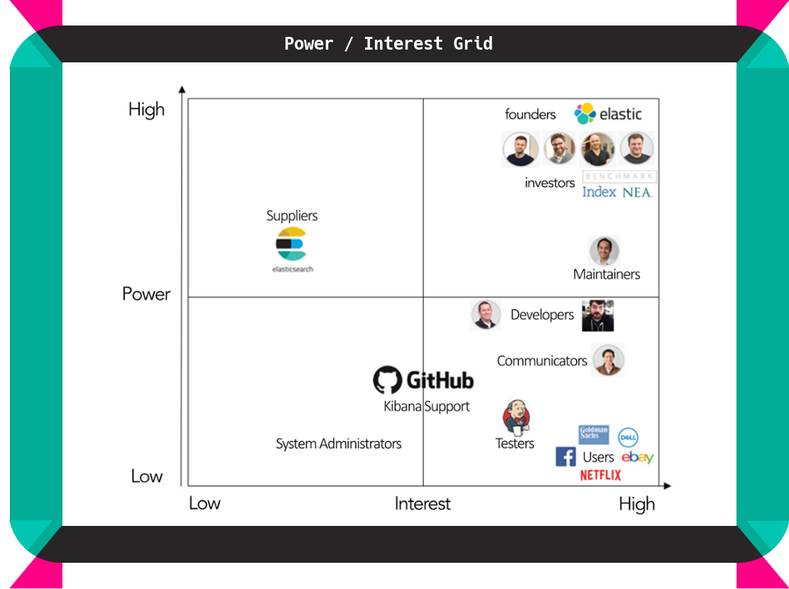
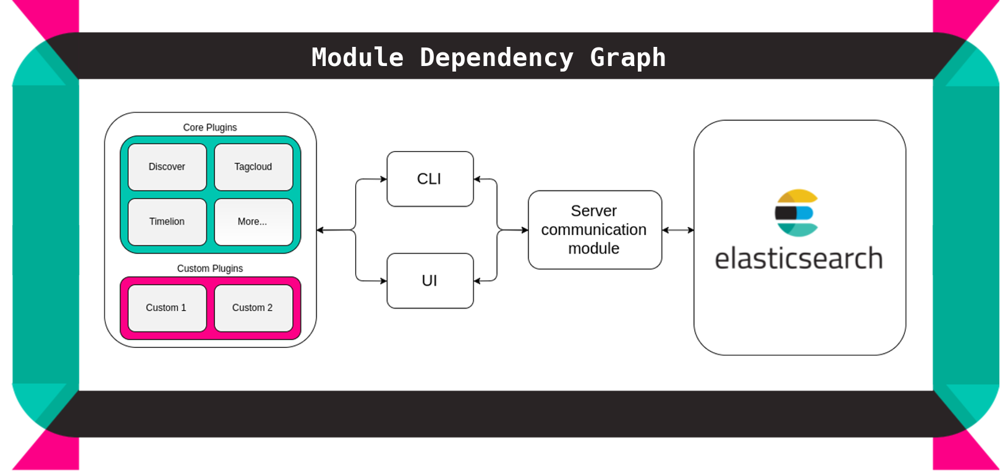
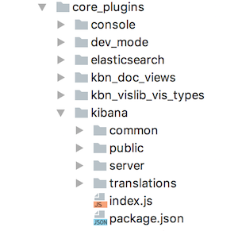
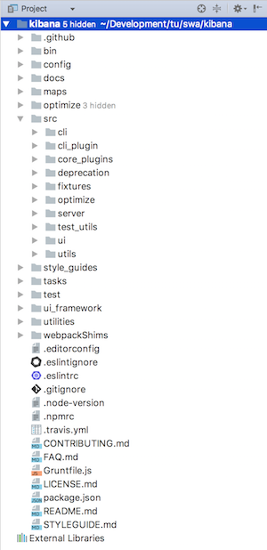
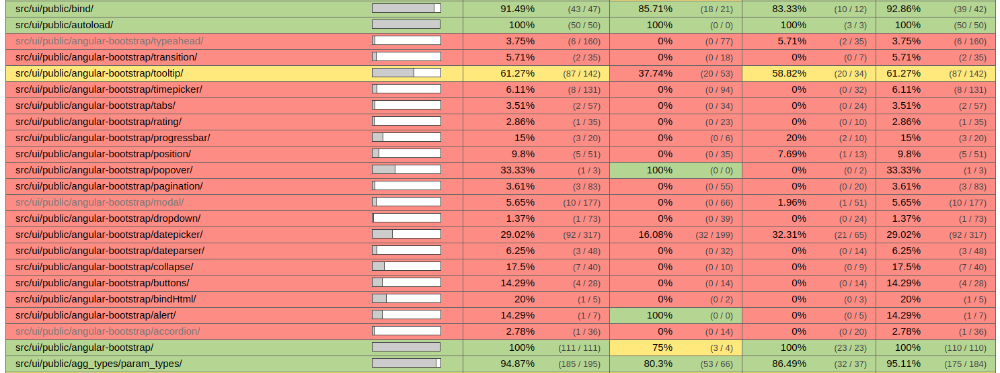
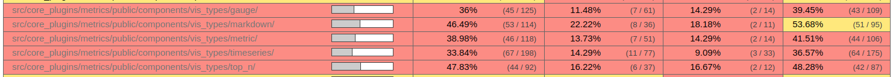

# Kibana

## Abstract

[Kibana](https://www.elastic.co/products/kibana) is your window into the Elastic Stack. It is a dashboard for real-time visualization and analysis of your [Elasticsearch](https://www.elastic.co/products/elasticsearch) data. You can also use it to configure and manage clusters, and other products that are part of the Elastic Stack. In this chapter, we give an overview of Kibana in terms of its software architecture. We provide different views on the system, including a stakeholder analysis, context view, development view, and deployment view. Furthermore, we have a look at the internationalization status, as well as at issues and integration. Hereafter, we discuss the current status of technical debt and its evolution over time. We conclude with an overview of our findings.

## Introduction

With the amount of data on the web growing exponentially every year, organizations are pushing the boundaries of using this data to improve their products. In 2012, the people behind Elasticsearch and [Apache Lucene](https://lucene.apache.org/core/) founded a company called Elastic, setting forth a vision that search can solve a plethora of data problems.

Today, Elastic offers a wide range of products, better known by the community as the Elastic/ELK Stack. The heart of this stack has always been Elasticsearch, a distributed, RESTful search and analytics engine, which centrally stores data to be accessed by the rest of the Stack. Apart from Elasticsearch, the largest component of the Stack is Elastic's Kibana. Kibana ([Figure 1](#figure_before_1) displays a snapshot) is considered the window into the Elastic Stack. It lets you visualize your Elasticsearch data, as well as configure and manage clusters and other products that are part of the Stack. All this funtionality is offered to the user through an intuitive, easy to use, yet powerful web interface.

We, four [TU Delft](http://www.tudelft.nl/) students from the Delft Students on Software Architecture group, have made an in-depth analysis of the Kibana system. By providing insight into different views, we hope to make meaningful contributions to the system and make the system more accessible to future contributors. We do so by first providing insight into Kibana's stakeholders, context view, development view, and deployment view. After that, we will elaborate on issues and integration handling, and on current technical debt in the Kibana system. Finally, we will conclude with an overview of our findings.

 <em>Figure 1 - A snapshot of a Kibana dashboard showing metrics.</em>

## Stakeholders

Stakeholders are the people that have an interest or concern in the product and organization. Stakeholders can have their effect on the product's objectives and policies. Rozanski and Woods [[1](#rw)] discuss different types of stakeholders in their book. In this section, we will first give an overview of the different stakeholders identified for Kibana. Hereafter, we will discuss how issues and integrations are handled. We will conclude this section with an overview of how power and interest in the system are divided amongst different stakeholders.

### Overview

**Acquirers:** Elastic's [founding and management team](https://www.elastic.co/about/leadership), as well as the [investors and board](https://www.elastic.co/about/board), which partially overlap. Their interest lies in managing and growing the company and its assets.

**Assessors:** [Baird Garrett](https://www.elastic.co/about/leadership), SVP of Legal and [Robin Sharpe](https://www.elastic.co/about/leadership), VP of Operations. They make sure the company conforms to standards and legal regulation.

**Communicators:** Main responsibility for Jeff Yoshimura, VP of Worldwide Marketing. Elastic also has their own Education and Consulting Services department. Furthermore, elastic has a large [community](https://www.elastic.co/community).
Their responsibility lies in letting the world know Kibana exists.

**Developers:** Main responsibility of Kevin Kluge, VP of Engineering. Kibana is supported by an open source community and by Elastic's engineers. The top three recent Git contributors are:

1. @[Spalger](https://github.com/spalger)
2. @[W33ble](https://github.com/w33ble)
3. @[rashidkpc](https://github.com/rashidkpc)

Developers deploy the Kibana software and try to make it work as smooth as possible.

**Maintainers** Gaurav Gupta, VP of Products, and developers from both the open source community, as well as those who work at elastic. These propose new features and make sure that the system evolves for the better.

**Suppliers:** In order to make use of Kibana, one must have an _Elasticsearch_ instance running. Elasticsearch and Kibana coexist, so it is in their best interest to work together as closely as possible.

**Support Staff:** Support is mainly provided by the community. [Elastic Cloud](https://www.elastic.co/cloud) users are provided with a service-level agreement based support, for which a team exists within the Elastic company. They try to solve all ad-hoc user problems.

**System Administrators:** Users either administrate their own systems when they host the Elastic stack themselves, or make use of the Elastic Cloud Service which has a dedicated system administration team. The administrators try to guarantee optimal uptime.

**Testers:** Developers write tests when implementing new functionality. After creating a Pull Request, [Jenkins](https://jenkins.io/) will execute the test suite and return the results which are then used by the integrators. Testers try to make sure software is bug-free before implementation

**Users:** Any user who runs an instance of the open source version. This group includes both the average user who is trying out new things, as well as large companies listed [here](https://www.elastic.co/use-cases). Users want to get the most out of Kibana's features.

### Power/Interest Grid

The power/interest grid (see [Figure 2](#figure_2)) contains the main stakeholder categories. _Investors_ and _Founders_ evidently are the most important to manage, _maintainers_ come second as they have a hand in the evolution of the product. _Suppliers_ are relatively powerful because the system is dependent on their choices, but their interest is relatively low. We have to keep _Developers_, _Communicators_, and _Testers_ very well informed to be able to perform their tasks. _Users_ also have to be kept informed but have very limited power. Finally, _Support staff_ and _System Administrators_ can be monitored but do not require a lot of attention, as they have both low interest and power [[2](#powerinterest)].

 <em>Figure 2 - Power/Interest Grid containing Stakeholder Prioritization</em>

## Context view

The context view [[1](#rw)] of a system defines the relationship and shows the interactions between the system and its environment. It is thus used to show the system's responsibilities and external entities. An overview of Kibana's context view is given in [Figure 3](#figure_3).

Kibana's communities primarily interact on [Github](https://github.com), which is used both as version control and issue tracker. Jenkins can be called from Pull Requests for continuous integration. The community also communicates via a dedicated IRC channel on [Freenode](https://freenode.net).

Kibana itself is developed primarily in HTML, CSS, and JavaScript, and is tested using [Karma](https://karma-runner.github.io) and [Mocha](https://mochajs.org). Its dependencies are managed by package manager [NPM](https://npmjs.com) and bundled using [Webpack](https://webpack.github.io).

 <em>Figure 3 - Context view depicting interactions between Kibana and its environment</em>

## Development view

The development view of a system describes the architecture that supports the project's software development process. This section addresses the concerns of a developer such as module organization, standardization of design, common processes, and codeline organization. As Kibana has almost no technical documentation, it proved to be difficult to give a clear overview of the difference between as-designed and as implemented. Kibana does have a set of style guides for different types of individual components, and these will form the foundation for the analysis of the as-designed development view.

Furthermore, having no technical documentation can be an entry barrier for newcomers to join open source projects [[2](#barriers)]. That is why issue #[10710](https://github.com/elastic/kibana/issues/10710) proposes to address this. The issue description included the findings that are also discussed in this section.

### Module organization

Kibana can be divided into three core modules. First, the UI module that defines the graphical user interface that users usually interact with. Second, the CLI module that contains the command line interface. Third, the Server module that serves data from the Elasticsearch clusters to the first two modules through an internal API.

Functionality in Kibana is implemented through plugins, these plugins contain the business logic and communicate with the CLI and UI module. This modular approach creates a more loosely coupled codebase. It also makes it easier for third-party plugin developers to add functionality to Kibana. A simplified high-level overview of the architecture is depicted in [Figure 4](#figure_4).

 <em>Figure 4 - High-level module dependency diagram</em>

The Server module is connected with Elasticsearch and provides an internal API to be consumed by the UI and CLI module so that they can perform their task.

When the user accesses Kibana via the graphical user interface, the UI module loads all core plugins, which comprise the core functionalities of Kibana, and therefore should always be included. It also loads the Utils module, this is a collection of helper functions and objects that are grouped to prevent code duplication.

All Kibana modules depend on one or more external dependencies, which together form the final module in the diagram. These third-party packages are installed, updated, and deleted by package manager NPM.

### Standardization of design

Open source projects such as Kibana are developed by a community. To keep Kibana's codebase consistent, the core developers (primarily employees of Elastic) composed a contribution guidelines document `CONTRIBUTIONS.md`. Main topics of the document are:

- How issues should be reported.
- How the community uses Git and GitHub.
- What to consider when contributing code.
- Information on the contributor license agreement (CLA).
- How to submit Pull Requests.
- Information about code reviewing.

They also created a set of style guides for different types of system components. These include both small styling conventions such as whether to use spaces or tabs, as well as larger conventions such as what the directory structure of a third-party plugin should look like. Essentially, the guides explain the standard design approaches for designing Kibana's core system elements. These guides are found under the `style-guides` directory.

### Common processing

According to Rozanski and Woods [[1](#rw)], any large system would benefit from identifying common processes. Apart from the standardization described in the style guides mentioned in the previous section, other common design elements can be identified. This section will elaborate on how different common design elements are implemented in Kibana.

**Termination and restart of operation** This refers to conventions to be followed in case of program termination. Kibana itself does not store data but communicates with Elasticsearch through a RESTful API. Therefore, there is no need for Kibana to have complex termination procedures as termination of data related operations are handled by Elasticsearch.

**Message logging and instrumentation:** Logging is handled both in the command line interface, as well as in the browser. Many different approaches have been implemented for almost all of the different components in the `src` directory.

**Use of third party libraries:** Third party libraries are installed through NPM and contained in the `node_modules` directory. NPM keeps track of the different versions used for each of the libraries, and installs them accordingly.

**Processing configuration parameters:** The processing of configuration parameters is done by injecting the different configurations, managed in `kibana.yml`, into the different core plugins and UI components.

**Security and cluster interaction:** Kibana supports SSL encryption for both client requests and for requests the Kibana server sends to Elasticsearch. Furthermore, one can use [X-Pack Security](https://www.elastic.co/products/x-pack/security), a plugin used to control what Elasticsearch data users can access through Kibana. As long as developers use the internal APIs to connect UI components to the server, and make use of the earlier mentioned techniques, Kibana users can safely communicate with their Elasticsearch cluster in a production environment.

**Testing:** For main components of Kibana that are not part of the core plugins, tests are included in the `test` directory. This directory includes tests on fixtures, scripts, internal APIs, and more. These tests must pass in order for Kibana to run any of its base features. At the level of individual plugins, each plugin has its own `__test__` directory, containing plugin-specific tests.

**Internal and external interfacing:** Both the UI and CLI communicate directly and exclusively with the server to obtain their data through internal interfacing. The server is the only part of the system that interacts with the Elasticsearch cluster through external interfacing.

### Codeline organization

According to Rozanski and Woods [[1](#rw)], the codeline organization of a system specifies how source code is stored in a directory structure, how the configuration is managed, how it is built and tested regularly, and how it is released as tested binaries for further testing and use.

#### Organization of the source code

Under the root directory, both files and folders can be found. The files are either configuration files of third-party services and tools, or text files.

File                                                                    | Purpose
----------------------------------------------------------------------- | ---------------------------------------------------------------------------------------------
`CONTRIBUTING.md`, `FAQ.md`, `README.md`, `STYLEGUIDE.md`, `LICENSE.md` | Several text files describing the repository, organizational conventions and the license
`.editorconfig`                                                         | Configuration file for editors and IDE's
`.eslintignore`, `eslintrc`                                             | Configuration files for [ESLint](http://eslint.org/)
`.node-version`, `.npmrc`, `package.json`                               | Configuration files for [Node.js](https://nodejs.org/en/) and NPM
`.travis.yml`                                                           | Configuration file for Jenkins (can also be used for [Travis](https://travis-ci.org/))
`Gruntfile.js`                                                          | Configuration file for [Grunt](https://gruntjs.com/)
`.gitignore`                                                            | Configuration file for git describing which files should not be sent to the remote repository

Among the directories, there are some that are empty and will be filled during usage. Others contain auxiliary items such as styling guides, documentation, and Grunt task descriptions.

Directory                     | Purpose
----------------------------- | ------------------------------------------------------------------
`src`                         | The actual product
`test`                        | The tests
`utilities`                   | Code for visual regression
`config`                      | Kibana's configuration
`ui_framework`                | UI components to build user interfaces
`docs`                        | The documentation of Kibana
`style_guides`                | Style guides for the different languages and frameworks
`tasks`                       | The Grunt tasks
`data`, `optimize`, `plugins` | Files generated during use. These directories are initially empty.

The `src` directory contains a more in-depth analysis. As mentioned above, it contains the actual product. This directory is further divided into several subdirectories. Among these is the `core_plugins` directory that contains Kibana's core modules, each of which encapsulates a core functionality of Kibana. These components are designed and structured in the same way as third-party plugins to ensure that they are loosely coupled. They also contain their own `package.json` file.

 <em>Figure 5 - Plugin directory structure</em>

[Figure 5](#figure_5) shows the directory of a plugin inside Kibana. The roles of these elements are discussed briefly below.

File/directory | Purpose
---------------- | -----------------------------------------------------------------------------------------------------------------------------------------------------------------------------------------------
`common/`        | This folder is where code that is useful on both the client and the server belongs.
`public/`        | This folder is where client-side code for your application is stored.
`server/`        | This folder is where server code belongs, think of custom routes, data models or other code that should be executed on the server.
`translations/`  | This is a plugin specific directory and is not included in the average plugin.
`index.js`       | The entry point each plugin. This file is always loaded when a plugin is being accessed. This is where you define things like dependencies on other plugins and applications and configuration.
`package.json`   | Contains information of the plugin, it's name and version.

 <em>Figure 6 - Directory structure of Kibana</em>

[Figure 6](#figure_6) shows an overview of the directory structure of Kibana. As mentioned above, the `core_plugins` directory contains all components that Kibana consists of.

#### Approach to building, integrating, testing and releasing

The build process of Kibana contains various subcomponents. These consist of downloading and including external dependencies such as Node.js and [ReactJS](https://facebook.github.io/react/), converting ES6 into regular JavaScript code with [Babel](https://babeljs.io/), setting environment parameters to production settings, and readying the `README.md` to exclude the section on snapshot builds.

Kibana has a many-sided test process involving browser and UI testing, server testing, and visual regression testing. Plugins are also tested during this process. To achieve this, many tools are utilized such as Karma, Mocha and [ChromeDriver](https://sites.google.com/a/chromium.org/chromedriver/). Furthermore, a tool developed by Elastic called [ESVM](https://github.com/elastic/esvm) is used to test with different versions of Elasticsearch.

The processes for building, integrating, testing and releasing are all automated so that they can be activated using a single action. For the build, test and release processes this is done using a task runner tool called Grunt.

Releasing into the test environment for integration is handled by Jenkins following the practice of Continuous Integration. For the production environment, the releases are created and listed using GitHub's Releases.

#### Configuration management

The configuration of Kibana is managed from `config/kibana.yml`. Examples of what can be configured are the port for Kibana's back-end server, credentials for Elasticsearch, and the SSL settings. Besides that, configuration files for third-party tools and services such as NPM, Jenkins and ESLint are found under the root directory.

## Deployment view

According to Rozanski and Woods [[1](#rw)], the deployment view describes the environment into which the system will be deployed, including the dependencies the system has on its runtime environment.

At this point in time, Kibana supports Linux, Darwin, and Windows. Since Kibana runs on Node.js, the necessary Node.js binaries for these platforms are included as part of the product.

Other third-party software requirements are a result of Kibana's JavaScript nature:

- **NPM** manages Kibana's dependencies. It is written in JavaScript. Kibana 6.0.0 requires v3.10.10.
- **Node.js** is an open-source, cross-platform runtime environment for developing server-side web applications in JavaScript. Kibana 6.0.0 requires v6.9.5.

Finally, a modern browser is required. Kibana 6.0.0 supports Chrome, Firefox, Safari, and IE11+.

## Internationalization

Internationalization means designing and developing Kibana in such a way, that it enables easy localization for target audiences that vary in language or culture. It is currently being implemented in Kibana.
Issue #[6515](https://github.com/elastic/kibana/issues/6515) discusses Kibana's internationalization roadmap. It was opened in March 2016, so implementation started recently. The internationalization of Kibana is being developed in four phases:

**Phase 1:** Implementing the internationalization engine in the form of a class called i18n (abbreviation for internationalization). The i18n engine should manage all locale translations; registering all translations and loading the correct locale when required.

**Phase 2:** Integrating the [angular translate module](https://angular-translate.github.io) with the i18n class. Furthermore, generating a translation plugin that localization engineers can easily use to create translations.

**Phase 3:** Adding translation identifiers and English translation strings for Kibana's AngularJS/ReactJS views.

**Phase 4:** Creating core language packs that are supported by Kibana, and allowing language packs to be contributed by outsiders.

Currently, phase 1 is finished and both phase 2 and phase 3 are work in progress. [This](https://srl295.github.io/2017/03/17/translating-kibana/) is a nice video showcasing how to translate Kibana with the IBM globalization pipeline.

## Issues and integration

This section discusses the workflow for issues and pull requests for the Kibana project. We conclude by mentioning the integrators and their challenges.

### Issues

At the time of analysis, Kibana had 1397 open and 4637 closed issues. The issues are categorized with colored labels to indicate the type of issue the domains affected by the issue. The most important labels are:

- **Black labels** are used to indicate _priority_. `P1` for high priority issues and `P5` for issues that for example are highly niche or in opposition to the core goals of the Kibana team.
- **Blue labels** are used to indicate _difficulty to implement_. `low fruit` is used for easy issues, `high fruit` for more complex issues.
- **Grey labels** are used to indicate _what version of Kibana the issue belongs to_
- **Yellow labels**, starting with a colon, are used to indicate _what component the issue belongs to_. Examples of labels are `:Data Table`, `:Filters` and `:Heatmap`.

### Pull Requests

While anyone can submit a pull request, most are created by Elastic employees who work on Kibana. Administrators that open pull requests can also merge them, as long as they are reviewed by at least one peer. While most are discussed on Github, sometimes it seems as if some of the pull requests are closed suddenly without discussion. This leads us to believe that these pull requests are discussed elsewhere, for instance in slack discussions. Some pull requests also refer to discussions on [Slack](https://slack.com/). Contributors also make great use of 'Work In Progress' pull requests, which are pull requests that are not yet ready for merge, but are meant to be submitted unfinished, so that people can start to discuss the topic and collaborate on the code.

### Integrators

Based on the analyzed issues and pull requests, we are able to determine the main integrators. The top three integrators are:

1. @[Ppisljar](https://github.com/ppisljar)
2. @[Thomasneirynck](https://github.com/thomasneirynck)
3. @[Kobelb](https://github.com/kobelb)

Several factors affect their decisions. First of all, to trigger a review, the @[Elasticmachine](https://github.com/elasticmachine) bot asks an admin to verify the patch. Then they use a test to find out if the commit author has signed the contributor license agreement (CLA). When the author has not yet signed, this is requested before merging. To test if the build succeeds, they ask Jenkins to test. For more difficult merges, they ask developer specialists to look over the pull request and ask for permission to merge. This process gives the integrators a robust framework to base their merging decisions on.

The main challenge for integrators is to keep the codebase bug-free and style compliant. Kibana is a popular project, so the integrators have to make sure that developers from all over the world create code that matches their desires. Matching random pull request with the company vision requires strict attention.

## Technical debt

According to [Techopedia](https://www.techopedia.com/definition/27913/technical-debt), technical debt is _"a concept in programming that reflects the extra development work that arises when code that is easy to implement in the short run is used instead of applying the best overall solution"_. The goal of identifying technical debt in a system is to improve code maintainability and to reduce the amount of effort it takes to develop new functionality. In this section, we will discuss the state of technical debt in the Kibana project.

### Analysis tools

To get an idea of the current state of technical debt in Kibana, we ran two code analysis tools to get some insights. We used [Codebeat](https://codebeat.co) and [CodeFactor](https://www.codefactor.io/). These tools analyze all project files separately and apply a rating (from A to F). Code complexity, code issues, and code duplication are examples of metrics that are taken into consideration. We chose these two tools because they provided free access for open source projects, and were hosted in the cloud to so that the analysis could be easily executed.

These tools gave us the following insights:

- _The Kibana project has quite some duplicate code_ - The Codebeat [documentation](https://hub.codebeat.co/docs/software-quality-metrics#lines-of-code) explains that they consider this one of the most serious issues, because it harms maintainability. Warnings are already triggered after five duplicate lines of code. Out of the 1315 warnings found by CodeFactor, 952 were about duplicate code.

- _Multiple functions have too many arguments_ - Codebeat triggers an information message if functions need four arguments, a warning if functions need five arguments, an error for six, and a critical issue for anything over six. For the kibana project, multiple warnings were generated.

- _Multiple functions have a too large body_ - The Codebeat documentation  [[6](#codebeat-lines-of-code)] gives a warning if methods have a length 40-60 lines, an error if the length is 60-80 lines, and a critical issue for anything over 80. 300 of the 1315 warnings found by CodeFactor were maintainability warnings.

Roughly half of the debt that was found by these tools is located in our test files. You could argue that certain aspects of technical debt are less urgent when located in test files. Your testing code is completely separated from your production code, functions that are too long could for example also improve the readability of test files, and possible performance degradations could be taken for granted.
Nevertheless, we think that coding best practices should also be applied in testing code.

The largest shortcoming of analysis tools like Codebeat and CodeFactor is that they do not look how files relate to each other. They do, however, help to discover trends and find errors.

### Code coverage

Code coverage describes the degree to which the source code of a program is executed by a particular test suite. Not having your software tested thoroughly is considered technical debt. According to the coverage report generated by [Istanbul](https://github.com/gotwarlost/istanbul), the Kibana project has good test coverage. The overall coverage is 70 percent. In this analysis, we will review two sections that have bad coverage and thus are examples of technical debt.

#### UI components based on AngularJS

As discussed in issue #[7591](https://github.com/elastic/kibana/pull/7591), the Kibana community is trying to remove the dependency on [Angular-bootstrap](https://angular-ui.github.io/bootstrap/), which in turn depends on [AngularJS](https://angularjs.org/), by integrating its source code into Kibana. The UI components that are based on Angular-bootstrap have seen custom tweaks by the Kibana community. Nevertheless, the code coverage (see [Figure 7](#figure_7)) of these files is below 40%, which is way below that of other files found in the `src/ui` directory. Over time, functionalities have been added and the code has been refactored to better adhere to the styling conventions. This means that Kibana can no longer simply depend on tests written by the angular-bootstrap community. The decision to remove the dependency on Angular-bootstrap, and instead create a copy of the code to serve as a foundation for Kibana's own UI components, created testing debt.

 <em>Figure 7 - Code coverage of Angular-bootstrap components</em>

#### UI components based on ReactJS

The Kibana community recently decided to slowly transition away from AngularJS as a whole. As can be seen in [Figure 8](#figure_8), testing debt that came with this process is present. The Kibana community still has a long way to go in redeeming this debt.

 <em>Figure 8 - Code coverage of ReactJS components</em>

### Comments

An interesting indicator that can help in analyzing technical debt is analyzing comments from a project. We analyzed `TODO` comments in the Kibana project to gain a better understanding of the technical debt that exists in the project:

1. 'Extract this into an external service' - found several times, producing these services would solve a lot of technical debt.
2. 'We should probably display a message of some kind' - This one is found at various places in the code, which signals that developers do not want to spend time on this kind of chore.
3. 'Override bootstrap styles. Remove !important once we're rid of bootstrap.' - `TODO's` including [Bootstrap](http://getbootstrap.com/) are found often, so bootstrap is definitely a major cause of technical debt.
4. 'May need to verify this or refactor' is a `TODO` that is found sometimes, referring to a part of the code that needs attention.

We also searched the project for `FIXME` comments. A `FIXME` comment is a comment that elicits a part of the code that needs fixing. This term is used less frequently than the `TODO` comment, which makes sense, as `FIXME's` are more severe. In total, we found 20 occurrences in the codebase listing a wide range of subjects, mostly referring to a small bug that is not too urgent. This causes the developer encountering the problem to defer it to a later point in time, creating a `FIXME` (and some Technical Debt). An example is _'`FIXME: inline moveTo is buggy with excanvas`'_.

### Evolution of technical debt and current challenges

In this section, we will discuss how technical debt has evolved in the Kibana project. We will also look at issues that are symbolic for challenges that exist in the current system. These include the removal of external library usage, the transition from AngularJS to ReactJS, and the transition from Kibana v4 to Kibana v5.

**AngularJS to ReactJS migration:** Kibana was originally written in AngularJS. However, since February 2017, ReactJS has also been in the `packages.json` file. As described in #[10271](https://github.com/elastic/kibana/issues/10271), it is not the goal of the Kibana team to do an immediate complete rewrite to ReactJS. However, the goal is to provide a slow migration to ReactJS, focusing on new apps being built from scratch and features isolated in leaf components.

This will cause major changes to the codebase in the near future. As the transition occurs, developers are required to work with two different frameworks that solve very similar problems. The usage of AngularJS has become a form of technical debt, but no immediate action will be taken to get rid of it.

**Removal of external libraries:** The Kibana team is trying to get rid of noncrucial external libraries like [Lodash](https://lodash.com/) or Bootstrap, because it makes the project dependent on external dependencies which might get outdated or unsupported. Bootstrap, for example, _"provides a lot of styles which we don't use/need, and of course, doesn't provide many styles which we do need"_ as stated in #[7364](https://github.com/elastic/kibana/issues/7364). This transition is still work in progress but it will be a great cleanup of the code once the team gets rid of it.

**Kibana v4 to v5:** The transition from Kibana version 4 to version 5.0.0 was a major makeover that added features and also improved the architecture. It made the codebase more robust and more open to additional improvements. This was caused mainly due to the new architecture, which splits up the code into different plugins. As since version 5.0.0 each option in the main menu is a plugin in the code, every component can be maintained, extended, and updated separately from the rest of the codebase. As a result, it has also become easier to add code to Kibana. One can simply create a new plugin that can be self-contained in a single directory. This can be considered a major payoff of the technical debt that had been around for quite some time in earlier versions.

## Conclusion

In this chapter, we gave an overview of different aspects of Kibana from a software architectural point of view.
We identified different stakeholders, which gave us a great overview of who is involved with the development of Kibana, and how they rank in terms of interest and power.
We discussed several architectural views defined by Rozanski and Woods [[1](#rw)] to fully understand Kibana's inner workings.
Hereafter, we discussed issues and integration, stating the workflow of how issues translate into pull requests, and finally into integration.
Finally, we analyzed the Kibana project from a higher level and tried to map out its status. We did this by identifying technical debt and looking at how this debt has evolved over time.

Looking back, a couple of interesting conclusions can be made. First of all, we think that the project architecture, that has its business logic defined in plugins, is a good architecture. It makes the code modular and allows programmers to easily extend Kibana's functionality. This architecture, that was introduced with the release of Kibana version 5, has helped to make the code more maintainable.

A more troubling observation is the migration process of the front-end framework AngularJS to React. This migration process is slowly being rolled out, and currently results in different front-end frameworks used simultaneously. Our code analysis learned us that these components are also badly tested, and hence contain technical debt. The current combined use also introduces confusion for future developers that want to contribute to the project. We think it is better to bite the bullet and try to migrate as quickly as possible.

To conclude, the Kibana project is a well-managed open source project that has evolved over time.
It is able to leverage its technically informed user-base to solve issues and technical debt. With the exponentially growing volumes of data that are being generated worldwide, we are confident that Kibana will play an even more important role in the future.

## References

1. 
Nick Rozanski and Eoin Woods - Software Systems Architecture: Working with Stakeholders using Viewpoints and Perspectives. Addison-Wesley, 2012.

2. 
Igor Steinmacher et al - Overcoming open source project entry barriers with a portal for newcomers. ACM, New York, 2016.

