# Magento: an e-commerce platform for growing your business online

By [Hans Schouten](https://github.com/hansschouten), [Elvan Kula](https://github.com/ekula), [Kin Lok Chow](https://github.com/jipjop) and [Jan-Gerrit Harms](https://github.com/jangerritharms)

*Delft University of Technology, 2017*

#### Abstract

*Magento is the fastest growing and most widely used e-commerce platform in Europe. It was first released in 2007 with an open source license. Magento differentiates itself from competitors by its remarkable amount of flexibility and large scope on customer targeting. This chapter analyzes Magento’s software architecture and the way the developers tackle challenges related to security, maintainability and technical debt. We will look more closely into Magento’s layered design, extensive use of design patterns, information flow and security measures.* 

***Table of Contents***

1. [Introduction](#introduction)
2. [Stakeholder analysis](#stakeholder-analysis)
3. [Context view](#context-view) 
4. [Development view](#architecture) 
5. [Information view](#information-view) 
6. [Security](#security) 
7. [Technical debt](#technical-debt) 
8. [Conclusion](#conclusion) 
9. [References](#references) 

## Introduction 
The problem with e-commerce software platforms has always been that these solutions never exactly provide what businesses are looking for. The business calls for a tailored solution. One that delivers on power, flexibility and scalability to meet the requirements of any business. Magento is the exception. 

Magento is the fastest growing and most widely used e-commerce platform in Europe [[1](#ecommerce)]. It is an open source platform that can be used by web shop developers to grow their online businesses. The e-commerce solution currently has over 200,000 online retailers and is chosen by one of every four online businesses, which is more than any other provider [[2](#description)]. Magento offers powerful features such as advanced marketing, search engine optimisation and catalogue-management tools to control the appearance, content and functionality of an e-commmerce website.

In 2007 the first release of Magento was developed by the company Varien with support of volunteers [[3](#history)]. In 2015 Magento Commerce launched as an independent company and released Magento 2.0, with an aim to provide new ways to improve the user experience [[4](#userexperience)]. The important milestones in Magento's history are depicted in Figure [1](#fig1).

Magento’s powerful features require an architecture that is modular, extensible, flexible and simple to maintain. Offering such qualities, dealing with a diverse user base and managing technical debt are the biggest challenges for Magento. This chapter will give insights into the way the developers of Magento deal with these challenges. First, the chapter will look into the stakeholders and context view of the project. Next, the layered design, information view and security measures of the system are described. This will be followed by an analysis of the technical debt in Magento.

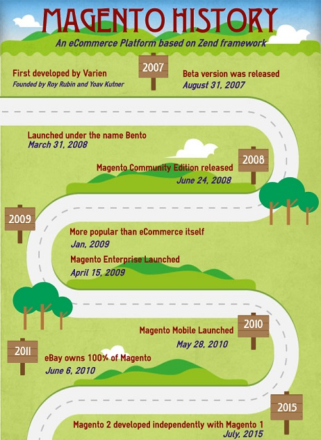

*Fig. 1: Roadmap of milestones in Magento's history*

## Stakeholder analysis 
This section identifies the key stakeholders of Magento and describes how they apply to the project. This will be followed by an analysis of their influence and associated levels of power and interest.

### Key stakeholders
The main stakeholder is [Magento Commerce]( https://magento.com). The organization and its employees exclusively fulfil the role of three of the eleven classes of stakeholders defined by Rozanski and Woods [[5](#rozanski)]: *acquirers*, *assessors* and *communicators*. The other stakeholders applicable to Magento are listed in the following table. 

| Stakeholder | Description | 
|----------|-------------------|
| Developers | Magento is developed by a highly active community of nearly 400 contributors. Most of the developers are employees of Magento Commerce and focus on contributing to specific features. The external developers can be classified in two groups, namely the *frequent community contributors* and *third-party contributors* based on their commit frequency. |
| Testers | Magento's chief architect, [Alan Kent](https://github.com/alankent), is responsible for internally running the automated tests of Magento’s testing framework. The individual contributors take responsibility for raising concerns and fixing minor bugs. |
| Integrators | All integrators of Magento are employees of Magento Commerce. [Oleksii Korshenko](https://github.com/okorshenko), [Igor Miniailo](https://github.com/maghamed) and [Max Yekaterynenko](https://github.com/maksek), were identified as general integrators who are responsible for evaluating all pull-requests in general. [Ievgen Shakhsuvarov](https://github.com/ishakhsuvarov), [Eugene Tulika](https://github.com/vrann) and [Vitalii Korotun](https://github.com/vkorotun) were identified as specific integrators who are assigned to specific types of pull requests. |
| Competitors | Magento’s competitors can be divided into two types: hosting and self-hosted solutions. Magento belongs to the self-hosted set of platforms. Competitors in the same area include WooCommerce, Zen Cart, osCommerce, OpenCart, X-Cart, SpreeCommerce and DrupalCommerce. Competitors that provide hosting are Shopify, BigCommerce, Yahoo Commerce and Volusion. | 
| Maintainers | [Alan Kent](https://github.com/alankent), is an important maintainer as his role is to keep an overview of the maintainability of the architecture. |
| Suppliers | As Magento is run on a local webserver, the user himself is responsible for the arrangement of the hardware and infrastructure on which the platform will run. However, there are numerous web hosting companies that offer Virtual Private Servers and Dedicated Servers that are specially designed for hosting Magento webshops [[6](#hosting)]. The largest Magento hosting provider is RackSpace. |
| Support | Customers with a Magento Enterprise Edition can request direct assistance from Magento's customer support. Non-enterprise customers can request assistance from the Magento community via their forum [[7](#forum)] or from their network of 300+ solution and technology partners [[8](#partners)]. |
| Users | The users are developers who want to implement a webshop or a similar application based on Magento. They need to easily understand the sample code and quickly identify those lines of code with shop logic. Code quality and correct use of technologies are important for them. Companies that hire developers to build these tailored applications are a more indirect type of users, the so-called clients. Some of Magento's largest clients are Burger King, Nestle, Murad and Coca-Cola [[9](#magento)]. |
| End users | The end users are people who would visit the webshop in case it went live. They need an intuitive layout that allows them to shop with ease in a few clicks. |

*Table 1: Key Stakeholders of Magento*

### Stakeholders influence

*Fig. 2: A power-influence grid showing the positions of key stakeholders*

The power-interest matrix shown in Figure [2](#fig2) visualizes a measurement of the power of the stakeholders compared to their interest. The grid consists of four quadrants with the most powerful entities in the upper-right quadrant and the least powerful ones in the opposite lower-left quadrant. Below, we elaborate on  responsibilities of some stakeholders and based on their power-interest ratio explain how Magento Commerce should engage with them:

* **High power, interested people** - *Manage closely*: The main contributors of Magento can be viewed as the most important stakeholders since they are the ones who make the project possible. They are responsible for fulfilling the user requirements and solving issues while maintaining a good quality of code. Their interest in a good functioning system is very high. 

* **Low power, interested people** - *Keep informed*: In the lower-right quadrant we see the external plugin developers. These are the companies or individuals who create the free/paid modules and themes for the Magento site owners. Those with almost no power, but pretty high interest are the competitors of Magento. They have to keep a close eye on each other to stay in the market.

* **High power, less interested people** - *Keep satisfied*: Those with high power, but less interest are Permira and the largest clients of Magento (Burger King, Nestle and Seat). As the company’s largest investor, Permira Funds holds a big stake in Magento Commerce. The largest clients also have a say in the future direction of Magento as they are responsible for a major part of the company’s value creation. They have great influence over the way the system is designed and develops. As the system is developed it is normal for these large clients to be questioned about the type of enhancement or design that they prefer.  

* **Low power, less interested people** - *Monitor*: In the least important category we find supporting services such as GitHub, Travis CI and the hosting providers. They are responsible for providing services regarding building, maintaining and hosting Magento’s software. The single users are also located in this quadrant as they have less power compared to the larger clients.

## Context view
A context view describes the relationships, dependencies, and the interactions between the system and its environment. This view is relevant for the system's architecture and defines the boundaries of the system and how it interacts with external entities across these boundaries. Figure [3](#fig3) shows the context view of the Magento project. 

*Fig. 3: An overview of the relationships between the Magento platform and its external entities*

### Development entities
Magento is written in PHP and its front-end is based on the JavaScript library [Knockout.js](http://knockoutjs.com/), enabling developers to provide their webshops with dynamic UIs. KnockoutJS, other frameworks and scripts are imported via [RequireJS](http://requirejs.org/) to manage JavaScript dependencies easier and to improve page load time. For continuous integration [Travis CI](https://travis-ci.org/) and [Codacy](https://www.codacy.com/) are used. These services are not only used for continuous integration, but also function as separate integration tests to check compatibility.

### Hosting entities
In order to host a Magento webshop, you need a [MySQL](https://www.mysql.com/) database or any variant which is forked from the MySQL database, like [MariaDB](https://mariadb.org/) or [Percona](https://www.percona.com/). The database should be hosted on a webserver, either on [NGINX](https://www.nginx.com/) or [Apache](https://www.apache.org/). The operating systems on these servers support most Linux distributions.

### System scope 
Magento differentiates itself from competitors by having a large scope of options when it comes to customer targeting [[10](#systemscope)]. The platform is a complete e-commerce solution that offers a lot of extra functionality in marketing, search engine optimisation and advanced search engine optimization features. On top of that, Magento offers a remarkable amount of flexibility to users. There are many possibilities of customizing the store with additional features and functionality with more than 7000 extensions in the Magento Marketplace.

Therefore, the scope of Magento is to provide a rich set of features for customer targeting and customization options, as well as the functionality that is already present in existing e-commerce platforms.

## Development view 
This section presents an overview of Magento’s architecture by first describing the principles and guidelines that govern the development of the system. This will be followed by an overview of the as-designed development view and as-implemented view of Magento.

<a id="architectural-principles" name="architectural-principles" />

### Architectural principles
Magento’s architecture is mainly built on concepts that allow for maximum flexibility and extensibility of its software:

* **OOP Principles**

As a PHP framework, Magento takes advantage of Object-Oriented Programming (OOP) principles that provide simplicity and extensibility. The concepts of data encapsulation and inheritance are especially useful for Magento’s front-end components [[11](#oop)]. 

* **Modularity**

The concept of modularity lies at the heart of Magento. At the highest level, Magento’s architecture is composed of core components and optional independent modules. These modules are organized by feature and can be used to modify the appearance and behaviour of a webshop without altering other parts of the code. 

* **Extensibility**

Product extensibility has always been taken into account from Magento’s earliest design stages [[12](#extensibility)]. Magento 2 uses automatic *dependency injection* and *service contracts* to facilitate new implementations of existing functionality [[13](#contracts)].

* **Stack of open-source technologies**

The Magento stack contains many [open-source technologies](http://devdocs.magento.com/guides/v2.0/architecture/tech-stack.html) for deployment and customization of storefronts.

<a id="development-guidelines" name="development-guidelines" />

### Development guidelines

<a id="test-strategy" name="test-strategy" />

#### Test strategy
The Magento team has an extensive testing framework which is divided into six different levels of testing, namely: 

* **Static tests**
Static testing checks if the code adheres to [coding standards](http://devdocs.magento.com/guides/v2.0/coding-standards/bk-coding-standards.html) that are set by the Magento team.

* **Unit tests**
The Magento team proposes to use Test-Driven Development (TDD) for unit testing. The team only uses unit tests for testing PHP code and defines a separate category for other programming languages.

* **JavaScript tests**
JavaScript tests are defined as unit tests for all Magento components that are written in JavaScript, which are mainly part of the front-end. The JsTestDriver library is used for running these tests in the browser. 

* **Integration tests**
The integration tests are run in different levels of isolation. Magento does not use the browser for the integration tests which makes the tests more granular than functional tests and a lot quicker. 

* **Functional tests**
The functional tests are run using the separately provided Functional Testing Framework (FTF) for smoke testing, acceptance testing and regression testing. The Magento framework uses a web browser and the selenium server to remote control user interaction. 

* **API functional tests**
API functional tests take the application as a black box and only test from the client’s perspective (the Web API endpoints). The API calls are managed by a common class which is inherited by all test cases and uses one function to access the API using either REST or SOAP. 

All the tests described above are located in the `<magento2 root dir>/dev/tests` folder. The team provides an easy integration with the PHPStorm IDE to ease the setup and running of tests [[14](#testing-guide)]. 

<a id="contribution-process" name="contribution-process" />

#### Contribution process
All contributions are done via the *fork and pull model* with the integrators reviewing pull-requests on a first-in-first-out basis. One’s code only has the chance of being merged if it adheres to the rules in the developers guide:

* Each code extension needs to adhere to the [coding standards]( http://devdocs.magento.com/guides/v2.0/coding-standards/bk-coding-standards.html).
* The Magento project has its own Definition of Done (DoD) defining a set of acceptance criteria that is applied to any changes in the code base. These criteria revolve around readability, sufficient code coverage and solid documentation.
* Each commit needs to pass the automated tests that are in place.
* Everyone who wants to contribute to Magento’s source code is required to accept the terms of the contributor agreement. This is automatically checked as illustrated in Figure [4](#fig4).

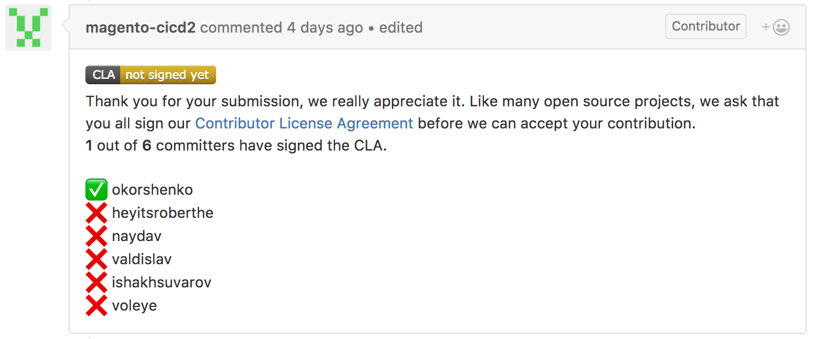

*Fig. 4: To make a contribution to Magento’s source code you need to sign their Contributor License Agreement*

<a id="original-design" name="original-design" />

### Original design

<a id="architectural-layers" name="architectural-layers" />

#### Architectural layers
Magento’s core product code has a layered design. For Magento’s customers specifically, a layered architecture provides the benefit of separating presentation logic from business logic. This simplifies the divided customization of store appearance on the one hand and store behaviour on the other. Architectural layers also provide developers a simplified model for the ideal placement of features and code in the system. 

The design of Magento can be decomposed into clusters of components with a similar functionality. These clusters, or layers, enable the logic separation of different responsibilities. Figure [5](#fig5) illustrates the layered architecture of Magento and shows the components of each layer. The diagram also demonstrates the connections between the four layers and the Magento framework, third party libraries, the supported database, and other technologies. [[15](#architecture-diagram)]

*Fig. 5: Magento's architecture layered diagram [[15](#architecture-diagram)]*

1.	**Presentation layer** - This layer is responsible for the interaction between users and the Magento Framework. Components in this layer are in charge of handling incoming user requests by executing code of the controller classes which in turn load UI components [[16](#presentation-layer)].
2.	**Service layer** - This layer provides a bridge between the presentation layer and the domain layer [[17](#service-layer)]. It uses PHP interfaces to form service contracts for Magento components. These contracts define through data interfaces how the components of the higher presentation layer and the lower domain layer should interact. This layer also prescribes service interfaces to provide an easy way to access Magento's API Framework for external REST and SOAP API applications. 
3.	**Domain layer** - This layer holds all business logic that Magento modules perform on data that is received in requests. A special use case of the models is when access to resources (for instance a database) is required. Higher layers do not have direct access to these resources, but use the resource model abstractions of the domain layer instead. 
4.	**Persistence layer** - This layer is responsible for all access to storage resources. Since Magento supports different databases, it offers different database adapters to accommodate them all [[18](#persistence-layer)]. 

<a id="architectural-patterns" name="architectural-patterns" />

#### Architectural patterns
A design pattern is a reusable solution to a commonly occurring problem. Since Magento contains functionality that matches these problem descriptions, using design patterns is an elegant way to implement the Magento functionality. Therefore, Magento 2 contains various design patterns. The Object Manager alone already contains more than 11 design patterns. In this section, however, we will only cover the most important design patterns of Magento.

#### Model-View-ViewModel/Controller (MVVM/MVC) model
To have a well-defined standardization for modules, the core developers decided to implement the Model-View-Controller (MVC) design pattern in Magento 1. In Magento 2 this model transformed into a more complex variant that is "closer to a Model, View, ViewModel (MVVM) system". [[19](#mvvm)] The benefit of MVVM over MVC is its simplification of data binding and the manipulation of UI elements [[20](#benefit)]. 

In Magento 2 a module corresponds to a URL. The URL is routed to the action method of a controller like in a classical MVC system, however in Magento's design the Controller has less responsibilities. As the Controller does not directly set variables of the View, the variables handle their own fetching from the Model instead. The HTML page that the controller returns to render has many sections called Containers which are constructed from a set of Blocks. A block corresponds to the ViewModel part of the MVVM pattern while the contained `pthml` file, a layout template for the Block, is the View. The implementation of this pattern is shown in Figure [6](#fig6) and the way modules employ MVVM can be found in the part of the [Logical view](#modules).

*Fig. 6: Magento implementation of the MVC-MVVM pattern*

#### Factory pattern
The factory pattern is responsible for the instantiation and automatic loading of classes. It is used in multiple locations in the Magento code. A class in Magento can be instantiated by a factory by calling a method with an abstract name that defines its class group and name. 

The factory pattern can for example be found in the instantiation of objects by the Object Manager class [[21](#factory)] as visualized in Figure [7](#fig7) [[22](#pronko)]. The Magento development team tries to limit the dependence on and direct use of the ObjectManager in code. Factories are an exception since they need the ObjectManager to create specific types of objects.

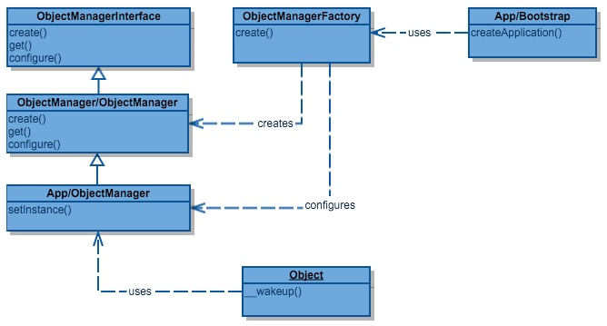

*Fig. 7: Example of the Factory Pattern in Magento 2 [[23](#leak)]*

#### Observer pattern
The event-driven architecture of Magento has been made possible by the observer pattern. The pattern is based on a one-to-many dependency between objects so that when one object’s state changes, all its dependents are informed and updated accordingly [[22](#pronko)]. Magento uses its XML data to define observers. If an event is fired with `Mage::dispatchEvent($eventName, $data)`, the data storage will be consulted and the appropriate observers for `$event` will be fired. In Magento 2, the observer pattern is for example implemented in the payment process as shown in Figure [8](#fig8).

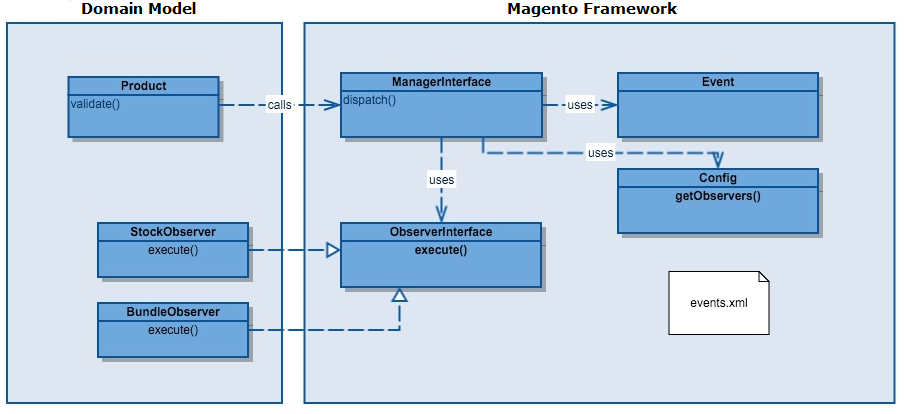

*Fig. 8: Example of the Observer Pattern in Magento 2 [[23](#leak)]*

#### Strategy pattern
The strategy pattern enables the application to vary an algorithm’s behaviour independently from users at runtime. In Magento 2, this pattern is used in the algorithms behind building payment requests [[22](#pronko)]. Figure [9](#fig9) shows an example in which the pattern recognizes two types of functions, namely the CaptureBuilder and PartialBuilder. The CaptureBuilder is used in the default case, however under certain conditions the function will be interchanged to adapt PartialBuilder.

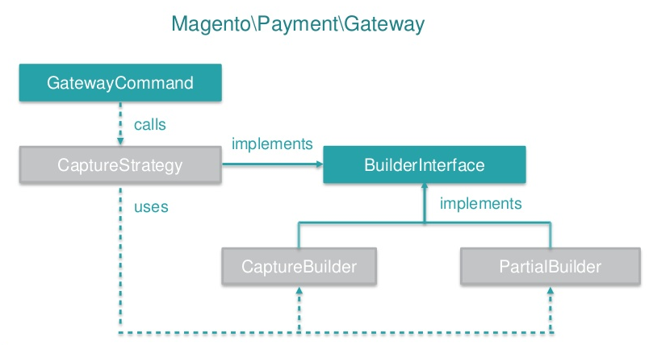

*Fig. 9: Example of the Strategy Pattern in Magento 2 [[22](#pronko)]*

#### Decorator pattern
The decorator pattern allows responsibilities to be added dynamically to an individual object. In Magento 2, this pattern is implemented to add new behaviour to the factory used by the ObjectManager. In Magento 2, this pattern is implemented to add new behaviour to the factory used by the Object Manager [[22](#pronko)]. This can be seen in Figure [10](#fig10). 

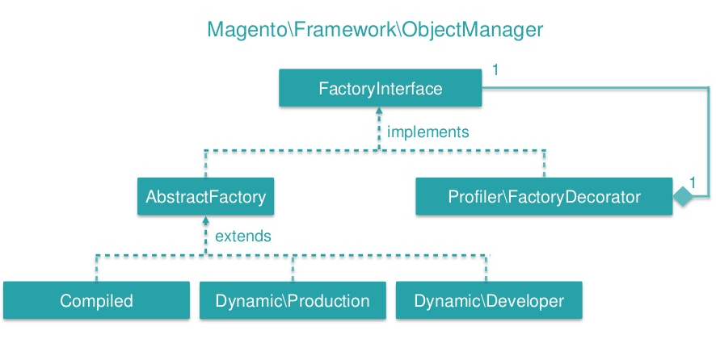

*Fig. 10: Example of the Decorator Pattern in Magento 2 [[22](#pronko)]*

<a id="actual-implementation" name="actual-implementation" />

### Actual implementation
#### The Magento Framework
The Magento Framework manages the interactions and information flow between application components. This includes processes regarding routing, indexing, caching and exception handling. The framework is positioned under the domain layer and surrounds the presentation, service and domain layers. More details about the framework’s folder structure and its libraries can be found in the section in the [Magento developer documentation]( http://devdocs.magento.com/guides/v2.1/architecture/archi_perspectives/arch_layers.html).

#### Logical components
Magento makes use of what they call ‘Magento components’ to enable users to customize the server-side visual representation of their webshop. The ‘Magento components’ are divided into [*modules*](http://devdocs.magento.com/guides/v2.0/architecture/archi_perspectives/components/modules/mod_intro.html), [*themes*](http://devdocs.magento.com/guides/v2.0/architecture/arch_themes.html) and [*language packages*](http://devdocs.magento.com/guides/v2.0/architecture/arch_translations.html). Below we will look more closely into modules and the way they employ the MVVM pattern.

#### Modules 
As explained before, modules employ the MVVM pattern. These are the most important implementation details that this pattern entails: 

* **module root**: All modules are located in the `<magento2 root folder>/app/code` folder. These 
   modules can be basic features developed by the core development team, or extensions built by external developers. The naming convention is `VENDOR_FUNCTIONALITY`. The developers each have their own folder, so a vendor specific module can be found in `<magento2 root folder>/app/code/<vendor_name>`.
* **main config**: Configuration files are written in `.xml` format with the 
   `<module root>/etc/module.xml` being the main configuration file. It specifies the name and 
   version of the module. The same name also needs to be added to the `<magento2 root folder>/app/etc/config.php` file in which the module we would like to use should be specified.
* **controller**: In order to respond to a URL, the module requires a controller. This consists of 
   two parts. The `<module root>/etc/frontend/routes.xml` specifies which routes the module should
   be able to respond to. Magento then transforms the URL to a controller class name and tries to 
   find it at `<module root>/Controller/SECOND_URL_COMPONENT/THIRD_URL_COMPONENT.php`. If the 
   controller exists, its execute function is called which determines how to respond (e.g. sending
   a HTML document or a redirect).
* **view**: Finally, the view is described by the *full action name layout handle XML file* 
   which defines hooks for the page layout system to include the Block of this component. Inside 
   this file we refer to a block class which should be created at `<module
   root>/Block/BLOCKNAME.php`. Usually, the Block class populates a template which will be rendered. 
   This template is a `phtml` file located at `<module root>/view/frontend/templates/TEMPLATENAME.phtml`. The Block would usually get data from the 
   model using requests or from other data sources and inject them into the view template. 

In Figure [11](#fig11) we can see an example of a module structure.

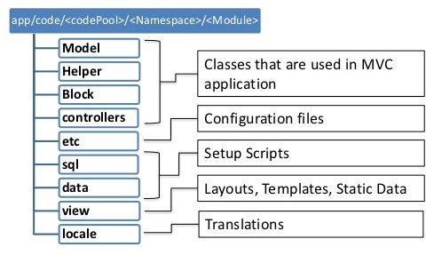
*Fig. 11: Example structure of a module [[24](#ibiza)]*

## Information view 
Magento webshops need to process many requests, orders and purchasing data. In order to work with these data, the Magento development team provides a proper interface for data management. This section describes the way that Magento’s architecture stores, manages and migrates information. 

### Data storage
The persistence layer is responsible for all access to storage resources in Magento. In order to provide a safer query execution and to simplify access to the database, it employs the PHP Data Objects (PDO) interface. The data-access abstraction that PDO offers is currently the recommended method for interacting with databases in PHP [[25](#database-access)]. For communication with the higher Domain layer, the Persistence layer adopts the Object-Relational Mapping (ORM) technique [[26](#orm)]. In this technique the communication with the database is performed via resource models. A resource model is an extension of a Domain Layer model that allows database access in an intuitive way. It creates an abstract representation of a particular database table. Each instance of the resource model represents a single record in the table the model corresponds to. 
A resource model is responsible for performing functions such as [[27](#persist)]:
* **Executing all CRUD (create, read, update, delete) requests**. The model contains the SQL code for completing these requests.
* **Executing additional business logic**. For example, a resource model could perform data validation, start processes before or after data is stored or perform other database operations.
The Magento ORM also allows the request of multiple records at once, by providing resource models of the type collection. Figure [12](#fig12) shows an overview of resource models and collection models in Magento.

*Fig. 12: Resource models represent records in the database*

A simple resource model defines and interacts with a single table. However, some objects have many attributes or a set related objects with a variable number of attributes. In these cases, the objects are composed using Entity-Attribute-Value (EAV) models. In result, any model using an EAV resource has its attributes spread out over a number of MySQL tables. The Customer, Product and Catalog resource models of Magento use EAV attributes.

### Data management
Magento makes use of a relational database management system with support for MySQL, MariaDB and Percona databases [[28](#databases)]. For purposes of flexibility, the Magento database employs EAV models [[29](#eav)]. In EAV, each modelled "entity" (e.g. a product) has a different set of attributes. Once a new product attribute is necessary, an EAV is added instead of adding an extra column to an ever-growing product table. EAV is very useful for a generic e-commerce solution since various stores may have different characteristics. EAV enables the developers to extend attribute sets without the need to redesign the database [[30](#eavattributes)]. Although it offers a lot of flexibility, not many open source or commercial databases make use of EAV. Hence, the Magento developers have constructed an EAV system out of PHP objects that adopts MySQL as a data-store. In other words, they have built an EAV database system on top of a traditional relational database.

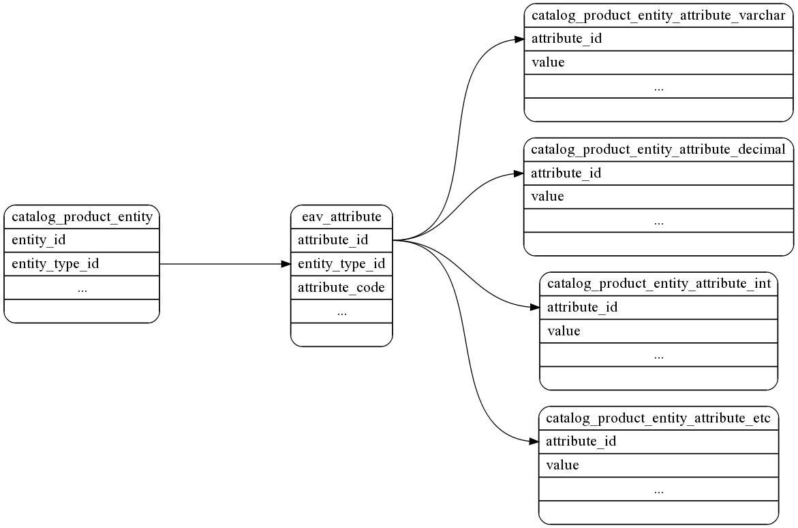

*Fig. 13: Overview of Magento’s database tables [[30](#eavattributes)]*

Figure [13](#fig13) is an overview of the database tables Magento interacts with to gain access to an EAV record for a *catalog_product* entity. Each individual product contains a row in *catalog_product_entity*. All the available attributes in the whole system are stored in *eav_attribute*, and the actual attribute values are stored in tables with names like *catalog_product_entity_varchar*, *catalog_product_entity_decimal*, *catalog_product_entity_etc*.

## Security 
E-commerce websites have always been a lucrative target for hackers, because of the sensitive data they contain, including credit card information. Especially with open source projects, security concerns present themselves as hackers know the internals of the application. That is why security should be the number one focus of all Magento developers and users. This section describes the vulnerabilities of the Magento system and the security measures that have been taken from the developers’ side and that should be taken from the users’ side. 

### Magento vulnerabilities
Based on the published patches and compared to competitors, Magento is quite secure [[31](#vulnerabilities)]. According to CVE Details, an online security vulnerability data source, there was only one vulnerability reported in 2016, five in 2015 and two so far in 2017 [[32](#cvedetails)]. According to the [Magento security center](https://magento.com/security/patches), they published six security patches in 2016 and one so far in 2017. Figure [14](#fig14) shows the percentages of the causes of these vulnerabilities. 

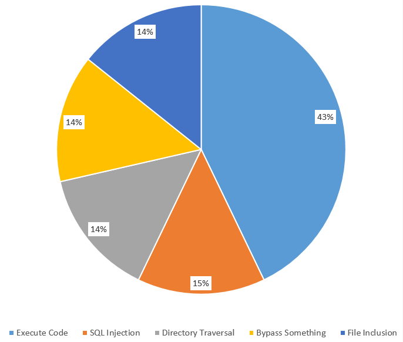

*Fig. 14: Vulnerabilities by type*

On the other hand, according to TrustWave’s Global Security Report 2016, "Magento was the ecommerce target of choice for hackers, with Magento installations accounting for 85% of compromised ecommerce systems" [[33](#trustwave)]. This was mostly caused by weaknesses in the server environment. As illustrated in Figure [15](#fig15), a Magento infrastructure contains several potential gateways for hackers [[34](#infrastructure)].

*Fig. 15: A standard Magento infrastructure at Rackspace*

TrustWave's report also notes that most software on Magento users’ servers were outdated and not fully patched. Therefore, securing the server infrastructure is the most critical aspect of securing a Magento website. In order to do this properly the Magento team published a [security guide](https://magento.com/security/best-practices/security-best-practices) which describes the best practices for server administrators to setup the third-party software correctly and securely.

### Intrusion detection and containment
Magento provides multiple security measures for intrusion, detection and containment to prevent attacks. Table 2 shows the security measures for each phase.

| Milestone | Measures for developers | Measures for users |
|-----------|-------------------|-------------------|
| Intrusion | Security fixes and patches are used to protect Magento. | Users should apply Magento's best practices for protecting their website and server environment.|
| Detection | Security tests, [BugCrowd](https://bugcrowd.com/magento) and the Magento community forum are used to keep track of detected breaches. | Monitor for signs of attacks using external tools that check the security status of your website. The most popular, [Magereport](https://www.magereport.com/), is developed by the Magento community.|
| Containment | Security updates are released in security patches with additional notes on their risk and applicable versions of Magento. | Users can sign up for security alerts and fixes to recover from attacks. To prevent future similar attacks follow Magento’s Disaster Recovery Plan, also part of the security guide. | 
*Table 2: Intrusion, detection and containment in Magento*

According to TrustWave, it takes Magento 80.5 days on average from initial intrusion to a security breach being detected [[33](#trustwave)]. The median total duration between intrusion and containment decreased from 111 days in 2015, to 63 days in 2016. But this still leaves hackers nine weeks on average to attack Magento without the developers being aware of it. 

### Recovery from failures
Magento applies the following measures to secure their products [[35](#securityoverview)]:
* **Enhanced password management**: Magento has improved the hashing algorithms (SHA-256) used in password management.
* **Prevention of cross-site scripting (XSS) attacks**: The Magento Framework follows protocols that manage the escape of data in output. These protocols allow clients to escape output for HTML pages (HTML, JSON, and JavaScript) and email. More information on measures against XSS attacks can be found in the [Magento documentation](http://devdocs.magento.com/guides/v2.0/frontend-dev-guide/templates/template-security.html).
* **Flexible file system ownership and permissions**: Since Magento 2.0.6., file system permissions are held in certain files that are writable in a development environment and read-only in a production environment. These permissions (particularly for production) can be further restricted using a umask, as explained in the [Magento documentation](http://devdocs.magento.com/guides/v2.0/install-gde/prereq/file-sys-perms-over.html).
* **Prevention of clickjacking exploits**: Magento protects your webshop from clickjacking attacks by using an X-Frame-Options HTTP request header. For more information, see [X-Frame-Options header](http://devdocs.magento.com/guides/v2.0/config-guide/secy/secy-xframe.html).
* **Use of non-default Magento Admin URL**: To prevent large-scale attacks that use automated password guessing and target default admin URL's like admin or backend, Magento creates a random Admin URI when you install the product. This URI can be changed through the provided CLI. More information can be found in the [Magento documentation](http://devdocs.magento.com/guides/v2.0/install-gde/install/cli/install-cli-adminurl.html).

## Technical debt 
Technical debt reflects on the long-term impacts of trade-offs that are taken during software development between productivity and maintainability. Since Magento is a very large system with nearly 200 external dependencies, technical debt is a serious threat that should be given a lot of attention. 

### Monitoring technical debt
In order to keep an overview of the system's technical debt, the Magento development team employs two automated testing tools.

#### Codacy static analysis
Codacy is a static analysis tool that performs automated code reviews and marks all violations. Based on the analysis results, the code is assigned a quality rating based on code style, security, duplication, code complexity and test coverage. Figure [16](#fig16) depicts the current quality rating of the Magento development branch. The vast majority of warnings are low level issues on variable name lengths and naming conventions. The Codacy report indicates that Magento is quite healthy software project.

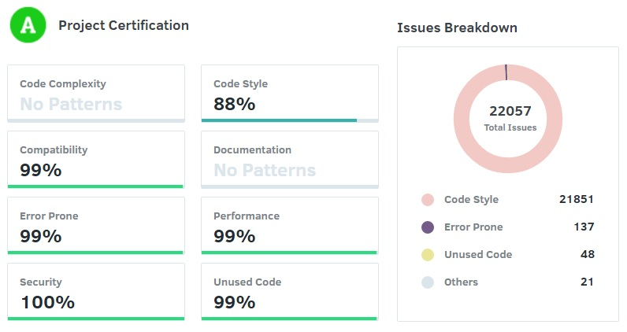

*Fig. 16: Codacy Technical Debt overview*

#### Travis Continuous Integration 
Travis CI is used for performing automated builds of the latest version of the platform. Since PHP is an interpreted language, the Travis build does not actually compile the code, instead it runs an extensive test suite with different configurations. Since most webservers use different PHP versions, the entire test suite is repeated for the current stable PHP 5 and PHP 7 versions.

Currently, this is the outcome of an integration test for a typical commit:

>OK, but incomplete, skipped, or risky tests!                
>Tests: 4783, Assertions: 12392, Incomplete: 69, Skipped: 77.

It indicates that there are a number of incomplete assertions and skipped test cases. This is generally not a good sign and indicates a source of technical debt.

#### Technical Debt Aggregation Tool 
One developer from the Magento community developed the *Module Technical Debt Aggregation* tool that analyses the technical debt of each module in Magento 2 [[36](#vinaitool)]. Figure [17](#fig17) shows the output of the tool for 28 modules ordered by decreasing technical debt.

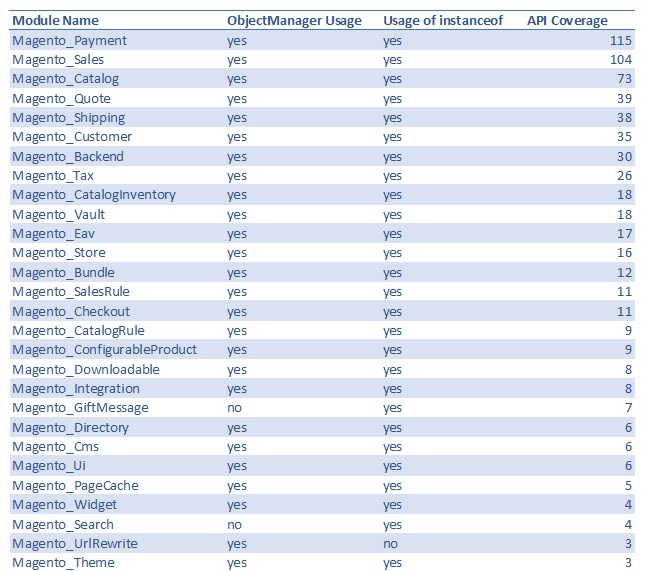

*Fig. 17: Magento Module Technical Debt*

The API coverage is particularly interesting, since it indicates the complexity and coupling of the various modules. The Payment module turns out to be the worst performing module. A further investigation confirms its complexity by the fact that this module consists of a staggering 272 files. Besides the Payment module, also the Sales and Catalog modules are high on the list. This shows that many parts of the website need access to the sales and catalog data. The *Module Technical Debt Aggregation* tool clearly indicates which modules need the most attention when reducing technical debt.

### Testing debt
Testing debt is caused by the lack of testing or by poor testing quality. Testing is unfortunately still considered a luxury for many development teams. Luckily, at Magento, they realized this and significantly invested in automated testing. 

#### Current code coverage
In order to measure how well the system is tested, we have used PHPUnit to generate a code coverage report in HTML format for Magento 2. The report can be found on our [team website](https://elvan.teammagento.nl/report/index.html). 
The overall coverage of the modules in `app/code` is 37%. This is pretty low because these modules contain a lot of untested UI elements and auto-generated code, as illustrated in Figure [18](#fig18). 

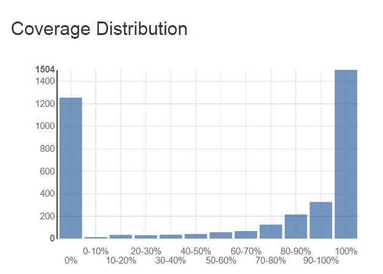

*Fig. 18: Coverage distribution in Magento 2*

Magento's Testing standard states that new code must always be covered unless it is auto-generated code or does not contain new business logic. Therefore, each module's View folder is untested which drastically lowers the overall coverage. However, the majority of the modules has a well-tested Block, Helper and Model folder (with a coverage higher than 70%). If we leave out all View folders and auto-generated code, the code coverage ends up higher than 88%. 

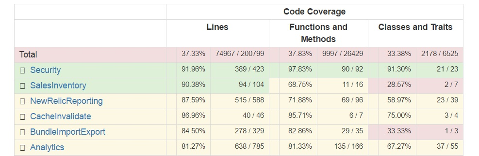

*Fig. 19: The top 5 Magento modules with the highest code coverage*

The modules that are best tested all have a coverage higher than 80%. Since modules shown in Figure [19](#fig19) are responsible for Magento’s core functionality, it is a good sign that they have been thoroughly tested. 

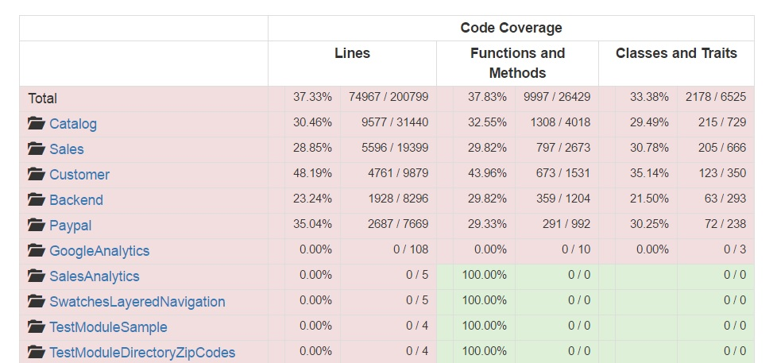

*Fig. 20: The top 5 largest Magento modules and the top 5 Magento modules with the lowest code coverage*

Figure [20](#fig20) shows that the five least tested modules have 0% coverage. Further investigation confirmed that these modules only contain auto-generated code. The largest modules have a coverage around 30% and are mainly base modules (Customer, Sales, Catalog) which contain many view files.

#### Testing procedure
As explained in [Magento’s Testing Guide](http://devdocs.magento.com/guides/v2.0/test/testing.html), the Magento 2 project distinguishes six different types of testing [[37](#alan1)]. Each test type has different quality criteria that must be adopted by Magento developers in order to get their pull-requests merged. They can be found in the [Magento2 git repository]( https://github.com/magento/magento2/wiki/Magento-Automated-Testing-Standard). 
Each PR will be measured by Codacy, Travis CI and integrators against the test level of the quality criteria. For each PR that includes new logic or new features another check by the core team is done to ensure adequate unit/ integration test coverage. 

An improvement potential in Magento’s testing procedure is the visibility of the code coverage in the continuous integration process. Currently, the contributors and integrators are expected to measure this on their local machine.

### Evolution of technical debt
With the transition from Magento 1 to Magento 2, the platform inherited a part of Magento 1’s technical debt. Therefore, the development team started to work in a series of milestones to pay the technical debt and to build an architecture that better complies to the SOLID principles [[38](#solid)]. This whole refactoring process took a year. Here are the most significant improvements:

* **The ObjectManager**: This God class is probably Magento 2’s largest violation of the SOLID principles. The usage of ObjectManager is a bad practice since it increases the coupling between different modules or models. The development team is dedicated to decreasing its usage in the source code, however because of its deep roots in the architecture this process goes slowly [[39](#object-manager)].
* **Dependency injection**: Instead of the ObjectManager ("Mage" class in Magento 1) Magento 2 uses dependency injection to make modules independent of their dependencies [[38](#solid)].
* **Framework dependency**: Magento 1 was tightly wrapped around Zend 1 and highly dependent on it. To make Magento 2 [[40](#framework-depend)] more independent, it uses its own adapter and interfaces for various frameworks.
* **Rewrite conflicts**: Magento 1 allowed modules to overwrite core functionality. Magento 2 changed this by introducing plugins [[41](#plugins)]. Plugins do not overwrite the class, but make it able to make a call before or after a method. 
* **Test automation**: With Magento 1 unit testing was not historically a requirement for developers. This was caused by the fact that Magento 1 was hard to test due to the static factory methods of the Mage class [[42](#magento1)]. However, with Magento 2 the community was introduced to test automation and the [Magento Automated Testing Standard](https://github.com/magento/magento2/wiki/Magento-Automated-Testing-Standard). This standard was defined to unify different testing approaches developed by the community. Soon enough the code coverage improved and since 2015 the coverage of Magento has been stable above 75%.

To compare the technical debt in Magento 1 and Magento 2, we used the tool SensioLabs. In total Magento 1 had 655946 lines, which had 24347 violations compared to a total of 997592 lines but only 8421 violations for Magento 2. The report for Magento 1 and 2 can be found on the SensioLabs website, [here](https://insight.sensiolabs.com/projects/a45659aa-fc73-428c-8b39-427b318e31cd/analyses/1) and [here](https://insight.sensiolabs.com/projects/753f9720-49fb-4b68-8d6f-fd81f1e7fece/analyses/1), respectively.

## Conclusion
We have analysed how Magento’s architecture offers flexibility and extensibility to its users. Magento’s design is based on a layered architecture with a clear separation in business and presentation logic. Many design patterns can be found in the core components. For purposes of flexibility, Magento employs a database layout based on Entity-Attribute-Value (EAV) models. In order to simplify access to the database, the platform offers the PHP Data Objects interface. 

Our analysis of Magento's security showed that the platform's vulnerabilities are primarily caused by remotely executed code and weaknesses in the server environment. The team provides different security measures, such as security patches, monitoring tools and best practices. 

Magento benefits from the improvements in technical debt that were introduced with the release of Magento 2. The development team is aware of the current technical debt and is dedicated to reducing it. The developers are actively decreasing the usage of the ObjectManager and often open pull-requests concerning code refactoring and documentation improvements.

In our analysis we have identified the visibility of code coverage and other software metrics as an improvement potential in Magento’s testing procedure. By making the measurement of these metrics part of Magento’s continuous integration process, feedback could be offered to developers more quickly, leading to a higher quality of code.

## References
1. 
 Ecommerce News. Magento the most used ecommerce platform in Europe. https://ecommercenews.eu/magento-used-ecommerce-platform-europe/.
2. 
 Jodie Pride. WooCommerce or Magento for Your E-Commerce Store? https://www.ostraining.com/blog/wordpress/magento/.
3. 
  Larry Morroni. The History of Magento and Its Rise to Ubiquity. https://morroni.com/blog/history-of-magento/.
4. 
 Magestore. What is Magento 2? First step to build a Magento 2 site. http://www.magestore.com/magento-2-tutorial/what-is-magento-2/
5. 
Nick Rozanski and Eoin Woods. Software Systems Architecture: Working with Stakeholders using Viewpoints and Perspectives. Addison-Wesley, 2012.
6. 
 Magento-hosting. https://www.yourhosting.nl/zakelijk/managed/magento-hosting/.
7. 
 Magento Community. https://community.magento.com/.
8. 
 Magento partners. https://magento.com/partners/portal/directory/?partner_type=1.
9. 
 Magento. https://magento.com/. 
10. 
 Samy Felice. The numerous benefits of the Magento Ecommerce Platform. https://www.neotericuk.co.uk/benefits-magento-ecommerce-platform.
11. 
University of Southampton. Object Oriented Basic Concepts and Advantages. http://eprints.soton.ac.uk/250857/3/html/node3.html.
12. 
 Magento. Global features that support extensibility. http://devdocs.magento.com/guides/v2.0/architecture/global_extensibility_features.html.
13. 
 Magento. Service contracts. http://devdocs.magento.com/guides/v2.1/extension-dev-guide/service-contracts/service-contracts.html.
14. 
Magento Testing Guide. http://devdocs.magento.com/guides/v2.0/test/testing.html.
15. 
 Magento Layered Architecture diagram. http://devdocs.magento.com/guides/v2.1/architecture/archi_perspectives/arch_diagrams.html.
16. 
 Magento Presentation Layer. http://devdocs.magento.com/guides/v2.1/architecture/archi_perspectives/present_layer.html.
17. 
 Magento Service Layer. http://devdocs.magento.com/guides/v2.1/architecture/archi_perspectives/service_layer.html.
18. 
 Magento Persistence Layer. http://devdocs.magento.com/guides/v2.1/architecture/archi_perspectives/persist_layer.html.
19. 
 Introduction to Magento 2 — No More MVC http://alanstorm.com/magento_2_mvvm_mvc/.
20. 
 R. Jaison. Six Benefits of Using MVC Model for Effective Web Application Development. https://www.brainvire.com/six-benefits-of-using-mvc-model-for-effective-web-application-development/.
21. 
 Magento. PHP developer guide: Factory. http://devdocs.magento.com/guides/v2.0/extension-dev-guide/factories.html.
22. 
 Max Pronko. Development Design Patterns in Magento 2. https://www.maxpronko.com/blog/magento-2-development-design-patterns.
23. 
 Magenticians. Twelve design patterns in Magento. https://magenticians.com/12-design-patterns-magento/.
24. 
 Magento 2.0. Prepare yourself for a new way of module development. https://www.slideshare.net/ivanchepurnyi/magento-20-prepare-yourself-for-a-new-way-of-module-development. 
25. 
 PHP The Right Way. http://www.phptherightway.com/.
26. 
 Object-Relational Mapping. http://www.killerphp.com/articles/what-are-orm-frameworks/.
27. 
 Magento. DevDocs: Persistence layer. http://devdocs.magento.com/guides/v2.0/architecture/archi_perspectives/persist_layer.html.
28. 
 Magento. DevDocs: Technology stack. http://devdocs.magento.com/guides/v2.0/architecture/tech-stack.html.
29. 
 Manish Prakash. Magento EAV database structure. http://excellencemagentoblog.com/blog/2011/09/07/magento-eav-database-structure/.
30. 
 Alan Storm. Magento for Developers: Part 7—Advanced ORM: Entity Attribute Value. http://devdocs.magento.com/guides/m1x/magefordev/mage-for-dev-7.html. 
31. 
 Brian Jackson. Complete Guide on Magento Security. https://www.keycdn.com/blog/magento-security/.
32. 
 CVE Details. Magento: Vulnerability statistics. https://www.cvedetails.com/product/31613/Magento-Magento.html?vendor_id=15393.
33. 
 ExtensionsMall. How secure is Magento? Not much, says Trustwave. https://www.extensionsmall.com/blog/how-secure-is-magento/.
34. 
 John Engates. Building Secure, Scalable and Highly Available Magento Stores, Powered by Rackspace Solutions. https://support.rackspace.com/white-paper/building-secure-scalable-and-highly-available-magento-stores-powered-by-rackspace/.
35. 
 Magento. DevDocs: Security overview. http://devdocs.magento.com/guides/v2.0/architecture/security_intro.html.
36. 
 Vinai Kopp. Magento 2 Module Technical Debt Aggregation. https://github.com/Vinai/m2-tech-debt.
37. 
 Alan Kent. Magento 2: Testing, testing and more testing. https://alankent.me/2014/06/28/magento-2-test-automation/.
38. 
 Brideo. Being a SOLID developer in Magento 2. http://brideo.co.uk/magento2/SOLID-in-Magento-2/.
39. 
 Alan Storm. Magento 2 Object Manager. http://alanstorm.com/magento_2_object_manager/.
40. 
Framework dependency in Magento 2. - http://www.coolryan.com/magento/2016/01/29/the-difference-between-magento-1-and-magento-2/
41. 
 Magento. Developer Documentation: Plugins. http://devdocs.magento.com/guides/v2.0/extension-dev-guide/plugins.html.
42. 
 Dan Homorodean. Beginning unit testing in Magento 1.x. https://magento.evozon.com/beginning-unit-testing-in-magento-1-x.html.
