# Matplotlib - The Python 2D Plotting Library

**By [Andreas Maruli C Pangaribuan](https://github.com/andreasmcp), [Helmiriawan](https://github.com/helmiriawan), [Rizky Dharmawan](https://github.com/rizkydharmawan), and [Sindunuraga Rikarno Putra](https://github.com/sindunuragarp).**  
*Delft University of Technology*

_The Matplotlib logo taken from their [website](http://matplotlib.org/1.5.1/examples/api/logo2.html)_

<!-- ////////////////////////////////////////////////////////////////////////////////////////////////////////////////// -->

---
## Abstract

_Matplotlib is a data plotting library that is often considered as the grandfather of visualization libraries in Python. The project is pioneered by scientist John Hunter back in 2003 and has since been developed by the open source community. This chapter aims to offer an outside point of view of the Matplotlib software architecture. At first, an analysis of the external entities of the system is given. Next, a closer look at the underlying architecture of Matplotlib is presented. Lastly, a deeper analysis into the system is done to identify technical debts that exist in Matplotlib and some possible solutions._

<!-- ////////////////////////////////////////////////////////////////////////////////////////////////////////////////// -->

---
## Table of Contents

- [1. Introduction](#introduction)
- [2. Stakeholders](#stakeholders)
- [3. Context View](#context-view)
	- [3.1. System Scope](#system-scope)
	- [3.2. External Entities](#external-entities)
- [4. Functional View](#functional-view)
- [5. Development View](#development-view)
	- [5.1. Codeline Organization](#codeline-organization)
	- [5.2. Module Organization](#module-organization)
	- [5.3. Common Design Models](#common-design-models)
- [6. Evolution Perspective](#evolution-perspective)
- [7. Technical Debt Analysis](#technical-debt-analysis)
- [8. Conclusion](#conclusion)
- [References](#references)

<!-- ////////////////////////////////////////////////////////////////////////////////////////////////////////////////// -->

---
## 1. Introduction

Matplotlib provides a convenient tool for creating 2D plots of data using Python. It is an open-source project that is fully supported by the Python scientific computing community. Matplotlib is now used by a variety of people for analysis and research purposes and was even used by NASA for data visualization of the [Phoenix](#http://matplotlib.org/users/screenshots.html#ellipses) spacecraft exploration on Mars.

Matplotlib was initially developed by a group of self-taught programmers with a scientific background. The founder of Matplotlib, John Hunter, started developing it to visualize biomedical data during his post-doctoral research in Neurobiology [[1]](#aosa) to visualize electrocorticography (ECG) data. At that time, the available proprietary data visualization tool was a limited resource, and John Hunter wanted to find an alternative tool that was available for all his team. MATLAB was the most popular alternative at that time, but he found that as a software program, it has limited capabilities in managing large biomedical data from various sources. Therefore, he opted to create a new tool that is similar to MATLAB using Python, which as a programming language has an advantage in handling data.

Matplotlib eventually evolved from a small project by a group of researchers into a widely used open-source tool. It is now one of the core component for the scientific Python stack. Matplotlib being a project that was initially developed by people without vast experience in software engineering makes its architecture and evolution interesting. The goal of this chapter is to analyze the architecture of this interesting project and present an outside overview of the system. To analyze the architecture of Matplotlib, we will refer to the guidelines made by Nick Rozanski and Eoin Woods [[2](#rw)].

<!-- ////////////////////////////////////////////////////////////////////////////////////////////////////////////////// -->

---
## 2. Stakeholders

To start off our analysis, we will look at the stakeholders involved with Matplotlib. A stakeholder is an entity of a system architecture that consists of an individual or an organization that has importance and interest to realize a system. [Figure 1](#fig-stakeholders) shows a summary of identified stakeholders of Matplotlib based on the classification proposed by Nick Rozanski and Eoin Woods [[2](#rw)].

### Overview

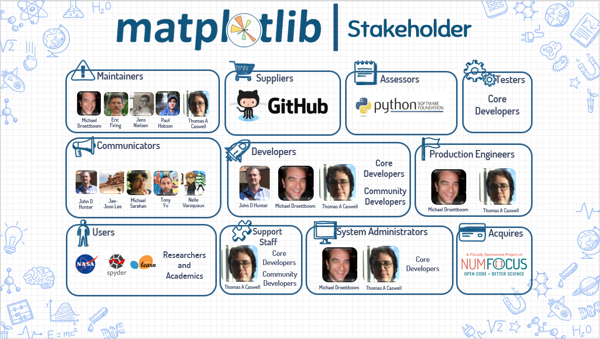  
_**Figure 1.** The Stakeholders of Matplotlib_

There are no corporate sponsors for Matplotlib, but the main funding is provided through donations via the [NumFOCUS](http://www.numfocus.org/) organization, which can be classified as an **Acquirer**. The Python Software Foundation ([PSF](https://docs.python.org/3/license.html)) can be categorized as an **Assessor** of Matplotlib because they oversee the system's conformance to standards and legal regulation. Meanwhile, the development of Matplotlib is coordinated via Github, which can be classified as a **Supplier**.

The **Developers** of Matplotlib are divided into core developers and community developers. [John D. Hunter](https://github.com/jdh2358) is the founder and initial lead developer of Matplotlib, but he passed away in 2012. Now both [Michael Droettboom](https://github.com/mdboom) and [Thomas A. Caswell](https://github.com/tacaswell) act as lead developers. They are accompanied with 15 other core developers in developing Matplotlib. Many of the core developers also act as **Maintainers**, since they review all contributions to make sure it doesn't break the system. Matplotlib's **Support Staff** consists of a few core developers such as [Thomas A. Caswell](https://github.com/tacaswell), [Paul Hobson](https://github.com/phobson), and [Eric Firing](https://github.com/efiring), and also some community developers, such as [Nelle Varoquaux](https://github.com/NelleV).

The **Users** of Matplotlib are varied as it is a generic data plotting tool, but based on [depsy](http://depsy.org/package/python/matplotlib), quite a lot of them are from the research and academic background. Some large projects also use Matplotlib, such as [NASA](http://matplotlib.org/users/screenshots.html#ellipses) and [Spyder](https://pythonhosted.org/spyder/). Some Python libraries such as [`scikit-learn`](https://github.com/scikit-learn/scikit-learn) and [`seaborn`](https://github.com/mwaskom/seaborn) are also users since they use parts of Matplotlib inside their library. Users can read the [documentation](http://matplotlib.org/contents.html) to find out how to use Matplotlib, which is written by the **Communicators**, mainly [John D. Hunter](https://github.com/jdh2358), [Jae-Joon Lee](https://github.com/leejjoon), [Michael Sarahan](https://github.com/msarahan), [Tony Yu](https://github.com/tonysyu), and [Nelle Varoquaux](https://github.com/NelleV).

Apart from the proposed definition above, there are also **Event Organisers** who organize annual events. An example is the [SciPy conference](https://conference.scipy.org/), which gathers people who develop open source scientific projects using Python. In such events, the participants not only showcase their latest projects, but also learn and collaborate with other developers.

### Power Interest Grid

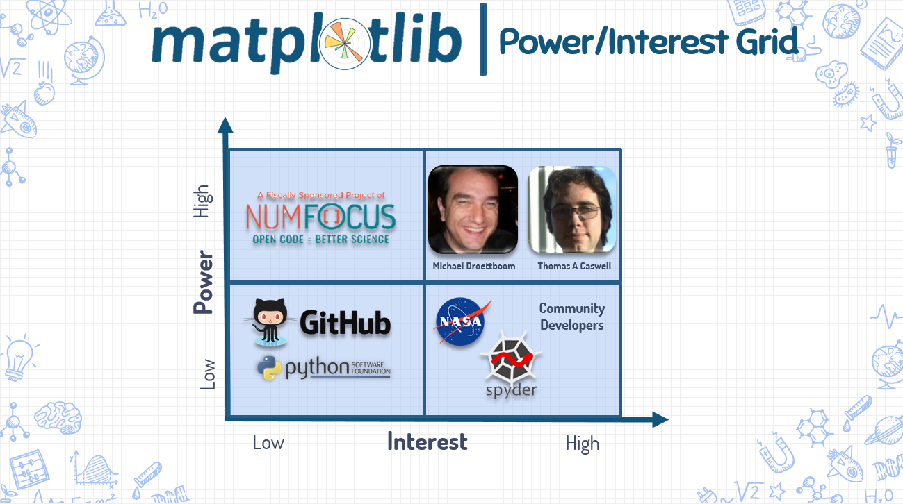  
_**Figure 2.** Power-Interest Grid_

The power versus interest relation of the stakeholders are shown in [Figure 2](#fig-power) and are classified into 4 categories :

- **Low power and low interest** : Github and the Python Software Foundation are stakeholders who do not have any control over Matplotlib, and do not have a significant role in the development of Matplotlib.    

- **Low power and high interest** : Users, competitors, and community developers of Matplotlib are stakeholders who follow the latest development of Matplotlib and are active in the discussion of Matplotlib, but they do not have significant power to directly change the Matplotlib system.

- **High power and low interest** : NumFOCUS is a stakeholder who directly affects development of Matplotlib, but it only provides funding without restricting the development.

- **High power and high interest** : [Michael Droettboom](https://github.com/mdboom) and [Thomas A. Caswell](https://github.com/tacaswell) are the lead developers of Matplotlib. Along with other core developers, they have significant interest and power in developing Matplotlib.

<!-- ////////////////////////////////////////////////////////////////////////////////////////////////////////////////// -->

---
## 3. Context View

Next we will look into the relationships that exist between Matplotlib and its environment. This section also defines what the system does and doesn't do, and the boundaries between it and the outside world [[2]](#rw).

### 3.1. System Scope

According to the [introduction of Matplotlib](http://matplotlib.org/users/intro.html) at its website [[3]](#mpl), Matplotlib is defined as **"a library for making 2D plots of arrays in Python"**. The scope of the software is clearly defined here. It is constrained to focus on one task, which is 2D plotting, and on a specific platform, which is on the Python programming language. From the [history of its development](#introduction), we can also conclude that Matplotlib was designed to be a free plotting library that is easy to use out of the box and is mainly targeted at the academic community.

The Matplotlib website [[3]](#mpl) also states the design philosophy which John Hunter held to when developing Matplotlib.

>Matplotlib is designed with the philosophy that you should be able to create simple plots with just a few commands, or just one! If you want to see a histogram of your data, you shouldn’t need to instantiate objects, call methods, set properties, and so on; it should just work.

This is further elaborated by a list of requirements that John Hunter had in mind when looking for a visualization tool.

>When I went searching for a Python plotting package, I had several requirements:
>- Plots should look great - publication quality. One important requirement for me is that the text looks good (antialiased, etc.)
>- Postscript output for inclusion with TeX documents
>- Embeddable in a graphical user interface for application development
>- Code should be easy enough that I can understand it and extend it
>- Making plots should be easy

### 3.2. External Entities

The connections between Matplotlib and its environment is summarized in [Figure 3](#fig-context).

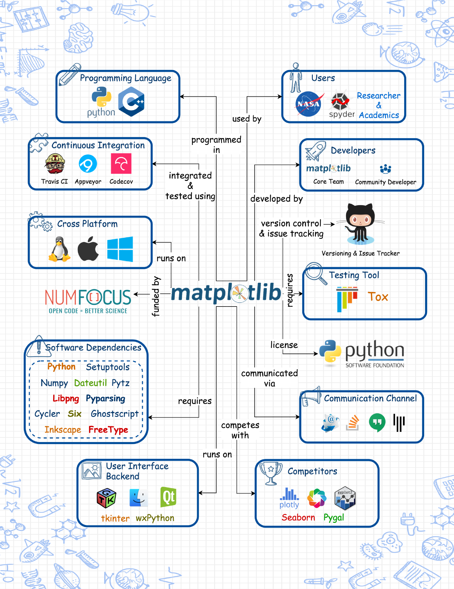  
_**Figure 3.** Context View Diagram_

The external entities can be split into three groups:

#### A. Competitors

When Matplotlib was initially created, there was no other reliable Python visualization library available. But now Matplotlib faces [quite a few competition](https://wiki.python.org/moin/NumericAndScientific/Plotting) for visualizing data in Python. The competitors are mainly split into two types:

**Data plotting tools** are the same as Matplotlib and want to make plotting data easier for people. Most of these tools extend Matplotlib such as [`seaborn`](https://github.com/mwaskom/seaborn) that builds on top of Python by adding more beautiful default plot designs, and [`ggpy`](https://github.com/yhat/ggpy) that adopts new features from the `ggplot2` [R package](http://ggplot2.org/). 

**Modern visualization tools** on the other hand try to tackle newer visualization problems out of the scope of Matplotlib. An example is [`bokeh`](https://github.com/bokeh/bokeh) and [`plot.ly`](https://github.com/plotly/plotly.py) that both focuses on generating interactive visualization that can be embedded on the web.

#### B. Software Platform & Dependencies

Matplotlib is developed as a Python package and is hosted on the Python package repository ([PyPI](https://pypi.Python.org/pypi)). A small part of the Matplotlib code is also written in other languages such as C++ and objective C for low level optimization.

**Platforms** : Matplotlib is well tested for compatibility on all three major operating systems (Windows, Linux, and OSX). Matplotlib enables image generation across platforms by supporting most UI rendering platforms (such as linux's `gtk` and OSX's `macosx`) and image formats (`jpg`, `svg`, etc).

**Dependencies** : Most dependencies are standard libraries such as `pyparsing` and `dateutil`, and also image format libraries such as `libpng`. Two libraries which Matplotlib has strong dependencies on are `numpy` which is used for numerical operations and `six` for backward compatibility with Python 2. A complete list can be found on the Matplotlib [website](http://matplotlib.org/users/installing.html) [[3]](#mpl).

#### C. Development & Community

A platform that plays an important role during development is `Github`, which is used for code versioning, issue tracking and project management. All code gets tested and integrated via continuous integration tools. Testing of the code uses the `pytest` and `Tox` package, and code coverage is tested using `Codecov`.

The main communication channel used in the development of Matplotlib is through their [Github repository](https://github.com/matplotlib/matplotlib) and their [mailing list](https://sourceforge.net/p/matplotlib/mailman/). More open discussion is done via `Google Hangouts` and the [Matplotlib `Gitter` channel](https://gitter.im/matplotlib/matplotlib). The Matplotlib developers also provide support to users through [`Stackoverflow`](http://stackoverflow.com/questions/tagged/matplotlib).

<!-- ////////////////////////////////////////////////////////////////////////////////////////////////////////////////// -->

---
## 4. Functional View

In order for Matplotlib to handle 2D plotting, it is conceptually split into three layers, which can be viewed as a stack [[1]](#aosa). The higher layers depend on the lower layers, while the lower layers are independent of higher layers. The three layers can be seen in [Figure 4](#fig-functional).

  
_**Figure 4.** Functional Abstraction of Matplotlib_

### Backend Layer

Matplotlib encapsulates functionalities that interact directly with the environment it is run on into the backend layer. There are three main components in this layer:
- `FigureCanvas` : This component handles the concept of a surface that is drawn into to make the plots, a.k.a "the canvas".
- `Renderer` : This component does the drawing of the plots on the surface, a.k.a "the paintbrush".
- `Event` : This component handles user inputs such as mouse or keyboard events, a.k.a "the viewer".

Through this abstraction, Matplotlib can be extended to work on different platforms including various UI rendering platforms and image formats. Additionally, the backend achieves image consistency between platforms through usage of a C++ 2D graphics library called [Anti Grain Geometry](http://www.antigrain.com/).

### Artist Layer

From the previous analogy, the artist layer is the object that knows how to use the paintbrush (`Renderer`) to draw on the canvas (`FigureCanvas`). Every image component inside a plot made by Matplotlib (axes, legends, etc) is an instance of the `Artist` class and communicates with the backend through the `draw` function. In fact, most of the heavy-lifting is done in this layer and it comprises most of the code inside Matplotlib.

There are two types of `Artist` objects, `Primitive Artists` which draws basic objects such as `Line2D` and `Circle`, and `Composite Artists` which consists of multiple `Artists`. The most important `Artist` object in Matplotlib is `Axes` which is responsible for composing the 2D data plots by combining multiple other `Artist` objects.

### Scripting Layer

With the artist layer, programmers are actually already able to create 2D plots. The scripting layer however encapsulates the lower level image component renditions with a layer that is designed to be easy to use by the average user. This is done to comply with the initial design goal of Matplotlib which is to create a 2D plotting tool that can be used interactively like in Matlab.

The scripting layer is accessed through the `pyplot` module and contains methods to create commonly used plotting graphics such as the histogram or the scatterplot. This layer also handles additional plot arguments such as setting the color of the plot or the plot labels, through the use of Python's `**kwargs` which captures all keyword arguments that are passed together with a method call. `pyplot` then forwards it to the correct `Artist` component to be configured.

<!-- ////////////////////////////////////////////////////////////////////////////////////////////////////////////////// -->

---
## 5. Development View

We will now take a closer look at the code structure and development process of Matplotlib to derive the architecture used to implement the designed functionality of Matplotlib as well as the strategies employed to standardize its design and development.

### 5.1. Codeline Organization

Code functionality inside the project can be split into four large sections by their roles as can be seen in [Figure 5](#fig-codeline).

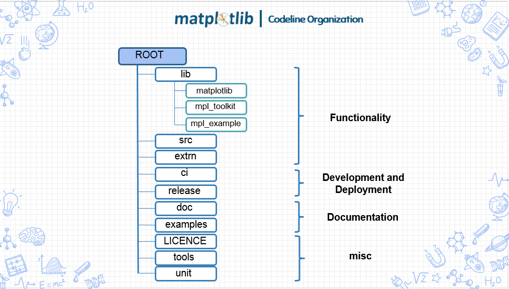  
_**Figure 5.** Codeline Organization of Matplotlib_

The **Functionality** section contains code responsible for the functionalities of Matplotlib and the dependencies required. The main part of the Matplotlib library is contained in the `lib` directory which depends on both code in `extern` (external libraries packaged with Matplotlib) and `src` (c++ code made by the developers) for performance improvement. The `lib` directory is split into three main modules: `matplotlib` contains the core module for implementing 2D plotting, `mpl_toolkits` contains the toolkits module for extending functionalities outside of Matplotlib's scope, and `mpl_examples` contains a symbolic link to the `examples` directory for ease of access in regression testing.

The **Development and Deployment** section contains code used in the development and deployment process of Matplotlib. These are mostly used for developing Matplotlib and do not directly affect the functionality of Matplotlib. There are two directories: `ci` contains files needed by the continuous integration platforms and `release` contains compatibility code for deployment of Matplotlib across platforms. The main part of this category is actually in the scripts at the root directory that are used in the development process such as `setup.py` and `tests.py`.

The **Documentation** section contains code used to generate the documentation of Matplotlib. There are two directories: `doc` contains code to generate the documentation which is hosted at their [website](http://matplotlib.org/contents.html) and `examples` contains example uses of Matplotlib.

The **Miscellaneous** section contains the rest of the code not contained in the previous three sections. The `LICENSE` directory is for legal purposes, while the `tools` and `unit` directory contains incidental scripts used for specific purposes only.

### 5.2. Module Organization

The Matplotlib source code is organized into several modules that encapsulates a coherent piece of functionality. Matplotlib modules are partitioned into three main categories as can be seen in [Figure 6](#fig-modulestructure). These modules are organized in different abstraction layers where the top layer depends on the layers below it.

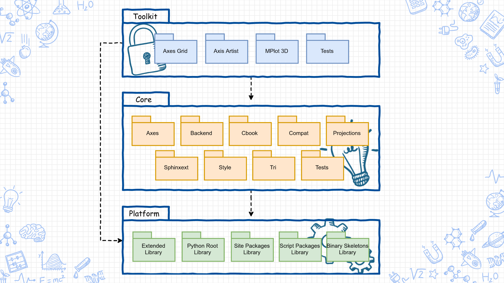  
_**Figure 6.** Module Structure Model of Matplotlib_

The **core module** comprises the core Matplotlib functionality for implementing 2D plotting. The main functional components as described in the [Functional View](#functional-view) is implemented here. Most of the backend layer is encapsulated inside the `backends` module, while the scripting layer is accessed from the `pyplot` submodule which is autogenerated using `boilerplate.py`. Most of the code here is from the artist layer and is spread in various submodules.

Most of the submodules are in the root directory, but a few submodules have been grouped together inside their own directory which creates a larger module. The most important of these modules are `axes` which is responsible for drawing the plotlines, `backends` which contains handlers for different platforms, and both `tri` and `projection` which handle low level image transformations.

The **toolkit module** enriches the basic functionalities of Matplotlib and depends on the core module. There are currently two major projects in this module: `axes_grid` which adds functionalities to `axes` such as combining multiple `axes` or adding angles to `axes`, and `mplot3d` which adds pseudo-3D plotting to Matplotlib.

The **platform module** consists of supporting modules from external parties such as the basic Python language libraries (Python root library, Python extended library, script package library) and site package libraries such as `scikit-learn` and `numpy`.

The diagram above can be considered as an oversimplification as the connections between modules are much more complex. A closer look at the interdependencies of the submodules is done at the [technical debt section](#technical-debt-analysis).

### 5.3. Common Design Models

In this section, common designs that are used and standardized in the development of Matplotlib are described.

#### Common Process Standardization
  
Since Matplotlib is not a continuously running system, the use of logging is mostly for debugging purposes. Generally, there are two types of logging in Matplotlib, debugging traces which are handled by a class called `Verbose`, and warnings which are handled by the `warning` Python package.

Matplotlib requires intensive numeric calculations to efficiently plot 2D data. Instead of developing from scratch, Matplotlib uses third party libraries. For matrix operations and data handling, Matplotlib uses [`numpy`](http://www.numpy.org/), while for geometric calculations, it uses [`antigrain geometry`](http://www.antigrain.com/) and [`qhull`](http://www.qhull.org/). Commonly used functions that are shared among many classes such as datetime handling, are stored inside a utility module called `cbook`.

#### Design Standardization

Matplotlib is a community effort which is developed through [Github](https://github.com/matplotlib/matplotlib). Development standards are communicated through their [developers's guide](http://matplotlib.org/devel/index.html).

Matplotlib uses [PEP8](https://www.python.org/dev/peps/pep-0008/) as a standard style for Python code. It is a set of coding standards created by the Python software foundation. To support Python 2 and 3 from a single code base, Matplotlib uses the [six](http://pythonhosted.org/six/) Python library. Meanwhile, design quality is maintained through Pull Request reviews and discussions in Github, and larger design goals are compiled into the [Matplotlib Enhancement Proposal (MEP)](http://matplotlib.org/devel/MEP/index.html).

#### Testing Standardization

Matplotlib uses standard Python testing libraries for their testing process. The tests mainly consists of unit tests which tests small components of the code, and also a Matplotlib specific "image comparison test". This test generates specific images using the Matplotlib code and then compares the results with baseline images generated previously.

To be able to do the testing internally, developers are required to install [`pytest`](http://doc.pytest.org/en/latest/) and [`mock`](https://docs.python.org/dev/library/unittest.mock.html). [Ghostscript](https://www.ghostscript.com/) and [Inkscape](https://inkscape.org/en/) are also required for the image comparison test. To guarantee changes to the code do not introduce unexpected failures or conflicts, Matplotlib implements continuous integration using [Travis CI](https://travis-ci.org/) for unix environments and [Appveyor](https://www.appveyor.com/) for windows. Both CI platforms are integrated to Github and run on every new Pull Request. Matplotlib also uses [CodeCov](https://codecov.io/) to check the code coverage when there is a change in the test code. To accommodate testing on different versions of Python, Matplotlib uses [`tox`](https://tox.readthedocs.io/en/latest/).

<!-- ////////////////////////////////////////////////////////////////////////////////////////////////////////////////// -->

---
## 6. Evolution Perspective

To understand more about the architecture of Matplotlib, we will take a look at its evolution over time. Matplotlib was originally developed as a visualization tool for medical research, but as time goes on, Matplotlib became a popular Python plotting library used by generic users. This interesting evolution of Matplotlib will be analyzed by comparing the state of Matplotlib in each minor and major releases.

### Feature Evolution

Matplotlib uses [semantic versioning](http://semver.org/) for numbering their releases, which clearly separates major releases, minor releases, and bugfix patches. [Figure 7](#fig-evolutionperspective) shows the timeline of Matplotlib version releases based on Matplotlib's [version release](http://matplotlib.org/users/whats_new.html#id1) documentation [[3]](#mpl).

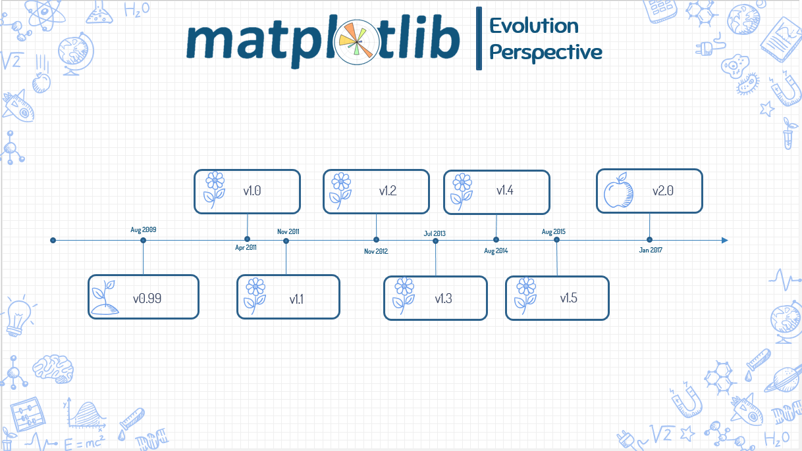  
_**Figure 7.** Matplotlib version history_ 

- `v0.99`: Added new features (mplot3d, axes grid toolkit and axis spine placement).
- `v1.0` : New backends (HTML5/Canvas), performance enhancements, and new features (complex subplots, triplots, multiple 'show' calls).
- `v1.1` : Introduced animations, new backends (qt4, IPython), new features (sankey diagrams), and improvements to legends and mplot3d.
- `v1.2` : Support for Python 3.x, new backends (pgf/tikz), new features (tri-surface plots, streamplots) and updated shipped dependencies (pytz and dateutil).
- `v1.3` : New backends (webagg), new features (sketch style) and a new setup script.
- `v1.4` : New backends (nbagg), added style package and new plotting features.
- `v1.5` : Interactive OO usage, support for pandas, new colormap and plotting features, and new tool manager.
- `v2.0` : Overhaul of the default styles  (font size, colours, mplo3d), fast text rendering, and support for retina displays.

Matplotlib has changed over time to support the latest versions of Python while also dropping support for older versions. For example in `v1.1` Matplotlib supports only Python 2.4 to 2.7, and then with release `v1.2` Matplotlib supports Python 2.6, 2.7 and 3.1. On the current release `v2.0`, Matplotlib only supports Python 2.7 and 3.4+ which are the two major Python versions currently used. Each update also usually brings support for new backends and plotting features. The more recent updates has focused mainly on supporting web backends which shows that Matplotlib is adapting to the trend of web based interfaces.

Another interesting part is how Matplotlib evolves to comply with user's needs. Matplotlib is mainly built for 2D plotting, but along with newer user's needs, some releases (`v0.99`, `v1.0`, `v1.1`, and `v1.3`) make adjustments to Matplotlib to support pseudo-3D plotting. Matplotlib also just recently changed the default plot styles since it was considered not very pretty by the community.

### Source Code Evolution

We used [cloc](https://github.com/AlDanial/cloc) to count the lines of code in Matplotlib over time. The graph can be seen in [Figure 8](#fig-linesofcode).

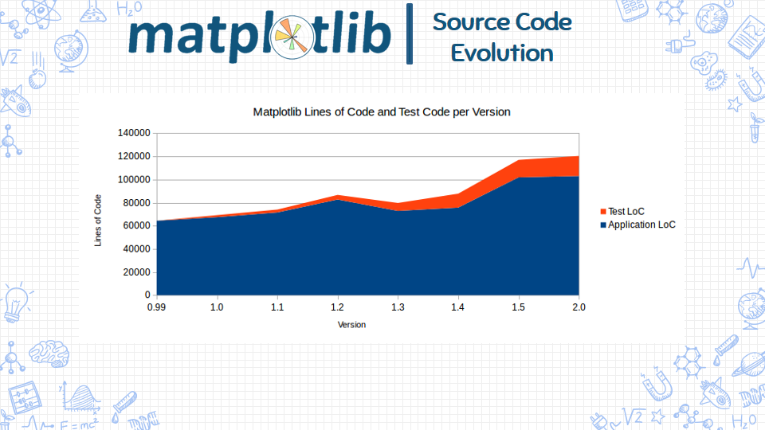  
_**Figure 8.** Matplotlib Lines of Code per Version_ 

In general, the lines of code increases gradually over time, but there is a slight decrease of code from `v1.2` to `v1.3`. According to the Matplotlib Enhancement Proposal 11 ([MEP11](http://matplotlib.org/devdocs/devel/MEP/MEP11.html)), this was because of a refactor. Matplotlib changed `dateutil`, `pytz`, and `pyparsing` into optional dependencies to decouple these third-party libraries from the application code.

It can also be seen that Matplotlib did not have any test code at `v0.99` but then started to add code testing in `v1.0`. Since then, in average the test code increases around 40% per release, while the application code only increased around 5% per release. This trend shows that over time, testing has become one area of focus in the development of Matplotlib.

<!-- ////////////////////////////////////////////////////////////////////////////////////////////////////////////////// -->

---
## 7. Technical Debt Analysis

After understanding the overall architecture of Matplotlib, we now take a deeper look at the current Matplotlib source code along with recent changes to the code to identify technical debts that exist in the system. To do this, we did both static code analysis and manual code inspection. We also tried analyzing discussions happening in the community, but not much discussions were found that directly addressed technical debts.

From the analysis, there were some findings. One nice finding is that nearly all code in Matplotlib was classified as rank A by [Radon](https://pypi.python.org/pypi/radon) with an average of 2.63, which is below the maximum threshold of 10 proposed by McCabe [[5]](#mccabe). There were only 7 files that were marked as having a large cyclomatic complexity. We also found that there were no major outdated dependencies and most of the code were already written in [idiomatic python](https://gist.github.com/JeffPaine/6213790). However, there are still a few technical debt that was identified and needs more attention.

### Ambiguous Project Structure

When compared to other similar Python libraries such as [`scikit-learn`](https://github.com/scikit-learn/scikit-learn) or [`bokeh`](https://github.com/bokeh/bokeh), Matplotlib's project structure can be considered messy. This is mainly because some files and directories are not self explanatory. For example, the `unit` directory in Matplotlib implies that it contains unit tests, but it actually contains problem specific testing scripts. The separation of the Matplotlib source code is also not clear between the `src`, `lib`, and `extern` directory.

These ambiguous code affect the developers of the system, potentially making development more tedious. There are currently also too much scripts in the root directory which would make it confusing for new contributors, but this is currently already being handled by the developers ([#8276](https://github.com/matplotlib/matplotlib/pull/8276)).

A simple step in improving this would be to put the contents of the `unit` directory as well as most scripts in the root directory into the `tools` directory. All functional code (`lib`, `src`, and `extern`) and build tools (`ci`, `release`, and some scripts in the root directory) can also be encapsulated into their own directory and renamed accordingly to better reflect their contents.

### Messy Module Dependencies

  
_**Figure 9.** Dependency Graph of Matplotlib_

The dependencies between internal modules of Matplotlib generated by [pydeps](http://pydeps.readthedocs.io/en/latest/) is shown in [Figure 9](#fig-dependencyall). Modules from core is shown in green, modules from toolkit in yellow, and the other colors indicate external dependencies. It can be seen that the dependencies inside Matplotlib are not so structured and that modules are not well separated. The separation between toolkits and core is also not so clean.

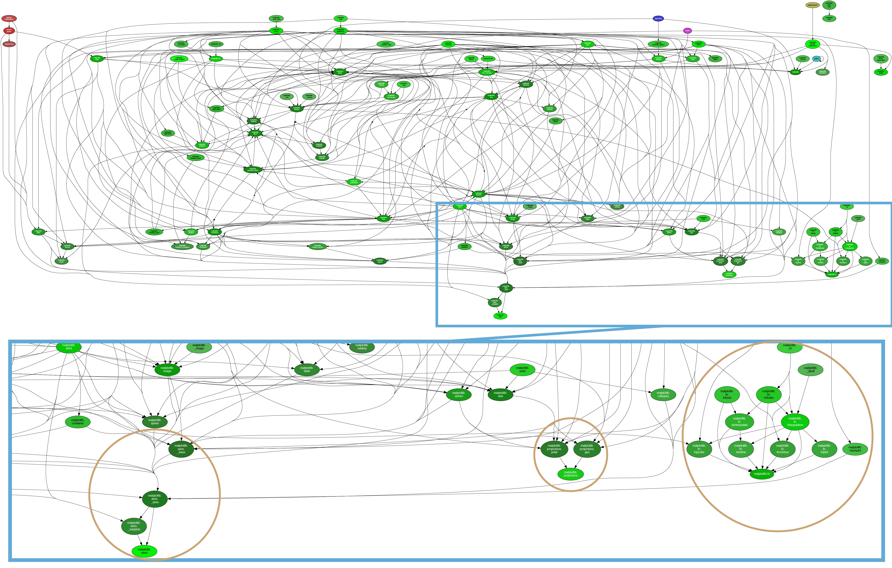  
_**Figure 10.** Trimmed Dependency Graph of Matplotlib Core_

A trimmed dependency graph of the core module without `backends` and `sphinxext` is shown in [Figure 10](#fig-dependencytrimmed). A closer look at the bottom right side shows that there is a well separated module group which is `tri`. To the left of that, there are also two smaller groups which are `projections` and `axes`. This shows that there are some attempts at encapsulating large concerns. However, overall the module organization in Matplotlib needs more separation of concerns. Fixing this issue would need a large refactoring of the whole Matplotlib project.

### Code Inconsistencies

Matplotlib has just recently migrated from using the `nose` testing framework into `pytest`. Despite this, some traces of the previous framework still exist in the system. The main trace we found is that the `testing` directory in each Matplotlib module which was previously created to extend the functionalities of `nose`, still exists until now. The Matplotlib [website](http://matplotlib.org/2.0.0/devel/testing.html) also still lists `nose` as their testing framework, but this is apparently already corrected in the code of the documentation and the website is not updated yet.

For logging purposes, Matplotlib has implemented their own utility class called `Verbose`, but many classes in Matplotlib still use a local debugging flag to control their debug loggings, and some even has local functions to handle this functionality. An example of this is in the `backend_qt5agg.py` file which uses a boolean flag named `DEBUG`.

There were also still 54 `TODO` and 13 `FIXME` that exist in the source code of Matplotlib at the time of our analysis, which shows there were some issues that are still not addressed yet.

This shows that the code inside Matplotlib is not very strongly standardized and maintained, which in the long run would make it harder for developers to extend the code since different classes have different code smell and conventions.

### Low Code Coverage

Code coverage is a measure used to indicate how much code has been covered by a test. Low coverage implies that the program has a high chance of containing undetected *bugs*. High coverage does not necessarily signify all actions will be correctly processed by the code, but at least it indicates that the likelihood of correct processing is good [[4]](#brader).

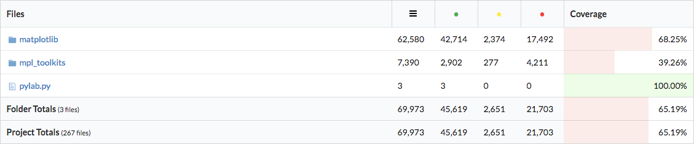  
_**Figure 11.** Code Coverage of Matplotlib_

Matplotlib uses `Codecov` to measure code coverage automatically. At the time of analysis, Matplotlib obtains 65.19% code coverage ([Figure 11](#fig-codecoverage)). This is still considered as a low code coverage as it is below the high threshold of 80% [[4]](#brader). The full results of our investigation for each module can be seen in [Figure 12](#fig-codecoveragecore) for the Core modules and [Figure 13](#fig-codecoveragetoolkit) for the Toolkit modules.

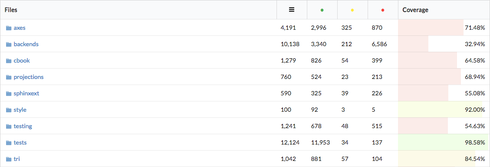  
_**Figure 12.** Code Coverage of Core Modules_

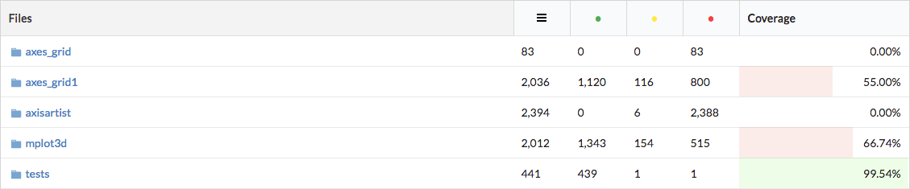  
_**Figure 13.** Code Coverage of Toolkit Modules_

A potential part of the code for improvement is the `backends` directory which currently only has 32% coverage albeit being a core part of Matplotlib. The `backends` is responsible for low level adjustments of Matplotlib to various graphic renderers, therefore improving code coverage in this part of Matplotlib would make future changes to Matplotlib more resistant to platform errors.

### Long Testing Time

Another source of technical debt is how long it takes to run tests. The runtime of integration tests are not strictly limited, but for unit tests which are supposed to be run repeatedly, according to [Martin Fowler](https://martinfowler.com/bliki/UnitTest.html), most experts agree that it should be fast and typically run less than a minute. A long unit test runtime means that the rate at which people can develop will be slowed down. The tests in Matplotlib when run in our own laptop achieved a runtime of around 7 minutes, while the average runtime of tests for continuous integration (in Jenkins) is around 20 minutes. This makes it hard to do rapid development of the Matplotlib code since it takes too long and the test script that is provided doesn't separate between unit and integration tests.

A possible solution is to separate out the integration tests, such as the Matplotlib image comparison test, into their own test script. This will reduce the number of tests that needs to be run frequently. If this is not enough, [Martin Fowler](https://martinfowler.com/bliki/UnitTest.html) also suggested that unit tests should be separated into a "compile suite" that is run on every compilation and a "commit suite" which is run before a commit (or usually on a pull request).

<!-- ////////////////////////////////////////////////////////////////////////////////////////////////////////////////// -->

---
## 8. Conclusion

Matplotlib is one of the oldest yet reliable and well-known visualization library in Python. During our investigation of Matplotlib, we identified some interesting findings that we believe will be useful to understand the current state of Matplotlib.

John Hunter initially designed Matplotlib as a Python tool strictly for 2D plotting and targeted it towards people of an academic background. Now Matplotlib has evolved into a thriving community project while still staying true with the initial design goals. As an open source project, most of the stakeholders are developers, with the NumFOCUS organization providing financial support through donations. From our short experience contributing to the project, we have identified [Thomas A. Caswell](https://github.com/tacaswell) who is also one of the lead developer, as the person to contact regarding the development of Matplotlib.

From the analysis, we learned that the functionality of Matplotlib is conceptually split into three layers, which at a glance is simple. However, digging deeper into its code, the architecture of Matplotlib is actually quite complex, and at its current state there are still quite a few technical debts. For instance, the interdependencies of the modules are too unstructured which makes the separation of concerns unclear. This makes it hard for most developers to contribute or change specific components of the system. There are also quite a few inconsistencies and lack of standardization in the code of Matplotlib, and some ambiguity in the project structure.

We have found that along its development, Matplotlib has improved a lot in terms of code tests, but currently the code coverage of Matplotlib is still too low. More tests need to be added especially to the `backends` module. The test script of Matplotlib is also not separated well between different types of tests, resulting in a very long test runtime which inhibits the speed of development.

To conclude, Matplotlib has evolved a lot from the research tool created by John Hunter, to the vastly used data plotting library it is today. Albeit the technical debts that still exist until now, Matplotlib has shown promising growth over the years. We strongly suggest people to contribute to Matplotlib as it has an open community that warmly welcomes new contributors as we have experienced in proposing some contributions.

<!-- ////////////////////////////////////////////////////////////////////////////////////////////////////////////////// -->

---
## References

1. <a name="aosa"/> Amy Brown and Greg Wilson (editors). The Architecture of Open Source Applications.Volume 2. 2012

2. <a name="rw"/> Nick Rozanski and Eoin Woods. Software Systems Architecture: Working with Stakeholders using Viewpoints and Perspectives. Addison-Wesley, 2012, 2nd edition

3. <a name="mpl"/> Matplotlib Project. (n.d.). Retrieved February 26, 2017, from http://matplotlib.org/

4. <a name="brader"/> Brader, Larry; Hilliker, Howie; Wills, Alan (March 2, 2013). "Chapter 2 Unit Testing: Testing the Inside". Testing for Continuous Delivery with Visual Studio 2012. Microsoft. p. 30

5. <a name="mccabe"/> McCabe, Thomas J. "A complexity measure." IEEE Transactions on software Engineering 4 (1976): 308-320.
