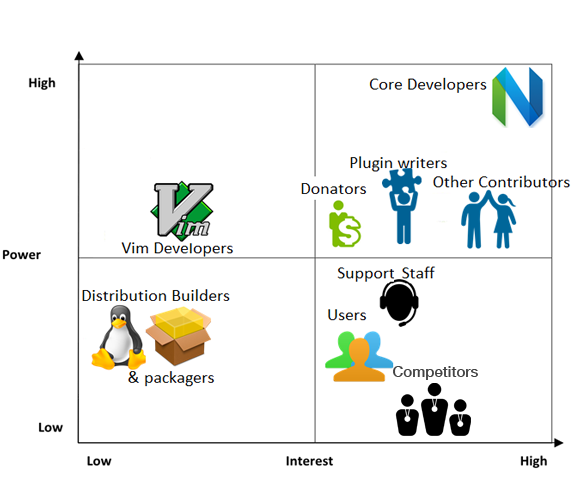
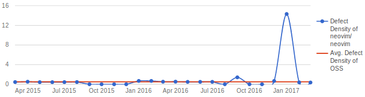
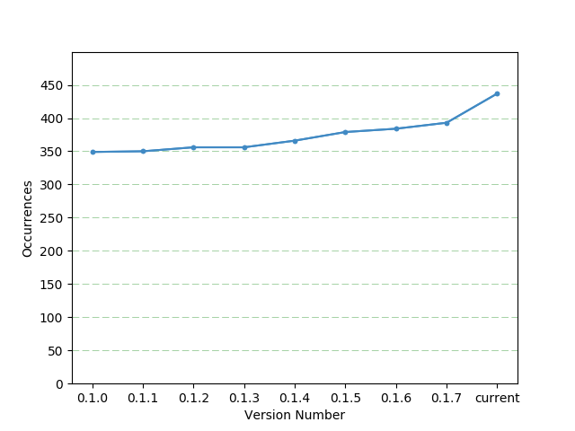

# Neovim

_In order of appearance: Ioannis Petros Samiotis, Thomas Millross, Sander Bosma and Jente Hidskes._

## Abstract

This chapter describes the software architecture of Neovim: an open source code
editor based on Vim. This analytical essay will provide interested
readers with objective and relevant insights into the challenges
and architectural decisions of the Neovim development effort.
Neovim’s software architecture is assessed within the Rozanski
and Woods [[1](#rw)] framework. The system _stakeholders_ are detailed and
categorised. Then the context and development _viewpoints_ are described,
followed by an analysis from the _perspectives_ of variability and evolution.
Finally the technical debt of the system is assessed and quantified.

## Table of Contents

1. [Introduction](#introduction)
2. [Stakeholder Analysis](#stakeholder-analysis)
    1. [Users](#users)
    2. [Developers](#developers)
    3. [Other Stakeholders](#other-stakeholders)
    4. [Stakeholder Management](#stakeholder-management)
3. [Context Viewpoint](#context-viewpoint)
    1. [System Scope and Responsibilities](#system-scope-and-responsibilities)
    2. [Context Model](#context-model)
4. [Development Viewpoint](#development-viewpoint)
    1. [Codeline Models](#codeline-models)
    2. [Module Structure Model](#module-structure-model)
5. [Variability Perspective](#variability-perspective)
6. [Evolutionary Perspective](#evolutionary-perspective)
    1. [Evaluation of the Initial Project Goals](#evaluation-of-the-initial-project-goals)
7. [Technical Debt](#technical-debt)
    1. [Coverity Scan Static Analysis](#coverity-scan-static-analysis)
    2. [Cyclomatic Complexity](#cyclomatic-complexity)
    3. ["ToDo" Style Placeholders](#todo-style-placeholders)
    4. [Coverage and Testing Debt](#coverage-and-testing-debt)
8. [Conclusion](#conclusion)
9. [References](#references)

## Introduction

Neovim is an extensible code editor, written mainly in C. The project is
a fork of the famous code editor Vim. It is a modal editor, which means
the keypresses are interpreted differently depending on the current mode. The
[main modes](https://en.wikibooks.org/wiki/Learning_the_vi_Editor/Vim/Modes) are
_normal_, _insert_ and _visual_ mode. The keyboard shortcuts and commands allow
users to edit and navigate through files faster than is possible with regular
editors.

Early on the project established its goals of making Vim development more open
to the community, refactoring the Vim codebase and removing misfeatures. The
[vision page](https://neovim.io/charter/) mentions that Neovim is intended _"for
users who want the good parts of Vim, and more"_.  The community is active and
welcoming to new users and contributors alike.

This chapter presents an analysis of Neovim's software architecture based on the
book Software Systems Architecture by Rozanski and Woods [[1](#rw)]. We begin by
considering the groups and individuals influencing the project through a
stakeholder analysis.  We then present a context viewpoint, which defines the
relationships between Neovim and its environment. An in-depth study of Neovim's
codebase is presented in the development viewpoint section. Next, two
perspectives are explored: the variability and evolutionary perspectives.
Finally, we discuss the technical debt in Neovim's codebase, before concluding.

## Stakeholder Analysis

We present here a stakeholder analysis of the Neovim project. To compile
information, we began by documenting our existing knowledge of the stakeholders
involved and supplemented this knowledge with data sources
including: GitHub issues and pull requests,
[Gitter](https://gitter.im/neovim/neovim) conversations and the online
[documentation](https://github.com/neovim/neovim/wiki). For categorisation, we
took the Rozanski and Woods stakeholder list [[1](#rw)] as a basis, then removed
the categories irrelevant to Neovim. Finally we estimated the power and interest
of each group through structured discussion within our team.

### Users

Neovim **users** are ultimately the
reason the project exists.  Professional data scientists,
[sysadmins](https://en.wikipedia.org/wiki/System_administrator) and
[devops](https://en.wikipedia.org/wiki/DevOps) experts are [known
to](https://stackoverflow.com/insights/survey/2017#technology-most-popular-developer-environments-by-occupation)
[favour Vim](http://stackoverflow.com/insights/survey/2015#tech-editor). Users
could be divided based on their skill-level into _beginners_ and _advanced_ users.
Beginners may struggle initially with Neovim's minimalist interface, and
frequently consult the help and documentation, striving to improve.  The
advanced group have traversed the steep learning curve, developed muscle-memory
in their fingers, and memorised countless keyboard shortcuts.  Design decisions
for Neovim primarily emphasise the maximisation of editing efficiency for the
advanced group. Beginners are encouraged to improve their skills, for instance
using [vim-tutor-mode](https://github.com/fmoralesc/vim-tutor-mode).

### Developers

Many people have contributed to the Neovim codebase as **developers**. The
[~14](https://neovim.io/news/2016/11/) core developers include
[@justinmk](https://github.com/justinmk) the [Benevolent Dictator For a Limited
time](https://neovim.io/news/2016/11/), the lead developer
[@ZyX-I](https://github.com/ZyX) and [@jamessan](https://github.com/jamessan),
with [@tarruda](https://github.com/tarruda) recently becoming much less active.
These core developers also fulfil additional roles, such as **maintainers** and
**assessors**, keeping the project running whilst ensuring contributions adhere
to coding standards and follow the [style
guide](https://neovim.io/develop/style-guide.xml). There is not a dedicated team
of **testers**; new tests are added by developers whenever significant changes
are submitted.

Developers can further be divided into subcategories, in recognition of their
differing concerns and motivations. **Related project & plugin
developers** are essential for the growth of a healthy software ecosystem in the
Neovim environment. Communication and overlap between these development teams
helps to ensure that requirements are met and clean interfaces
are maintained without regression. **Vim developers**
may have submitted code still in use by Neovim, or recent bug-fixes that
have been ported. Neovim developers also actively assist Vim developers by
porting relevant patches to their codebase.

### Other Stakeholders

There are no _official_ **support staff** or dedicated **communicators**.
Volunteers provide support through a
[wiki](https://github.com/neovim/neovim/wiki/) which contains the documentation,
and a [user manual](https://neovim.io/doc/) which can be accessed through the
Neovim `:help` command. Individual support is also offered through
[StackExchange](https://vi.stackexchange.com/), [GitHub
Issues](https://github.com/neovim/neovim/issues), [Twitter](https://twitter.com/neovim),
[Gitter](https://gitter.im/neovim/neovim), IRC, [Google
Groups](https://groups.google.com/forum/#!forum/neovim) and
[Reddit](https://www.reddit.com/r/neovim/). Everyone who replies on these
channels could be considered as support staff.

**Suppliers** are the stakeholders that develop distributions and packages.
They take decisions on whether to distribute Neovim for their platforms and
hence can potentially influence the future popularity of the software.  Neovim
accepts donations through
[Bountysource](https://salt.bountysource.com/teams/neovim), so the donators
could be regarded as **acquirers**. However, they have no formal decision making
power.  Finally, the **competitors**
are an important stakeholder, described in the [context
viewpoint](#context-viewpoint) section.

### Stakeholder Management

To visualise the relative power and interest of the stakeholders, a
power-interest grid is provided in [Figure 1](#power-interest-grid). The
power axis indicates influence in the decision making process and project
direction. The interest axis represents the ongoing attention paid by a
stakeholder to the project development. Stakeholders in the upper right corner
should be closely managed, while those in the lower left require minimal
engagement. The stakeholders in the upper left corner should be kept satisfied
and those in the lower right should be kept informed about developments,
to maintain their interest.

*Figure 1: the power-interest grid*

## Context Viewpoint

The context viewpoint describes
_"the relationships, dependencies, and interactions between the system and its
environment"_ [[1](#rw)]. We highlight Neovim's project scope, then
use a _context model_ to
elaborate on the relationships with external entities.

### System Scope and Responsibilities

Neovim is a code editor for those users who prefer to have a simple but powerful
environment. Its responsibilities include opening text files and allowing
the user to edit these files. Neovim assists the user in
navigating these files and understanding the code contained within them by
offering syntax highlighting and other features. An embedded scripting language
called [Vimscript](http://learnvimscriptthehardway.stevelosh.com/) is included,
to enable extension and configuration by the user (as described in the
[variability perspective](#variability-perspective)).

Note that Neovim is [*not*](https://neovim.io/charter/) striving to be an integrated development environment
(IDE). While it offers the user a vast array of extensibility that could provide
IDE-like features, the intention is to remain a simple but powerful code editor.

### Context Model

Neovim's context model is illustrated in [Figure 2](#context-model). This model
depicts Neovim in the centre, surrounded by the external entities it interacts with.
These entities are described below, beginning at the
competitors and rotating clockwise.

*Figure 2: the context model of Neovim*

#### Competitors

Neovim has
competition from mainstream code editors such as **Atom**, **Sublime
Text** and **Notepad++**. Vim and GNU Emacs are the main competitors from the
same niche and require a small elaboration:

* **Vim** and Neovim are of course quite
  similar. Neovim introduced new features, some of which are now also found in
  Vim. Many differences are also found _under
  the hood_ and in the way the communities operate.
* **GNU Emacs** is an extensible, customisable text editor -- and much more.
  At its core, Emacs is a Lisp interpreter that just so happens to support text
  editing. Plugins can change almost everything; there is an entire ecosystem
  providing functionality such as calendars, project
  planners, PDF readers and even internet browsers.

#### Community

Neovim has an extensive community, known for being open and friendly to
newcomers. See the [stakeholder analysis](#stakeholder-analysis) for an
overview.

#### Operating Systems

Neovim runs on a variety of operating systems: macOS, Linux, FreeBSD,
OpenBSD and even Android. Neovim chose not to inherit Vim's
support for obsolete operating systems. Windows support is the focus
of the [current](https://github.com/neovim/neovim/milestone/10) release target.

#### Plugins

Plugins can extend the functionality of the editor
or overwrite its default behaviour; detail is available in
the [variability perspective](#variability-perspective).

#### Software Dependencies

Neovim is built on top of existing C libraries that handle low level
operations. These dependencies are enumerated in [Table 1](#tbl-dependencies).

Library                                                  | Description
-------------------------------------------------------- | -----------
[jemalloc](https://jemalloc.github.io)                   | an efficient replacement for the system provided `malloc`, used to allocate memory
[gettext](https://www.gnu.org/software/gettext/)         | used to localise the interface to the user's locale
[unibilium](https://github.com/mauke/unibilium)          | Neovim's built-in UI is a terminal user interface. Unibilium provides information about the supported features of the terminal emulator within which it runs
[libtermkey](http://www.leonerd.org.uk/code/libtermkey/) | to decode keypresses, enabling the functionality described above
[libvterm](http://www.leonerd.org.uk/code/libvterm/)     | provides the built-in terminal emulator
[libuv](https://github.com/libuv/libuv)                  | abstracts the operating system layer
[MessagePack](http://msgpack.org)                        | exposes Neovim's API, allowing clients to be written in any programming language
[LuaJIT](http://luajit.org/)                             | provides support for Lua scripting

_Table 1: dependencies of Neovim_

#### Static Analysis

[Static analysis](https://en.wikipedia.org/wiki/Static_program_analysis) tools help
developers to identify bugs, style deviations and
[technical debt](#technical-debt). Three
different static analysis tools are run on the Neovim codebase.
[Coverity](https://scan.coverity.com/projects/2227) is the most advanced static
analysis tool used by Neovim and integrates with both GitHub and Travis.  [Clang
Static Analyzer](https://neovim.io/doc/reports/clang/) is the static analysis
tool offered by the Clang compiler. Finally,
[clint](https://github.com/neovim/neovim/blob/88bc9f8e92903700494486fe383c6b94eef80f3f/src/clint.py)
is used to check for coding style violations and suspicious patterns.

#### Related Projects

Neovim's architecture (as described in the [development viewpoint](#development-viewpoint))
enables the creation of graphical UIs and other
clients that cannot be implemented in Vim.
For instance, [VimR](http://vimr.org/) replaces Neovim's built-in terminal UI with a graphical UI
native to macOS. [NyaoVim](https://github.com/rhysd/NyaoVim) also provides a
modern graphical UI for Neovim using Electron, but registers itself as a client
over MessagePack instead of replacing the built-in terminal UI.
[SolidOak](https://sekao.net/solidoak/) is an aspiring IDE for Rust that embeds
Neovim as its editor component. Finally, [Neovim-Qt](https://github.com/equalsraf/neovim-qt)
is a client graphical UI like
Nyaovim, using Qt5 instead of Electron. Neovim-Qt will be the default graphical
UI on Windows.

#### Source Code Control and Issue Management

Neovim's entire development infrastructure is hosted on
[GitHub](https://github.com/neovim).
[Coveralls](https://coveralls.io/github/neovim/neovim) is used to keep track of
code coverage. [SourceGraph](https://sourcegraph.com/github.com/neovim/neovim)
is offered as an alternative way of browsing the code online and
[Waffle](https://waffle.io/neovim/neovim) is offered as an alternative project
management tool.

#### Build and Continuous Integration

Neovim replaces the [autotools](https://en.wikipedia.org/wiki/GNU_Build_System)
build system with one implemented in [CMake](https://cmake.org/), which is
arguably easier to work with, particularly on Windows. Neovim uses
[AppVeyor](https://ci.appveyor.com/project/neovim/neovim/branch/master) for
Continuous Integration builds on Windows and
[TravisCI](https://travis-ci.org/neovim/neovim) for macOS and Linux
builds.

#### History

Neovim comes from a long line of editors. **ed** was the line editor provided by
the Unix operating system. It inspired the creation of **ex**, a line editor
for Unix systems that took advantage of video terminals.  **vi** was born as the
visual mode for ex. Over the years, vi became the standard Unix text editor. Vim
(Vi IMproved) is a clone of vi providing more features, such as syntax
highlighting and an extended range of ex commands. Finally, Neovim is a fork of
Vim.

## Development Viewpoint

A development
viewpoint describes _"the architecture that supports the software development
process"_ [[1](#rw)]. We describe a number of _codeline models_, then
present the _module structure model_.

### Codeline Models

This section is mainly structured after the four activities from the "Codeline
Models" chapter in Rozanski & Woods [[1](#rw)]. Additionally, it contains a
section relating to the standardisation of testing.

#### Folder Structure

A description of the top-level folders of the Neovim repository is shown in [Table 2](#tbl-folders) below.

Folder      | Description
----------- | -----------
build       | generated folder containing all object files and binaries
cmake       | CMake recipes to generate the Makefiles required during the building process
config      | CMake and versioning configuration
contrib     | useful files for contributors: autocompletion configurations, Doxygen settings, etc.
man         | source for displaying manual pages (through the `man nvim` command)
runtime     | all run-time data: syntax highlighting, indentation scripts, icons, in-program documentation, plugins, etc.
scripts     | scripts for building, releasing, etc.
src/nvim    | C source code including some related files organised into subdirectories and some unorganised loose files. See the [module structure model](#module-structure-model) for more information
test        | testing related files; functional tests are placed in test/functional, unit tests are placed in test/unit. The structure of test/unit is identical to src/nvim
third-party | CMake recipes to build third party dependencies
unicode     | files containing Unicode definitions

_Table 2: description of the top-level folders_

#### Build Approach

Neovim uses a combination of GNU Make and CMake to automate the building process. Make
ensures that source code is compiled in the correct order; it uses a Makefile
which lists dependencies between targets and specifies the steps required to
build a target. Since it is difficult to write Makefiles that are independent of
the system configuration (e.g. installed compiler and libraries), CMake is used
to dynamically create Makefiles specific to the system on which it runs.
Once a user has cloned the Neovim repository from GitHub, they simply
execute the `make` command. This will automatically call both CMake and Make as
required.

#### Release Process

Each time a commit is made to the master branch, Travis-CI automatically
builds the [Doxygen](https://neovim.io/doc/dev) and [user](https://neovim.io/doc/user)
documentation. It also generates the
[Clang Static Analyzer](https://neovim.io/doc/reports/clang),
[translation](https://neovim.io/doc/reports/translations),
[clint](https://github.com/neovim/doc/blob/gh-pages/reports/clint/index.html),
[vim-patch](https://neovim.io/doc/reports/vimpatch) and
[Coverity](https://scan.coverity.com/projects/2227) reports.
Finally, a [nightly release](https://github.com/neovim/neovim/releases/nightly)
is made which contains the Linux and MacOS binaries. Windows binaries are
[generated](https://github.com/neovim/neovim/wiki/Installing-Neovim#windows)
by [AppVeyor](https://www.appveyor.com/). The nightly releases are
mostly _for testing_. At major milestones, an official release is
tagged which contains only the source code. Users can either
compile Neovim themselves or wait until distribution maintainers update
their packages to provide the new version.

#### Configuration Management

Neovim uses the standard GitHub pull-based development model for collaboration.
The project is split into multiple repositories. All files mentioned in the
subsections above are located inside the
[Neovim](https://github.com/neovim/neovim) repository. Related projects, such
as plugin clients, continuous integration support and forks of dependencies are
in GitHub repositories under the same [organisation](https://github.com/neovim).

#### Standardisation of Testing

Neovim categorises test into unit and functional tests. Unit tests are compiled
into a shared library and executed through the
LuaJIT [FFI library](http://luajit.org/ext_ffi.html), which enables Lua code
to use the C functions and data structures of the Neovim code. Functional tests,
on the other hand, do not interface with the C code directly, but instead use
the API via remote procedure calls (RPCs). While the unit tests usually only check
the return values of functions, the functional tests can also check for example whether the
resulting screen displays the correct state. These tests can be [run](https://github.com/neovim/neovim/wiki/Building-Neovim#running-tests)
locally. They are also automatically executed when changes are pushed to GitHub,
together with [clint](https://github.com/neovim/neovim/blob/88bc9f8e92903700494486fe383c6b94eef80f3f/src/clint.py)
to detect coding style violations and
[Coveralls](https://coveralls.io/github/neovim/neovim) for test coverage
(as in [coverage and testing debt](#coverage-and-testing-debt)).

### Module Structure Model

A module structure model shows the organisation of the source files into modules
that contain related code [[1](#rw)]. Such a structure provides an overview of
the source code which guides developers to understand and navigate the codebase.

The module structure model for Neovim in [Figure 3](#module-structure-model)
displays a simplified conceptual overview for two reasons:
 1. the codebase is complex and exhibits a structure which is difficult to
    discern due to inheriting 25 years worth of updates and changes without a
    significant refactoring (see [technical debt](#technical-debt)).  Neovim was
    created to address this issue, and this work is ongoing.
 2. C is a low-level language, but low-level analysis does not provide the ideal
    overview for documenting the module organisation.

Within the model, each _box_ represents a module containing the names of some of
the relevant source files of that module. The arrows show inter-module
relationships, and the relative height differences graphically represent the
layering.

*Figure 3: the module structure model*

We begin with the *Modes* module, which has a
thick border.  Neovim models a [pushdown
automaton](https://en.wikipedia.org/wiki/Pushdown_automaton) that changes state
on receipt of input from the operating system. A state in this case refers to a
mode (such as [insert mode](https://github.com/neovim/neovim/blob/master/runtime/doc/insert.txt))
or [normal mode](https://github.com/neovim/neovim/blob/master/runtime/doc/intro.txt#L514)) that
implements an interface. The modes guide the pushdown automaton's state changes
and Neovim's behaviour, and hence the modes drive all other modules.

A mode operates on a buffer (Vim jargon for a loaded file) to edit its contents.
The *Files and Buffers* module contains the code required to load files into
memory, for which it needs to handle I/O, character encoding
and multi-byte characters. Because I/O is inherently operating system specific,
this module interacts with the *Operating System Interface*
module. This module provides abstractions over
filesystem access, signals, input handling and other low-level operations that
vary across operating systems.

When a buffer is changed from any mode, the mode notifies the *Screen* module.
This module is responsible for maintaining an internal representation of what
should be visible on the UI. For each running Neovim instance, there is one such
screen that displays one or more windows (a view into a buffer) in tab pages (a
layout of windows). An architectural decision taken by Neovim is that all code
related to GUIs is removed from the core. Instead, there is a *User Interface*
module that reflects the Screen module. Synchronisation between the User
Interface and the Screen module is handled through the *Events* module: the
Screen module publishes events that in turn drive the User Interface module.

The *API* module exposes the User Interface and other modules over the
*MessagePack RPC* module. GUIs or other clients can subscribe to
this RPC channel to for example interact with the running Neovim
instance, or control it over a (local) network connection.

Finally, the *Local Clients* module contains clients that bypass the RPC
interface and directly communicate with the User Interface module. The built-in
Terminal UI (TUI) is an example of such a local client.

## Variability Perspective

This section highlights three types of software variability: compile-time,
load-time and run-time variability [[3](#apel-batory)]. The choice of which type
of variability to utilise is a design decision which balances disk-space
requirements, run-time performance and usability.  Neovim uses all three types
to some degree.

### Compile-time

Compile-time options influence the binary created by the build process; the
chosen options are compiled into the binary, the others removed. This results in
a reduction in binary size, but also an increase in performance as these options
now do not have to be evaluated at run-time. A classic example of compile-time
variability is enabling or disabling certain feature sets, an option heavily
used by Vim. Neovim has removed these feature sets and instead compiles most
features unconditionally. The remaining compile-time variability options include
inherently compile-time dependent OS-specific code that cannot be abstracted and
the built-in TUI that can be disabled.

### Settings

Neovim is highly customisable, with over 300 [configurable
settings](https://neovim.io/doc/user/quickref.html#option-list) such as syntax
highlighting, colour schemes, indentation width, and default case sensitivity of
searches.  Key bindings can also be personalised for the user. These settings
can all be configured at run-time or added to the initialisation file for
load-time variability. As this file is interpreted as Vimscript, it can also be
used for implementation of plugins.

### Plugins

Neovim plugins can be broadly divided into two categories: _remote plugins_ and
_Vimscript plugins_.  [VimAwesome](http://vimawesome.com/) lists over 15000
Vimscript plugins, with the majority designed originally for Vim. Most [are
compatible](https://github.com/neovim/neovim/wiki/FAQ#are-plugin-authors-encouraged-to-port-their-plugins-from-vimscript-to-lua-do-you-plan-on-supporting-vimscript-indefinitely-1152)
with Neovim. After Neovim implemented asynchronicity, Vim developed an 
incompatible alternative implementation. Asynchronous plugins are thus an 
exception: they are not compatible unless support is manually added.
However, most plugins are purely synchronous and can thus be
used by both systems.

_Remote plugins_ can communicate with the Neovim API via
MessagePack. To simplify remote plugin
development, Neovim-specific _API clients_ are currently available in [17
languages](https://github.com/neovim/neovim/wiki/Related-projects#api-clients), although in
theory any language implementing MessagePack (of which there
[are](http://msgpack.org/#languages) over 50) can be used to develop new remote
plugins.  Since remote plugins are introduced by Neovim, these plugins do not
work on Vim.

Inter-plugin dependence is uncommon, although some such as
[vim-airline](https://github.com/vim-airline/vim-airline) are designed to
integrate with others.  Plugin conflicts are also rare, with the possible
exception of overlapping key bindings.

### External User Interface

Neovim can also be embedded into other programs through the RPC API.  The
external GUI starts Neovim in [headless
mode](https://www.reddit.com/r/neovim/comments/4kd2et/overview_of_working_with_headless_nvim/)
using a command line parameter (another form of load-time variability). Instead
of drawing the screen, Neovim sends the screen state over the RPC API to the
external UI.  Conversely, key strokes are received by the external GUI and sent
across the API to Neovim. The RPC layer can also by bypassed directly by
replacing the built-in TUI with another UI (see VimR in [related
projects](#related-projects)).

## Evolutionary Perspective

The evolutionary perspective takes a view on the ability of the system's
architecture to be flexible [[1](#rw)]. We take a slightly different approach and
consider the changes required of Vim's architecture from the perspective of
[@tarruda](https://github.com/tarruda) when he decided to fork Vim. We use the
following process, adapted from Rozanski & Woods [[1](#rw)]: characterise the
evolution needs, assess the current ease of evolution and rework the
architecture. We conclude by evaluating the extent to which
[@tarruda](https://github.com/tarruda)'s architectural goals have been met.

After two decades of evolution, Vim had accumulated a complex codebase that few
people understood. Bram Molenaar was possibly the only person capable of
maintaining Vim's codebase, leaving him reluctant to merge new features due to
the risk of regression.  Vim was thus unable to keep up with the improvement and
evolution demands of its users.

[@tarruda](https://github.com/tarruda) realised this and decided it was time to
rework Vim's architecture to increase its flexibility and reduce the time taken
to implement new features. He
[characterised](https://www.bountysource.com/teams/neovim/fundraiser) Vim's
evolutionary requirements using his prior experience contributing to Vim, as in
[Table 3](#tbl-changes).

Change | Type | Magnitude | Timescale
------ | ---- | --------- | ---------
Simplify maintenance to support new features and make it easier to provide bug fixes | Functional | Large-scale, high risk | Not immediately required, rather a long-term goal
Enable the implementation of modern user interfaces separate from the core of the editor | Functional, environment | Large-scale, high risk | Required sooner rather than later
Increase extensibility (see the [variability perspective](#variability-perspective)) | Functional, environment | Large-scale, high risk | Required almost immediately

_Table 3: Neovim's change requirements when forked from Vim_

For each change, [@tarruda](https://github.com/tarruda) specified a plan to help
in estimating the ease of evolution:

1. To simplify maintenance, Neovim would migrate to a CMake-based build system,
   remove legacy support and compile-time features and remove platform-specific
   code in favour of libuv. This is a difficult and high-risk requirement that
   would change the codebase as a whole. Luckily, much of it could be automated
   using existing tools.
2. To enable modern user interfaces and increase extensibility, Neovim would
   implement a job control mechanism over MessagePack. This is again a difficult
   requirement that would require substantial refactoring of the codebase.
   However, there was already prior work and experience from attempting to bring
   asynchronous plugins to Vim.

Since then, Neovim's developers have refactored Vim's architecture in a
step-wise fashion, limiting changes to distinct sub-systems.  They strived to
encapsulate functionality within well-defined modules (see the [module structure
model](#module-structure-model)) with separate concerns. Where possible, these
modules were abstracted behind interfaces. A focus on unit and functional tests
within a continuous integration framework helped towards ensuring the changes
were reliable.

### Evaluation of the Initial Project Goals

Neovim is now three years old; how have these initial goals been met? In
November 2016, Neovim developers [stated](https://neovim.io/news/2016/11/) that
at least 20,000 new lines of C code had been written, with 2200 new tests in
addition to Vim's own test suite. By that time, 273 contributors had committed
more changes than Vim had received in twelve years. For a complete and
up-to-date overview of differences between Vim and Neovim, see the
[vim-differences](https://github.com/neovim/neovim/blob/master/runtime/doc/vim_diff.txt)
manual page.

The asynchronous plugins and built-in terminal emulator are prime examples of
new features that have been implemented. All the work on the foundation is just
now starting to bear its fruit with the appearance of many external GUI clients
and several clients making use of the asynchronicity to implement features
previously impossible in Vim. As new features have been implemented without the
addition of a significant support burden, it is clear that the changes have
[led](https://neovim.io/news/2016/11/) to simplified maintenance requirements.
All of this is not without technical debt, however, as the following section
will show.

Additionally, Vim 8.0 was
[announced](https://groups.google.com/d/msg/vim_dev/CmiGxtJ7fn4/DzdTuTtIAQAJ) in
December 2016 as the first release in ten years, sporting many of the features
initially found only in Neovim. This suggests that the new competition was the
inspiration and motivation for this vital renewal in development effort.

## Technical Debt

This section explores technical debt in the Neovim codebase. Before entering
into the details, let us first consider the perspective that the Neovim project
exists partly as an answer to the technical debt accumulated by the Vim project.
[This blog](https://geoff.greer.fm/2015/01/15/why-neovim-is-better-than-vim/)
describes examples of technical debt found in Vim's codebase, before
highlighting Neovim as the solution.

It is clear that Neovim developers understand Neovim within this context.  The
lead maintainer [@justinmk](https://github.com/justinmk) demonstrates his
familiarity with the technical debt metaphor on numerous occasions
([1](https://github.com/neovim/neovim/pull/2762),
[2](https://github.com/neovim/neovim/issues/329),
[3](https://github.com/neovim/neovim/pull/394),
[4](https://github.com/neovim/neovim/pull/5243)). Furthermore, on the
[progress](https://github.com/neovim/neovim/wiki/Progress) page in the Wiki a
lot of items are listed that are directly or indirectly related to paying
technical debt. Finally, during a period of limited new features, in response to
the question of "[is Neovim in maintenance
mode?](https://www.reddit.com/r/neovim/comments/44r36y/is_neovim_in_maintenance_mode/)",
he responds "Yes. We're paying down technical debt".

### Coverity Scan Static Analysis

[Coverity Scan](https://scan.coverity.com/) is an advanced static analysis tool
that helps developers find and fix defects. It is executed periodically to scan
Neovim's source code. At the time of
writing, there are 89 outstanding issues out of a total of 458 found since the
project's inception. 40 of these are dismissed as false positives and 329 have
been fixed.  The last scan (March 5, 2017) concluded a defect density (defined
as the number of defects per 1,000 lines of code) of 0.33.

Some of the 89 outstanding issues were first detected in 2014. All open Coverity
issues can be categorised as technical debt, since all of these defects are
known but nobody has managed to fix them (or determined if they are false
positives).

In [Figure 4](#fig-defect-density) we present the defect density of Neovim over
a period of time as generated by Coverity. As can be seen, Neovim's complexity
fluctuates around the average defect density of open source software projects of
similar size (between 100,000 and 499,999 lines of code). The spike visible
around January 2017 is likely a misconfiguration or something going wrong on
Coverity; a defect density of 14 would mean there are total of 3500 defects,
which does not correlate to the amount of changes made in this period.

_Figure 4: Neovim's defect density over time, courtesy of Coverity Scan_

### Cyclomatic Complexity

A popular and well-studied [[3](#mccabe-complexity)] metric for measuring code
complexity is the [Cyclomatic
Complexity](https://en.wikipedia.org/wiki/Cyclomatic_complexity) metric (CC).
This quantifies the number of independent paths through the source code of a
particular function. The explanatory power of CC is frequently challenged
[[4](#shepperd), [5](#graylin)]. However this discussion is beyond the scope of
this essay, and we will assume the metric has scientific validity and
informational value with regards to _technical debt_ for the remainder of this
section: a high CC is an indicator for technical debt.

Coverity marks all functions with a CC of greater than 15 as being too complex.
The Coverity scan of March 5 2017 marked 728 functions as being too complex, out
of 5128. The average CC of all the functions is 10, while the average of the
functions marked too complex is 47. The highest CC found in Neovim is 728. While
the threshold of 15 is debatable [[6](#watson-mccabe)], it is clear that some of
Neovim's functions are way too complex.

### "ToDo" Style Placeholders
A complementary approach to measuring technical debt is counting the occurrences
of "TODO", "FIXME", "XXX" et cetera within the codebase. This approach relies
upon the commenting habits and conventions of the developers, and does
not provide a comprehensive understanding of the technical debt
of a project. However, because Neovim has had mostly the same group of
maintainers over its lifetime, we assume that this metric provides some
insight into the evolution of technical debt in Neovim.

The occurrences were counted by searching for the strings mentioned above, which
were chosen from looking through comments and searching for common "ToDo" style
variants. The results were inspected and the following files were excluded to
remove many false positives: `build/*`, `runtime/syntax/*`, `*.txt` and all
binary files. It is uncertain whether all categories contribute equally to
technical debt, but quantifying their difference is not simple. Therefore,
[Figure 5](#fig-numtodos) only displays the sum of all these occurrences for
various versions of the project.

_Figure 5: Number of occurrences of "TODO", "FIXME" and "XXX" over several
versions of the project_

It can be seen that the technical debt gradually seems to increase as the
project evolves. A sharp increase can be observed in the current (unreleased)
version, although this number may decrease before an official release is made.

### Coverage and Testing Debt

Neovim uses [Coveralls](https://coveralls.io/github/neovim/neovim) to keep track
of the total test coverage. From Coveralls we can observe that coverage
increased gradually from 57% in 2014 at Neovim's inception to 76% in March 2017.
This can be explained by Neovim's policy of adding tests whenever significant
changes are made.

Instead of identifying testing debt in the actual tests' code, we can identify a
rather large case of possible testing debt on a higher level. "New style" tests
imported from Vim are written in Vimscript, whereas tests made for Neovim are
written in Lua. The gain from rewriting these tests is small in comparison to the
effort required and hence they are imported
[as-is](https://github.com/neovim/neovim/wiki/Unit-tests#checklist-for-migrating-legacy-tests).
The result is having tests written in two different programming languages, which
can be considered testing debt.

There are also "old style" legacy tests that are left over from the fork of Vim.
These are written using yet another framework and are actively encouraged to be
rewritten using Lua, as can be seen from the many pull requests named "Migrate
legacy test", e.g. [#2988](https://github.com/neovim/neovim/pull/2988). In this
sense, Neovim is working to pay off some of its testing debt.

## Conclusion

The goal of this chapter was to present Neovim and examine its software
architecture. We did so by documenting the stakeholders, giving the context and
development viewpoints, considering the variability and evolutionary
perspectives and discussing Neovim's technical debt.  We have shown that despite
the clean simplicity of the UI, there is significant complexity hiding under the
surface. Challenging architectural decisions have been taken in order to satisfy
a variety of stakeholders.

Through our research, we have discovered a conscientious community of
hardworking volunteers, dedicated to improving the text editor they love. The
Neovim codebase, like any other, is not perfect. There are still issues and
ongoing improvements. However, we may conclude that the Neovim team has improved
the Vim experience and brought Vim into the twenty-first century.

We would like to thank:
 * [@justinmk](https://github.com/justinmk) and the community for actively
 welcoming new contributors, assisting with our contributions
 and clarifying some technical details for the
   _module structure model_
 * the dedicated teaching assistants [@sandervdo](https://github.com/sandervdo)
   and [@valmai](https://github.com/ValMai) for their invaluable feedback and
   encouragement
 * our peers that reviewed the chapter prior to completion, helpfully
   highlighting areas of improvement
 * professors [@avandeursen](https://github.com/avandeursen) and
   [@azaidman](https://github.com/azaidman) for designing and managing such an
   original and valuable course and assignment.

## References

1. 
Rozanski, N., & Woods, E. (2011). Software systems architecture:
   working with stakeholders using viewpoints and perspectives. Addison-Wesley.
2. 
Apel, S., Batory, D., Kästner, C., & Saake, G. (2013).
   Feature-Oriented Software Product Lines: Concepts and Implementations. Springer.
3. 
McCabe, T. J. (1976). A complexity measure.
   IEEE Transactions on software Engineering, (4), 308-320.
4. 
Shepperd, M. (1988). A critique of cyclomatic complexity
   as a software metric. Software Engineering Journal, 3(2), 30-36.
5. 
Graylin, J., Hale, J. E., Smith, R. K., David, H., Kraft,
   N. A., & Charles, W. A. R. D. (2009). Cyclomatic complexity and lines of code:
   empirical evidence of a stable linear relationship. Journal of Software
   Engineering and Applications, 2(03), 137.
6. 
Watson, A. H., Wallace, D. R., & McCabe, T. J. (1996).
   Structured testing: A testing methodology using the cyclomatic complexity metric
   (Vol. 500, No. 235). US Department of Commerce, Technology Administration,
   National Institute of Standards and Technology.
