# Netty: Asynchronous Event-Driven Network Application Framework

 

[Ade Setyawan Sajim](https://github.com/asajim), [Muhammad Ridho Rosa](https://github.com/rosaridho), [Priadi Teguh Wibowo](https://github.com/priaditeguh), [Mohamat Ulin Nuha](https://github.com/mulinnuha)

*Delft University of Technology, 2017*

#### Abstract
Netty is an asynchronous event-driven network application framework in Java which has been used by many large companies, such as Facebook, Apple, and RedHat.
Netty Project has been actively developed since 2004. It is developed by a team of core developers and hundreds of external contributors.
This chapter illustrates the software architecture of Netty in multiple parts.
It starts with an explanation about Netty's stakeholder and followed by the description of four viewpoints (context view, development view, deployment view and functional view) in Netty. The chapter is then continued by identification of technical and testing debt and presentation of two perspectives (evolution perspective and performance-scalability perspective). Lastly, a conclusion from the process of analyzing Netty is presented.

## 
1 Introduction
When developing networking applications, developers usually dreams of having a high performance and high throughput in their software [[25](#ref25)]. Unfortunately, having control over networking code means lots of hard work on networking primitives. The problem gets even worse if security and scalability issues are also considered. A networking framework that tries to solve this issue is Netty.
[Netty](http://netty.io) is a non-blocking I/O (NIO) client-server framework which eases network programming and enables fast construction of network applications [[2](#ref2)].
Netty has been designed thoughtfully with the experiences gained from the implementation of multiple protocols to ensure ease of development, high performance, stability, and flexibility without a compromise [[2](#ref2)].

In the following section, the result of analysis on Netty is shown. The analysis was done using the guidelines from Nick Rozanski and Eoin Woods [[1](#ref1)]. The analysis starts by explaining about stakeholders and context view (section 2 and 3). To have a deeper insight on Netty's technical side, the analysis continued by describing on Netty's development view, deployment view, and functional view (section 4, 5, and 6). Some drawbacks inside Netty's system is presented on technical and testing debt sections (section 7 and 8). To understand Netty even further, two extra perspectives, evolution perspective, and performance-scalability perspective, are presented on section 9 and 10. Finally, section 11 concludes our analysis.

## 
2 Stakeholders

Stakeholders are an individual, team, organization, or classes who have interests and concerns about a project [[1](#ref1)]. List of Netty stakeholders can be seen on table [1](#tablestakeholders).

|      Type     |                      Representation                      |                                                                                                                                                                                                           Description                                                                                                                        |
|:-------------:|:-----------------------------------------------------|:------------------------------------------------------------------------------------------------------------------------------------------------------------------------------------------------------------------------------------------------------------------------------------------------------------------------------------------------------------------------------------------------------------------------------------------------------------------|
|   Acquirers   | Founder | Acquirers supervise the acquirement of the system or product. [Trustin Lee](https://github.com/trustin) is considered to be the acquirer for Netty Project as he is the Netty founder. |
|   Assessors   | Core developers | The core developers in Netty since one of their jobs is to ensure that all contributors sign Individual Contributor License Agreement or Corporate Contributor License Agreement |
| Communicators | Developers and the community | In Netty, the communicators are core developers, especially Trustin Lee, Scott Mitch and Norman Maurer. Besides developers, the community can also be communicators since they can contribute by spreading information about Netty through creating articles and Netty tutorial documentations. |
| Developers | Core developers and external contributors | One way to search for Netty's developers is to look at [contributor section in graphs tab on Netty's GitHub](https://github.com/netty/netty/graphs/contributors). Such section shows the commits and the contributions that could be used to detect the developers. To see Netty's core developers, a look up on [The Netty Project members page](https://github.com/orgs/netty/people). From the mentioned page, it can be found that there are fifteen core developers in Netty. Between those developers, top four contributors are [Trustin Lee](https://github.com/trustin), [Norman Maurer](https://github.com/normanmaurer), [Scott Mitchell](https://github.com/Scottmitch), and [Frederic Bregier](https://github.com/fredericBregier). |
| Maintainers | Core developers and external contributors | The maintainers are the core developers and external contributors because they control the development of the system since it starts working which can be seen from pull request and issue analysis. |
| Production engineers | Core developers | In Netty, production engineers are the core developers. Their role is to plan, deploy, and maintain the software environments in which Netty will be developed and examined.|
| Suppliers | Libraries which Netty depends on, Java, IntelliJ | An example of a supplier is libraries because they help how Netty constructed. Java is also a supplier since Netty is developed in Java. IntelliJ is also an instance of Netty's supplier because IntelliJ is an IDE on which Netty is currently developed and officially supported. |
| Support Staffs | Community, core developers, external contributors | They communicate and solve problems via Github, Stack Overflow, Twitter, IRC, RSS, or Google Group.  GitHub serves as a mean to discuss issues, primarily bugs and performs code reviews. Twitter is used as media social interaction. StackOverflow is a place of discussion between developers. RSS is used to publish updated information regarding the project frequently.|
| Testers | Core developers and external contributors | By looking up Netty's pull request section at its GitHub repository, testers of Netty project can be identified.|
| Users | Any organizations that use Netty and personal users | Beside personal users, companies that use Netty can be identified by looking at [related article](http://netty.io/wiki/related-articles.html) that featuring Netty. Some of the identified companies are Apple, Facebook, and RedHat. |

*
Table 1. Netty Stakeholders*

Besides several types of stakeholders above, there is a category that is not included in the table. This category is not found in  [[1](#ref1)] but related to the Netty project. Below is the extra stakeholder which is identified: 
- Funders/Donators 
Funders are persons or organizations who support Netty's development by providing monetary fund or giving donations. Netty project gets the donation from several companies such as Clinker, Spigot, Twitter, JetBrains, and Yourkit [[26](#ref26)].  

### 
2.1 Power/Interest Grid

After identifying several types of stakeholders, an analysis of the power/interest of each stakeholder can be performed.
The power/interest prioritization can be split into four categories:

- **High power, high interest**: These people need to be managed closely since they have the power to halt or change the development of the project or add new functionalities and have a high interest in the development of the project. In Netty, the founder who also acts as the acquirer and core developers are included in this category.
- **High power, low interest**: This category includes the people who required to be kept satisfied in the development of the project. They have high power in the development of the project but low interest in it. Suppliers are included in this group because any changes on their system will affect Netty development but any Netty development has a minor impact on their system.
- **Low power, high interest**: Any persons or organizations who need to be informed about the development of the project are included in this category, for example, any companies that use Netty, personal users, and funders/donators.
External contributors, who also act as communicators, also falls between this category and "high power, high interest" category since some of them contribute a lot to Netty which makes their influence significant in Netty development.
- **Low power, low interest**: This category consists of people or organizations who required to be monitored but with minimum effort. Competitors fall between this category and "low power, high interest" category because some of them care about how to be a better solution than Netty.

The following is the power/interest grid figure for the selected stakeholders

 
*
Figure 1. Netty's Power/Interest Grid*

## 
3 Context View

Context view explains the behavior of the system and illustrates the relations, dependencies, and interactions between the system and its environment [[1](#ref1)].

### 
3.1 System Scope

Netty as the asynchronous event-driven framework which supports several protocols has the advantage of the development of network application between server and clients. Netty purpose is to become an easy and quick NIO client server framework network application which support several protocols such as FTP, SMTP, HTTP, XML, and HTTP2.

#### Design Philosophy
Trustin Lee mentioned in his presentation that Netty design philosophy is to make a very simple network application and highly performing application which is also maintainable [[13](#ref13)].

### 
3.2 External Entities
External entities in Netty project can be divided into three parts, competitors, software platform & dependencies, and development & community.

#### Competitors
Competitors are the organizations who are engaged in competitions with each other. The competitors of Netty project are [Apache Mina](https://mina.apache.org) and [Grizzly](https://grizzly.java.net). Both of them are focusing on developing NIO client server framework network application.

#### Software Platform & Dependencies
In this section, the platform and the dependencies of Netty will be discussed.

##### Platform
Netty is compatible with any platform as long as it could run JDK because Netty is designed on top of Java platform.

##### Dependencies
Netty depends on many libraries. Between those projects, some of them are used in testing environment, i.e., Mockito, JUnit, and Java Hamcrest.

Beside libraries, Netty also depends on several entities, for example IntelliJ as its officially supported IDE. Netty also rely upon GitHub as its version control and issue tracker. To ease build activity, Netty also utilizes Maven as build automation tool and Travis CI as continuous integration tool. Another instance of Netty dependency is shown by its license usage since Netty is distributed under Apache License v2.0.

<!-- Another example of Netty dependencies is provided in the supplier part on stakeholder analysis. -->

### 
3.3 Context View Diagram

In this section, the context model of Netty is presented by combining every information provided in stakeholder section and previous subsections. The relationship between external entities and its interfaces or context view graph of Netty is visualized by figure [2](#figcontextview).

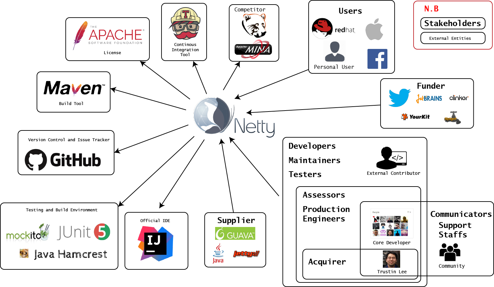
*
Figure 2. Context view graph of Netty*

## 
4 Development View

In this section, the architecture that addresses the aspects of system development process in Netty is explained. This section consists of three subsection; module structure models, common design models, and codeline models.   

### 
4.1 Module Structure Models

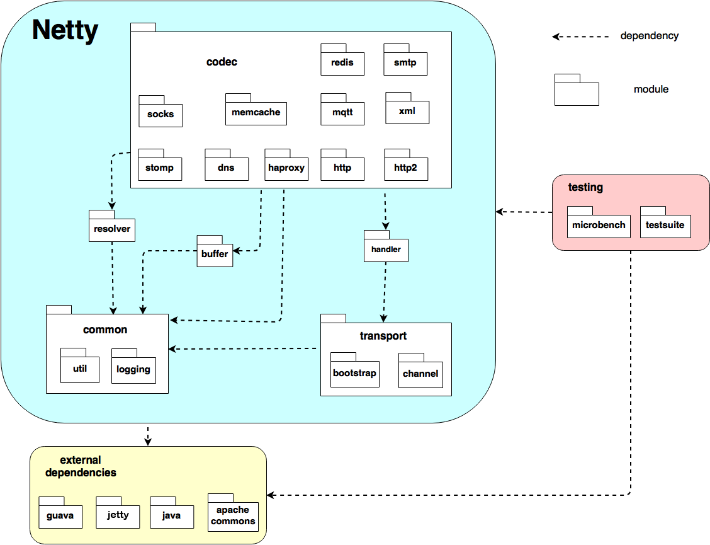 
*
Figure 3. Netty's Modules Structure Model*

As a framework, the source code of Netty could be organized as model structure, as shown on the figure above. In figure [3](#figmodstructure), the ecosystem of Netty is divided into three major parts: internal modules, testing system, and external dependencies.

#### Internal Modules
The followings are the explanation of each module inside internal modules with its description and dependencies:
- `netty-common` 
This module contains utility classes and logging facade. There are several sub-modules in Netty Common, such as `io.netty.util` and `io.netty.util.internal.logging`. This module does not have any dependencies to other modules in Netty. However, it has a  dependency to `java.util` package.
- `netty-resolver` 
This module deals with resolving an arbitrary string that represents the name of an endpoint into an address and resolving a domain name asynchronously, which supports the queries of an arbitrary DNS record type as well. This module has a dependency to sub-module `io.netty.util`.
- `netty-buffer` 
Module `netty-buffer` handles fundamental data structure to represent a low-level binary and text message. This module has a dependency to `io.netty.util` and `java.*` package.
- `netty-transport` 
This module deals with channel API and core transports, native socket transport for Linux using JNI, Rxtx transport, SCTP transport, and UDT transport. It has several sub-modules such as `io.netty.channel` and `io.netty.bootstrap`. This package has dependencies to `io.netty.util`, `io.netty.buffer`, and `io.netty.resolver`.
- `netty-handler` 
Module `netty-handler` relates to flow control handler, flush control, ipfilter (filter IP address), logging (Logs the I/O events for debugging purpose.), SSL (Secure Socket Layer), stream, timeout and traffic. It has a dependency to `io.netty.channel`.
- `netty-codec` 
Module `netty-codec` handles codec-related functionalities, for example, dealing with packet fragmentation and reassembly issue found in a stream-based transport.

#### Testing System
Testing system also contains multiple modules, which will be explained below:
- `netty-microbench` 
This module deals with performing a series of micro-benchmark tests. It is built on top of [OpenJDK JMH](http://openjdk.java.net/projects/code-tools/jmh/). This module has dependencies of all above modules.
- `netty-testsuite` 
This module contains packages for integration tests and common test suite. This module also has dependencies of all above modules.

#### External Dependencies
Besides having dependencies among its modules, Netty also has a dependency to external entities, such as Guava, JBoss, and Apache Commons.

### 4.2 Common Design Model
Any commonality across element implementations inside Netty is explained in this subsection.

#### Common Processing
By analysing Netty repository, it was acknowledged that there are many common processes that happen between its components inside its system. To deal with this issue, Netty has a module called `netty-common`. The practice of isolating common processing into separate code modules helps the development of Netty since the usage itself is spread across all modules, and the development of common processes can be done independently of other modules.

Below are some identified common processing elements inside this module:
1. Message logging 
There are three logging classes that Netty recommends to use, e.g., `Log4J2Logger`, `Log4JLogger`, and `Slf4JLogger`. In each class, there are five levels of logging; `trace`, `debug`, `info`, `warn`, and `error`. 
2. Resource leak detector 
Resource leak detector helps Netty deals with any resource leak. There are four levels on how resource leak detector works; `disabled`, `simple`, `advanced`, and `paranoid`. 
3. Net util 
This element holds a number of network-related constants which commonly used on many Netty's components. 
4. Constant pool 
Constant pool helps Netty's elements to store any constant which will be used during its execution.

#### Design Patterns

Another important thing discussed in this section is Netty's design patterns as they are solutions to general problems that software developers faced during software development [[20](#ref20)]. Presenting design pattern implemented in Netty will help contributors to understand how object-oriented structure resides in Netty source code. Below are listed several design patterns used by Netty:

1. Reactor Pattern: Reactor pattern is implemented by Netty as the framework is related to servers request handling with single-threaded event loop [[19](#ref19)].

2. Intercepting Filter Pattern: Package `ChannelPipeline` implements an advanced form of the Intercepting Filter pattern to give a user full control over how an event is handled and how the handlers in the pipeline interact with each other [[6](#ref6)].

### 4.3 Codeline Models

This section will explain how the directory of Netty project is managed, with a goal to ensure the build, test, and release processes could lead to a reliable Netty software.

#### Source Code Structure
The Netty project directories are organized based on their functionalities. Every folder mostly consists of Java classes and `pom.xml` file. Almost all the source code folders contain the main codes and the testing codes. There is a file called `package-info.java` which is used to explain the package where the file `package-info.java` stored. The module organization of Netty ensures every main code has a testing file located in the same directory. Figure [4](#figcodestructure) shows the source code organization of Netty 4.1 directory (Artifact ID).

 
*
Figure 4. Netty's Code Structure Organizations*

The Netty source code file always starts with copyright and license. After the declaration of Java package, usually, there is a short comment about the code.

#### Built and Testing Management

By looking at Netty repository, Netty's developers implement several ways of testing to verify that it works as it supposed to be. For example, after a developer finishes creating a class or modifies the source code, he/she will need to do a unit testing, usually by using added tools, such as JUnit and Mockito.

Regarding the build management, the developers of Netty also set up the build standards. For example, after the contributors have successfully set up the development environment, pushed a commit and submitted a pull request, a continuous integration platform called Travis CI is used. Continuous integration platform is vital to Netty for ensuring Netty's source code quality and to implement quick and easier error detection, since each introduced change is typically small. Another example is when developing Netty in a local repository, a developer can also utilize Maven to check whether his code is built successfully or not.

#### Release Management
In Netty Project, if the core developers intend to release a new version of Netty, they need to follow the standard Maven release procedure, which uses maven-release-plugin :

1. Stage the new release into the staging repository.
2. Verify the staged files are all good. If not, drop the staging repository and try again.
3. Close the staging repository so that no more modifications are made into the staging repository.
4. Release the staging repository so that the new release is synchronized into the Maven central repository.

#### Configuration Management

To configure Netty, a developer should follow the [Developer Guide](http://netty.io/wiki/developer-guide.html). First, a developer should use 64-bit operation system. Then, he/she should install the necessary build tools (e.g. Oracle JDK 8 or above, Apache Maven 3.1.1 or above, and Git). Last, a developer has to use Java programming language and also utilize IntelliJ IDEA since it is the officially supported IDE. A developer can also use other development environments as long as the contributor adheres to the Netty's coding style.

## 
5 Deployment View

Deployment Viewpoint describes the environment into which the system will be deployed and the dependencies of the system [[1](#ref1)]. Netty is supported by any operating system that can run Java 5+ (Netty 3.x) or Java 6+ (Netty 4.x).
Furthermore, Netty does not require any specific hardware requirement to deploy.

As for the third-party software dependencies, the base functionality of each sub-module of Netty only requires JDK 5+ (Netty 3.x) or JDK 6+ (Netty 4.x) to run. For the development of Netty, it requires JDK 7+. However, some sub-modules require additional dependencies, for example, doing Transport Security (TLS) with Netty would require either OpenSSL or JDK (Jetty ALPN/NPN).

The binary files of Netty can be downloaded in [Netty's Download Page](http://netty.io/downloads.html) as jar files. The jar files are available for all modules (`netty-all-x.x.x.Final.jar`) or for each sub-module (for example `netty-transport-x.x.x.Final.jar`). Netty does not differentiate the binary files for different operating systems or different instruction set architecture.

## 
6 Functional View
In this section, the functional view graph of Netty will be presented and the explanation of the elements will be discussed briefly. Figure [5](#figfuncview) displays the functional graph of Netty. Explanation on each component is available below the figure.

 
*Figure 5. Netty's Functional View Diagram*

### 6.1 Network Application
A network application is an application that is running on the different host.
<!-- For example, the Twitter and Online Game messaging are the network application that is running on several hosts and usually these hosts connected to a server.  -->
The communication between host needs to be handled by software. In this case, Netty plays a crucial role to ensure the communication effectiveness, security, and maintainability between that hosts.

### 6.2 Network framework
Netty as a network framework has a purpose to built and to ensure all the aspects go well for communication between clients and server. Netty was proposed as a unified API for various transport types, such as blocking and non-blocking socket, and designed based on flexible and extensible event model [[2](#ref2)].
Netty has interfaces with the application, the supported protocols, and the transport services.

### 6.3 Protocol Supports
Netty supports many protocols, such as UDT (User Datagram Protocol), SCTP (Stream Control Transmission Protocol), HTTP/HTTP2 (Hypertext Transfer Protocol).

### 6.4 Transport Services
Netty's transport services can be divided into three parts, datagram socket, transport tunnel, and virtual machine.

#### Datagram Socket
The datagram socket is a package that has responsibilities for sending and receiving datagram packets [[6](#ref6)].

#### Transport Tunnel
In Netty, HTTP tunneling is used as a component to connect a restrictive HTTP Proxy [[6](#ref6)]. HTTP Tunnel consists of two components, client-side and server-side. The client-side will act as a SOCKS proxy, while the server-side translate and forward the HTTP request.

#### Virtual Machine
Netty offers a functionality to replace Java Virtual Machine's  garbage collector. Instead of waiting for the garbage collector to work, Netty has the capability to flush the memory directly after reading or writing to a socket [[6](#ref6)].

## 
7 Technical Debt
Technical debt refers to any extra development work that arises when applying an easy to implement code over the best overall solution [[1](#ref1)].
In this section, an analysis of technical debt existence inside Netty repository is presented.

### 
7.1 Identifying Technical Debt
There are two methodologies chosen during technical debt analysis; static code analysis and manual code analysis.
Details on each methodology are explained further in the following subsections.

#### 
Static Code Analysis
The chosen static code analysis tool for identifying technical debt is SonarQube [[8](#ref8)]. SonarQube works by analyzing the folder that contains the source code and shows the overall technical debt data. The following figure displays the details of technical debt given by [SonarQube](https://garage.netty.io/sonarqube/). In figure [6](#figtechdebtsqube), Netty version 4.1  has technical debts amount of 65d (65 days). The parameter that is used in SonarQube, 'day', is based on SQALE (Software Quality Assesment based on Lifecycle Expectations) Methodology [[24](#ref24)].

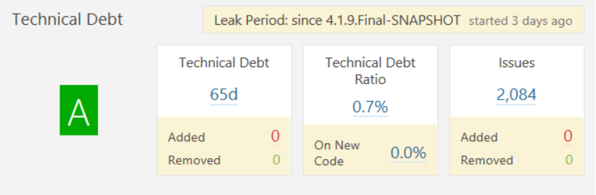 
*
Figure 6. Technical debt of Netty 4.1 generated using SonarQube*

The following figure shows the technical debt in size of circle radius in term of number lines of code (x-axis) and number of issues (y-axis).

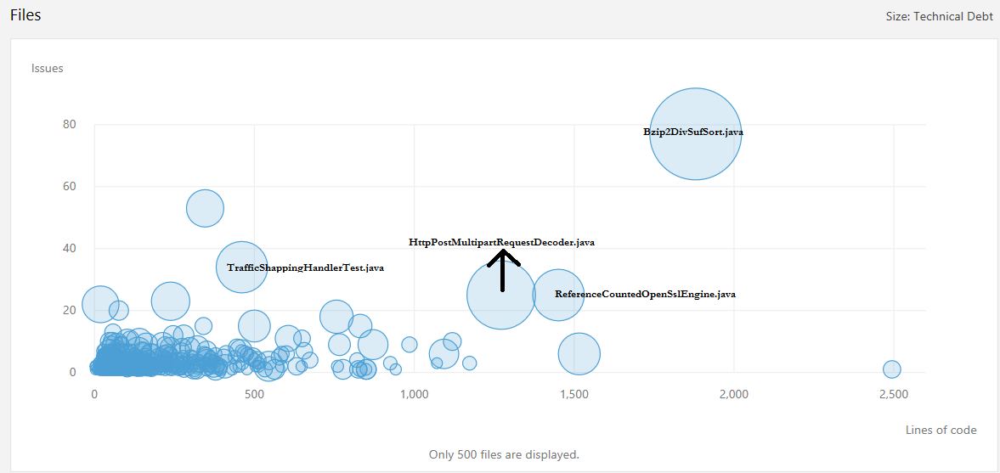 
*
Figure 7. Technical debt in terms of lines of code (x-axis) and issues (y-axis) of Netty 4.1 generated using SonarQube*

In Netty version 4.1 the biggest technical debt is located in [`Bzip2DivSufSort.java`](https://github.com/netty/netty/blob/4.1/codec/src/main/java/io/netty/handler/codec/compression/Bzip2DivSufSort.java).
 -The other files that have the potential problems are [`TrafficShapingHandlerTest.java`](https://github.com/netty/netty/blob/4.1/testsuite/src/main/java/io/netty/testsuite/transport/socket/TrafficShapingHandlerTest.java) and [`ReferenceCountedOpenSslEngine.java`](https://github.com/netty/netty/blob/4.1/handler/src/main/java/io/netty/handler/ssl/ReferenceCountedOpenSslEngine.java).

##### 
Code Smells
By utilizing static code analysis tool, Netty's code smells can also be detected.
According to [[11](#ref11)], there are twenty-one types of code smells. From those twenty-one types, five different smells were identified inside Netty repository.
A further explanation of those identified code smells is provided below.
###### Long Method
Class `Bzip2DivSufSort.java` is an example of a class inside Netty that has this characteristic.
This class has a large method, i.e., `ssMultiKeyIntroSort` method. The cyclomatic complexity of this method is 48 which is greater than 25 (the authorized complexity recommended).
Cyclomatic complexity itself is a quantitative measure of the number of linearly independent paths through a program's source code [[12](#ref12)].
###### Large Class
`Bzip2DivSufSort.java` is an example of a large class inside Netty since it contains 2116 lines of code. A large class is not recommended because it exaggerates its complexity, which can lead to a poor performance and difficult to understand and to maintain.
###### Long Parameter List
`ssMergeBackward` method is an example of a method that has long parameter list. This method requires seven parameters, i.e., `final int pa`, `int[] buf`, `final int bufoffset`, `final int first`, `final int middle`, `final int last`, and `final int dept`.
###### Switch Statements
In object-oriented programming, a situation where switch statements or type codes are needed should be handled by creating subclasses [[11](#ref11)]. Unfortunately, inside Netty source code, there are 678 matches of switch statements.
###### Duplicate Code
Based on the SonarQube analysis result, there are 14,425 lines of duplicated code. The file that has the most duplication code is `HttpPostMultipartRequestDecoder.java` that has 610 duplicated lines.

#### 
Manual Code Analysis
Besides static code analysis, another way to find out any technical debts inside a system is by doing manual code analysis.
This methodology requires a lot of time and energy, but if done correctly, it will present a better understanding on how such a system deals with its technical debt and the quality of its code. There are several manual code analysis that can be done in the code, one of which is SOLID principle analysis [[10](#ref10)]
One of the modules in Netty, `netty-common`, was analyzed. In the analysis, there are no violations of SOLID principles that can be found. Each class in `netty-common` has its own responsibility, the module is open to extension but closed to modification, and base classes can be substituted using their derived classes.

### 
Evolution of Technical Debt
SonarQube, a static code analysis tool mentioned in the previous subsection, was utilized again to see how the technical debts evolved in Netty.

###### Technical Debt Evolution Between Different Major Versions
For this analysis, two latest Netty major versions were analyzed, version 4.0 and version 4.1 [[19](#ref19)].
Figure [8](#figtechdebt4041) displays the details of technical debt given by SonarQube.
This figure shows that even though the Netty version is increased, the technical debt is also raised.
Therefore, a newer version doesn't always lead to a better technical debts management.

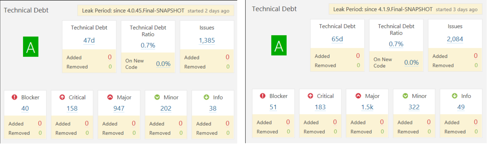 
*
Figure 8. Technical debt of Netty 4.0 and Netty 4.1 generated using SonarQube*

Figure [9](#figtechdebtlinecode40) and [10](#figtechdebtlinecode41) show the technical debt in size of circle radius in term of number lines of code (x-axis) and number of issues (y-axis). At this point, it can be seen from the mentioned figures that the biggest technical debt is changing.
In Netty version 4.0 the most significant technical debt is located in file `HttpPostMultipartRequestDecoder.java`, but in Netty version 4.1 the biggest technical debt is located in `Bzip2DivSufSort.java`.
The others files that have the potential problem both in version 4.0 and 4.1 are `TrafficShappingHandlerTest.java` and `ReferenceCountedOpenSslEngine.java.`

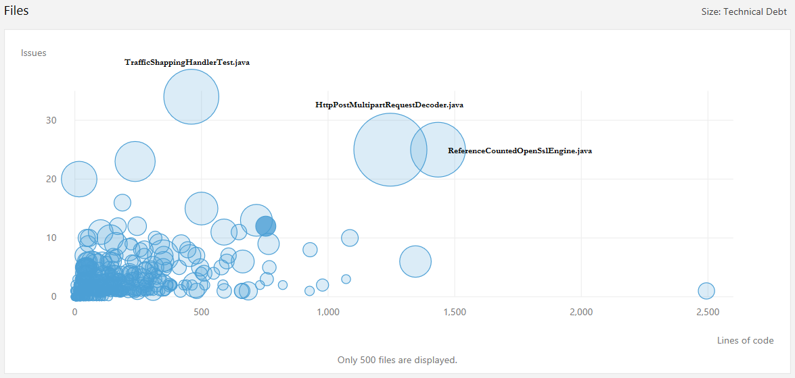 
*
Figure 9. Technical debt in terms of lines of code and issues of Netty 4.0 generated using SonarQube*

 
*
Figure 10. Technical debt in terms of lines of code and issues of Netty 4.1 generated using SonarQube*

###### Technical Debt Evolution In Similar Major Version
Another interesting fact that was found is that Netty developers are always trying to reduce the number of technical debts inside Netty throughout its development time.
This might seems untrue if the comparison is only done between different major versions, but if compared to similar major releases, this argument becomes valid. Figure [11](#figevnetty1) and figure [12](#figevnetty2) support this claim.

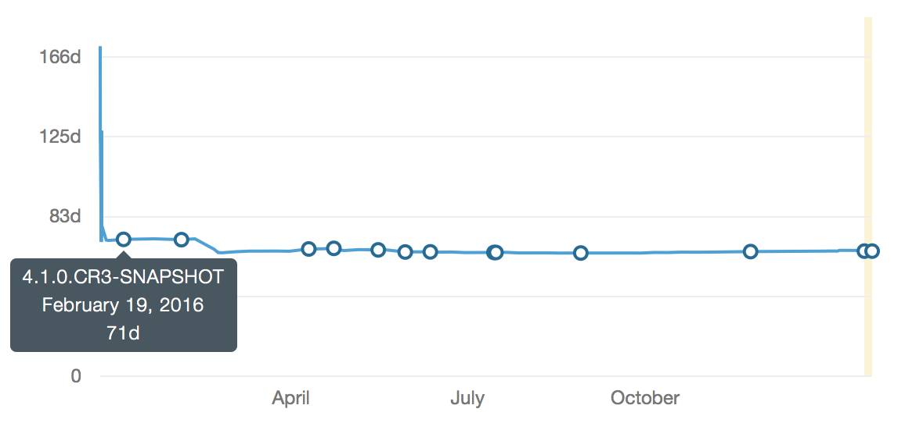 
*
Figure 11. Technical debt of Netty 4.1 recorded at February 19, 2016 analyzed using SonarQube*

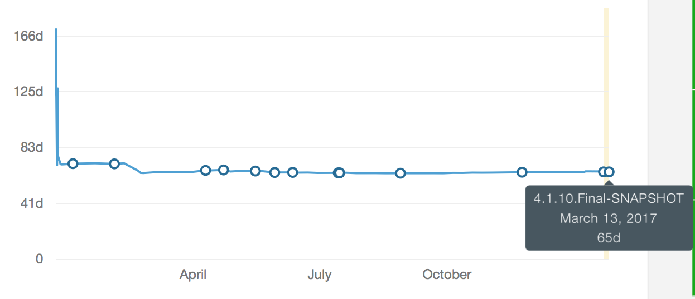 
*
Figure 12. Technical debt of Netty 4.1 recorded at March 13, 2017 analyzed using SonarQube*

From both figures, it can be seen that the number of total technical debts is decreased over the last single year. On February 19, 2016, it had 71 days of technical debt, while on March 13, 2016, it only 65 days. This is a good understanding of Netty developers' effort and also displays a nice progress since Netty only start utilizing SonarQube since the February 2016. This result looks even better if total lines of code is included in the analysis since there are 18453 of newly added codes during this period.

## 
8 Testing Debt
Similar to technical debt, testing debt is also a poor aspect that may arise when developing software. In the following subsection, details related to testing debt inside Netty will be explained.

### 
8.1 Code Coverage
Code coverage determines how many lines of code is being tested. Using SonarQube [[8](#ref8)], it is found that Netty 4.1 has overall code coverage around 61.4 %. Though Netty code coverage is relatively low, it is not necessarily a good metric to know whether the system is well-tested. Even when it has a high number, it does not guarantee anything. So, it is necessary to look for sections of code where coverage is missing and analyze it whether the uncovered line is critical or does not matter if it is skipped.

- [SonarQube](https://garage.netty.io/sonarqube/overview/coverage?id=io.netty:netty-parent:4.1) show that several modules which have a relative big percentage of total line of code are standalone testing modules, such as Microbench and Testsuite. Thus, these modules will not be covered by unit testing.
- `Transport/RXTX` module also has 0% coverage. After checking at Netty source code, it is found that this module does not contain a testing folder.
- Deprecated methods found in Netty source code, as shown in figure [13](#figdeprecated), are not tested as well, as usually the method will be removed later in next version or has a purpose to preserves the "backward compatibility".

  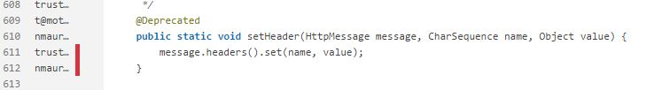 
*
Figure 13. Deprecated method example*

- Simple and logging methods found in Netty source code, as shown in figure [14](#figsimplemethod) and [15](#figloggingmethod), are not tested as they do not have a significant impact on Netty system or damage its functionalities if it has a bug.

  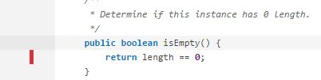 
*
Figure 14. Simple method example*

  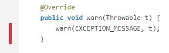 
*
Figure 15. Logging method example*

If some part line of code explained before are not covered, it is fine if unit testing does not include them. However, because code coverage of Netty 4.1 is still relatively small, there is still room for improvement as explained later in Testing improvement subsection.

### 
8.2 Testing Procedures
#### 
 Unit Testing
Unit testing is a testing technique test individual modules in the smallest possible chunks, isolated as much as possible from other code modules and runtime dependencies. Then it will be easier to identify, analyze and fix the defects. The concern with this method is functional correctness of the standalone modules.

Netty 4.1 is a Java-based project, so it utilizes JUnit as its unit testing framework. In Netty project, each module has its unit testing in its folder, for example, module `netty-common` has unit testing placed at `Netty/Common 4.1/src/test/java/io/netty/` separated from its main source code.

### 
8.3 Testing Improvement
One obvious improvement that can be done in Netty project is increasing its code coverage. By manual checking on, it was found that some line of codes is safer or better to be tested, which are:

- Branching: The example for this kind uncovered line of codes is shown in figure [16](#figuncoveredbranch). It can be seen that it is not a trivial code, so there should be a test case that covers all important branching line.  
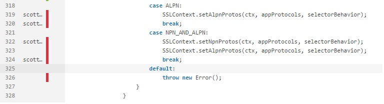 
*
Figure 16. Uncovered Branch*
- Override Methods: This type of uncovered line of code experience the same thing as uncovered overloading methods. They are not covered because the test case only tests one kind Override method. So it would be better if there is a test case that covers all important Override methods. The example of this type is shown in figure [17](#figoverriding), found in `MemoryAttribute.java` from HTTP module. 
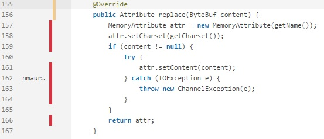 
*
Figure 17. Overriding Methods*

One of the factors that impede addition of tests is the documentation of Netty source code. There is no clear or detail explanation regarding the class or methods. For example, there should be a statement about input or output arguments (its type, its purpose, etc.). This would help developers or contributors to understand the code faster, especially if they want to test a method or create a class or a method that utilize a method from other class.

## 
9 Evolution Perspective

Since the start of its development in 2001, Netty has been released in hundreds of version. In the age of more than fifteen years, Netty still keeps evolving and adding new capabilities into its system. Figure [18](#figcommits) displays the number of commits into Netty repository to help illustrates how evolution happens inside Netty.

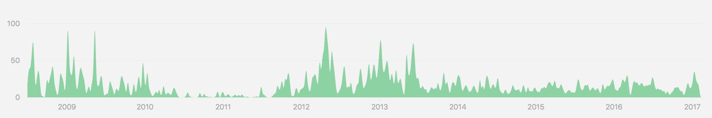 
*
Figure 18. Netty number of commits*

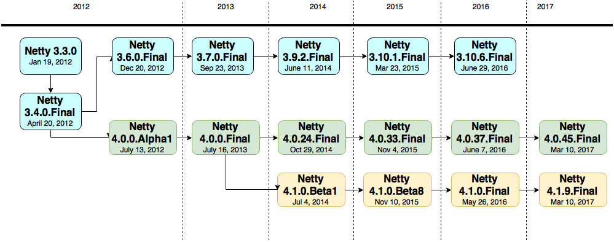 
*
Figure 19. Netty version history*

The progress of Netty version can be seen on figure [19](#figvhostory), that shows how Netty evolved into different major version changes while still maintaining the older version. For example, after Netty released version 4.0.0.Final, they still maintain version 3.x.x until the next two years. Even after version 4.1.0.Final was released, the version 3.10 still got updated. During the development of a version, Netty usually releases several alpha, beta and/or CR (candidate release) versions first.

To see the reason why Netty keep upgrading to a newer version, one can look at the issues and pull requests in Netty repository [[14](#ref14)]. The core developers will choose which issues can be added to a milestone of a version. When every item in the milestone is completed, the version related to that milestone will be released. The issues included in the milestone usually comes from bug fixing and requests of a new feature. Most of the requested features are related to security improvement and extra protocol support.

## 
10 Performance and Scalability Perspectives

This section discusses the two quality properties of Netty, which are performance and scalability. Performance concern of Netty is how fast Netty system performs its workload. Meantime, scalability focuses on the predictability of the Netty system's performance as the workload increases, for example, the increased number of users [[1](#ref1)]. As non-blocking IO and asynchronous client-server framework, Netty offers various of advantages compare its competitors, which are synchronous or blocking IO framework or other NIO framework, in terms of performance or scalability [[16](#ref16)]. These perspectives will be elaborated below.  

#### 
Performance
One of performance indicator is latency which is the amount of time required to satisfy a request. In the test [[17](#ref17)], to measure the latency, the framework is tested by responding with the simplest of responses: a "Hello, World" message rendered as plain text. The test shows that Netty Project has lower latency, i.e. 233.0 ms, compared to one of Netty competitors or Project Grizzly, i.e. 9680.0 ms.

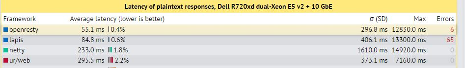 
*
Figure 20. Latency of Plaintext Response Test by TechEmpower [[17](#ref17)]*

#### 
 Scalability

Scalability is the ability of a system to handle this increased workload [[1](#ref1)]. The workload that effects the scalability of Netty is the number of concurrent connections. The scalability test [[18](#ref18)] shows that Netty 4 could reach 1,200,000 transactions per second with more than 1000 connection.   

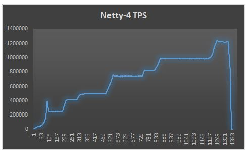 
*
Figure 21. Result of Netty Scalability Test [[18](#ref18)]*

## 
11 Conclusion
In this chapter, stakeholders, viewpoints, and perspectives of Netty are exploited in depth. Each section will lead to the understanding of Netty's software architecture. This section will summarize the chapter of Netty Project.

In stakeholders analysis, it is found that [Trustin Lee](https://github.com/trustin) is the founder of Netty and it is developed by a team of core developers and external contributors through GitHub. Besides personal developers, Netty is also used by well-known companies in their product, such as Apple, Facebook, and RedHat. Netty also has competitors as a client-server framework, e.g. [Apache Mina](https://mina.apache.org) and [Grizzly](https://grizzly.java.net). Then context view illustrates the relationship between external entities and Netty systems, for example, Java as a programming language, JUnit as testing frameworks, users, Apache License v2.0 as licenses in which Netty are distributed, IntelliJ as IDE and GitHub as version control and issue tracker.

Furthermore, the architecture of Netty Project is explained in depth by Development View, Deployment View, and Functional View. Development View section discusses all modules inside Netty, common processes, design constraints, design pattern, code structure, built and testing management of Netty Project. In Deployment View, the environment into which Netty is deployed is described, for example, the operating systems and third-party software dependencies. Netty's functional elements and their responsibilities are explained in Functional View.

After elaborating four viewpoints, technical and testing debt of Netty are explained. To identify technical debt, static code analysis and manual code analysis are performed. SonarQube is a tool to do static code analysis and it could detect that Netty has five types of code smells. It is also found that Netty Project has no SOLID violations during manual code analysis. Using SonarQube, it is also discovered that the code coverage of Netty is relatively low, i.e. 61.4 %. Thus, increasing Netty's code coverage is a must to improve the testing capabilities of Netty.

In addition, perspectives are included to deepen the analysis of Netty Project. Evolution perspective explains how Netty evolve since the development started in 2001.
 <!-- and now they have three separated version, i.e. Netty 3.10.6, Netty 4.0.45, and Netty 4.1.9.  -->
Meanwhile, the performance test [[17](#ref17)] in performance and scalability perspectives section shows that Netty has lower latency, i.e. 233.0 ms, compared to its competitor, i.e. Project Grizzly. Furthermore, the scalability test [[18](#ref18)] shows that Netty 4 could reach 1,200,000 transactions per second with more than 1000 connection.

After a profound and extensive analysis of Netty Project, it can be concluded that Netty is a reliable framework and maintainable project due to the involvement of many parties and proper methods of development. After reading this chapter, the reader is expected to understand the architectural complexity and potential shortage of Netty Project, then help them to contribute in [Netty](https://github.com/netty/netty).

# 
References

1. 
Nick Rozanski and Eoin Woods. Software Systems Architecture: Working with Stakeholders Using Viewpoints and Perspectives. New Jersey: Addison-Wesley, 2014.

2. 
The Netty Project. Netty: Home. http://netty.io/index.html.

3. 
Georgios Gousios. How do project owners use pull requests on Github?. http://www.gousios.gr/blog/How-do-project-owners-use-pull-requests-on-Github.html, 2014.

4. 
The Netty Project. Writing a Commit Message. http://netty.io/wiki/writing-a-commit-message.html.

5. 
The Netty-Project. The Netty Project - Individual Contributor License Agreement v1.0. https://docs.google.com/forms/d/e/1FAIpQLSd7Bzje39G__THDJLRgKpQZ4gODNE26x_hZW3ofQOkgL6RGCA/viewform?formkey=dHBjc1YzdWhsZERUQnhlSklsbG1KT1E6MQ.

6. 
N. Maurer and M. A. Wolfthal. *Netty in Action*. 10th ed. Shelter Island: Manning, 2014.

7. 
Technopedia. What is Technical Debt. https://www.techopedia.com/definition/27913/technical-debt.

8. 
SonarQube. Features | SonarQube. https://www.sonarqube.org/features/.

9. 
StackOverflow. When using netty for a large file upload, how can I get uploaded size while upload is in progress?. http://stackoverflow.com/questions/29507687/when-using-netty-for-a-large-file-upload-how-can-i-get-uploaded-size-while-uplo, 2015.

10. 
Amir Khan. The Principles of OOD. http://butunclebob.com/ArticleS.UncleBob.PrinciplesOfOod.

11. 
M. V. Mäntylä and C. Lassenius. "Subjective Evaluation of Software Evolvability Using Code Smells: An Empirical Study". Journal of Empirical Software Engineering, vol. 11, no. 3, 2006, pp. 395-431.

12. 
McCabe (December 1976). "A Complexity Measure". IEEE Transactions on Software Engineering: 308–320.

13. 
Trustin Lee. Trustin Lee Presentation in Twitter University. https://www.youtube.com/watch?v=0aoeSsKarc8, 2014.

14. 
The Netty Project. Netty project - an event-driven asynchronous network application framework. https://github.com/netty/netty.

15. 
Norman Maurer. Why Netty. http://normanmaurer.me/presentations/2014-netflix-netty/slides.html#1.0, 2014.

16. 
Norman Maurer. Network - Application Development The Easy Way. http://normanmaurer.me/presentations/2013-wjax-netty/#/10.

17. 
TechEmpower. Test types : Plaintext. http://www.techempower.com/benchmarks/#section=data-r9&hw=i7&test=plaintext

18. 
Ronen Nachmias. Netty 4 Throughput test. https://github.com/ronenhamias/netty-perf-testing/wiki/Netty-4-Throughput-test, 2014.

19. 
Alon Dolev. What is Netty ?. http://ayedo.github.io/netty/2013/06/19/what-is-netty.html, 2013.

20. 
TutorialsPoint. Design Pattern - Overview.  https://www.tutorialspoint.com/design_pattern/design_pattern_overview.htm

21. 
The Netty Project. Netty 4.1. https://garage.netty.io/sonarqube/overview?id=2477.

22. 
Daniel Bimschas. Zero-Copy Event-Driven Servers with Netty. https://www.slideshare.net/danbim/zerocopy-eventdriven-servers-with-netty, 2011.

23. 
Wang Wei. Importance of Logs and Log Management for IT Security. Retrieved March 29, 2017, from http://thehackernews.com/2013/10/importance-of-logs-and-log-management.html, 2013.

24. 
Jean-Louis Letouzey. The SQALE Method for Evaluating Technical Debt. In 3rd International Workshop on Managing Technical Debt. Zurich, Switzerland. 2012.

25. 
Alon. What is Netty?.  http://ayedo.github.io/netty/2013/06/19/what-is-netty.html, 2013.

26. 
The Netty Project. Netty: Thank you for your donation. http://netty.io/sponsor/thanks.html.
