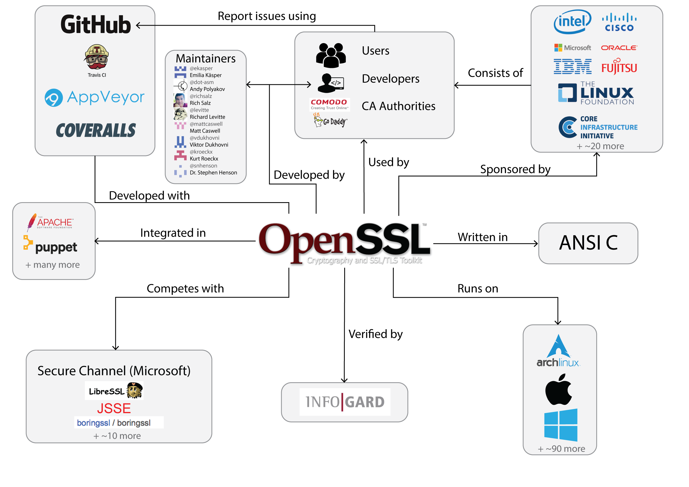

By [Frits Kastelein](https://github.com/fpk47), [Maarten in 't Hout](https://github.com/minth) and [Thijs ter Horst](https://github.com/gmth).

## Abstract

OpenSSL is a library and toolkit that provides secure communication by implementing the Transport Layer Security (TLS) and Secure Sockets Layer (SSL) protocols. OpenSSL is written in C. The goal of this chapter is to describe OpenSSL for possible contributors and other interested parties.

OpenSSL is described in the viewpoint of stakeholders, context and development and functional. Also, some challenges the OpenSSL development team currently faces, are described in the perspective of evolution. While OpenSSL is mature in terms of development hours, it also has shortcomings that need to be addressed in the coming future.

## 1. Introduction

Some of the most used operating systems, such as Linux, Windows and MacOS, support a toolkit that by now is virtually indispensable; OpenSSL. Because of its importance in systems that are used daily by millions of people, its history, present-day functioning and future should be well evaluated. This chapter looks into these concerns.

OpenSSL is an SSL/TLS toolkit, that intends to provide a secure connection to another host. Additionally, it allows encryption and decryption of other data, key creation and certificate signing. According to the website [datanyze.com](datanyze.com), OpenSSL has the largest market share in SSL technology, larger than the proprietary implementation from Comodo [[1](#INTRO_DATANYZE)]. Nowadays OpenSSL has an active community and several developers working full time on the project. 

The goal of this chapter is to guide developers that want to start contributing on OpenSSL. This is a daunting task. This is by no means an exhaustive guide, but it provides an overview of OpenSSL, by showing some of its intricacies.

This chapter first describes the prominent figures and parties that have an interest in OpenSSL. Hereafter, the context of OpenSSL and its development is described. This Context View provides background information needed to understand OpenSSL. This is followed by the evolution of OpenSSL, that highlights the past, present and future of OpenSSL in the face of inevitable change. This Evolution Perspective is followed by a Functional View, that depicts the workings of OpenSSL from a high-level perspective. After this, the Development View explains what is important for people that want to contribute. Finally, the chapter is concluded.

## 2. Stakeholders

This section first describes the different stakeholders that can be identified
within the OpenSSL project, and then describes who these stakeholders are 
and how they fulfill their role for OpenSSL.

| Type   |      Description      | 
|---|:---:|
| Acquirers | Acquirers are responsible for the financial survivability of the project, this includes sponsors. |
| Assessors | Assessors check for compliance with legal regulations and defined standards. |
| Communicators | Communicators are the persons that do any communication to the outside world. This can be writing documentation, training people or marketing.|  
| Developers | Developers create new features for the system, such as new encryption algorithms and updates to the API. |  
| Maintainers | Maintainers of a system are concerned with keeping it up and running. This involves fixing bugs, discussing its current architecture and planning future modifications.|  
| Suppliers | Suppliers make the hardware, software or infrastructure on which a system will run. This stakeholder does usually not have an active role in the development of the system. It may be relevant when a supplier changes their platform drastically. |  
| Support Staff | Support staff provide the support to users using the product once it is running. They resolve issues but do not improve the product.|
| Users | Users will ultimately make use of the system. Their concerns are usually performance, security and functionality. Although users are not closely involved with the development of the system, they still are important stakeholders. |

Steve Marquess is the business manager of the corporate entity of OpenSSL and is
thereby an **acquirer**. Sponsors include large multinationals such as Cisco, 
Fujitsu, Hitachi, Huawei, IBM, Intel, Microsoft, NEC, Oracle, Qualcomm and 
Samsung [[2](#sponsors)].

Matt Caswell, one of the three full time core developers, has GitHub comments 
regarding legal regulations [[3](#pull1956)], and thus acts explicitly as 
**assessor**. An example of an assessor that is very specific for OpenSSL is a
cryptographer. Creating a secure protocol is very hard because security does 
not only depend on the strength of algorithm, but also on the entire chain of 
functions. Therefore, it is vital to have a set of cryptographers actively 
involved in the process. This is currently done by the validating company, 
InfoGard Laboratories [[4](#FIPS2)]. Other examples are large organisations and 
governments. A specific case of this is when Rohde & Schwarz Cybersecurity, a 
german based company, ran an extensive test and extracted multiple problems from 
OpenSSL [[5](#RSC1)][[6](#RSC2)] by order of a German federal government 
agency. 

OpenSSL **maintainers** primarily focus on discussing issues and pull requests. 
When looking at the recent history of the GitHub repository, Richard Levitte 
(@[levitte](https://github.com/levitte)), Rich Salz (@[richsalz](https://github.com/richsalz)) 
and Andy Polyakov (@[dot-asm](https://github.com/dot-asm)) are most active in 
responding to issues and pull requests. 

Within OpenSSL, the line between **maintainers** and **developers** is thin. 
The people that maintain the current code base and fix bugs, are the same 
persons to implement new features for a coming release. There are some 
pull requests by people other than the core maintainers, but these come from
people that contribute to OpenSSL only once or twice.

In an open-source environment such as OpenSSL, maintainers also are 
**communicators**: they communicate with people outside of OpenSSL that want 
to contribute to the project, for example through GitHub. Another task of
communicators is to provide documentation. The documentation for OpenSSL is a 
community project. Each change in source code should be accompanied by an 
update to the respective documentation for a pull request to be accepted. 
However, the majority of the contributions to the several READMEs come from
Matt Caswell, Richard Levitte and Rich Salz.

The companies Coveralls [[7](#coveralls)] and Travic-CI [[8](#travis_ci)] are 
**suppliers**, they provide OpenSSL with the tools to do automatic testing and 
measuring code coverage. Intel might also be considered a supplier: they provide 
chips with AES implementations.

Money for the project is acquired by means of sponsoring and paid support.
There are contracts to get direct support for OpenSSL where it is said that paid 
technical support is done by the team members or close collaborators in the 
OpenSSL developer community who thus act as **support staff** [[9](#openssl_support)]. 
OpenSSL does not do significant marketing, although Steve Marquess does the 
business related communications.

OpenSSL **users** vary from Internet users to software engineers encrypting 
their system using OpenSSL to big businesses using OpenSSL to provide their
clients with a secure connection to their servers. Some users do not even know 
they are using it while others need to know OpenSSL in detail to guarantee 
system security. 

## 3. Context View

A context view is a tool to investigate how a system interacts with its environment.
It shows the relation between a system and the different types of stakeholders,
systems or organisations it depends on and interacts with. Ultimately, it helps
to get an overview of what a system does (should), or does not (should not) do. 

Figure 1. Context view 

In the diagram in Figure 1, three kinds of users are indicated. First there are 
the users that use a browser to get a safe connection to a website on a server that uses OpenSSL.
These people generally have no idea about the underlying system, but heavily rely on it to work.
Secondly, there are developers of websites that want to allow their customers to connect securely to their servers.
Usually they do not develop on OpenSSL and also may not exactly know how it works.
Thirdly, there are certificate authorities, that should not distribute 
certificates which are not accepted by OpenSSL. Even though there is an SSL 
standard that both OpenSSL and the certificate authorities should adhere to, 
OpenSSL can for example make choices that affect the validity of certain 
certificates [[10](#CV_ISSUE)].

As an open source project, OpenSSL is mainly sponsored by companies that use
OpenSSL for securing their connections. Sponsoring can be monetary, or companies 
can have people on their payroll work on OpenSSL. The money can either be used for paying employees
(OpenSSL has three full time employees [[11](#CV_EMPLOYEES)]) or 
for paying testing and verification services.

Automated testing is done by AppVeyor and Travis-CI, which both offer free 
service to open source projects. When source code also adjusts tests, Coveralls
provides an overview of the coverage of the test cases. Coveralls, too, provides
free services to open source projects.

The main competing SSL implementations are *Secure Channel* from Microsoft,
and *JSSE*, which is developed by Oracle for Java.
Secure Channel is used for Windows platforms, and JSSE enables secure 
connections in Java programs. The other two SSL implementations, BoringSSL [[12](#CV_BORINGSSL)] and LibreSSL [[13](#CV_LIBRESSL)], are forks from OpenSSL in response to the Heartbleed bug [[14](#CV_HEARTBLEED)]. BoringSSL is developed by Google and its goal is to being able to change the structure to meet the company needs. LibreSSL is an OpenBSD project that is trying to modernize and refactor the existing OpenSSL code.

## 4. Evolution
### The Start
OpenSSL was created as a successor of the SSLeay. SSLeay was a project which started in 1994, in a time when SSL implementations had to be bought instead of being freely available [[15](#EV-EAY-BOOK)]. Eric Andrew Young and Tim J. Hudson began working on SSLeay as a hobby project, before a lack of time forced them to abandon it in 1999. SSLeay was not designed in advance, but grew organically [[16](#EV-EAY-DOCS)].

In 1999 a team of software engineers started a new project, OpenSSL, with SSLeay at its core. Communications were done via mailing lists and changes were done via patches. However, the policies were not documented and the code was released sporadically. By 1999 there was already a considerable technical debt, as software engineering in open source projects was still in its early ages when SSLeay was created. This can be seen in the achitecture which in some aspects can be described by the anti-pattern "Big ball of mud".
 
### The Stagnation
From 1999 onwards the technical debt only started to increase and soon OpenSSL was crushing itself under heaps of technical debt. In 2002 an issue tracker was introduced. Every year 125 open tickets were accumulated, resulting in approximately 1500 open tickets by 2014, as can be seen in Figure 2. By 2009 only a small team of two authors was left. By 2014 only 50% of the SSLeay was still alive in the code. Salz describes the codebase as complex, arcane, hard to maintain and even harder to develop new features for. One of the reasons which might explain these dreary circumstances is that OpenSSL only received about $2.000 per year in donations, leaving not much room for dedicated support from maintainers [[17](#EV-RICH)]. In other words, these 12 years were a breeding ground for technical debt. When taking all this misery into account, the following crisis is no surprise.

Figure 2. Evolution of tickets in rt.openssl.com
 
### The Crash
In 2014 Heartbleed was discovered; the ever-famous bug which shook the digital world. It took about two years from the error until the discovery of this bug, which made all servers that used OpenSSL potentially insecure. Up to now, only two maintainers were responsible for OpenSSL. With such little manpower, the focus lied heavily on keeping the software running, i,e, there was simply too little time to focus on actual maintainable code. This crisis inspired a group of OpenBSD developers to modernize the codebase of OpenSSL and to remove a lot of insecure and deprecated functions. This new project is called LibreSSL. In the first week of development, about 90.000 lines of OpenSSL code was removed [[18](#OPENSSL_90000)].
Another effect of the Heartbleed bug was the sudden realization of the criticality and the dependence on OpenSSL by both developers and companies like Google, Facebook, IBM, Intel and Microsoft. Therefore, these users began to contribute and donate to the further development and improvement of OpenSSL. The current donation is estimated to be more than $300.000 per year, which is incomparable with the donations prior to 2014. Because of this major turnaround and the significant raise in contributions, the amount of open tickets was halved in just two months (See Figure 2). Currently, there are about 300 tickets open and the amount of original code is reduced to 21% [[19](#OPENSSL_SCRIPT)]. Furthermore, the number of active maintainers grew to about 12.

### Now and the Future

Once a forgotten child, OpenSSL's future now looks bright. The first part almost everybody agrees on. However, regarding the second part, the community is divided. Some argue that OpenSSL should be abandoned and OpenSSL forks like BoringSSL and LibreSSL are the future. But then again, others keep supporting OpenSSL. The solved and reported vulnerabilities on the OpenSSL website support this, i.e., they are not decreased after Heartbleed [[20](#OPENSSL_VULN)]. Also, these vulnerabilities were noted by various people. This implies that the OpenSSL community is still going strong.

The OpenSSL development team is not only focussing on solving bugs, but also on new features, such as TLS 1.3. Currently a working draft, OpenSSL will have TLS 1.3 support in their next big release (OpenSSL 1.1.1)[[21](#OPENSSL_ROAD)]. This clearly reflected in the pull requests on GitHub: Most closed, and accepted, pull requests concern improving documentation, fixing bugs and implementing TLS 1.3. This makes sense: it is in line with the OpenSSL's road map.

What will the future bring OpenSSL?  Currently, the focus lies heavily on documentation and testing. This will probably also be the case in the (near) future. Also, using a step-wise implementation process, new features are evaluated and implemented. Looking at the accepted pull requests, there seems to be a good balance between testing, bug fixing an introducing new functionality. With more people, more work can be done. When OpenSSL keeps evolving in this way, its future does look bright.

## 5. Functional View
The architectural elements and responsibilities of OpenSSL are represented in the functional view that is introduced in this chapter.
Figure 3 shows an idealised impression of the current state of the architecture. This idealised impression was constructed by reading the documentation and the module descriptions. This architecture exhibits a clear separation between layers and minimises dependencies between elements. First, the architectural elements that are used by OpenSSL are described. After this, the actual architecture is shown and while the architectural elements remain the same, the structure and dependencies differ. 

Figure 3. Idealised impression of the OpenSSL architecture

### Userspace Layer
The first layer, the **userspace layer**, consists of the programs OpenSSL provides its users with or any program that uses the OpenSSL library. All programs here are completely separate entities and have little to no dependencies between them.

Programs that OpenSSL provides are Command-line interfaces (CLI), this means that these programs can only be accessed trough the command line. An example of an extensively used program is `openssl req`. This utility can generate and validate certificates that can be used for asymmetric cryptography.

Other programs can use OpenSSL by either statically or dynamically linking to the OpenSSL libraries. Statically linking means that a copy of OpenSSL is included in the program itself. This is opposed to dynamically linking which means that OpenSSL remains separate from the program. In that case, the operating system needs to provide OpenSSL when running that program.

### Abstraction Layer
The second layer is the API and **abstraction layer**, with separate abstractions 
for SSL/TLS functionality (SSL), crypto functionality (EVP), and BIO which 
provides a Basic Input/Output abstraction that tries to hide I/O details from an 
application.

**EVP**: 
The EVP ("Envelope") module is a high-level interface to the cryptographic
functions that OpenSSL provides [[22](#FV_EVP)]. It allows encryption, decryption,
signing and verification of data, independent of the algorithm someone would
want to use.

**BIO**: 
The BIO (Basic Input Output) module provides BIOs, which are stream 
abstractions that can act as sources, sinks or filters. It is very similar to 
C's `FILE *`.

**SSL/TLS**: 
The SSL/TLS module provides the functions to set up a secure connection. The module does not consist of just API functions but also implements the functionality to open connections and for performing the handshakes.

### Implementation Layer
Finally, the third layer is the implementation layer. In this layer, an Engine module provides access to both software and hardware implementations of crypto algorithms. 

**Software Crypto**: 
The Software Crypto module is by far the largest module and the core of OpenSSL.
It contains multiple interconnected submodules that implement different 
cryptography algorithms, for example, to encrypt and decrypt,
but also for creating and handling keys. All these modules are shown as one 
block to keep the figure readable.

**Engine**: 
The Engine module provides ENGINE objects to create and manipulate cryptographic
modules. It also provides an abstraction to the soft- and hardware crypto modules and uses the hardware crypto implementations when they are available. Like SSL/TLS, it is a bit of a hybrid between API and implementation.

**Hardware Crypto**: 
The Hardware Crypto module consists of hardware implementations of cryptographic algorithms. This hardware is not provided by OpenSSL, but OpenSSL does allow for the hardware to be used.

An example of such a hardware implementation is the Intel Advanced Encryption Standard New Instructions (AES-NI). This is an extension of the x86 instruction set that some of the AMD and Intel processors support. A ninefold increase in performance of AES algorithms can be realised because of this [[23](#FV_HARDWARE_BENCHMARK)].

### Actual Architecture
Because the 20-year-old project has grown piece by piece,
without the existence of any diagrams that describe the project [[24](#FV_MAIL)], 
the architecture is not as nice as the one described in Figure 3.
Indeed, the lack of overview of the project and the resulting entanglement
of modules, is what makes OpenSSL extremely complex and hard to maintain.
After Heartbleed, things have become better, but the extremely high amount of
dependencies in the project definitely holds it back.  Figure 4 shows the current state of the project. 

Figure 4. More realistic representation of the OpenSSL architecture

## 6. Development View
An overview of the structure of OpenSSL, its principles, guidelines and 
standardisation of design and testing can make it easier for new developers to
contribute to the OpenSSL project. The structure of OpenSSL has been covered
in the section Functional View, and will therefore not be repeated here. 
Instead, the focus lies on the software development process and how issues are
tackled.

### Principles
The most apparent core principle that governs the development of the system is 
that everything that is added, must be tested.
OpenSSL runs tests using Coveralls, and aims to have at least a coverage of
67% before October 2017 [[25](#ROADMAP)]. Currently, the test coverage is at 58%
[[26](#COVERALL-main)], coming from 54% in August 2016 [[27](#COVERALL-start)].
Considering the enormous codebase OpenSSL consists of, more than 500k lines of code in June 2015 [[28](#CODING-LINES)], this is a significant 
increase in test coverage, though the road to 67% will be long. It should also 
be mentioned that according to a paper from Bullseye, 70%-80% is 
reasonable [[29](#BULLSEYE)], and that it should be higher for safety-critical 
systems. If anything, OpenSSL can be considered safety-critical for a lot of 
systems. 
    
OpenSSL principles dictate now that any code that is added, should be 
accompanied by a test case. For a commit to be accepted, it must not give 
compiler warnings, and a Contributor License Agreement (CLA) has to be signed.

OpenSSL keeps reported security leaks private and within the development team
until they are solved. The OpenSSL website states about this principle: "The 
more people you tell in advance the higher the likelihood that a leak will 
occur. This has happened before, both with OpenSSL and other projects.". 
Because OpenSSL is used a lot, it is in the interest of all stakeholders that 
leaks with a high priority are solved quickly [[30](#SECURITY)].

### Guidelines
Guidelines and principles of a project are often tightly connected. The 
principle that all new code must be tested is accompanied with the guideline
that all contributions that add code, also have to add appropriate test cases. 
Similarly, new features or a change in functionality must be documented 
accordingly. 

After March 29, 2010 the release guideline was modified to meet the users and
maintainers expectations. Currently, the latest stable release is 1.1.0e.
When the release only changes the last digit of the version number, it will 
contain new features but it does not change the API and CLI of OpenSSL. When 
there is a letter appended or the is letter changed to the version number it 
will only contain bug and security fixes [[31](#RELEASE-STRAT)]. 

Linux is the primary development platform of all maintainers. Secondary 
platforms that at least one maintainer supports are FreeBSD, Windows, MacOS X 
and VMS. All other platforms are either supported by the community or not at all 
[[32](#PLATFORM)]. 

All OpenSSL source-code must conform to the coding style which is derived from 
the Linux kernel coding style.
This is a very common coding style, demanding underscores_in_names, ALLCAPS for 
constants and defines and descriptive variable names for non-iterator variables.

### Standardisation of Design
Design standardisation can help tremendously in keeping a software system 
maintainable and coherent. OpenSSL tries to accomplish this by splitting the
separate functionalities into modules, and submodules for the several 
cryptographic algorithms. This is combined with the use of some programming design
patterns.

Many documented design patterns primarily target object-oriented software.
While it is perfectly possible to write C in an object-oriented manner (see
the implementation of GTK for example), many C programs do not use such a 
programming style. Adam Tornhill has described a few design patterns in C
in his book [[33](#PATTERNS-BOOK)]. Related to design patterns are the
SOLID principles: Single responsibility, Open-closed, Liskov substitution, 
Interface segregation and Dependency inversion. These principles are mainly
used for Object Oriented programming, so they may not map too well to the 
C code that OpenSSL is written in.

The principle that does map well is the Interface segregation principle, which
OpenSSL heavily uses. OpenSSL has a lot of different interfaces for the
several kinds of functionality it provides, up to the point of separate 
command line programs for OpenSSL and key generation.

These command line user interfaces logically rely heavily on the Observer pattern, 
performing actions depending on the signals that are given to the program. No 
other part of the OpenSSL project seems to use this kind of pattern. Therefore 
this pattern cannot really be considered a pattern that governs the development 
of the system.

A programming pattern that is used more often in the code is a pattern that
could be an equivalent to a Strategy pattern, where multiple similar functions
have the same kinds of input and output. An excellent example can be found in
the SSL implementation, which contains a struct `ssl_method_st`.
This is a struct that defines function pointers with a certain input and output,
that can be filled in at will. As a result, a method in that struct such as 
`ssl_renegotiate` may be implemented by multiple methods. This maps nicely 
to the Liskov substitution from the SOLID principles.
Apart from the Strategy pattern, this also has something of an Abstract Data 
Type pattern, which is described in the book of Adam Tornhill.

Another nice example of the adoption of the Strategy pattern is the `Engine` 
module. An Engine is an opaque data type that simply accepts a cipher function, 
a key and an initialisation vector, and encrypts data using these. The result
of this strategy is that modules with the same objective (hashing, encryption)
are implemented in a very similar way. Obviously this is very beneficial for 
the maintainability of those pieces of code.

Also in the Engine module one can identify a Singleton pattern. It makes sure 
that a certain engine is only loaded once, and that every subsequent call to the 
same engine is handled by the same instance. This does not have much effect 
on the maintainability of the code, but it does reduce the memory footprint of 
OpenSSL.

Clearly, OpenSSL relies primarily on a Strategy pattern, which is a 
logical choice for implementing a library where many modules have the same
kind of functionality.

### Standardisation of Testing
Testing is done on by Travis-CI and by AppVeyor. Test recipes must be written
in Perl, and are put in a `test/recipes` directory. The recipies contain names
of binaries to run and their expected outcomes. Note that one test recipe can
call multiple tests. These tests are compiled C code and reside in the `test` 
directory.

## Conclusion

Rich Salz, Matt Casswell and Richard Levitte are important for OpenSSL, i.e., they represent many stakeholder classes. It is not trivial to distinguish between classes: When is a maintainer also a developer? For OpenSSL maintainers, communicators, assessors and acquirers are the most important. OpenSSL has to be maintained to prevent heartbleed-like issues. Users must know how to use OpenSSL. OpenSSL must comply with industry standards and enough funding is required to allow further development.

OpenSSL still has a long way to go code coverage wise, and it will take time before the magic 80% boundary is reached. The guidelines and principles of OpenSSL are tightly connected: All contributions that add code have to add appropriate test cases. Furthermore, OpenSSL makes use of a few programming patterns. User interfaces rely on the Observer pattern while in other modules the Strategy pattern is found. Finally, like other open-source projects, testing is done using Travis-CI and AppVeyor.

OpenSSL has different types of users. It is mainly sponsored by companies that use it. Main competing SSL implementations are Secure Channel from Microsoft, and JSSE. Via issues on GitHub, or directly mailing the development team, the most problems and security leaks of OpenSSL are reported.

The functional view showed the architectural layout. The intended layout, achieved by reading documentation, shows a layered design. However, due to years of ad-hoc development, the current architectural layout has lot of unwanted inter-connectivity, i.e., there is a lot of entanglement. 

The past may be behind us, but after Heartbleed, the OpenSSL development team has to learn from its mistakes. Currently, the focus lies heavily on documentation and testing. With a step-wise implementation process, new features are evaluated and implemented. There seems to be a good trade-off between testing, bug fixing an introducing new functionality. 

To conclude: The lack of structure in the architecture of OpenSSL makes it extremely complex and hard to maintain. Also, the lack of sufficient code coverage could lead to critical, and potentially dangerous, bugs. Having said all this: OpenSSL needs to increase code coverage, and constantly, needs to work conform guidelines. However, it seems that OpenSSL development team has learned from its mistakes, and if it keeps evolving in this way, its future looks bright.

### References

1. 
 Unknown author. "OpenSSL marketshare", https://www.datanyze.com/market-share/ssl/openssl-market-share. March, 2017
2. 
 Unknown author, "OpenSSl Sponsors", https://www.openssl.org/support/acks.html. March, 2017
3. 
 @bboli, "Pull request", https://github.com/openssl/openssl/pull/1956. March, 2017.
4. 
 Unknown author, "Security Policy OpenSSL", https://www.openssl.org/docs/fips/SecurityPolicy-2.0.pdf. March, 2017.
5. 
 J. Leyden, "German government get involved in OpenSSL", https://www.theregister.co.uk/2016/02/04/openssl\_mediocre\_german\_gov_audit/. February 2016.
6. 
 Unknown author, "Rohde & Schwarz acquires enterprise security specialist Sirrix AG", https://www.rohde-schwarz.com/us/news-press/press-room/press-releases-detailpages/rohde-schwarz-acquires-enterprise-security-specialist-sirrix-ag-press_releases_detailpage_229356-119553.html. May, 2015.
7. 
 "Unknown author", "Coveralls website", https://coveralls.io/. May, 2017.
8. 
 "Unknown author", "Travic-CI website", https://travis-ci.org. May, 2017.
9. 
 Unknown author, "OpenSSL Support", https://www.openssl.org/support/contracts.html. March, 2017.
10. 
 @chenchuAtXidian, "Issue" https://github.com/openssl/openssl/issues/2620. March, 2017.
11. 
 C. Stokel-Walker, "How an unprecedented face-to-face meeting of 11 geeks will make the internet more secure". https://qz.com/286210/how-an-unprecedented-face-to-face-meeting-of-11-geeks-will-make-the-internet-more-secure/. March, 2017.
12. 
 Unknown author, "Website boringssl", https://boringssl.googlesource.com/boringssl/. March, 2017.
13. 
 Unknown author, "Website LibreSSL", https://www.libressl.org/. March, 2017.
14. 
 Unknown author, "Website Hearbleed", http://heartbleed.com/. Retrieved on 2017-03-20.
15. 
 S. Garfinkel, G. Spafford. "Web Security, Privacy & Commerce", O'Reilly, 2002
16. 
 Unknown author, "Bundle of old SSLeay documentation files", https://raw.githubusercontent.com/openssl/openssl/91bad2b09eb2ad77da8aca29f80f2d0677e75423/doc/ssleay.txt. March, 2017.
17. 
 Rich Salz. "Software Engineering and OpenSSL is not an oxymoron", https://threatpost.com/openssl-past-present-and-future/112485/. March, 2017.
18. 
 Larry Seltzer, "OpenBSD forks, prunes, fixes OpenSSL", http://www.zdnet.com/article/openbsd-forks-prunes-fixes-openssl/. April, 2014.
19. 
 M. in 't Hout, "Script to calculate original OpenSSL lines of code", https://github.com/minth/openssl-delftswa2017. April, 2014.
20. 
 Unknown author, "OpenSSL Vulnerabilities", https://www.openssl.org/news/vulnerabilities.html#y2016. March, 2017.
21. 
 Unknown author, "OpenSSL Roadmap", https://www.openssl.org/policies/roadmap.html. March, 2017.
22. 
 Unknown author, "OpenSSL wiki EVP", https://wiki.openssl.org/index.php/EVP. March, 2017.
23. 
 Red Hat, "OpenSSL Intel AES-NI Engine", https://access.redhat.com/documentation/en-US/Red_Hat_Enterprise_Linux/6/html/Security_Guide/sect-Security_Guide-Encryption-OpenSSL_Intel_AES-NI_Engine.html. March, 2017.
24. 
 Rich Salz, "Personal communication (email)"
25. 
 Unknown author, "Roadmap", official OpenSSL documentation, https://www.openssl.org/policies/roadmap.html. March, 2017.
26. 
 Unknown author, "Coverall OpenSSL", https://coveralls.io/github/openssl/openssl. March, 2017.
27. 
 Unknown author, "Coverall OpenSSL - August 2016", https://coveralls.io/repos/65739/builds?page=166, March, 2017.
28. 
 Stepthen Schmidt, "Lines of code in OPENSSL", https://aws.amazon.com/blogs/security/introducing-s2n-a-new-open-source-tls-implementation/. June, 2015
29. 
 Steve Cornett, "Bullseye - Minimum Acceptable Code Coverage", http://www.bullseye.com/minimum.html. March, 2017.
30. 
 Unknown author, "Security Policy", official OpenSSL documentation https://www.openssl.org/policies/secpolicy.html. March, 2017.
31. 
 Unknown author, "Release Strategy", official OpenSSL documentation https://www.openssl.org/policies/releasestrat.html. March, 2017.
32. 
 Unknown author, "Platform Policy", official OpenSSL documentation https://www.openssl.org/policies/platformpolicy.html. March, 2017.
33. 
 Adam Tornhill, "Patterns in C", https://leanpub.com/patternsinc. 2015

