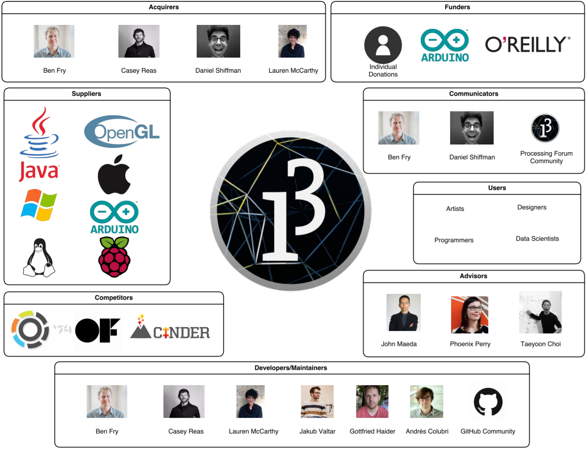
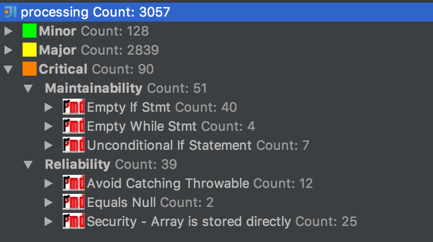
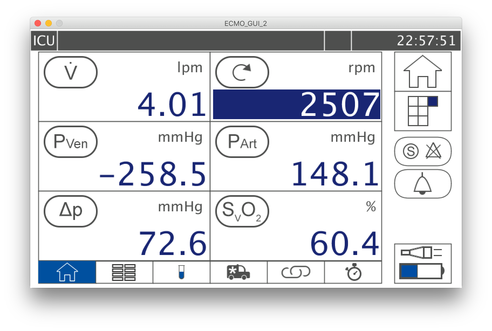

# Processing - Learn How to Code Within the Context of Visual Arts
**By [Omar Hommos](https://github.com/11maxed11), [Mohammed Al-Rahbi](https://github.com/meer1992), [David Bergvelt](https://github.com/bergvel1), and [Mathew Vermeer](https://github.com/mathewvermeer).**

Delft University of Technology.

## Abstract

Processing is a simple software sketchbook and a language designed to introduce programming to new learners in the context of visual arts. This chapter includes a brief overview on several aspects of Processing, precisely its stakeholders, context, deployment, and evolution. It further presents an analysis of its architecture development and its technical debt. The presentation of these aspects is inspired by the methods followed in the Software Systems Architecture book by Rozanski and Woods [[1](#rw)].

## Table of Contents
   * [I. Introduction](#i-introduction)
     * [Our Favorite P5 Projects](#our-favorite-p5-projects)
   * [II. Stakeholder Analysis](#ii-stakeholder-analysis)
     * [Classes of Stakeholders](#classes-of-stakeholders)
     * [Additional Classes of Stakeholders](#additional-classes-of-stakeholders)
   * [III. Context View](#iii-context-view)
     * [System Scope](#system-scope)
     * [Visualization](#visualization)
   * [IV. Deployment View](#iv-deployment-view)
     * [Third-party Software Requirements](#third-party-software-requirements)
     * [Runtime Environment](#runtime-environment)
     * [Operating System](#operating-system)
   * [V. Architecture Development View](#v-architecture-development-view)
     * [Module Organization](#module-organization)
     * [Dependencies](#dependencies)
     * [Common Processing](#common-processing)
     * [Standardization of Design](#standardization-of-design)
     * [Instrumentation](#instrumentation)
     * [Codeline Organization](#codeline-organization)
   * [VI. Technical Debt in Processing](#vi-technical-debt-in-processing)
     * [Identifying Technical Debt](#identifying-technical-debt)
     * [Testing Debt](#testing-debt)
     * [Evolution of Technical Debt](#evolution-of-technical-debt)
   * [VII. Evolution Perspective](#vii-evolution-perspective)
     * [Processing 1.0](#processing-10)      
     * [Processing 2.0](#processing-20)
     * [Processing 3.0](#processing-30)
   * [VIII. Conclusion and Discussion](#viii-conclusion-and-discussion)
   * [IX. References](#ix-references)
   * [X. Appendix](#x-appendix)
     * [A1. An Interview With a User](#a1-an-interview-with-a-user)

## I. Introduction

Processing (nicknamed P5) is an open source computer programming language and integrated development environment (IDE) built for the electronic arts, new media art, and visual design communities with the purpose of teaching the fundamentals of computer programming in a visual context. Processing is also widely used by hardware hackers, as it is quite easy to use and supports important features like serial communications, with many related libraries and tutorials [[2](#homepage)].

The Processing Project was started in Spring 2001 by [Ben Fry](https://github.com/benfry) and [Casey Reas](https://github.com/REAS), who still contribute largely to the project [[3](#procppl)]. in 2012, [Dan Shiffman](https://github.com/shiffman  ) joined them to start the Processing foundation [[4](#procsupport)]. Since then, the project continues to grow a user community of thousands of people.

The Processing IDE is called a _sketchbook_. Processing language files are called _sketches_. Every sketch is a subclass of [_PApplet_](http://processing.github.io/processing-javadocs/core/index.html?processing/core/PApplet.html), a Java Class that implements most of the Processing language features. Thus, Processing language is more of a simpler version of Java. Processing code is translated into Java before compilation. Processing classes are all treated as inner-classes. As such, the use of static variables and methods in classes is prohibited unless Processing was set to run in pure Java mode. The IDE and the language create an ecosystem that is quite powerful for new learners [[2](#homepage)].

This chapter begins with a discussion on the stakeholders, the context, the deployment, and the evolution of the Processing environment. Afterwards, it focuses on the architecture development view of the IDE, and its technical debt. It later ends with a conclusion, followed by an interview with a P5 user in the Appendix.

### Our Favorite P5 Projects!
[Petting Zoo](http://minimaforms.com/#item=petting-zoo-frac-2) is the latest work developed by experimental architecture and design studio Minimaforms. The project simulates life using a robotic environment. The whole project makes you question environments, life forms, and communication. The creatures can learn and explore by interaction with viewer. It's an example of cool hardware art projects!

*Figure 1: Project Petting Zoo*

[unnamed soundsculpture](http://www.onformative.com/work/unnamed-soundsculpture/) is a 3D motion piece visualizing sound by the movement of the body. A dancer was used to visualize a musical piece (Kreukeltape by Machinenfabriek) as closely as possible with movements of her body. She was recorded by three Kinects using Processing language the resulting views were aligned and merged to form a complete 3D point cloud and imported into 3D Studio Max.

*Figure 2: Project Unnamed Soundsculpture*

[Partitura](https://vimeo.com/23316783) Created by Abstract Birds and Quayola, Partitura is a custom software for creating real-time graphics aimed at visualising sound. The term “Partitura” (score) implies a connection with music, and this metaphor is the main focus of the project. The main characteristic of the system is its horizontal linear structure, like that of a musical score. It is along this linear environment that the different classes of abstract elements are created and evolve over time according to the sound.

*Figure 3: Project Partitura*

## II. Stakeholder Analysis
In order to understand a project like Processing, it is beneficial to identify the various individuals and groups affiliated with the project, and understand how their needs and motivations influence Processing. These individuals and groups are known as *stakeholders*, and can be categorized into classes by their role in relation to Processing. In this section we will identify several stakeholder classes and discuss their influence on Processing.

Figure 4 shows a graphical representation of the Processing stakeholders. Detailed discussion on stakeholder classes will follow.

*Figure 4: Processing IDE Stakeholder Diagram*

### Classes of Stakeholders
First, we will examine several classes of stakeholders originally identified in *Software Systems Architecture: Working With Stakeholders Using Viewpoints and Perspectives* by Rozanski and Woods [[1](#rw)].
#### Acquirers
The major stakeholders of Processing in the acquirer class are senior members of the Processing Foundation. As members of the Processing Foundation Board of Directors, these individuals oversee the ongoing development of Processing and related projects at a high level. It is important to note that many of the acquirers for Processing also belong to other stakeholder classes, such as developers and communicators. To reflect this, the table below lists the major acquirers of Processing along with information on other stakeholder classes they may belong to.

*Table 1: Processing Foundation Board of Directors*

| Name            | Class                                                   | More info                                              |
|-----------------|---------------------------------------------------------|--------------------------------------------------------|
| Ben Fry         | Acquirer, Communicator, **Developer**, Maintainer       | http://benfry.com/, https://github.com/benfry           |
| Casey Reas      | Acquirer, Communicator, Developer, **Maintainer**, User | http://reas.com/, https://github.com/REAS               |
| Daniel Shiffman | Acquirer,**Communicator**, Developer, Maintainer        | http://shiffman.net/, https://github.com/shiffman       |
| Lauren McCarthy | Acquirer,Communicator, **Developer**, Maintainer        | http://lauren-mccarthy.com/, https://github.com/lmccart |

#### Communicators
There appear to be two major online platforms through which Processing communicators can interface with other stakeholders. The first is GitHub, where developers can communicate with acquirers and other developers about issues and proposed modifications to the source code. There is significant overlap between the primary communicators on GitHub and the main developers, namely Ben Fry, Jakub Valtar, and Gottfried Haider.

The second platform used for communication is the official Processing forums, which is a more general-purpose platform where end users can ask questions and discuss Processing. The two forum administrators are [Philippe Lhoste](http://phi.lho.free.fr/index.fr.html) and [Cedric Kiefer](http://www.onformative.com/) [[3](#procppl)].

#### Developers and Maintainers
Since Processing is an open-source project that is actively contributed to on GitHub, we can get a good idea of the stakeholders in the developers class simply from examining the repository commit logs. In particular, this can help us narrow down which of the individuals listed on the Processing site as developers are relevant stakeholders to our project (i.e. the Java variant of Processing).

 Here are three of the top GitHub contributors in the last year (who were not already included above as part of the Processing Foundation) :

*Table 2: Top Contributors*

| Name             | Class               | More info                                                  |
|------------------|---------------------|------------------------------------------------------------|
| Jakub Valtar     | **Developer**, User | http://www.jakubvaltar.com/, https://github.com/JakubValtar |
| Gottfried Haider | **Developer**, User | https://github.com/gohai                                   |
| Andrés Colubri   | **Developer**, User | http://andrescolubri.net/, https://github.com/codeanticode |

#### Suppliers
Processing has numerous stakeholders who can be classified as suppliers. These suppliers can be broken into two major categories: software dependencies (existing software  developed by third parties which Processing utilizes) and hardware platforms (that Processing may be run on).
##### Software Dependencies
- Java 8
- JavaFX
- OpenGL

##### Hardware Platforms
- Windows
- Mac
- Linux
- Android
- Arduino
- ARM-based platforms (e.g. Raspberry Pi)

### Additional Classes of Stakeholders
In addition to the previous stakeholder classes from Rozanski and Woods, we have identified three additional classes present in Processing: funders, competitors, and advisors.

#### Funders
*Individuals or groups that directly contribute to the project financially.*

The support page of the Processing Foundation details the sources of funding for Processing and all related projects [[4](#procsupport)]. First and foremost, Processing is supported by individual donations of 5 to 100 USD. However, Processing also receives funding from corporations such as Arduino and O'Reilly Media, and numerous academic and design institutions.

#### Competitors
*Groups involved with the development of projects with similar functionality or goals.*

There are a number of projects and products which share Processing's goal of uniting programming and creative arts. Some of the more popular ones include [Max](https://cycling74.com/products/max/https://cycling74.com/products/max/), a visual programming language for audio manipulation and synthesis, [openFrameworks](http://openframeworks.cc/), a C\++ toolkit for visualization and artistic expression, and [cinder](https://libcinder.org/about), another C++ visualization library.

#### Advisors
*Individuals or groups who provide high-level advice and guidance regarding major design decisions, but are not necessarily intimately familiar with the use or implementation of the software like an end user or developer. Can include individuals who are experts in fields related to the project, as well as organizations or individuals that use the software.*

The Processing Foundation Board of Advisors serves to guide the decisions of other major Processing stakeholders. It does this in two ways: by drawing on the knowledge of highly experienced individuals in the field of design (namely John Maeda) and by examining the needs and suggestions of some individuals who represent the typical Processing user (Phoenix Perry and Taeyoon Choi).

*Table 3: Processing Foundation Board of Advisors*

| Name          | Class             | More info                |
|---------------|-------------------|--------------------------|
| John Maeda    | **Advisor**       | https://maedastudio.com/ |
| Phoenix Perry | **Advisor**, User | http://phoenixperry.com/ |
| Taeyoon Choi  | **Advisor**, User | http://taeyoonchoi.com/  |

## III. Context View

In order to properly analyze a system, it is naturally convenient to know in which environment, and with which actors, the system interacts, both internally and externally. Such a high-level overview can be obtained by creating a context view of said system. This context view describes a system's dependencies, as well as its interactions with external entities. See below for the context view illustrating the mentioned information in the case of the Processing IDE.

### System Scope

Programming is seen by many beginner students as black magic. The fact that every *Hello World* example in many popular languages does not produce much visual feedback makes learning to program an even more daunting and challenging task.

Processing aims to make programming much more accessible by adding this dimension of visual feedback to the beginners who used it. It does this by taking Java, simplifying its syntax, and adding extra functions that simplify creating visualizations programmatically. However, it does not lose its flexibility and power because of these simplifications.

The scope of Processing is therefore to ease non-programmers into the world of programming by allowing them to experiment with a language that is able to provide instant visual feedback.

### Visualization

Due to the simplicity of the Processing language, and the fact that it runs on most platforms, the language is mostly used as an introduction to the world of programming. Its importance as an introductory language is further illustrated by the multiple educational companies and institutes that fund the project, such as O'Reilly and New York University. Processing has a very active community, as can be seen observed from the thousands upon thousands of threads on the official Processing forum [[5](#forum)]. While Processing has an official community forum, mainly GitHub is used for the interaction between users and developers. It is the site where all development takes place, manuals and tutorials are hosted, and issues are tracked.

The state of this diagram is expected to remain quite constant throughout further development of Processing. The system will continue to be implemented in Java, which means that its cross-platform capabilities will not change and will continue to run on the current multitude of platforms. Its dependencies, JavaFX and OpenGL are actively maintained and developed software systems, meaning that they will not be replaced any time soon. Finally, given GitHub's position as market leader in version control repositories and the sheer amount of work already invested in working with GitHub, it is extremely unlikely that any switch will be made to another competitor. Figure 5 shows a visualization of the context view of the system.

*Figure 5: Visualization of Processing's Context View*

## IV. Deployment View

The Processing IDE is not a stand-alone piece of software. That is, it requires additional software to be able to run correctly and successfully. Furthermore, in order for said additional software to run, other system requirements must be met. This section will mention these requirements and constraints. Figure 6 illustrates the deployment view of the system.

*Figure 6: Deployment view Processing*

### Third-party Software Requirements

Processing needs a few third-party software packages in order to be used. Apache Ant is needed in order to build the software from its source code. JavaFX is also a necessity, since it is used to build the GUI of the system. Since the release of Java 7 update 6, however, the JavaFX libraries have been bundled together with the standard Java SE, and as such, does not have to be downloaded and installed separately [[6](#javafx)]. Lastly, Processing depends on OpenGL for the creation of images and visualizations, which is one of the core selling point of Processing [[7](#overview)].

### Runtime Environment

Since Processing is an extension of the Java language, the Java Virtual Machine (JVM) is ultimately used to run Processing code. This, however, is just the default option. Processing also offers different *Modes*, which allows users to write their programs in different languages, or make them able to run on different environments. These *Modes* include JavaScript, Python, Ruby, and Android *Modes*. All of these previously mentioned languages have their own runtime environment.

### Operating System

As this software is built on Java, which is cross-platform, the software itself is cross-platform as well. It is able to run on Windows, Linux, and macOS. Being able to run on Linux also gives it the ability to run on Raspberry Pi systems, which support the Linux operating system. Processing applications can also be run on Android systems, if Android *Mode* is used when creating the application.

A special case is Arduino. The Arduino board does not run any operating system, yet Processing code is still able to run on the hardware [[8](#arduino)]. This is because Processing programs are first compiled to binary files before being executed [[9](#compile)].

## V. Architecture Development View
The development view of a system illustrates aspects of the software development process. These aspects are code structure and dependencies, build and configuration management of deliverables, system-wide design constraints, and system-wide standards [[1](#rw)].

This section will describe the system from a developer perspective, and will be concerned with module organization, common processes, standardization of design and testing, and codeline organization.

###  Module Organization

The module structure of Processing deals with the system's source code in terms of modules. Processing has developed a well structured model. There are six main modules in Processing namely: Core, Data, Language, App, Third party and build. Figure 7 illustrates the different modules and their components.

*Figure 7: Processing's Development View*

####  Core Module:
This module handles the rendering and displaying of 2D and 3D graphics including drawings and animations. It is considered the core module as it contains PApplet, PGraphics, PShape, PSurface, Event and MovieMaker.

*Table 4: Core Module Contents*

| Component  | Details  |
|---|---|
| PApplet  | This is base component for all sketches in Processing. It includes drawing tools, handling animations, window sizing with sketches.  |
| PGraphics | It had all main graphics and rendering context, as well as the base API implementation for Processing "core"  |
| PShape  | It is responsible for drawing, loading and saving shapes. The component supports SVG (Scalable Vector Graphics) and OBJ shapes. |
| PSurface  | It handles the interaction with the OS (creation of a window, placement on screen, getting mouse and key events) as well as the animation thread.   |
| Event  | This component deals with user events such as key event, mouse event and touch event.|
| MovieMaker | It concerns on making a QuickTime movie from a sequence of images. Options include setting the size, frame rate, and compression, as well as an audio file. |

####  Third Party Module:
It manages external libraries and resources such as OpenGL, JavaFX, AWT and Gluegen.

*Table 5: Third Party Module Contents*

|  Component |  Details |
|---|---|
| OpenGL  | An API used to render 2D and 3D vector graphics.|
| JavaFX  | This package used to design, create, test, debug, and deploy rich client applications that operate consistently across diverse platforms. |
| AWT  | Abstract Window Toolkit (AWT) is a set of APIs used to create graphical user interface ( GUI ) objects.  |
| Gluegen | It used for generating the Java and JNI code necessary to call C libraries.|

#### App Module:
This module mainly deals with the graphical user interface (GUI) of the application including Base, Syntax, Platform, Contribution Manager and Exec.

*Table 6: App Module Contents*

| Component  | Details  |
|---|---|
| User Interface  | This package includes all the GUI components in the application such as Editor, Welcome, Find and Replace, Color Chooser ...etc.  |
| Syntax  | This is syntax highlighting package which used for syntax and style checkers. It depends on the language module which deploys the program in a different programming language such as Java and Python. |
| Base  | This is the base component which manages all the UI components, build the core components using the selected mode language. |
| Platform  | Platform handlers for Windows, Linux and Mac. |
| Contribution Manager  | Allows for installing, uninstalling and updating third party libraries, modes and tools.   |
| Exec  |  This is an executor component which executes a given task, and handles input and output of the processes. |

#### Data Module:
 This module represents data structure which is used in the core and app module. It consists of JSON, XML, Table and List.

*Table 7: Data Module Contents*

| Component  |  Details |
|---|---|
| JSON  |  It handles all the JSON objects and arrays.  |
| XML  |  This component handles the XML files.  |
| Table  |  Manages tabular data such as a CSV, TSV, or other sort of spreadsheet file. |
| List  | A list component for all the data type including int, float and String  |

#### Build Module:
This module builds all the configuration files for the target platform such as Window, Mac and Linux. It utilizes Apache Ant to build the binaries.

*Table 8: Build Module Contents*

| Component  | Details  |
|---|---|
| Windows  | Configuration related to Windows platform. |
| Mac |  Configuration related to  Mac platform. |
| Linux  | Configuration related to  Linux platform. |

#### Language Module:
This module consists of different packages of programming languages such as Java, Android, Python, p5 JS and REPL (Read Eval Print Loop). This means the user has the opportunity to choose the preferred language to code. Therefore, each component has its own compiler which then the app module is communicating with the core module to build the desired mode.

*Table 9: Language Module Contents*

| Component  | Details  |
|---|---|
| Java  | A package for Java programming language |
| Android |  A package for Android |
| Python  | A package for Python programming language  |
| p5 JS  | A package for JavaScript |
| REPL  | A package for Read Eval Print Loop (REPL) |

### Dependencies
As seen in the module organization previously, the core module depends on the data module which provides its data structure for the drawings and rendering in the PGraphics, PSurface and PShape component. Also, it depends on third party module which provides external libraries in graphics such as OpenGL and JavaFX. The PApplet component, which acts as the main controller in core module, relies on PGraphics, PSurface and PShape. The App module depends on the language module to compile the chosen programming language by the user. Also, the setup of Processing depends on the build module which provides the necessary packages to run the application in different platforms.

###  Common Processing
When designing the system’s software elements, it is desirable to define a set of design constraints in order to maximize commonality across element implementations. The reason for this is because code duplicates are avoided, and it can improve the system’s overall technical coherence which makes it easier to maintain and understand [[1](#rw)].

#### Message Logging
One of the common design models is message logging. The Processing project has ensured that all components log human readable messages. Each log record has a date, time, sequence, logger, class, method, thread and message. A record also has different levels such as fatal, error, warning, information and debug. An Error message gets displayed with its trace, which makes it easier for the developer to debug and fix the issue later. In general, log records are clear and structured.

#### Internationalization
The Processing team made sure that hard coded strings are not used. Instead, strings are fetched from one of 12 "property files", where each file includes the used text in a certain language. On application start-up, keys and values are loaded and then mapped to their respective UI elements.

### Standardization of Design
As the project grows and has more contributors, the Processing team needed design standardization in order to maintain the project. Processing achieves this by using some design patterns, [style guidelines](https://github.com/processing/processing/wiki/Style-Guidelines) and philosophical principles.

The second design is the plugin modules. The Contribution Manager component allows to add different modes, third party libraries and tools. This design enables third party developers to create abilities which extend an application. Also, it supports easily adding new features which provides flexibility and scalability.  

Processing team stated a principle that "GUI components do not live in the base package" . The base package is the main package of processing project, and all the GUI components should be declared at the user interface package. The primary role of the base package is for platform identification and general interaction with the system (launching URLs, loading files and images).

Another design principle is that inner classes should not be accessed by classes that are not in the same file. This rule will allow other developers to maintain the project, and save performance time especially when it is being used a lot.

### Instrumentation
Similarly to testing, the Processing IDE has no proper instrumentation implemented. The only thing that comes close to instrumentation is message logging, which is discussed in the *Common Processing* section above. And, as is also the case with testing, verifying that code runs properly and does not consume unnecessary resources is completely left to the author of said code.

In the case that neither the author of the code nor the developer who accepts the pull request spot the faulty code, it will continue to live on in the system until another user comes across it and is able to identify the flaw. An example of this is [issue #4825](https://github.com/processing/processing/issues/4825). In this particular case, faulty code that was written several years ago that produces an out-of-memory error in certain cases. This memory leak could have been identified much sooner if proper instrumentation was implemented to track system resource usage.

### Codeline Organization
The Processing source files are organized based on their functionalities as shown in figure 8. Every folder mostly consists of Java classes and a build.xml file. In order to speed the build process, Apache Ant is used build the binaries. In addition to automating the build process, Ant makes it easy to add JUnit test cases. Test cases have been added to the App folder.

This structure (in figure 8) makes it possible for Processing developers to do continuous integration. For instance, as there are a lot of changes in the Core folder, it is separated into different components such as `data`, `event`, `awt`, etc., depending on the functionalities. This will ensure that the system's code can be managed, built and tested when using an iterative development and release process.

*Figure 8: Codeline Organization of Processing*

## VI. Technical Debt in Processing

Technical debt is a metaphor for incomplete and inadequate artifacts in the software development which cause higher costs and lower quality in the long term [[11](#adv)]. Technical debt can be in many forms such as design/code debt, defect debt, documentation debt and testing debt. This section will discuss these debts in Processing project.

### Identifying Technical Debt
One of the ways to identify technical debt is the overall quality of design and code. There are a number of techniques used to quantify technical debt such as SOLID (**S**ingle responsibility principle, **O**pen/closed principle, **L**iskov substitution principle, **I**nterface segregation principle, **D**ependency inversion principle) violations, code smells and ASA (Automatic Static Analysis). This section will identify the design/code debt in Processing using some of these techniques.

#### Single Responsibility Design (SRD) - Discovering Violations
A direct violation of the Single Responsibility Principle is having a god class.
A god class is an object that controls way too many other objects in the system and has grown beyond all logic to become the class that does everything. In processing, the PApplet class acts like a controller for the data module, as well as the PGraphics, PShape, PSurface and Event classes. There are many possible actions which PApplet performs such as reading and writing different types of files such as XML, JSON and Table. It can also load images, and do mathematical calculation such as sin, cos, tan, etc... Also, it does all the drawings and animations which depend on the [PGraphics](http://processing.github.io/processing-javadocs/core/processing/core/PGraphics.html) class. God classes can be classified as code smells too.

#### Dependency Inversion Principle (DIP) - Discovering Violations
This principle states that "high level modules should not depend on low level modules" [[12](#agile)]. The interaction as seen in figure 9 is between two level modules (Base and PApplet).

*Figure 9: DIP violation in Processing*

Because the interaction between these subsystems is at different module levels, the Base needs to interact with a higher module than the PApplet. The refinement of the design would be having an abstract interface class called "Core Service Interface" as illustrated in figure 10.

*Figure 10: Resolving the DIP violation*

Now, the base module is not infected by the changes in PApplet because of dependencies inversion which created a structure that is more flexible and durable.

#### Code Smells
In addition to the god class that exists, another code smell, namely **Large Classes**.

The PApplet class has more than 13,000 lines of code with more than 100 methods. The PGraphics class has more than 7,000 lines of code. The table below shows the four biggest classes in the project. Methods are mostly small and tractable, and a portion of the lines of code is dedicated to documentation. However, further decomposition into several classes make the codeline organization better, and solves this issue, in addition to the God Class issue mentioned above.

It can be argued that for PGraphics, PImage, and PShape, a large amount of documentation exists, significantly increasing the lines count, and that graphics-related code quickly accumulates lines of code due to the overhead required for functionality e.g. settings up colors, lines, vertices, etc, meaning that the LoC count isn't very large relative to the application. However, decomposition is still a viable option to increase code structure quality. This will further help avoid issues similar to these high priority issues [#4897](https://github.com/processing/processing/issues/4897), [#4894](https://github.com/processing/processing/issues/4894), and [#4895](https://github.com/processing/processing/issues/4895), later on, and make development pace faster.

*Table 10: Lines of code in the largest Processing classes*

| Class  | Lines Of Code (LOC) |
|--------|---------------------|
| PApplet | 13,545 |
| PGraphics | 7,188 |
| PImage | 2,974 |
| PShape | 2,720 |

#### Static Code Analysis
The [QAPlugin](http://qaplug.com/) tool has been used to test the code quality of the project. It helps statically analyze the code to identify potential problems. Figure 11 shows a snapshot of the results.

*Figure 11: QAPlugin output for Processing*

The tool found about 90 critical statements in the project. There are 40 empty `if` statements which only evaluate the condition, and do nothing else. Also, there are about four empty `while` statements which are not even timing loops. No reason can be thought of that justifies having these problems. Some of them are intentional for sure. However, documentation to include these must be improved, and unintentional critical statements should be addressed. These probably have an indirect effect on performance. Theoretically, these do not affect the maintainability, as those parts of the code probably do not get touched quite often (or at all), or the developers would have noticed and fixed them.

### Testing Debt
Testing is a very interesting aspect of the Processing project, namely because the amount of testing throughout the code is minuscule. The project does not make use of any continuous integration system that makes sure the project builds correctly after each commit. It is the sole responsibility of the contributor to verify whether the proposed code alterations do not break the system's build process.

From a code coverage perspective, Processing's testing situation is not the best. The entire project is composed of around 174,000 (174 thousand) lines of Java code, including comments. This number can be reduced to 150,000 lines of code if 20,000 lines are assumed to be comments. The `PdePreprocessor.java` file, which is the only tested class in the entire project where it focuses on the preprocessing engine and compiler, contains 1,295 lines of code, excluding comments. This means that total code coverage is around 0.9%. Although 100% code coverage is generally not necessary [[13](#coverage)], properly testing barely a single percent of the total amount of the code is not appropriate, particularly for a project of this size.

The project's wiki page does not mention any testing procedures or methodologies [[10](#wiki)]. In summary, testing is left to the code contributors themselves. Since there is no standard methodology, testing is done in a very inadequate, ad-hoc manner. This is mainly due to the main developers' time constraints, and even though skipping testing saves quite some time, this sets a dangerous precedent that will likely create significant technical debt.

### Evolution of Technical Debt
Technical Debt in Processing is visible when new features are added. The design of the Processing core has been around for 13 years, and there have been significant changes. This section will analyze how the processing system evolved in terms of technical debt.

Since version 3 of Processing, developers have started migrating functionality away from old and outdated code. Speeding up this process, as well as properly documenting the new code will significantly help the progress towards improved testing debt. This way, old, untested, and undocumented code could be replaced by well-written, documented code that will be much easier to test by official contributors as well as external developers.

##### Core
The first version (1.0) was almost stable as there were only a few components and fewer people working on the project. However, at version 2.0, the Processing team had the project out of control as there were drastic changes made in the graphic features such as OpenGL, VolatileImage, BufferStrategy...etc. Not only did they need to cope with these changes, but also they had a performance issue in PApplet. Applet at that time was the base class for PApplet.

At version 3.0, the Processing team decided that it was time to maintain "clean code". PApplet is now no longer the base class, and they had to redo the entire rendering and threading model for Processing sketches. This shows how hard it was to make an improvement change.

##### OpenGL (JOGL vs LWJGL)
Team Processing were also confused about which OpenGL library they should be using (JOGL or LWJGL). JOGL had some major issues with the development and was stopped in 2014. The team had been trying out LWJGL2 to see how it fared. Then, the LWJGL project  moved all their development effort to LWJGL3. The Processing team spent almost a week rewriting OpenGL to use LWJGL3. They decided to go back to JOGL and fix issues since LWJGL was too unstable to use, and would require major reworking of PApplet to remove all uses of AWT.

## VII. Evolution Perspective

Many are familiar with the following old adage:

> The only constant is change.

It holds true for many things, and certainly for software development. Software is continuously changing. This section will discuss how Processing has evolved over time with each of its major releases. Bug fixes and minor changes will be left out in favor of the changes that altered the functionality or are relevant to the architecture of the system. In other words, changes that affect the stakeholders that work with the system. Versions 1.0, 2.0, and 3.0 will be discussed.

### Processing 1.0

- Sound and XML libraries were added.
- Jikes compiler switched with ECJ compiler.
- Updated to Java 6
- New global Processing functions `loadShape()` and `requestImage()`

### Processing 2.0

- New global Processing functions `rect(x, y, w, h, radius)` and `rect(x, y, w, h, tl, tr, br, bl)`.
- Own P2D and P3D renderers replaced with OpenGL renderer.
- Upgraded to OpenGL 2.
- OpenGL is built into Processing core.
- Added *Modes* to make coding possible with other languages.
- Support for Java **Applet** is removed.
- List of imports is now hardcoded and no longer read from an external text file.
- Rewrite event handling to support OpenGL events. Removed support for `java.awt.*` events.

### Processing 3.0

- New global Processing functions `pixelDensity()`, `fullScreen()` and `displayDensity()`.
- Video and Sound libraries removed by default.
- Variables `displayWidth` and `displayHeight` deprecated.
- UI code moved from `processing.app` to `processing.app.ui`.
- Several (static) utility functions from `Base` have moved into separate utility classes.
- Update to Java 8.
- Added "Contributions Manager" for downloading compatible third-party libraries and modules.

The quality of Processing's evolution is mixed. On the one hand, one can see that some effort is being made to clean up the codebase, and therefore reduce the technical debt of the system. This can be observed from the refactoring of the UI code in release 3.0. Additionally, developers seem to value up-to-date software, given their tendency to remove support for outdated classes/features and update the used third-party software to the latest version: OpenGL to version 2 and Java from version 6 to version 8. Some design decisions, however, are not in the best interest of code and architecture quality. One of these bad decisions is continuously adding global functions to the scope. Another is creating static utility functions, as well as the decision to split them up into separate utility classes, as this violates the principles of object-oriented design.

As the software gains popularity, the quality of development, no doubt, increases. From an architectural point of view, every major release has made significant improvement upon the state of the software, and it is expected that this will continue down the line. Undocumented, obsolete, out-of-date code will be replaced by documented code that is more maintainable and testable. Though it will take a lot of time and effort, the necessary steps are already being taken.

## VIII. Conclusion and Discussion

This chapter provides a brief overview of Processing. It begins with identifying stakeholders, and how their motives started and keep Processing up-and-running. It later clarifies the role Processing plays from various aspects -its context, deployment, and evolution. Afterwards, technical discussion begins with an in-depth analysis of the architecture of this software, and the technical debt it accumulated throughout its years.

Processing is a great and very handy software. Our love for it and its unique set of features is what motivated this chapter, and is what motivates others to keep using it, as can be seen from the interview available in the Appendix. However, some issues in the development process need to be addressed. First of all, the amount of technical debt is staggering. Testing should be added to allow for a better grasp of the project functionality, and make sure that changes are not breaking anything. This will also allow contributors to submit higher-quality pull requests that do not break undocumented aspects, which only the experienced developers know (e.g. [here](https://github.com/processing/processing/pull/4935#issuecomment-283699860)).

The mentioned issue is largely a consequence of another out-of-hand issue, which is the lack of strong community development support due to the demographics of the project users. Take a developer-focused open source project -Node.js for example; since it's a tool for developers, developers will report well-documented issues and submit meaningful pull requests to help advance the project for their own advantage and the whole community. In contrast with Processing, where most users lack experience in software engineering, submissions from the community are scarce, and often extremely simple. The developers of this project would have to choose between feature improvement and development on one side, and adding tests or extra documentation on another.

In the end, a well-deserved salute is addressed by the chapter authors to the developers of Processing for their continuous work and stamina that keeps this project alive and ever amazing (and useful!).

## IX. References

[1] Nick Rozanski and Eoin Woods. Software Systems Architecture: Working with Stakeholders using Viewpoints and Perspectives. Addison-Wesley, 2012.

[2] Processing Homepage. Accessed 4/2/2017. Retrieved from: https://www.processing.org/

[3] People \ Processing.org. Accessed 20-3-2017. Retrieved from: https://processing.org/people/

[4] Processing Foundation -- Support. Accessed 20-3-2017. Retrieved from: https://processingfoundation.org/support

[5] Processing 2.x and 3.x Forum (Accessed 2-4-17). Processing. https://forum.processing.org/two/

[6] Oracle. JavaFX FAQ. Accessed 19-3-2017. Retrieved from http://www.oracle.com/technetwork/java/javafx/overview/faq-1446554.html#5

[7] Overview \ Processing.org (Accessed 2-4-17). Processing. https://processing.org/overview/

[8] Arduino Playground - Processing (Accessed 2-4-17). Arduino. http://playground.arduino.cc/Interfacing/Processing

[9] Build Process - arduino/Arduino Wiki (Accessed 2-4-17). Arduino. https://github.com/arduino/Arduino/wiki/Build-Process

[10] Processing. processing/processing Wiki. Accessed 5-3-2017. Retrieved from https://github.com/processing/processing/wiki

[11] Advances in Computers, Volume 82. (2011).   

[12] Robert C. Martin, Micah Martin. (2006). Agile Principles, Patterns, and Practices in C#.

[13] TestCoverage. Fowler, M. Accessed 12-3-17. Retrieved from https://martinfowler.com/bliki/TestCoverage.html

## X. Appendix

### A1: An Interview with a user

This interview was done with Yahya Al-Homsi, an Electrical Engineering student at [Qatar University](http://www.qu.edu.qa/). He is currently doing his graduation project on an [ECMO Machine](https://www.dellchildrens.net/services-and-programs/therapy-rehabilitation/ecmo/what-is-ecmo/how-does-ecmo-work/) Simulator. The simulator is a hardware piece that simulates the exact functionality of a real ECMO Machine. Since those machines are ridiculously expensive, hospitals rarely have money to dedicate some of them for training purposes. Thus, a simulator would be a (very) cheap substitute to train nurses on, while giving them same experience. He is doing his work with three more colleagues, and it is co-supervised by [Hamad Medical Corporation](https://www.hamad.qa/EN/Pages/default.aspx), and is being funded by [Qatar National Research Fund](http://www.qnrf.org/en-us/).

- Why do you use Processing and not other tools? What is its advantages with respect to other similar software? And what do you love the most about it?

I like the built-in GUI functions that is has. This makes it really easy to create animations and shapes (2D or 3D). Furthermore, since I am a hardware guy, it's really nice to connect Processing with micro-controllers using serial communications and display information on the computer screen. In addition, what is really nice about Processing is that you can program in it using Java, Python, and more. This reduces the learning curve, since one can already use the language he knows. It also makes it really easy to have a full working program and execute codes to be a product level software.

- How did you learn about Processing?

I was searching for a way to connect the Arduino to the internet without buying the expensive Ethernet shield. I found a blog that was talking about connecting the Arduino to a processing sketch that is connected to the internet. So I stared learning about Processing. To be honest, it is always easy to do stuff with Processing. In general, the open-source hardware community prefers Processing, and most examples you find online are using Processing + Arduino together. This made my life very easy when working on projects.

- Oh, cool. Can you please give a brief on projects that you're doing/have done with Processing. Pictures would be nice!

I built an home automation system from scratch using Processing. Using it, I was able to write a software that does voice recognition, Text-to-speech, communicate with Arduino board using serial, and get data from a PHP server. You guessed it, it is indeed inspired by Jarvis from the Iron Man movie, though its replies were programmed to sound like those of Gladiators, not of a super-human artificial intelligence. I have had just finished Spartacus when I started working on the project.

Another project I have worked with involved making a small smart home controller. I built the code base using Processing, used Arduino to control the lights and the air conditioning in my room (useful when it's quite hot in Qatar), and made a webpage to control those. Here's a pic!

*Figure A.1: Costume Smart Home Controller*

The other project I am doing now is for my senior design project. The goal is to built a GUI that runs on Raspberry Pi 3. The sketch must get some values from the Firebase Database and then display them on the screen that is connected to the Raspberry Pi. The sketch should be also able to get inputs from 4 push buttons and a rotary encoder. Here's another pic! It's of the ECMO simulator control panel. An exact replica of a real ECMO machine panel.

*Figure A.2: Control Interface of the ECMO simulator*
