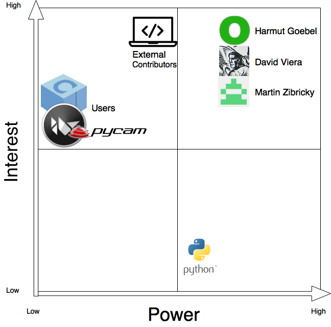

# PyInstaller

Written by Vincent Koeten (@[vincentrk](https://github.com/vincentrk)), Vito 
Kortbeek (@[iiKoe](https://github.com/iiKoe)), Ruben Starmans 
(@[rubenstarmans](https://github.com/rubenstarmans)) and Lars Wijtemans 
(@[lars2309](https://github.com/lars2309)).

## Abstract {#abstract}

The following chapter will analyse the architecture of the
[PyInstaller](http://www.pyinstaller.org) system.
This will be based on the cardinal aspects of software architecture.
First the major stakeholders of PyInstaller will be reviewed along with a close
look at who contributes to, maintains, and uses PyInstaller.
After, the development and deployment of PyInstaller will be examined.
Next is a look into the security of PyInstaller.
Following is discussion about the technical debt found in the system and how to
reduce it.
Lastly the challenges the maintainers face while reviewing external 
contributions and what merging strategy they apply to this will be inspected.

## Introduction {#intro}

PyInstaller is a program that packages Python programs into stand-alone
executables.
Some of the goals of PyInstaller include being compatible with Python 2.7 and
Python 3.x, working on a large variety of operating systems, and supporting 
3rd-party packages without user intervention.
The advantage of packing Python programs with PyInstaller is that deployment can
be done by just having to transfer a single packed executable to the target
systems.
There is no need to install a specific Python version, nor any of the program's 
dependencies.
This makes PyInstaller a valuable tool for software developers who want to
easily distribute their Python programs.
This chapter aims to provide insight into the structure and evolution of
the PyInstaller code and development process.

## Stakeholders {#stakeholders}

PyInstaller is an interesting, complex project and has seen many
iterations and changes, the team included.
There is a long [list](http://pyinstaller.readthedocs.io/en/stable/CREDITS.html)
for crediting everyone who has participated in the development of PyInstaller,
along with a short dedication on PyInstaller's [main website](http://www.pyinstaller.org/development.html).
Since the list spans a number of years, we are only going to reference the
more recent stakeholders.
There are a few people who fit into more than one of the defined categories
in Chapter 9 of Rozanski and Woods. [[1](#bookrozanski)]

Definition: A stakeholder in a software architecture is a person, group, or
entity with an interest in or concerns about the realisation of the
architecture. [[1](#bookrozanski)]

In table [1](#stakeholders) the stakeholders of PyInstaller will be 
explained by the categories defined in Rozanski and Woods [[1](#bookrozanski)].

| Type          | Stakeholders.                                                                                                                                                                                                                            | Task                                                                                                                                                                                                    |
|---------------|------------------------------------------------------------------------------------------------------------------------------------------------------------------------------------------------------------------------------------------|---------------------------------------------------------------------------------------------------------------------------------------------------------------------------------------------------------|
| Assessors     | [Harmut Goebel](https://github.com/htgoebel), [Thomas Waldmann](https://github.com/ThomasWaldmann) and [David Vierra](https://github.com/codewarrior0).                                                                                  | Monitoring and enforcing the coding standards.                                                                                                                                                          |
| Communicators | David Cortesi.                                                                                                                                                                                                                           | Managing PyInstaller's documentation.                                                                                                                                                                   |
| Developers    | [Giovanni Bajo](https://github.com/rasky) and [William Caban](https://github.com/williamcaban).                                                                                                                                          | Initial development.                                                                                                                                                                                    |
| Maintainers   | Harmut Goebel, [Martin Zibricky](https://github.com/matysek), David Cortesi, and David Vierra.                                                                                                                                           | Maintaining PyInstaller with regards to current development, PR's and documentation                                                                                                                     |
| Suppliers     | Microsoft, Apple, various Linux distributions and GitHub.                                                                                                                                                                                | Developing and distributing the operating systems PyInstaller runs on. Github supplies the hosting.                                                                                                     |
| Support staff | [PyInstaller documentation](https://pyinstaller.readthedocs.io/en/stable/),  [#pyinstaller IRC channel](https://webchat.freenode.net/?channels=pyinstaller) and [Stack Overflow](http://stackoverflow.com/questions/tagged/pyinstaller). | These different platforms provide support to contributors and users by means of documentation and Q&A.                                                                                                  |
| Testers       | [Bryan A. Jones](https://github.com/bjones1) and numerous bug hunters and testers mentioned in the [credits](http://pyinstaller.readthedocs.io/en/stable/CREDITS.html).                                                                  | Bryan wrote the original test suite. Multiple contributors added test cases and spotted bugs.                                                                                                           |
| Users         | Private users, developers and enterprise users. [A small list](https://github.com/pyinstaller/pyinstaller/wiki/Projects-Using-PyInstaller)                                                                                               | Use PyInstaller to package and distribute their application to their own users. Enterprise users have a financial interest as they use PyInstaller to distribute their application to paying customers. |

 *Table 1: Stakeholders of PyInstaller*

### Power and Interest Graph

In figure [1](#powerinterestgraph) the stakeholders of PyInstaller are 
placed onto the graph according to their power and interest in PyInstaller. 
For this the most relevant and interesting stakeholders are used. 
The figure represents the degree of each party's interest in and power to 
change PyInstaller.
The core maintainers have both a high interest and power to change PyInstaller 
as they make all the decisions.
The users have a high interest but little power over PyInstaller.
External contributors that take the time to add to PyInstaller have a high 
interest and also some amount of power.
This is because their contributions can have an actual impact to the 
functionality.
Lastly Python is in the graph because PyInstaller is written in Python and 
updates to it might influence the development done by the maintainers.
Python, however, does not have any direct interest in PyInstaller.

 
*Figure 1: Power/Interest graph for PyInstaller*

## Context View {#viewcontext}

To analyse a system it is not only needed to thoroughly analyse the internal
components, but also to take a good look at the interactions a system has with
the outside world.
These interactions come in many forms, for example interactions with other
projects as dependencies, or interactions with a user.

A context view can be created to visualise this communication flow between
PyInstaller and the entities it interacts with.
The system itself is depicted as a black box with outgoing arrows to those
external entities and thereby creates an easy to understand overview of the
system and its relations.

*Figure 2: Context view of PyInstaller*

Figure [2](#contextview) shows that the users can interact with the system
through GitHub by means of generating issues for problems related to PyInstaller.
For less technical and more general questions, such as the usage of
PyInstaller, users can either join the IRC channel, send an email to the mailing
list, or ask a question on Stack Exchange.
For downloading and setting up PyInstaller, the user can visit the official
website where instructions regarding the installation are located.

Because PyInstaller packages Python applications, it inherently depends on
Python for its operation, as without Python there is no need to package Python
applications.
Other hidden dependencies include the operating system related ones.
These are needed by PyInstaller to extract the needed information and libraries
when it is packaging an application.
A change in the functionality of these system tools greatly influences the
operability of PyInstaller.

As PyInstaller is a way to package a Python applications, it is used by the
creators of Python applications to package their software.
Because of this, big projects depend on PyInstaller and its correct operation to
be able to package their applications in a form that can easily be distributed.
This causes a great dependency by those projects on PyInstaller.

## Development View {#viewdevelopment}
To get a better understanding of the PyInstaller project the architectural
structure of the project will be analysed. To do this multiple models that
represent the project in its current state are created as described in
Software Systems Architecture by Nick Rozanski and Eoin Woods. The module
organisation, the common design models and the codeline
models will be discussed in this section.

Each of these models will give more insight into the project from a
developers standpoint and should make clear which steps are taken in each
part of the development.

### Module Structure
In figure [3](#modulestructure) the structure of the modules of PyInstaller
is shown. In this view the dependencies of the modules become clear.
Most important to note of this view is the way the hooks are used for external
libraries.
The main executable building scripts access these via the utilities.
This view also describes what the tool actually uses and how the user's Python
application is bundled into the single executable file or folder.  

*Figure 3: Module structure of PyInstaller*

### Common Design Models
Certain processing that is very common for a system to run should not be
duplicated in each part of the system.
They should rather be separated into their own dedicated code components.
This makes the system more understandable and maintainable.
For PyInstaller there are two main parts that are used throughout the project
which should be held against the design principles enforced by the project.

First there is the message logging that PyInstaller does.
PyInstaller uses log messages for things such as debugging and error
reporting, but because it is run via the command line the messages are also
used for informational purposes.
For message logging it is important that the standard
[logging objects](https://docs.python.org/3.5/library/logging.html) supplied in
the Python library are used.
This library uses standard log levels of which INFO, WARN, DEBUG, TRACE,
ERROR, and FATAL are used by PyInstaller.
New contributions with respect to message logging should adhere to these
levels.

Next is the way PyInstaller is configured at run-time.
The configurations are saved in a general configurations file which can be
imported in other source files.
This way variables that are needed in run-time can also be added via the
command line by adding them as a new variable to the configurations.
PyInstaller uses a `dict()` object from Python to store parameters in the
`CONF` variable in the main run-time configuration file.
Parameters needed in run-time should be defined in the comments of this
configuration file and can be accessed during run-time by calling the `CONF`
object with the right key.

### Codeline Model

The PyInstaller code is mostly written in Python and C.
The Python portion is
responsible for packaging the application.
The C portion is the bootloader which
is part of the bootstrap process.
The project is managed on GitHub, but releases
can also be downloaded from the [official website](http://www.pyinstaller.org/)
and through the [`pip`](https://pypi.python.org/pypi/pip) python package
manager.
For developers it's recommended to clone the `develop` branch.

#### Directory Structure
The root folder of the PyInstaller GitHub project contains a number of
directories and files.
In table [2](#mostsignificantdirectories) the most significant directories 
are described.

| Directory      | Contains                                                   |
|----------------|------------------------------------------------------------|
| [PyInstaller](https://github.com/pyinstaller/pyinstaller/tree/develop/PyInstaller)  | The main Python code for packaging applications            |
| [bootloader](https://github.com/pyinstaller/pyinstaller/tree/develop/bootloader)    | Bootloader code and build utilities                        |
| [doc](https://github.com/pyinstaller/pyinstaller/tree/develop/doc)                  | Documentation                                              |
| [scripts](https://github.com/pyinstaller/pyinstaller/tree/develop/scripts)          | Helper scripts for releasing and updating the project      |
| [tests](https://github.com/pyinstaller/pyinstaller/tree/develop/tests)              | Tests, both unit and functional                            |

*Table 2: Most significant directories of PyInstaller*

There are also some important files present in the root directory, some hold
information regarding the project such as
[`COPYING.txt`](https://github.com/pyinstaller/pyinstaller/blob/develop/COPYING.txt)
and
[`README.rst`](https://github.com/pyinstaller/pyinstaller/blob/develop/README.rst).
Others are used to setup PyInstaller, such as `setup.py` which is a standard way
to setup/install Python applications and modules.
Also the main Python script which launches PyInstaller, `pyinstaller.py` is
present in the root directory.

#### The PyInstaller Application
Most of the application code resides in the PyInstaller directory.
Within this directory there is a defined structure for the separate tasks
PyInstaller undertakes to package an application.
The main directories within the PyInstaller directory are shown in table [3](#directoriesinpyinstaller).

| Directory      | Contains                                                                                         |
|----------------|--------------------------------------------------------------------------------------------------|
| [bootloader](https://github.com/pyinstaller/pyinstaller/tree/develop/PyInstaller/bootloader)  | Precompiled bootloader executables for Linux, Windows and OS X                                   |
| [building](https://github.com/pyinstaller/pyinstaller/tree/develop/PyInstaller/building)      | Code for building the package containing the application                                         |
| [depend](https://github.com/pyinstaller/pyinstaller/tree/develop/PyInstaller/depend)          | Code for detecting the dependencies of the application, both binary and Python modules           |
| [hooks](https://github.com/pyinstaller/pyinstaller/tree/develop/PyInstaller/hooks)            | Hooks for Python modules that need special treatment when packaging                              |
| [lib](https://github.com/pyinstaller/pyinstaller/tree/develop/PyInstaller/lib)                | Modified 3rd party Python modules that need changes to be compatible with PyInstaller packaging  |
| [loader](https://github.com/pyinstaller/pyinstaller/tree/develop/PyInstaller/loader)          | Python code for loading a packaged application                                                   |

*Table 3: Directories within PyInstaller*

#### The Bootloader
The bootloader can be seen as a separate project within the PyInstaller project.
It's task is to bootstrap the application by extracting the application if
needed, setting up the environment for the Python interpreter and finally
running the application within this Python interpreter.

The bootloader is written in C and is located in the aforementioned bootloader
directory in the root of the project.
It is meant to have no 3rd party dependencies in the form of libraries and
should be compilable for all the officially supported platforms (Linux, Windows
and OS X).  
The main directories within the bootloader directory are shown in table [4](#directoriesinbootloader).

| Directory      | Contains                                                    |
|----------------|-------------------------------------------------------------|
| [src](https://github.com/pyinstaller/pyinstaller/tree/develop/bootloader/src)         | The source code for the bootloader common to all platforms  |
| [windows](https://github.com/pyinstaller/pyinstaller/tree/develop/bootloader/windows) | Code specific to Windows                                    |
| [zlib](https://github.com/pyinstaller/pyinstaller/tree/develop/bootloader/zlib)       | A library to unzip archived Python modules                  |

*Table 4: Directories within the bootloader*

The bootloader directory also contains the files needed to build the bootloader
for all the supported platforms.
Building the bootloader is simplified by the use of
[waf](https://github.com/waf-project/waf), which is a build system written in
Python for configuring, compiling and installing applications.
There is no automated testing for the bootloader, there is however a `debug`
option which can be set at compile time which will print useful information and
errors during runtime.

#### Testing
The `tests` directory in the root of the PyInstaller project contains the tests
to make sure all the components of PyInstaller are working correctly.
The first set of tests are functional and reside in the `functional` directory,
these test functionality by creating actual executables using PyInstaller.
The `unit` directory contains unit tests for the components of PyInstaller.
The directory `old_suite` contains the old test structure of which some tests
still have to be migrated to the new structure.
For running the tests, the [`pytest`](http://doc.pytest.org/en/latest/)
framework is used.
Whenever a new pull request is made to the PyInstaller project on GitHub the
tests are run automatically by the continuous integration tools.
[travis-ci](https://travis-ci.com/) is used for Linux and OS X testing and
[AppVeyor](https://www.appveyor.com/) is used for testing on Windows.

#### Release Process
The [release process](https://github.com/pyinstaller/pyinstaller/wiki/Development-Release)
of PyInstaller conforms to [PEP4040](https://www.python.org/dev/peps/pep-0440/).
This describes
> . . . a scheme for identifying versions of Python software distributions . . .

The current version of PyInstaller is version
[3.2.1](https://github.com/pyinstaller/pyinstaller/releases/tag/v3.2.1).
The version number has the format `major.minor.micro`.

Releases are not done according to a time schedule, but are done when the
maintainer is satisfied with the amount of changes made.
A milestone is also created with components that need to be finished before a
certain minor release.
Micro releases are mostly fixes and can happen more quickly, but this of course
depends on the gravity of the fixed issues.
Major releases are reserved for big overhauls.
The current major release was made when support for Python 3 was added to
PyInstaller.

The release process includes uploading a new version of PyInstaller to the
[`pip`](https://pypi.python.org/pypi/pip) Python package manager and marking the
commit as release on GitHub.

## Deployment View {#viewdeployment}

The PyInstaller project can run on multiple platforms.
The officially supported platforms are:
* Windows XP or newer
* Mac OS X 10.7 (Lion) or newer
* Linux

For each of these platforms there are different requirements.
In terms of hardware there are no special requirements other than that it can
run one of the listed operating systems.
In terms of software there are a number of requirements.
This also has to do with the fact that PyInstaller runs on multiple operating
systems and how it accomplishes its goal, namely creating an application
bundle, depends greatly on the used operating system.
PyInstaller has support for multiple Python versions and can be run using Python
2.7 and Python 3.3–3.5.

### Windows
Windows requires either PyWin32 or pypiwin32, which are both Python
interpreters.
The interpreter used to run PyInstaller will also be packed into the produced
package for distribution.

### Linux and Mac OS X
PyInstaller requires a number of tools which make it possible to discover and
extract library details which need to be packaged with the application and used
within the bootloader.
This is needed for the application to be stand-alone.
The tools needed are `ldd`, `objdump` and `objcopy`.
A caveat is that applications packaged with a certain `glibc` version can only
run on systems with an equal or newer versions of `glibc`.

### Python and System Libraries
As the goal of PyInstaller is to convert Python projects into a distributable
format, it also requires the same libraries as needed for the target application
to be packaged.
For example when a package uses the QT libraries to create a GUI application,
PyInstaller also depends on these libraries to be available on the system.
This is not because they need to be executed by PyInstaller, but because they
need to be discovered and copied into the final application created by
PyInstaller.

### Precompiled Bootloader
PyInstaller contains precompiled executables for each of the officially
supported operating systems.
This is because a different bootloader is needed for each different operating
system.
For Windows and Linux both 64- and 32-bit versions are bundled and for OS X only
a 64-bit variant is included.
The reason for including the precompiled bootloader is that it will not require
the user to have all tools needed to compile the bootloader.
The rest of PyInstaller is written in Python and is cross-platform as it's
interpreted.

For every release of PyInstaller the bootloader is compiled by a trusted member
for each of the listed operating systems, and the resulting binaries are pushed
to Github for distribution with PyInstaller.

### Optional
PyInstaller does not depend on any Python library for its functionality.
If however encryption of the generated Python bytecode is needed, PyInstaller
needs the PyCrypto package to utilise encryption algorithms.

## Security Perspective {#perspectivesecurity}

Security is something that can't be encapsulated in a single view.
It is applicable to many different aspects which are covered within the views.
To better describe the security measures taken by PyInstaller the security
perspective is applied to the development and deployment view.

### Security Perspective of the Development View
The security perspective applied to the development view mostly concerns the
GitHub development and release process.
When a release is made for PyInstaller the maintainer of the project takes a
certain number of steps which can only be executed by a PyInstaller maintainer.
Also every piece of code contributed to the PyInstaller project in form of a
pull request needs to be approved by the maintainers.
This prevents malicious code from entering the codebase.

### Security Perspective of the Deployment View
When PyInstaller is deployed it is made available for multiple operating
systems.
For each of these a precompiled bootloader is provided.
This is because the bootloader is not written in a language which can be
interpreted as is the case with the rest of the project.
It is not desirable to have the user compile the bootloader as this requires
specific tools.

The precompiled bootloader can however pose a security risk if every contributor
to the PyInstaller project is able to update the precompiled bootloader within
the GitHub project.
This is because there is no real way to verify that the bootloader provided has
no added malicious code.
For this reason only the PyInstaller maintainers are allowed to update the
precompiled bootloader binaries and upload these to GitHub.

### Encryption of the Source
Through PyInstaller it's also possible to
[encrypt](https://pythonhosted.org/PyInstaller/usage.html#encrypting-python-bytecode)
the generated Python bytecode.
This will make it more difficult to decompile the application packaged using
PyInstaller.
This method however is not ideal, as the key is still stored within the
application as it is needed to decrypt the bytecode before it can be executed.
This means that it only makes retrieving the source code harder and not
impossible.

## Technical Debt {#debt}

Technical debt is described in software technology as a piece of software
that is relatively easy to write and works on the short term,
but is not the ideal solution.
Because of this, when a new feature needs to be added at a later stage,
additional work is required to fix the debt taken earlier.
Technical debt is thus expressed in the time it will take to remove the debt.
Note that this is just an indication of the approximate time it will take to
repay the debt, as this will vary for each person.
It can be difficult to fully avoid all technical debt.
Ideally when completing a new feature,
there should be no increase in technical debt,
but when managed consciously there can be some advantages,
like getting a feature to work before a deadline.
Care must then be taken that the debt does not grow to unmanageable proportions.

Technical debt can manifest itself in software in a number ways.
The blog [Think Apps](http://thinkapps.com)
[describes](http://thinkapps.com/blog/development/technical-debt-definition-importance/)
four different kinds of debt in software.

- Design debt
- Testing debt
- Documentation debt
- Defect debt

Design debt is caused by bad design choices made by the programmer.
For example not using design patterns, writing bad code with a high
cyclomatic complexity or code with duplication.

Testing debt is the kind of debt that stems from writing bad tests or no tests
at all.
The writing of tests is sometimes skipped in order to be able to write more
functionality in less time.
If this continues to happen over a longer period the debt increases and later
changing something small might break the whole system without the programmer
knowing what is going wrong.

Documentation debt is obviously caused by not writing the proper documentation,
or, as with tests, no documentation at all.
Writing proper documentation is important for code readability and
maintainability.
Not only for others, but also for the person writing the code.

Defect debt consists of known defects to the system that need to be fixed.
Defect debt might stick around for a long time because the defect does not have
a high enough priority, or because the defect occurs very rarely.
Needless to say, defects need to be fixed in the long run, because they might
cause additional problems for features added in a later release.

### Using SonarQube on PyInstaller

Running [SonarQube](https://www.sonarqube.org) on the PyInstaller codebase
resulted in an 'A' score for technical debt, with an estimated 18 days to solve
the 1078 debts.
In total, 20 bugs and 90 vulnerabilities were identified,
while only 0.8% of the code is duplicated across 25 blocks.

*Figure 4: SonarQube code smells*

Figure [4](#sonarsmells) shows an overview of the technical debts along with a graph
showing which files are most troublesome.
The longest file in PyInstaller,
[lib/pefile.py](https://github.com/pyinstaller/pyinstaller/blob/develop/PyInstaller/lib/pefile.py),
also has the most technical debt,
with just over 3 days accumulated through 129 code smells.

The SonarQube results are not a perfect representation of all the technical
debt present in PyInstaller.
`FIXME` and `TODO` tags are given an estimated 20 minutes each.
This results in a combined debt of nearly 2 days.
However, the action required could take more or even less time.
Additionally, a generic set of rules was used to generate this number,
while the maintainers of PyInstaller may be enforcing a different set.

| Tag            | Technical Debt (time) |
|----------------|-----------------------|
| Brain-Overload | 8 days                |
| Convention     | 6 days                |
| Performance    | 5 hours               |
| Unused         | 4 hours               |
| misra          | 4 hours               |
| Clumsy         | 3 hours               |
| Confusing      | 2 hours               |
| Obsolete       | 25 minutes            |
| cert           | 5 minutes             |
| cwe            | 5 minutes             |

*Table 5: Breakdown of technical debt by category*

Table [5](#sonartags) shows a breakdown of the technical debt by category.
The largest two categories are brain-overload and convention.
If the maintainers are using a different set of coding conventions,
it may be possible that 6 days of debt is not actually present and can be
subtracted from the total.
This indicates that the number produced by SonarQube should not be taken
as an absolute value of debt, but as a rough approximation.

The brain-overload tag is related to code complexity and cognitive complexity,
with the end-goal being to have simple and readable code.
Having around 8 days of debt across 188 issues in this category can be evidence
of having a complex project with intricate functions, or of programmers getting
a feature to work short term with the assumption that they will come back to
refactor and simplify the code later.

SonarQube is immensely useful for maintaining code convention consistency,
having discernible hard lines dividing complicated code and readable code,
identifying trends of bad coding practices, and possibly discovering bugs and
security vulnerabilities.
This tool does not directly identify violations of the
[SOLID principles](https://en.wikipedia.org/wiki/SOLID_(object-oriented_design)).
However, it provides a useful starting point for manual code reviewing.

Looking at the tags with the greatest technical debt,
the brain-overload tag is at the top,
which might be an indication for a violation of the Single Responsibility
Principle or the Open Closed Principle.
One of the files which were given the brain-overload tag is
[archive/writers.py](https://github.com/pyinstaller/pyinstaller/blob/master/PyInstaller/archive/writers.py).
This file has three methods that SonarQube suggests to refactor.
Manual inspection reveals that there are indeed some methods which look quite
complex.
For example, the `save_trailer` method of the `ArchiveWriter` class has a
complexity of 29 where SonarQube would allow only 15.
In addition, the method contains a complex conditionals structure with
a nesting of four layers.
This complex structure might indicate a violation of the Open Closed Principle.
It is still uncertain if it is really a violation, because the
[history of archive/writers.py](https://github.com/pyinstaller/pyinstaller/commits/master/PyInstaller/archive/writers.py)
does not show any classes that are frequently changed together with
[archive/writers.py](https://github.com/pyinstaller/pyinstaller/blob/master/PyInstaller/archive/writers.py).
The containing class `ArchiveWriter` also contains some variables such as
`HDRLEN`, which is used by some methods, but not all of the methods.
This could indicate a violation of the Single Responsibility Principle.

### Bootloader

The bootloader can be considered as a separate project within PyInstaller.
Its job is to bootstrap the generated application by setting up the
environment and starting the Python interpreter and application.

The main Python code is well written and does not contain a lot of technical
debt, as can be seen in the previous section.
The bootloader, however, has some issues related to technical debt.
The bootloader code is written in C and has no unit tests,
which makes some components difficult to verify.
A big problem with C applications is that the programmers have to manage the
memory, and nothing stops the programmer to write outside allocated space.

The PyInstaller bootloader makes extensive use of memory manipulation in the
form of copying strings without any size protection.
This function simply writes all the characters to a destination until it
reaches a terminating character.
The problem that can occur is that, if the length of the source is larger than
the available length in the destination, this function will continue writing
past the allocated space for the destination.
This can lead to undefined behaviour, system crashes, and may in some
circumstances be leveraged by an attacker to execute arbitrary code.

### String Manipulation

Throughout the bootloader `TODO` markers are present stating that the string
operations need to be made safe. This are cases where a buffer overflow can
potentially occur because data is written to a location without checking if the
required space is available.

The reason why this was not done originally is probably because correctly
managing memory can be difficult and introduces a lot of length checking into
the code.
The programmer probably wanted to focus on functionality first.
The `TODO` marker stating that this should be changed is from the
[14th of March 2016](https://github.com/delftswa2017/pyinstaller/commit/9187b075860c2493785bc2061bd24876665b005b)
and the original bootloader code was even written in 2013.
This means that this potentially unsafe code has been in use for a long time.

Solving this problem is not as simple as just replacing these functions with
their safer counterparts, as this is not always needed or practical.
If earlier in the code the maximum size of the source was already determined
to be smaller then the destination,
using a `strncpy` would lead to a waste of resources,
as it takes longer to execute than the unsafe `strcpy`.

Another problem occurs when there is no information regarding the available
length of the destination.
In such a case it is not wise to define a magic number or import the maximum
size from some higher 'layer',
but it may be best to keep the current, potentially 'unsafe', implementation.
This is because in these cases it is up to the calling function to make sure
that these buffers are sufficiently large.
This can be seen as obeying the: "Single responsibility principle" from SOLID.

These problems can be resolved by analysing each case and judging if they should
be fixed and secondly how the size checking should be implemented.

### Memory and Resource Leaks

Another form of technical debt is not using tools to check your code.
A static analyser can often find memory or other resource leaks,
which can be hard to spot by a programmer.
The downside of such tools, however, is that they take time to set up and that
they can give false positives.
The reason to not use these types of tools is similar to why there are no
tests: in early stages of development it can seem easier to "just run it".

To solve this a static analyser tool (or multiple) can be added to the build
procedure. 
This would force developers to fix potential leaks before they are merged into
the main branch. 
This would also detect and help resolve pre-existing leaks.

## Integrator Challenges and Merge Decision Strategies {#decisions}

Based on an analysis of a selection of the PRs,
there seem to be several important things the maintainers are factoring in
when reviewing and merging PRs.
One of the most important considerations of primary maintainer Harmut Goebel
seems to be the quality of the submitted code.
This entails code duplication, unnecessary bloat, inclusion of tests,
correctness, and adherence to standards.
Next to the quality of the submitted code, commits and their comments should be
clear and logical.
The codebase of PyInstaller and the amount of contributions are small enough
that it can be handled by a single person,
though when the integrator feels they lack the expertise to approve the code,
they will ask another contributor with the necessary skills to co-review.

Although these strategies help maintain the quality of the codebase,
first-time contributors might feel unappreciated when their code gets rejected.
It is therefore important to have clear documentation about the expectations
for code contributions
to help prevent much of this disappointment and additional work.
The [How to Contribute](https://github.com/pyinstaller/pyinstaller/wiki/How-to-Contribute)
section of the wiki plays an important role here.
Unclear policies may incur extra work on the part of the contributors and
the integrators, possibly leading to frustrations and a decline in contributions.
One particularly poorly communicated policy of the PyInstaller project is to
not accept binary executables (the bootloader) as contributions.
This is done for security reasons, but is not mentioned in the documentation.

## Conclusion {#conclusion}

This chapter has reviewed the key aspects of software architecture for
PyInstaller.
The stakeholders were analysed and broken down into categories and then further
plotted in a power-interest graph.
An in-depth examination of the core structure of PyInstaller's system follows, 
describing how it has been developed and how all parts interact together. 
Next, aspects of how PyInstaller is deployed are discussed including which
platforms are supported and how the bootloader is used. 
Security was briefly inspected especially in regards to the bootloader and
encryption.
The technical debt of PyInstaller was thoroughly analysed. 
SonarQube was utilised to approximate the debt while additional attention was
given to the bootloader, string manipulation, and memory and resource leaks.
Finally the challenges and merge decision strategies the maintainers applied
while reviewing contributions was studied. 
All of these analysed attributes allow PyInstaller to continue to package Python
programs into individual executables that can be easily distributed to multiple
platforms.

## References {#references}

1. 

Nick Rozanski and Eóin Woods. _Software Systems Architecture: Working with Stakeholders using Viewpoints and Perspectives._ Pearson Education, Inc., 2005. ISBN 0-321-11229-6
