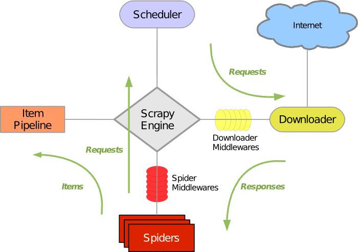
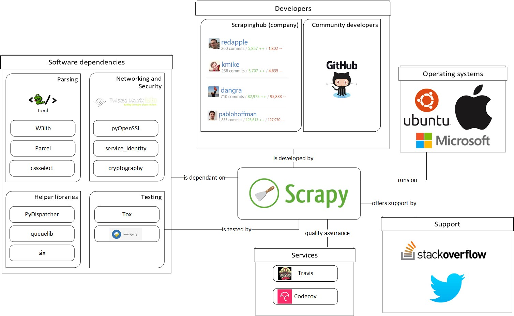
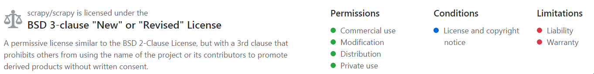

# Scrapy

Joren Hammudoglu ([@jorenham](https://github.com/jorenham)), Johan Jonasson ([@jojona](https://github.com/jojona)), Marnix de Graaf ([@Eauwzeauw](https://github.com/eauwzeauw))

*Delft University of Technology, 2017*

## Abstract

Scrapy is an application framework for crawling websites and extracting structured data which can be used for a wide range of web applications, like data mining, information processing or historical archival. The chapter will start by analysing the Scrapy framework from different perspectives. First, the context view which describes the environment around Scrapy such as dependencies and responsibilities. Then the development view with the architectural concerns related to Scrapy. The chapter will also describe the operational viewpoint, performance and scalability. The chapter will end with analysing the technical debt related to the code and the evolution of the technical debt.

## Table of contents
1. [Introduction](#introduction)
2. [Stakeholders](#stakeholders)
    - [Types and classes of stakeholders](#Stakeholders_types_and_classes)
    - [Integrators](#Integrators)
3. [Context view](#context_view)
    - [External entities, services and data](#external_entities)
    - [Environmental impact](#environmental_impact)
4. [Development viewpoint](#development_viewpoint)
    - [Codeline model](#codeline_model)
    - [Common design model](#common_design_model)
5. [Operational viewpoint](#operational_viewpoint)
    - [Installation](#installation)
    - [Live monitoring](#live-monitoring)
    - [Support](#support)
    - [Operation in third-party environments](#3rd-party)
6. [Performance and scalability perspective](#performance)
7. [Technical debt](#technical_debt)
    - [Static analysis](#static)
    - [Discussions about technical debt](#discussions_tech)
    - [SOLID principles](#solid-principles)
    - [Testing debt](#testing_debt)
    - [Evolution of technical debt](#evolution)
8. [Conclusion](#conclusion)
9. [References](#references)

## 1 Introduction

Scrapy is an open-source framework for crawling websites and extracting structured data from them.
Crawling websites concerns the cycle of downloading a webpage, following its links and downloading those pages.
It can be used for a wide range of web applications, like data mining, information processing or historical archival.
The general use-case is to extract data from a webpage, which does not provide a public API for its data.
Core functions include, but are not limited to, fetching webpages (crawling), processing them (scraping) and saving the extracted data (exporting).
While Scrapy can do a lot out of the box, it is also designed so one can easily extend existing functionality.

The project architecture is built around the use of ‘spiders’.
The spiders are self-contained crawlers which are given a set of instructions on how to crawl pages and which data to extract from them.
Spiders are implemented to crawl fast and concurrently while also being fault-tolerant and polite to crawled servers.
A general overview on how Scrapy works can be seen in [Figure 1](#Fig1).
Scrapy is written in Python and can be run on Linux, Mac OS and Windows.

*Figure 1: General overview of Scrapy's workings. Adaptation of image from documentation [13](#ref-scrapy-arch).*

This chapter takes the reader through the workings and development of Scrapy, next to the possible problems in the project. 
It starts with the context of the project itself, describing the [stakeholders](#stakeholders), [integrators](#Integrators), [system responsibilities](#system_scope) and [dependencies](#external_entities).
Next, more attention is paid to the code itself and we dive deeper into the structure of Scrapy. 
The [development viewpoint](#development_viewpoint) includes code structure, modules and dependencies, configuration management and coding standards. 
This is continued by the [operational viewpoint](#operational_viewpoint) which describes how Scrapy is operated in the production environment by identifying concerns related to control, managing and monitoring the system. 
After this, Scrapy is analysed from a [performance and scalability perspective](#performance) followed by a description of the [technical debt](#technical_debt) build-up over the years.

## 2 Stakeholders
Several stakeholders are present for widely-used projects like Scrapy. 
Chapter 9 of Rozanski and Woods[[1](#ref-rw)] defines a Stakeholder as follows:
> A stakeholder in the architecture of a system is an individual, team, organization, or classes thereof, having an interest in the realization of the system.

Every type of stakeholder has its own wishes, requirements and influence for the project. 
In the following sections the stakeholders of Scrapy will be described according to their type, class and role.

### Types and classes of stakeholders
Several types and classes of stakeholders are categorised in Chapter 9 of Rozanski and Woods. To better understand the stakeholders, an analysis follows in [Table 1](#tab1) and [Table 2](#tab2) on how they apply to Scrapy.

| Type | Description |
|--------|--------|
|End-users without influence       |   Users who use Scrapy without contributing to the development or decision-making process.
|End-users with influence	|Company employees or professionals using Scrapy in their business, who also contribute to the code and (architectural) decisions of Scrapy to help their own product work better. Examples of these companies are [Scrapinghub](https://scrapinghub.com/) (current maintainer), [parse.ly](https://www.parsely.com/) and any other company found on the [Scrapy companies page](https://scrapy.org/companies/).|
|Specialists knowledge 	|Most active developers and founders with a lot of insight into the system, which again would be employees of Scrapinghub. Other external contributors with specific knowledge about some part of the system are also part of this type.	|

*Table 1: Types of Stakeholders*

| Class | Description |
|--------|--------|
|Maintainers    |Most active (and arguably the most important) class, who manages the evolution of the system once operational. For Scrapy this class consists of a few members described more in detail below and they are the ones accepting and reviewing pull-requests. Notable is that most of them have a connection to Scrapinghub.|
|Developers 	|Construct new functionality, write tests for that and give suggestions on how to build the system. For Scrapy this class consists of all the contributing members on GitHub. |
|Communicators	|Explain the system to other stakeholders via documentation and training materials. In Scrapy these are the people who write the documentation and those that answer questions on forums, GitHub and [StackOverflow](https://stackoverflow.com/questions/tagged/scrapy). Without this active community it would be unclear for users how to use the framework for their unique project.
|Testers		|Tests the system to ensure that it is suitable for deployment. Scrapy does this by using [Tox](https://tox.readthedocs.io/en/latest/) for (unit)testing. New features must be accompanied by test cases so that tests can easily be run before merging a new code contribution. This class in Scrapy contains the reviewers to the pull-requests on GitHub but also all the developers who are expected to test their code before they make a pull-request.	 |
|Users 			|Ultimately makes use of Scrapy and provide requests for new functionality and provide bug reports.			 |
|Assessors	| Oversees conformance to standards and legal regulation. This class consists mostly of the reviewers and thus overlaps with the Maintainers class.	|
|Acquirers | Oversees the procurement of the product. As Scrapy is free to use and uses open-source free modules, no entities can be found belonging to this class.|

*Table 2: Classes of Stakeholders*

To get more insight into the Scrapy framework and development, an analysis of issues and pull-requests was made. 
The results were that the most active commenters and reviewers are [Kmike](https://github.com/kmike) and [Redapple](https://github.com/redapple) who are employees of Scrapinghub. A few other actively contributing members were also present by creating issues, pull-requests and comments. Most of the issues and pull-requests are related to fixing existing code. 
There are also issues related to fixing technical debt and implementing new features.

One example of an interesting issue is [#2568](https://github.com/scrapy/scrapy/issues/2568). The issue is a discussion about removing old deprecated code versus keeping it for backward compatibility. 
As discussed more in the [technical debt](#technical_debt) section, Scrapy tends to keep outdated code for a long time. From looking at the pull-requests it is found that Scrapy often uses one reviewer and an automatic [Codecov](https://codecov.io/) report.
A final overview of the stakeholders is displayed in [Figure 2](#figure2).

*Figure 2: Stakeholders overview*

### Integrators

From the analysis the integrators @[Kmike](https://github.com/kmike), @[Redapple](https://github.com/redapple) and @[Dangra](https://github.com/dangra) can be identified, who are active in reviewing and accepting pull-requests. 
The founders @[Pablo Hoffman](https://github.com/pablohoffman) and Shane Evans also greatly contributed to the project. 
Pablo Hoffman is still the biggest overall contributor to the Scrapy GitHub but is not active anymore. All of the above is part of the Scrapinghub organisation on GitHub.

The method for contributing new patches to Scrapy can be found on the [ReadTheDocs of Scrapy](https://doc.scrapy.org/en/master/contributing.html#writing-patches). 
They encourage small patches, require all tests to pass and that new tests cases are created for new features. 
If the patch changes the API, the documentation changes should be added together with the feature.

From the analysis on the pull-requests and issues it is found that pull-requests are accepted after one member has reviewed it. 
All pull-requests are checked with an automatically executed Codecov report. 
Pull-requests are used for code reviews and resolving GitHub issues. 
Discussion on features or bugs is done in issues and there is almost always an issue referenced in a pull-request. 
Most of the pull-requests seem to be corrective and fixes errors or other issues.

## 3 Context view

In this section we will assume Scrapy to be a black box. 
This will illustrate the project in its context, while not looking at the internal workings.
We will focus on which environmental factors Scrapy depends on, and what influence Scrapy has on its environment.
This formalisation of context is described by Rozanski and Woods, Chapter 16 [[1](#ref-rw)].

### External entities, services and data

In this subsection we will peek into the black box and look at how it handles its dependencies and what it does with other external entities and services.

Internal systems of the Scrapy project include the documentation website, the user interaction channels such as Twitter, an email list and an IRC channel. 
The original development environment for Scrapy is Python 2 and in the past years Scrapy has gained Python 3 support.
This increases the complexity because there have been breaking API changes in Python 3 with respect to Python 2. 
Aside from this, Scrapy has many dependencies on external libraries, which are listed in [Table 3](#tab3).

| Dependency                                                                                           | Purpose                                                                                    | Type                        |
|--------------------------------------------------------------------------------------------------    |----------------------------------------------------------------------------------------    |-------------------------    |
| [lxml](http://lxml.de/)                                                                              | Efficient XML and HTML parser                                                              | Parsing                     |
| [parsel](https://pypi.python.org/pypi/parsel)                                                        | HTML/XML data extraction library written on top of lxml                                    | Parsing                     |
| [w3lib](https://pypi.python.org/pypi/w3lib)                                                          | Multi-purpose helper for dealing with URLs and web page encodings                          | Parsing                     |
| [cssselect](https://github.com/scrapy/cssselect)                                                     | Parse CSS(3) to XPath1.0 expressions, maintained by the Scrapy devs themselves             | Parsing                      |
| [Twisted](https://twistedmatrix.com/)                                                                | Asynchronous networking framework, which the entire Scrapy codebase is built on top of. This framework also allows for unit-testing   | Networking and Security     |
| [cryptography](https://cryptography.io/) and [pyOpenSSL](https://pypi.python.org/pypi/pyOpenSSL)     | Deal with various network-level security needs                                             | Networking, Security and Testing   |
| [pyOpenSSL](http://www.pyopenssl.org/en/stable/)                                                     | Python wrapper around [OpenSSL](https://www.openssl.org/)                                  | Networking and Security     |
| [service_identity](https://github.com/pyca/service_identity)                                         | Checking the validity of certificates.                                                     | Networking and Security     |
| [PyDispatcher](http://pydispatcher.sourceforge.net/)                                                 | Process signals with multiple consumers and producers                                      | Helper libraries            |
| [queuelib](https://github.com/scrapy/queuelib)                                                       | Collection of persistent (disk-based) queues, originally part of Scrapy                    | Helper libraries            |
| [six](https://github.com/benjaminp/six)                                                              | Python 2 and 3 compatibility                                                               | Helper libraries            |
| [Tox](https://tox.readthedocs.io/en/latest/)                                                         | Tests Scrapy on Python versions 2.7, 3.3 - 3.7 and Pypy                                    | Testing                     |
| [Coverage](https://bitbucket.org/ned/coveragepy)                                                     | Measurement tool for code coverage of tests                                                | Testing                     |

*Table 3: Scrapy's dependencies*

Scrapy’s source code and documentation are maintained on GitHub. 
Here, stakeholders also discuss bugs, fixes and propose new features. 
The code is available for use and modification, although the license needs to be included and the name Scrapy cannot be freely used for promotion.

Scrapy is (unit)tested using the [Tox](https://tox.readthedocs.io/en/latest/) and [coverage](https://coverage.readthedocs.io/en/coverage-4.3.4/) libraries, described in more detail below. 
While Scrapy is written in Python and theoretically executable on any platform that runs Python, there are some platform-specific considerations. 
An example of this is [#2561](https://github.com/scrapy/scrapy/pull/2561).
This pull-request makes it evident that running Scrapy requires a different setup and dependencies on an operating system other than Linux.

There are many web crawling frameworks, and defining competition is a matter of choosing how wide to cast your net. 
Scrapy is the most complete and mature web crawling framework in Python, but in other languages and for other scales there are many other frameworks [[2](#ref-crawlers)].
Scrapy is intended for a scale of crawling from one site up to a couple of thousand, but not intended for example as a broad web crawler to use as a basis for a search engine, such as those employed by Google, Bing etc.

The users of Scrapy consist of individuals and companies. 
Some of these companies are listed on the [Scrapy website](https://scrapy.org/companies/).

When a pull-request is submitted to the Scrapy repository, automated services check the quality of the submitted code. 
The tests are run using the [Travis](https://travis-ci.com/) continuous testing service. 
If tests fail in any of the enabled Python versions, a red cross will appear in the pull-request, indicating that the proposed code change should be fixed.
For measuring the number of code lines that are covered by the tests, [Codecov](https://codecov.io/) is used.
This service is publically accessible and displays exactly which lines are tested and the percentage of those lines.
This percentage is the ratio of test-covered lines and the total amount of lines.
It also offers a very useful sunburst diagram of the coverage distribution of the code structure.

An overview of the relations Scrapy has with external entities is depicted in [Figure 3](#figure3)

*Figure 3: External entities*

### Environmental impact

Web crawling can make a lot of requests to the web. Crawling a single webpage with many requests can result in a DDoS effect on the website and make it unavailable or slow. Crawling multiple webpages requires many DNS lookups to the crawlers DNS server. 

A result could be a slow network and a response from web servers could be an IP block. These problems can be avoided by limiting the amount of requests to a server within a time limit and using a local DNS server.

## 4 Development viewpoint

The development view focuses on the architecturally significant concerns, as described by Rozanski and Woods, Chapter 20 [[1](#ref-rw)].
In this section we will describe how the code is structured, how the modules and their dependencies are organised, the way different configurations are managed and the standardisation of design and testing. 
Additionally, we will investigate the planning and design of the software development environment which is used to support the development of the system.

### Codeline model

This subsection will describe how source code is organised, tested and managed. 

#### Configuration management
Scrapy uses GitHub for version and configuration management. 
Different versions are maintained using [tags](https://github.com/scrapy/scrapy/tags), different configurations with branches. 
The latter are generally used for big experimental features or code rewrites, where multiple developers contribute to.
Once they are sufficiently tested and approved by the maintainers, they can be merged to the master branch.
An example branch is [asyncio](https://github.com/scrapy/scrapy/tree/asyncio).
Although not maintained anymore, it illustrates the joint work on the support of a fundamental architectural feature.
In contrast, small changes to the current configuration (e.g. a bugfix or feature) can be pull-requested directly to the master branch.

#### Release process
A release in Scrapy is defined by a release number with 3 numbers, A.B.C. 
A is the major release number where changes are rare and are meant for large changes. 
Scrapy is still in version 1.X and A has only changed from 0 to 1 when Scrapy was defined to be production ready and with a stable API.
B is the release number for new features and updates which might break backward compatibility. 
C is only for bugfix updates. 

Every new Scrapy release is accompanied with release notes explaining new features, bug fixes, documentation changes and dependency changes. 

Releases are handled on GitHub using the release system and tags. 
The latest release 1.2.2 was released on dec 6 2016 and there are currently tags for 1.2.3 and 1.3.2 on GitHub.

Documentation updates are required to be created by the developer with the pull-request. 
Other documentation changes are handled with the same process as a code update with pull-request and issues. 

#### Test build and integration approach

When a contributor adds a new feature or fixes a bug, it is required to write tests as specified in the [documentation](https://doc.scrapy.org/en/master/contributing.html#writing-tests). 
They should cover the added or changed lines and they should pass.

The source code is automatically tested with unit-tests using the Twisted unit-testing framework [[3](#ref-twisted)] in combination with [Tox](https://tox.readthedocs.io/en/latest/). 
Due to the multiple Python versions (2.7 and 3.3 - 3.6) that are supported, the tests are run on each of these versions.
To ensure that all the tests pass on each environment before pushing code to the master branch, [Travis](https://travis-ci.com/) is used.

Analogously, [coverage.py](https://coverage.readthedocs.io/en/coverage-4.3.4/) and [Codecov](https://codecov.io/) ensure that the number of tested code lines is sufficiently high.
The dropping of coverage for a new feature could indicate that it is poorly tested, which is why this is automatically displayed in the corresponding pull-request.

#### Code structure

We will discuss the structure of the code by describing the folders inside the Scrapy master branch for version [1.3.2](https://github.com/scrapy/scrapy/tree/1.3.2). 

The [artwork](https://github.com/scrapy/scrapy/tree/1.3.2/artwork) directory contains the Scrapy logo and fonts used for that logo. 
In the [debian](https://github.com/scrapy/scrapy/tree/1.3.2/debian) directory are several files responsible for packaging Scrapy into a Linux executable.
The [docs](https://github.com/scrapy/scrapy/tree/1.3.2/docs) folder contain the markdown sources for the [offical Scrapy documentation](https://doc.scrapy.org/en/1.3/).
Miscellaneous scripts for i.e. bash completion and coverage report can be found in the [extras](https://github.com/scrapy/scrapy/tree/1.3.2/extras) folder.
Scrapy Enhancement Proposals (SEP) are placed in the [sep](https://github.com/scrapy/scrapy/tree/1.3.2/sep) directory. These markdown files are mostly old feature proposals.
Automated tests are placed in the aptly named [tests](https://github.com/scrapy/scrapy/tree/1.3.2/tests) folder. 
Inside, there are a few folders for keys, sample data and with test cases for a few modules.
The main source code is all located in the [Scrapy folder](https://github.com/scrapy/scrapy/tree/1.3.2/scrapy). 
Most modules are placed into subdirectories which are listed below. 
All of the smaller modules are placed directly into the `scrapy` folder. 
There are also old files from moved modules. 
For example `spider.py`, the spider code is now in a directory but the spider.py still exists in the top folder with deprecated warning code.

Inside of the source code directory, there are three deprecated modules: [contrib](https://github.com/scrapy/scrapy/tree/1.3.2/scrapy/contrib), [contrib_exp](https://github.com/scrapy/scrapy/tree/1.3.2/scrapy/contrib_exp) and [xlib](https://github.com/scrapy/scrapy/tree/1.3.2/scrapy/xlib). 
They are still there for backward compatibility. 
The contrib form `contrib` is now placed in the [extensions](https://github.com/scrapy/scrapy/tree/1.3.2/scrapy/extensions) module. 

The [core](https://github.com/scrapy/scrapy/tree/1.3.2/scrapy/core) module is for several essential sub-modules; the Scrapy engine, scheduler, scraper, spider middleware and downloader.
Another integral part of Scrapy are the [spiders](https://github.com/scrapy/scrapy/tree/1.3.2/scrapy/spiders). 

Creating a Scrapy project requires one to implement a spider to define which webpages should be crawled and what data should be extracted, as explained in the [documentation](https://doc.scrapy.org/en/1.3/topics/spiders.html). 
The data extraction is done by selecting a part of the HTML with either [css](https://www.w3.org/TR/selectors/) or [XPath](https://www.w3.org/TR/xpath/) expressions. 
The implementation for this is in the [selector](https://github.com/scrapy/scrapy/tree/1.3.2/scrapy/selector) module ([docs](https://github.com/scrapy/scrapy/tree/1.3.2/scrapy/linkextractors)). 

Extracting links is a very common use-case, which is why there is the [linkextractors](https://github.com/scrapy/scrapy/tree/1.3.2/scrapy/linkextractors) module ([docs](https://doc.scrapy.org/en/1.3/topics/link-extractors.html)).

Crawling website's requires HTTP functionality, which is mostly found in the [http](https://github.com/scrapy/scrapy/tree/1.3.2/scrapy/http) module.  
The HTTP requests and responses can be processed for e.g. caching and compression purposes with the [downloadmiddlewares](https://github.com/scrapy/scrapy/tree/1.3.2/scrapy/downloadermiddlewares) module ([docs](https://doc.scrapy.org/en/1.3/topics/downloader-middleware.html)). 
The [spidermiddlewares](https://github.com/scrapy/scrapy/tree/1.3.2/scrapy/spidermiddlewares) also offers similar functionality but for the output and input of the spiders ([docs](https://doc.scrapy.org/en/1.3/topics/spider-middleware.html)). 

The extracted data of the spiders is put in containers called items that are managed by the [loader](https://github.com/scrapy/scrapy/tree/1.3.2/scrapy/loader). 
To extract files and images from these items, a [pipelines](https://github.com/scrapy/scrapy/tree/1.3.2/scrapy/pipelines) can be used.
The pipelines implement features to avoid re-downloading files and outputting extracted data. 

The [contracts](https://github.com/scrapy/scrapy/tree/1.3.2/scrapy/contracts) feature is used for testing spiders ([docs](https://doc.scrapy.org/en/1.3/topics/contracts.html)).
Scrapy can be controlled from the command-line with the the [commands](https://github.com/scrapy/scrapy/tree/1.3.2/scrapy/commands) module ([docs](https://doc.scrapy.org/en/1.3/topics/commands.html)). However, we will see in the [Testing Debt](#testing_debt) section, this directory is likely to be removed in the near future.
The [settings](https://github.com/scrapy/scrapy/tree/1.3.2/scrapy/settings) contains the default settings that can be overridden in a Scrapy project.

A big module is [utils](https://github.com/scrapy/scrapy/tree/1.3.2/scrapy/utils). 
It contains different utilities. For example, help to deprecate functions or helper functions for HTTP objects.

#### Module organisation
Large systems are often organised into modules to be able to group related code. 
Modules help with arranging dependencies and lets developers work with modules without affecting other modules and causing unexpected errors or changes to the system. 

We have identified five module categories for Scrapy; the engine, downloader, spiders, item processing and user interface. 
The modules for each category and their high-level dependencies can be seen in [Figure 4](#figure4). 
The modules and their dependencies are listed in [Table 4](#table4) and [Table 5](#table5). 
The inter-module dependencies have been omitted for clarity.

*Figure 4: Scrapy dependency diagram*

#### Standardisation of design
Standardisation of design is important since systems are developed by a team. 
A coherent design will benefit maintainability and reliability since it will be easier to understand or compare different parts of the system. 
The design can be standardised by using design patterns or common software. 

Some standardisations made by Scrapy are to encourage the use of [PEP 8](https://www.python.org/dev/peps/pep-0008/) coding style, a documentation policy. 
Even though the PEP 8 coding style is encouraged it is not heavily enforced and the code contains violations. 
Some examples are [#2429](https://github.com/scrapy/scrapy/pull/2429), [#2147](https://github.com/scrapy/scrapy/issues/2144) and [#2368](https://github.com/scrapy/scrapy/pull/2368).

### Common design model
The common design model lays out some common practices used throughout the project to create coherence and reduce duplication.

#### Logging
The logging has five different levels: critical and regular errors, warning, info and debugging messages, in decreasing order of severity.
Messages are written with a short description of what happened plus a passed object to show the state.
Scrapy uses Python’s own [logging](https://docs.python.org/2/library/logging.html). 
Previously, Scrapy used its own logging implementation. 
According to the [documentation](https://doc.scrapy.org/en/master/topics/logging.html), this has been deprecated in favour of explicit calls to the Python standard logging, but parts remain for backward compatibility.

#### External libraries
External libraries should be imported at the top of the file, to adhere to the PEP 8 standard. 
When importing internal classes, only the used parts are imported. 
There are exceptions to this rule, one of which is the importing of optional libraries.
In this case the import is not guaranteed to work, so this has to be dealt with.
An example of this is in [httpcache.py](https://github.com/scrapy/scrapy/blob/master/scrapy/extensions/httpcache.py#L348), where the `leveldb` import is placed in the class that uses it, to avoid exceptions from being thrown.

#### Interfaces
Scrapy interfaces with spiders through numerically ordered layers of middleware which can be customised or removed at will through specification in a middlewares dictionary. 
Each middleware layer needs to implement a spider input, output, exception and startup method.
Similarly, Scrapy interfaces with a downloader which does the actual HTTP requests through layers of middleware. 
These downloader middleware layers need to implement request, response and exception methods.
Scrapy also allows for extensions to override the default behaviour. 

| Module                | Dependencies                                                                  |
|-----------------------|-------------------------------------------------------------------------------|
| commands              | utils, http, _exceptions_, _item_, settings, linkextractors, contracts, shell | 
| contracts             | utils, http, _exceptions_, _item_                                             |
| core                  | utils, http, _exceptions_, _item_, responsetypes, middleware                  | 
| downloadermiddlewares | utils, http, _exceptions_, responsetypes, core                                |
| extensions            | utils, http, _exceptions_, responsetypes, _mail_                              | 
| http                  | utils, _exceptions_, _link_                                                   | 
| linkextractors        | utils, _exceptions_, _link_                                                   | 
| loader                | utils, _item_                                                                 | 
| pipelines             | utils, http, _exceptions_, settings, selector, middleware                     | 
| selector              | utils, http, _exceptions_                                                     | 
| settings              | utils, _exceptions_                                                           | 
| spidermiddlewares     | utils, http, _exceptions_                                                     | 
| spiders               | utils, http, _exceptions_, selector                                           | 
| utils                 | http, _exceptions_, _item_, settings, selector, spiders                       | 

*Table 4: Scrapy modules*

| Module          | Dependencies                                                          |
|-----------------|-----------------------------------------------------------------------|
| cmdline         | utils, settings, commands, crawler                                    |
| crawler         | utils, settings, core, extension, resolver, interfaces, signalmanager |
| dupefilters     | utils                                                                 |
| exceptions      |                                                                       |
| exporters       | utils, exceptions, item                                               |
| interfaces      |                                                                       |
| extensions      | utils, middleware                                                     |
| item            | utils                                                                 |
| link            | utils                                                                 |
| logformatter    | utils                                                                 |
| mail            | utils                                                                 |
| middleware      | utils, exceptions                                                     |
| resolver        | utils                                                                 |
| responsetypes   | utils, http                                                           |
| shell           | utils, http, exceptions, item, settings, spiders, crawler             |
| signalmanager   | utils                                                                 |
| spiderloader    | utils, interfaces                                                     |
| statscollectors |                                                                       |

*Table 5: Scrapy weak modules (`.py` files living directly in the `scrapy` package)*

## 5 Operational viewpoint

The operational viewpoint will describe how Scrapy is operated in the production environment. 
Here we will identify how Scrapy handles concerns related to control, manage and monitor the system. 
According to Rozanski and Woods Chapter 22 [[1](#ref-rw)] the operational viewpoint is often not completely designed until it is needed and the system is already constructed. 
This is also the case for Scrapy, the installation methods, logging and settings have changed during development.

### Installation

One operational concern is installing and upgrading the system on users hardware and how to configure the installation.

Scrapy is included in the [PyPi repository](https://pypi.python.org/pypi/Scrapy) for Python packages. 
This makes it possible to install, upgrade or uninstall using [pip](https://pypi.python.org/pypi/pip). 
The recommended method to install Scrapy is to use a [virtual environment](https://pypi.python.org/pypi/virtualenv) to avoid conflicts with system packages.
On Windows Anaconda can be used for this but it only works for Python 2.

### Live monitoring

Scrapy can be controlled by the command-line tools. 
It lets the user create, edit and start projects. 
The tools can also be used to run different Scrapy features without a project such as scraping a single webpage. 

To monitor the system during runtime or production, Scrapy uses logging, described more in [Logging](#logging). 
This is also used to capture performance metrics. 

### Support

Scrapy has two support groups, developers and users of the framework. 
Developers mostly have problems with understanding the code or tips on how to solve programming problems. 
The developers get support from each other on GitHub. 
Users of the framework can get support from [StackOverflow](https://stackoverflow.com/questions/tagged/scrapy) or other online communities. 
The users often have problems with installing Scrapy, connection problems and implementation problems. 

### Operation in third-party environments

Scrapy may be forked for any use as long as the name Scrapy is not used without consent, as can be seen in [Figure 5](#Fig-licence) which shows the licence information on GitHub.

*Figure 5: Licence of Scrapy.*

## 6 Performance and scalability perspective 

Scrapy is a web crawling framework, which generally means that a lot of HTTP requests need to be made when it runs.
The big issue with that, is that each request takes a while to get a response.
What also could happen is that a response won't be received, which will take even longer.

With this thought in mind, the Scrapy developers decided to build the framework on top of the Twisted framework [[5](#ref-twisted)], to be able to handle HTTP requests in an asynchronous manner, without the need to write complex code. 

Twisted is a rather heavy-weight networking framework which has been around since 2002. 
It is written in Python and heavily relies on the event-driven programming paradigm [[4](#ref-event-driven)].
That means that one can request a webpage, specify the callback functions that should be called when it completes or throws an error, and then run other code while Twisted is making the request. 
This requires no threads or processes to be spawned, as it can run in one thread, while being non-blocking.
That does not mean that Twisted requires requests to be made in one thread only.
It offers threading facilities to run the requests in separate threads without exposing the user to the underlying complexity.
Twisted is ideal for Scrapy, as it revolves around making many requests, processing the results, and handling errors gracefully. 
This choice has made Scrapy very performant.

Scrapy offers utilities to control the amount of various performance-related settings. 
This is done by specifying parameters in the project settings file. 
These settings involve specifying download delays, timeout durations, cache sizes, whether and how often to retry a failed request, threadpool sizes etc. 
This way the user has full control over the Scrapy performance and it can be fine-tuned to meet their requirements.

Because Scrapy is able to handle a lot of requests, scrape the response pages and save the data, there is the risk of memory issues.
One way this is handled, is by using the `queuelib` library [[5](#ref-queuelib)]. 
It offers a way to create several types of queues on the disk and is optimised for speed.
This prevents e.g. HTML pages that have yet to be scraped to overflow the memory, as it is written to disk.

As memory leaks are often the cause of bad performance, Scrapy has dedicated several utilities and documentation to debugging these leaks [[6](#ref-scrapy-leaks)].
In the documentation there is also a page on how to measure the performance of a spider using the built-in benchmarking tool [[7](#ref-scrapy-benchmarking)].

When making a lot of requests, especially to multiple websites, several external factors can limit performance. For example DNS servers or data throughput.

There are many more measures taken to ensure good performance and scalabity [[8](#ref-scrapy-docs)], [[9](#ref-scrapy-github)]. 
For the sake of brevity, not all of them can be discussed.

## 7 Technical debt

Technical debt can be defined as [[14](#ref-what-is-tech-debt)] :
> a concept in programming that reflects the extra development work that arises when code that is easy to implement in the short run is used instead of applying the best overall solution.

A static analysis, analysis on the use of SOLID principles, testing debt and the evolution of technical debt on Scrapy is described in this section.

### Static analysis

To identify the technical debt we used [Pylint](https://www.pylint.org/) which is a static analysis tool for Python.
Pylint tests the source code for coding standard [PEP 8](https://www.python.org/dev/peps/pep-0008/), error detection related to imports and interfaces and detecting duplicated code.

The result of running Pylint is lots of errors and warnings. Most of the errors are due to decisions taken by the developers and some are mistakes or actual bad coding. The most common errors in the Scrapy code are related to docstrings, imports or PEP 8 compatibility as can be seen in [Figure 6](#Fig-6).

*Figure 6: Results of Pylint*

Scrapy does not use docstrings for modules which are described in the documentation.
It is good to not duplicate the information, also known as the DRY (Don't Repeat Youself) principle [[10](#ref-dry)], but this makes development harder since docstrings are integrated into most IDE's to help code faster (introspection). 
There are also missing docstrings where they are recommended, such as the 'utils' module which has 78 missing docstring messages from Pylint.

The results also contain a lot of import warnings, some due to convenience for the developers. 
By having a lot of imports in the `scrapy.__init__` file, Scrapy modules can be imported by using `import scrapy.Module` instead of `import scrapy.package.Class`. 
Other often occurring warnings in the Pylint report are PEP 8 violations related to code formatting and naming conventions, some lazy exception handling and a few 'FIXME's.
These are errors with mostly low impact on the system and are not likely to cause any problems but it is always good to keep the code clean for easier future changes.

The Scrapy framework for item pipelines, DownloaderMiddleware and Spider middleware have methods that can be implemented by the user, but the methods are only documented in the documentation. 
This could be implemented as abstract classes to inform the user if they forgot to implement a function. 
The abstract classes also help the user to see which methods they can implement and the interface will make it more clear what type of middleware the class is. 
The hard part of designing the abstract classes is that all methods are optional and it has to be compatible with current code. 

Scrapy´s modules and dependencies are a bit messy and from the dependency tables ([Table 4](#table4) and [Table 5](#table5)) we can see that there are modules with a lot of dependencies. 
This leads to tight coupling and we can find classes in the utils modules with very few usages in the code, `ftp.py`, `mulipart.py`, `osssignal.py` which could be moved to other modules to reduce the dependencies in the utils module.  

### Discussions about technical debt

At the time of writing there are 9 TODO's and 4 FIXME's in the source code. 
In the [Scrapy issues](https://github.com/scrapy/scrapy/issues) there are numerous discussions about fixing the technical debt. 
There is for example issue [#2144](https://github.com/scrapy/scrapy/issues/2144) about making the Scrapy code PEP 8 compliant.
However doing this would require a lot of code changes and all attempts have been rejected so far, as it resulted in too many merge conflicts.

There is also issue [#8](https://github.com/scrapy/scrapy/issues/8) that involves refactoring code. 
It has been open since 2011 but it appears that the developers got inspiration on how to fix it after the Django 1.10 release on august 2016.

Other issues involve refactoring as a solution, but are all aimed at improving functionality. 
Following this mindset, we also created an issue [#2633](https://github.com/scrapy/scrapy/issues/2633) that will improve documentation and also cleans up the code, hence paying technical debt. 

The number of issues that focusses solely on technical debt, in contrast with the number of developer notes in the code, indicates that a lot of technical debt issues are in the source code. This is not a good practice since they have the tendency to be overlooked and therefore will probably remain in the code for a long time.

Scrapy has been around since 2009, which is a long time for a framework. 
This also means that there have been a lot of changes and refactors to the code. 
Because of this, there are a lot of deprecated modules and files still present. 
The reason that they have not yet been removed is mostly for the sake of backward compatibility, according to the developers.

To give an example, the `contrib` module has been fully deprecated since version [1.0.0](https://github.com/scrapy/scrapy/tree/1.0.0), which was released in 2015. 
In Februari 2017 (version [1.3.2](https://github.com/scrapy/scrapy/tree/1.3.2)) a discussion started ([#2568](https://github.com/scrapy/scrapy/issues/2568)) on finally removing the code. 
In this issue it was decided to document the deprecation policy to avoid deprecated code for living too long.
This will in turn keep the code cleaner, hence paying technical debt.

### SOLID principles
Scrapy does not often violate the SOLID principles [[11](#ref-solid)], which is a mnemonic acronym for 'Single responsibility, Open-closed, Liskov substitution, Interface segregation and Dependency inversion'. 
These five principles or guidelines, when applied together, will make it more likely that programmers create a system that is easily maintainable.

The Scrapy code does not often use deep levels of abstractions, resulting in a low code complexity.
On the other hand this lack of abstractions can create some confusion for developers. 
As has been explained before, the `item pipelines`, `DownloaderMiddlewares`, `SpiderMiddlewares` but also the `Extensions` can all be abstracted. 
Each of the classes in these modules implement common optional methods or functionality. 
These could be abstracted in a common interface.
We contributed to the Scrapy project by implementing this change.

Non-intentional SOLID violations are hard to find as a lot of the principles are actively used, though not specifically discussed in the issues or pull-requests. 
Examples of where the principles are implemented can easily be found.
The [contracts](https://doc.scrapy.org/en/latest/topics/contracts.html) which are offered for spiders make sure that the newly added spiders work correctly, can be compared with the Liskov Substitution Principle. 
Any spider following the contract can be replaced with any other spider as they all behave the same.
The Single Responsibility Principle is largely adhered to with every scrapy functionality having its own class which becomes immediately clear from the folder structure.
The modules in the DownloaderMiddlewares are all separated by different functionality (http authentication, compression, proxies, cookies etc.) which means that the Interface Segregation Principle with many client-specific interfaces is widely used.

### Testing debt

Scrapy is overall a very well tested framework. 
The overall testing code coverage, according to [Codecov](https://codecov.io/gh/scrapy/scrapy/commit/b48a0bbfb704289d3f2abe4a1705e2940c9cd569), is 83.57% for version [1.3.3](https://github.com/scrapy/scrapy/tree/1.3.3).
In this section we will focus on the 16.43% of the code that is not covered by the tests.

| Module / file                                                                                                   | Coverage | Reason                                                                                                  |
|-----------------------------------------------------------------------------------------------------------------|----------|---------------------------------------------------------------------------------------------------------|
| [`commands`](https://codecov.io/gh/scrapy/scrapy/tree/d3f8f3d38a2b2139fc193d39de8ced05993fd2c6/scrapy/commands) | 63%      | The `Command` classes are not properly tested if they require a project.                                |
| [`cmdline.py`](https://codecov.io/gh/scrapy/scrapy/src/master/scrapy/cmdline.py)                                | 66%      | Print functions aren't tested.                                                                          |
| [`shell.py`](https://codecov.io/gh/scrapy/scrapy/src/master/scrapy/shell.py)                                    | 68%      | Interactive shell detection is untested (hard to test).  Print functions aren't tested.                 |
| [`contracts.__init__.py`](https://codecov.io/gh/scrapy/scrapy/src/master/scrapy/contracts/__init__.py)          | 67%      | Some bad weather cases are untested (easy to test).  `Commands.add_pre_hook` is untested (easy to test).|
| [`pipelines.files.py`](https://codecov.io/gh/scrapy/scrapy/src/master/scrapy/pipelines/files.py)                | 65%      | Amazon S3 storage functionality is badly tested.                                                        |
| [`extensions`](https://codecov.io/gh/scrapy/scrapy/tree/master/scrapy/extensions)                               | 76%      | A lot of untested low-level (memory) debugging utilities (very hard to test).                           |
| [`mail.py`](https://codecov.io/gh/scrapy/scrapy/src/master/scrapy/mail.py)                                      | 76%      | Code returns before the untested code if debug is on. (hard to test).                                   |

*Table 6: Modules and files with low coverage*

To get a good overview of where the testing debt hides, we can employ [Codecov](https://codecov.io/gh/scrapy/scrapy/tree/b48a0bbfb704289d3f2abe4a1705e2940c9cd569/scrapy) to see which modules and files have low coverage.
In [Table 6](#table6) we have compiled an overview of the modules and files with low coverage accompanied by the reasons for this.

What immediately becomes clear from [Table 6](#table6) is that the command-line interface related code is generally poorly tested. 
The main reason for this is that it contains a proportional amount of functions dedicated to printing instructions.
Although it is not hard to test print statements in Python, it could be speculated that the developers did not feel the need to test these as they are not very complex and by looking at the code, it is clear that they work as intended.
Another reason for the low testing coverage of the `commands` module, is that the command-line command that requires a functional Scrapy project are mostly untested.
These project-only commands [[docs](#ref-scrapy-docs)] can be a hassle to test because mocking an entire project, or creating a project that reflects all (or most) possible outcomes of running a command, is hard to do.

The `contracts` module has low coverage as well. 
The reason for this is rumours that the module might be moved and the code will probably change [[12](#ref-move-contracts)].

There is some Amazon S3 storage functionality that is untested. 
However the tests are present, but turned off on Travis because they require a real S3 storage. 
At the moment of writing, there is a discussion going in [#1790](https://github.com/scrapy/scrapy/issues/1790) on how to run these tests in Travis as well.

### Evolution of technical debt
Most issues are picked up quite fast and find their way into master in a relatively short time. 
Removing code which is deprecated, unused or misplaced is not one of the top priorities.
The earliest available Codecov report on the Scrapy GitHub from 19-10-2015 shows a total coverage of 82.64%.
At 2-4-2017 this has improved to a total coverage of 84.66%, showing a slight increase in 1.5 years.

There is no official policy which determines when a deprecated function gets deleted from the codebase. 
As mentioned in issue [#2568](https://github.com/scrapy/scrapy/issues/2568), developers sometimes experience that coding is taking longer than needed or that mistakes are being made because of the existing technical debt. 
An example of this are almost-alike imports (e.g. `scrapy.dupefilter` and `scrapy.dupefilters`) of which one is deprecated but still shows up in the IDE autocomplete of the developer.

The same issue mentions the currently unwritten policy on removing deprecated code:
> It is OK to deprecate something in major release X and remove it in major release X+1 (given that they separated by at least half year or a year), but if the deprecated path doesn't hurt it can be kept for much longer. 

\- @[Kmike](https://github.com/kmike) on Feb 28, 2017

This general strategy can indeed be found when looking at earlier pull-requests, where backward compatibility is often preferred compared to code cleanups. 
This is also discussed in issue [#1096](https://github.com/scrapy/scrapy/issues/1096) as well as the strategy for cleanups which happen just before new major releases. 
As there are not many major version releases this does not happen too often. 
There are only 23 pull-requests (of a total of 1290) related to cleanups, which started appearing from around 2013 increasing in activity as time goes on. 
The average time for these changes to make it to the master vary from a month to a year.

## 8 Conclusion
Scrapy is a widely used and ever-evolving scraping framework. 
It has a vast community of users and new features and bugfixes appear regularly.

In this chapter we have analysed Scrapy from different viewpoints and perspectives. 
We have found that due to the long lifetime of the project, the software architecture has become incoherent.
This is gradually improving, although at a slow pace.

We are confident that Scrapy will continue to be the de-facto standard for scraping webpages using Python.

## 9 References
1. 
Nick Rozanski and Eoin Woods. Software Systems Architecture: Working with Stakeholders using Viewpoints and Perspectives. Addison-Wesley, 2012.
2. 
https://github.com/BruceDone/awesome-crawler
3. 
https://twistedmatrix.com
4. 
https://en.wikipedia.org/wiki/Event-driven_programming 
5. 
https://pypi.python.org/pypi/queuelib
6. 
https://doc.scrapy.org/en/master/topics/leaks.html
7. 
https://doc.scrapy.org/en/master/topics/benchmarking.html
8. 
https://doc.scrapy.org/en/master/
9. 
https://github.com/scrapy/scrapy
10. 
https://en.wikipedia.org/wiki/Don't_repeat_yourself)
11. 
https://en.wikipedia.org/wiki/SOLID_(object-oriented_design)
12. 
https://github.com/scrapy/scrapy/issues/1918
13. 
 https://doc.scrapy.org/en/0.10.3/topics/architecture.html
14. 
 https://en.wikipedia.org/wiki/Technical_debt
