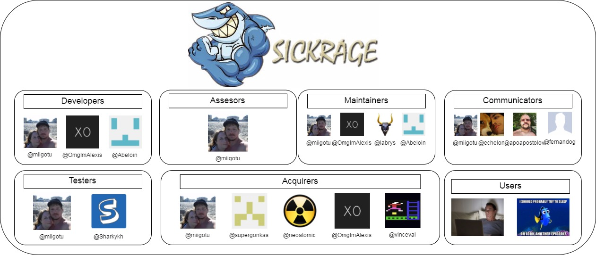
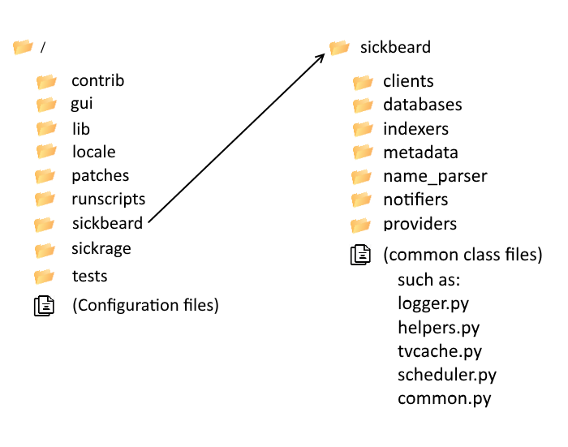
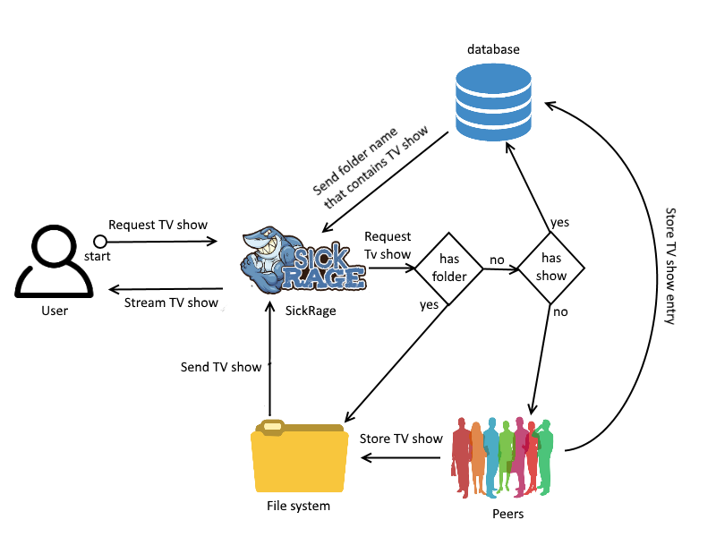
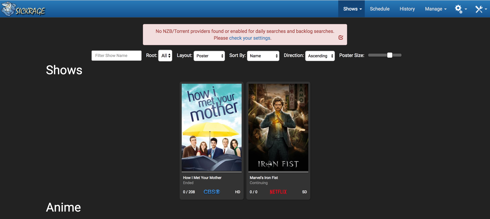
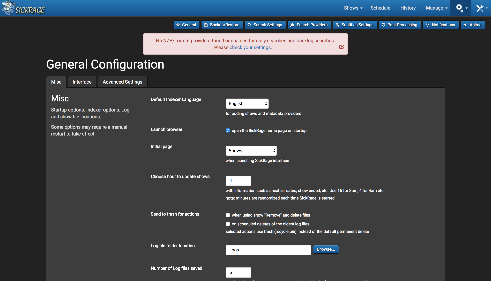

# SickRage
Dion de Hoog

Zilla Garama

Sander Liebens

Tim Molenaar

Lars van der Zwan

# Abstract
This chapter will discuss the open source project SickRage.
SickRage is a fork from SickBeard, but has a different focus.
This chapter aims to show the structure and focus of the developers and project.
It will become clear that SickRage is very development focused and often times adding new features are preferred over improving or fixing older features.
While it might be convenient for users to quickly get new features. The consequences are that as the project keeps growing, the testing and structure lags behind.
SickRage keeps a clear structure of the project but does not adhere to any design patterns which makes it difficult for new contributors to stick to that structure.

# Introduction
This chapter will dive into the open source project SickRage. SickRage is an automatic video library manager for TV shows written in Python.
SickRage is an interesting project since the focus is on growing and adding new features instead of setting up a solid codebase.
The structure, advantages and weaknesses will be discussed in depth. This will be done by going into detail about a couple of views as described by Rozanski and Woods's book "Software Systems Architecture" [[1](#rw)].
The chapter starts off by giving the analysis of the stakeholders, issues and pull requests. Then the context, development and information views will be presented.
After that the module organisation and structure will be discussed. Then the testing and design will be analysed. Finally, the technical and testing debt will be presented.

# 1. Analysis

### Stakeholder Analysis
Every system has different (groups of) people with different interests. These (groups of) people are called stakeholders. Rozanski and Woods [[1](#rw)] classify a couple of different stakeholders for a software system. This section will describe the following stakeholders; Acquirers, assessors, communicators, developers, maintainers, support staff, system administrators, testers and users.

There is no big sponsor for SickRage. The money that is required for the development is gathered via donations to the acquirers.
SickRage is developed by a small but highly active team of developers. There is a total of 278 contributors but only a few commits every day.
The top developers are the GitHub users @[miigotu](https://github.com/miigotu), @[OmgImAlexis](https://github.com/omgimalexis) and @[abeloin](https://github.com/abeloin). There are only 14 people with more than 50 commits. This means that most contributors only contribute for a short period of time or only in order to change a certain thing. 
As can be seen in figure 1, @[miigotu](https://github.com/miigotu) has many stakeholder roles. 
This pattern of a single user acting as different stakeholders happens with @[OmgImAlexis](https://github.com/omgimalexis) and @[abeloin](https://github.com/abeloin) too.
Assessors oversee the system's conformance to standards, as it is @[miigotu](https://github.com/miigotu) who enforced the use of Travis CI, he belongs to this category.
The maintainers manage the evolution of the system once it is operational. The people belonging to this category vary a lot over time. The people mentioned in figure 1 , are the most active on average.
The communicator stakeholders are another pretty big stakeholder type in SickRage. All information about the system that is not directly involved with the development is communicated via the Wiki on GitHub. 
There are quite a few people contributing to the wiki page but the top 5 are mentioned in figure 1.
The tests are completely automated with the help of continous integration tools such as Travis. The people who check, maintain and write these tests are @[miigotu](https://github.com/miigotu) and @[Sharkykh](https://github.com/sharkyhh).
The group of people who use SickRage is not that big and consists mostly of pirates and developers.
Suppliers are missing because the whole system is based on GitHub. Everything runs on local machines by cloning the repository. 
This means that downloading SickRage is not possible as they also don't work with GitHub releases.
Another stakeholder type that is missing is the support staff as the typical users of SickRage are mostly developers themselves and they are considered by the SickRage community to be able to figure things out on their own.

*Figure 1: An overview of the stakeholders*

### Issue Analysis
In a lot of issues, one can see that the master contributor does most of the work. He either checks the issues and their relevance. Or he says that he "will fix the issue as soon as he has some time".
Most issues are reported by users that follow the project development, as one can see that they often try to think of a solution as well.

At the time of writing the Chapter, and after contact with the master contributor (miigotu), it has been concluded that these issues were not solvable in the amount of time given, but time should rather be invested in fixing tests and TODOs, as can be seen in the Technical Debt section.

### Pull Request Analysis
All in all it seems the developers are very active at reviewing and merging pull requests since most of them are handled at the same day the pull request is made.
Pulling and merging is mostly done by @[miigotu](https://github.com/miigotu), in fact, all the pull requests listed above are closed by @[miigotu](https://github.com/miigotu). In the end, the users do notice changes in functionality when they download a new version.

# 2. Views

## Context View
Before analysing the system itself, an analysis of how SickRage interacts with different entities around it will be presented. In this section a context view is created to show all external dependencies, relationships and interactions between the system and its environment.

*Figure 2: Context view of SickRage*

SickRage is a fork of [SickBeard](https://GitHub.com/dbr/tvdb_api/) and could be defined as a continuation of the latter, as SickRage is being actively developed and SickBeard is not. Due to the stagnation of SickBeard's development in terms of the lack of new features and support, a group of programmers created SickRage. SickRage's system is hosted on GitHub, which is at the same time one of the most important communication platforms. Communication between the developers of the system is furthermore done by [Google Groups](https://groups.google.com), [Kiwi IRC](https://kiwiirc.com/client/irc.freenode.net/?theme=basic#SickRage-issues), [Twitter](https://twitter.com/) and [FaceBook](https://www.facebook.com/).
[Travis CI](https://travis-ci.org/), an open source testing platform, is used for integration testing.
SickRage uses the API of [The TVDB](http://thetvdb.com/) and [The AniDB](https://anidb.net/perl-bin/animedb.pl?show=main) to retrieve data about series and episodes, after which these can be downloaded using the torrent or Usenet clients.
Within SickRage, it is possible to search for new episodes automatically using torrent or Usenet providers such as [qBittorrent](http://www.qbittorrent.org/) and [uTorrent](http://www.utorrent.com/).

SickRage is mainly developed in Python and uses the template library [Mako](http://www.makotemplates.org/), in order to improve standardisation of code and performance. Mako is a front-end template library which easily communicates with a Python back-end. Methods and variables can easily be exchanged and therefore improves code standardisation. As communication with the user is done via web-interface a part of SickRage is developed in HTML, CSS and JavaScript. The system uses [SQLAlchemy](https://www.sqlalchemy.org/) to manage databases (amongst others an [SQLite](https://www.sqlite.org/) database to store its data).

## Development View
The development view describes the development process in terms of code architecture, design standards and technical standards.
According to Rozanski and Woods, we "need to focus here on issues, concerns, and features that are architecturally significant.".
Also, we "(...) should view (...)" our "(...) work as a starting point for the more detailed design work that will be performed as part of the software development phase." [[1](#rw)]
Furthermore, the development view is applicable to systems that are a result of significant work in terms of software development.
This constraint is met, because one of the requirements of this assignment is for the open source project to be actively developed and of sufficient complexity.

We took into consideration the pitfall of describing (parts of) the development view in too much detail, and also the fact that we should describe every part of the development view in the same level of detail.

### Module organisation
Modules are units of related code that together implement for example a library or a coherent piece of functionality (Rozanski and Woods).
The module organisation is thus the way the different modules are separated and organised in the open source project.
Here we will discuss the different modules in the SickRage project.

SickRage uses a rather basic module organisation. Each of the folders in the root contains a different functionality.

* The front-end of the system, located in the folder "gui/slick". This folder contains the following elements:
  * css: contains all the styling for the front-end
  * scss: an extension of the normal css (this is not used at this moment)
  * fonts: contains the custom font for the front-end
  * images: the images used in the front-end
  * js: the JavaScript to give the front-end its functionality
  * views: all the different pages in the front-end.
* The back-end. There are two modules that make up the back-end. This was done when SickRage forked from SickBeard, the developers decided to keep the original back-end and the newly added functions separated from each other:
  * The original back-end of the system is in the folder "SickBeard". SickBeard consists of a few modules together with a lot of scripts that are just put in the root. The modules are:
    * Clients
    * Databases
    * Indexers
    * Metadata
    * Parsers
    * Notifiers
    * Providers
  * The newly added functionalities to the back-end are in the folder "SickRage". SickRage does not have scripts placed in the root, this implies the developers focus more at breaking the code up in modules. The modules in SickRage are:
    * Helpers
    * Media
    * Providers
    * Show
    * System
    * Tagger
* All the dependencies and libraries are in a folder called "contrib". Even though a library is a module itself, we also identify the collection of libraries and dependencies as a module for SickRage.and dependencies that SickRage relies upon.
* Translations for different languages are located in "locale".
* All the contributed extensions for SickRage that the developers did not want to include in the original project, but did want to offer to the users, are in "contrib".
* Tests for the system are grouped together. Tests for the SickRage and SickBeard aspects are separated.

Even though it is an understandable choice to keep the old and new functionality split it does raise some difficulties.
For one, the scripts used in SickRage heavily depends on the content of SickBeard. SickBeard uses functionalities and methods from the original project.

### Common processing
The root folder contains modules, such as the GUI, tests and the back-end source code. The latter contains the files used for common processing.

SickBeard is the folder containing the source code, not the SickRage folder as one could expect. 
The SickRage folder only contains several folders for non-common (or feature-specific) purposes, which we can ignore.
The SickBeard folder also contains some folders for non-common (or feature-specific purposes. However next to the folders in SickBeard all common processing files are placed directly in here.
Common processing functionalities have been identified and isolated from the feature-specific functionality.

Some of the libraries can also be seen as common processing but the developers did not make these themselves but are merely using them.
The following image is a visualisation of the aforementioned description:

*Figure 3: Common processing in SickRage*

### Design standardisation
SickRage divided (code-)files into folders or modules based on functionality.
Contributors could therefore add their contribution to the module corresponding to the correct functionality.
However, on the level of code design, design patterns are not explicitly mentioned either in the Wiki or the project.
This makes it difficult to stay true to a design pattern since contributors are not aware they should adhere to a design pattern.
It seems like the developers made their own structure without following a specific design pattern.
On the other hand, we were able to detect certain design principles. For example, in general, files are written in a way that they fulfill just a single functionality, such that SickRage is open for extension and closed for modification (open/closed principle).
Since SickRage builds upon SickBeard and these parts are separated but heavily interconnected we can conclude that SickRage is a bit of a mess on the level of code design, although the folder structure is okay.

Maintainability of the code for inexperienced contributors is hard, because there are no design standards defined.
The system's reliability is directly influenced by a lower degree of maintainability, because contribution mistakes could be made more quickly due to lack of clarity on design patterns.
Evidently, since there are no strict design patterns defined, the entropy of the SickRage project will increase.

### Standardisation of testing
SickRage uses the Python unit testing framework, also known as PyUnit, which is a Python version of the Java unit testing framework JUnit. The automation of tests is done by this framework.
The folder "tests" contains some test files and a folder 'SickRage_tests', which contains the tests for the 'SickRage' folder.
before a build is made, the tests are automatically run. However, A lot of the test cases are not yet implemented, although there have been a lot of commits in the last week. Test data is not standardised. In fact, some test files (for example search_tests.py) only have 1 test case.
The tests are only made after the functionality is implemented and sometimes no tests are made at all. From this we can conclude that the development is not test driven.
The problem this creates is that a lot of functionality is only tested in a basic way and by manually trying if it works. However, this does imply some edge cases are not tested and could raise problems.
Miigotu said there was a certain issue they put a lot of time in but still can't find the source for. If the system would have been thoroughly tested the chance of this happening would be a lot smaller.

### Codeline organisation (directory structure, configuration management system, build management, tests and binary file management & testing)
The directory structure as mentioned in Common processing shows the file structure of the codebase.
As one can see, configuration files are put into the runscripts folder. This folder contains code to configure system variables and other settings in Linux, in order to run the project correctly.

Whenever a pull request is accepted and put into master, @[miigotu](https://github.com/miigotu) creates a new release.
These releases occur almost daily, and sometimes even multiple times in one day.
Stable releases in the master are very important for SickRage, as there is no actual install script or file.
To be able to run SickRage, one simply clones the current master project, and runs the startup file (`SickBeard.py`) locally.
In order to stay up to date with the master branch, SickRage has an automatic check built-in, to see if the version you are running is the latest, and shows you how many commits you are behind.

### Module structure
As can be seen in figure 4, all modules are interconnected.
It can roughly be divided in 3 main layers and 2 side modules. The three main layers which together form the core of the system are the GUI layer, the platform layer and the libraries & database layer. The arrows between the modules show the interdependencies between them. The GUI layer is the front-end which shows the web application to the user, including all HTML, CSS, JavaScript files and images. The platform layer runs the actual application and makes sure that everything that is changed by the user in the web application is saved in the database. The database uses SQLite, which is why this is shown in the image. As is usual in a software system, libraries are also used. These libraries are all written in Python. Because there are many libraries we did not list them specifically inside the image. The 2 side modules consist of a testing and configuration module. The configuration model exists of scripts that change settings on Linux machines such that the system will run correctly. The tests exist for the Python scripts, but also for the GUI, databases and even for the configuration files.

*Figure 4: Modules of SickRage*

## Information View
The information aspect of SickRage describes information flow (how is a TV show retrieved?),
data ownership (who owns the downloaded TV-shows?) and data quality.

### Information flow
The flow of information initially starts with the user requesting a TV show. 
If this show is available, it can be retrieved from the file system, for which the location is saved in the database.
If this show is not yet available, SickRage crawls for torrent providers that retrieve the requested show from peers,
which will then be stored on the user's file system.
A pointer to the correct folder is also stored in the database.
The show is not able to start until it has been retrieved entirely, thus streaming from peers is not possible.

*Figure 5: Information flow of SickRage*

### Data ownership
The data processed by SickRage is not SickRage's property as the system is a means to retrieve and present the requested data.
TV shows are stored on the user's local file system and therefore are the user's property.
This also means that when the user requests illegal data, it is the user who is responsible rather than SickRage or the SickRage team.

### Data quality
The quality of data depends on a crawled torrent and can't be fully controlled by SickRage.
For example, the speed in which a show will be retrieved depends on selected torrents and the user's internet connection.
However, SickRage is able to select whom will be the supplier of TV-shows and could decide to pick only trusted suppliers.
Furthermore, SickRage allows the user to control data quality in terms of resolution, configuration of scene numbering, and additional features such as subtitles.

Besides data quality, SickRage aims to optimize data retrieval speed.
It will therefore continue crawling torrent providers until all available providers have been used.
A user that selects more torrent providers will therefore have a higher initial waiting time.

# 3. Usability
The first thing that comes to mind when starting SickRage is the way it has to be "installed". 
"Installed", because you do not run an installer. 
Instead, one must download the project from GitHub and start the python script.
In the case of usability, this is not user friendly.
Users who are known to Python, GitHub, or programming probably know how to run it, but users without a technical background will probably have a hard time trying to run the program.

When one succeeded in running the script, the homescreen will appear:

*Figure 6: Home screen of SickRage*

At first sight, this looks very user friendly. 
A user his shows can be divided into the categories "normal" and "anime"."
When one clicks on a show, all the metadata is loaded as can be seen in the picture below. 
It is good to see that SickRage shows the size of the folder in which the downloads are, and where these downloads are located.
All features that a user could want in the show view, are there. One can jump to a season, edit the show configurations, (re)search for single episodes, or for all episodes, and even browse to the next or previous show.

*Figure 7: View of "How I met your mother" in SickRage*

*Figure 8: List of episodes of "How I met your mother" in SickRage*

Up to this point, SickRage is quite user-friendly.
A positive feature of SickRage is that it shows important errors or missing configurations at the top of every screen, as can be seen in the homescreen and showview above.
In this case, there is no torrent provider found or enabled, to search and download the missing and future episodes.
However, the settings screens could use some improvement.
No one will disagree about the fact that configuring a program takes some time, but as most programs are well documented, you save time in searching.
SickRage has no documentation for the settings and configurations, which means one has to Google its way to answers, or use a trial and error method to find its own solution.
According to SickRage, text fields should not contain too much information or text in order to stick to the design of the frontend [[1](#translations)].
This, in combination with the fact that there is no settings documentation, makes it very hard for users to successfully configure their program. 
In the picture below, the first page of settings can be seen.

*Figure 9: Settings page in SickRage*

The settings area combines most of the backend functionality with the front-end view. Therefore one would expect that this is the most important part of the front-end, architecture-wise.
Luckily, SickRage has a backup mechanism.
You can backup all shows (excluding downloaded files), configurations and settings to a folder for later use, or in case you switch hardware.

In conclusion, the SickRage interface is very user-friendly. Adding, adapting and viewing shows can be done very easily.
Some more time can be spent on a real installer, and the settings view or documentation on the settings.

# 4. Debt
According to the lecture by Andy Zaidman, debt in a system means that there are aspects of the software we know are wrong but don't have time to fix now. Things like TODO's are a good indicator of this, but also the amount of comments per lines of code (LOC) or the Cyclomatic Complexity (CC). Having few comments per lines of code make the code difficult to understand for new developers. This is also true for a high CC because this means that there are many different decisions that lead to many possible paths the program can take. Understanding all these different paths at once to get an overview of the program is hard.

The developers of SickRage have multiple ways of communicating errors, bugs and work to be done. Besides the IRC, the issue tracking and GitHub itself, some of the developers like to communicate through code comments. Especially TODOs are a popular way of communication, as at the moment of writing, 241 TODOs can be found at the repository.
The files were investigated, and after filtering the library files, around 200 TODO’s were still left in either code or testing files.

### Technical debt
In order to determine the technical debt of the system, an analysis tool called Radon was used. Radon is a python tool for obtaining raw metrics on line counts, CC, Halstead metrics and maintainability metrics.

The CC was calculated for each file in the SickRage folder, the SickBeard folder and the SickBeard.py runnable.
All metrics can be found in the Metrics folder. The most devastating results will be mentioned and explained here.

The method `find_search_results` in `SickRage/providers/GenericProvider.py` has a CC of 51, which is a very error-prone and unstable block. This method is used to find search results in a torrent or nzb provider and therefore uses a lot of conditions. In the `SickBeard` folder, more methods have a high CC score. Most of them involve file loading/editing, as this needs a lot of conditioning to resolve errors and exceptions. (e.g. does the file exist? Is the file not empty? Is the file an episode file?) Others are in the configurations file. The biggest problem lies in `SickBeard/webserve.py`. The method `ConfigProviders.saveProviders` has a CC of 95! This all has to do with the many possibilities of configurations one can have for a provider. Also, the `SickBeard.py` runnable has an unstable block. The method `SickRage.start` has a CC value of 44. This again has a lot to do with file reading and writing. It needs to check for permissions, read database and cache files, see if the standard SickRage port is not already in use and similar kind of conditions under which it will or will not be able to run.

While analysing the SickRage project last weeks we already noticed that commenting is not a favourite task of the developers of SickRage. Running the raw code metrics of Radon confirms this.
Where ideally you want most lines of code to be commented, the amount of lines that are actually commented are very low. The lowest amount of comments in percentages are in the files `rawSickBeard.txt`, `rawSickRage.txt` and `rawSickBeardPy.txt`. The files such as `SickBeard/auto_postprocessor.py`, which has a very high persentage, have comments about the GNU licensing and distribution rather than explaining the code itself.

This little amount of comments are worrisome. As a new developer to the SickRage system, you have to understand what a method does, what input and output is needed and why some design choices were made. This information can easily be given by the use of commenting.
It is understandable that developers of SickRage did not want to comment all code written by the developers of SickBeard, as this takes a lot of time. However, they also needed to understand the SickBeard core, before developing further features. It could have saved much time for new developers if the SickRage developers would have commented on the SickBeard code, as they found out what the code does.

### Testing debt
In order to investigate the testing debt the test coverage provided by coveralls.io was looked at first. 
The total test coverage of the system on the master branch as well as on the develop branch is only 30.341% at the moment of writing.
Main contributor 'miigotu' pointed at this low coverage in his mail to us writing that 'an area that is always in need is adding unit tests, and possibly implementing AppVeyor testing so that we have testing specific to Windows done'.
Notable is that in the SickRage folder, as well as in the SickBeard folder a lot of files with 100% test coverage are '\_\_init\_\_.py' files, mostly beacuse they only consist of only 0, 1 or 2 lines of relevant code.
The most recent significant change in test coverage was made to the '/SickBeard/config.py' file, which now has a test coverage of 88.63%. 

All in all it can be said that SickRage is not tested very well at this time, only some files in the SickBeard and SickRage modules are tested and even in these modules a lot of files have 0.0% test coverage.
At this moment the only tests are unit tests, which is of course quite limited. These tests are run manually and it is also manually checked whether these tests run or throw errors. Testing can therefore simply be improved by adding more unit tests, but also by adding automated integration tests, acceptance tests or functional tests. 
For some parts of the code writing tests can become quite complex, as their Cyclomatic Complexity is quite high. This means that for proper testing, more advanced unit tests that follow different paths through the code should be written.

### Evolution of technical and testing debt
The first noticable thing that changed with commits over time was that the number of files gradually increased over time. 
Most folders did exist from the beginning (april 2016), except the folder containing languages (added in between april and september 2016) and the folder containing runscripts for different Linux versions (added in between september 2016 and january 2017). However, these additions did not affect the technical debt of the system.

SickRage is originally a copy of an existing project (SickBeard), which already contained a significant technical debt.
This is also a reason why SickRage has not evolved much in terms of technical debt.
As mentioned in the first section, the lines of code that actually contain comments are low.
Unfortunately, this has not been improved when looking back to older commits.

SickRage references a test coverage tool on GitHub which visualises test coverages for all branches that have ever existed on the SickRage repository. When analysing the coverage of SickRage, it can be observed that in the past few months the code coverage has increased. At the end of 2016, a 27.91% code coverage was measured (https://coveralls.io/builds/9358622). By march 2017, the code coverage percentage is more than 30% (https://coveralls.io/builds/10365156). The increased test coverage was achieved by means of only a few commits containing test files. One commit in particular, on february 28th increased code coverage by 1.9%. This is probably an indication that the development process is not test-driven.

## Conclusion
Information is controlled but not owned by SickRage. Data is retrieved from torrent providers, stored on the user's local machine and local database, where SickRage is merely a means to control the flow of information. Data quality can partially be controlled by the user, for example the resolution of an episode. SickRage is also visualising data to the user by means of a user-friendly interface. Installation of SickRage requires knowledge of third-party software and could be improved in the future. On the other hand, the user has much control over which features should be enabled and which torrent providers should be used.

An excessive stakeholder analysis shows that there is considerable overlap between different stakeholder roles. The project owner, @[miigotu](https://github.com/miigotu), is practically involved with all roles. SickRage is not a stand-alone application. It depends on external factors and programs, such as GitHub, torrent providers and Travis CI. In order to achieve the current code architecture, developers have defined certain practices and code standards. For example, SickRage is divided into a front-end and back-end, which respectively target data visualisation and data management. Furthermore, functionality is not duplicated but reused by means of a modular structure. Also, testing, design and codeline organisation have been standardised.

Technical debt is measured by means of Radon, which showed a relatively bad cyclomatic complexity (CC). Furthermore, SickRage is low on code comments and poorly tested. However, over time it can be observed that code coverage has been improved. SickRage is therefore a challenging project with a lot of potential, which still requires a lot of work in order to become an architectural beauty.

# References
1. 
Nick Rozanski and Eoin Woods. Software Systems Architecture: Working with Stakeholders using Viewpoints and Perspectives. Addison-Wesley, 2012.
2. 
https://GitHub.com/SickRage/SickRage/wiki/Translations, 2017.

