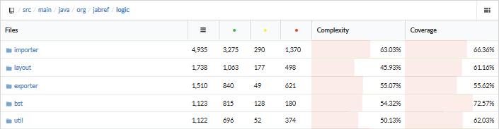

# JabRef - A Graphical Application for Managing BibTeX Databases

 
[**Alborz Salimian Rizi**](https://github.com/Asalimianrizi), [**Owen Huang**](https://github.com/ohuang12), [**Rolf Starre**](https://github.com/RolfStarre), and [**Tim van Rossum**](https://github.com/TRvanRossum).  
 
*Delft University of Technology, 2017*  

## Abstract
JabRef is an open source BibTeX reference manager, written in Java.
It can be used to structure and manage large BibTeX/BibLaTeX reference databases used for writing scientific papers.
The system has been in development since November 2003 and is still actively maintained.
The fact that the project is under active development can be deduced from the speed at which pull requests are merged: usually within a day.
As of 20-03-2017, the project has over 135.000 lines of code, 95 contributors, and 31 releases.
This chapter studies JabRef by looking at its architecture, and by looking at the system through different viewpoints and perspectives.

## Table of Contents

1. [Introduction](#Intro)
2. [Stakeholders](#Stakeholders)
3. [Context view](#ContextView)
4. [Development view](#DevView)
5. [Technical debt](#TechDebt)
6. [Deployment view](#DeployView)
7. [Evolution of JabRef](#Evo)
8. [Conclusion](#Conclusion)
9. [References](#Refs)

## <a name="Intro">Introduction</a>
JabRef is a graphical BibTeX reference manager, used for structuring large BibTeX databases in a orderly fashion.
This chapter gives a structured overview of JabRef by providing descriptions of the various parts that compose its architecture, in order to explain the system and how it works.
After introducing the system, the most prominent stakeholders and their workflow are identified.
Next, the interaction of JabRef with its environment is illustrated through analysis of the context view.
Furthermore, the development view is described to find code structure and dependencies.
Following that, an overview of the technical debt of JabRef is given by characterizing some of its issues.
After that, this chapter continues with an evolution perspective of JabRef, which shows the history of JabRef.
Finally, the chapter concludes by listing the most important findings.

## <a name="Stakeholders">Stakeholders</a>
In this section we will describe the different stakeholder classes as proposed by Rozanski and Woods [[1](#ref1)] and relate our views of the classes in relation to the JabRef project.
In addition we have also identified a stakeholder group that was not a part of the eleven types proposed by the book, the sponsors.

The **sponsors** of JabRef are [Baola](http://baobab.org/BAOLA-sparkling-drink) and [Neuronade](https://neuronade.com/). While they support the development of JabRef, they do not play an active role in steering of the project.
Currently the project relies on volunteers for the development of the project, although they are [trying to attract a funded developer](http://help.jabref.org/en/FAQcontributing).

Since the core developers of JabRef determine the direction of the product we consider these the **acquirers** of the project.
They share their vision and roadmap via GitHub and the JabRef website.
The following persons make up the core development team of JabRef: [Stefan Kolb](https://github.com/stefan-kolb), [Oliver Kopp](https://github.com/koppor), [Tobias Diez](https://github.com/tobiasdiez), [Matthias Geiger](https://github.com/matthiasgeiger), [Jörg Lenhard](https://github.com/lenhard), [Simon Harrer](https://github.com/simonharrer), [Oscar Gustafsson](https://github.com/oscargus), and [Christoph Schwentker](https://github.com/Siedlerchr).

We also consider these core developers a part of the **developers**, **maintainers**, and **production engineers** stakeholder groups. They actively contribute to the development of the project and are the ones who are responsible for reviewing and merging pull requests. This means they determine which contributions get merged and which get rejected. They are also the ones who manage and deploy the different aspects of building, testing, and running the system.

Since JabRef is an open source project and contributions from outside are actively encouraged, there are also a lot of [people](https://github.com/JabRef/jabref/blob/master/AUTHORS) outside of the core development team who have made contributions to the JabRef code base.
These contributors are part of the **developers** class, since they make contributions to the development of JabRef through pull requests.
Contributors are also considered to be part of the **maintainers**, since they provide assistance in maintaining the system by making pull requests.

Both the core developers and contributors make up the **assessors** and **testers** groups. When someone offers to contribute to the project, they are asked to run a set of unit tests to make sure any additions do not cause problems in the system.
Furthermore, the assessors and testers also request that the contributor creates additional unit tests when implementing new features.
All the developers are a part of the assessors because they are responsible for conforming to certain standards and legal regulations, since the contributions are considered to be made under the [MIT license](https://github.com/JabRef/jabref/blob/master/LICENSE.md).

There is a diverse group of **communicators** and **support staff**. First off we have the creators of the [JabRef help website](https://help.jabref.org/en/), mainly the core developers but also other contributors have worked on this.
The help page contains most of the information needed for setting up and using JabRef.
There is also a [forum on the JabRef website](http://discourse.jabref.org/) where users and other people can ask questions.
The communicators on this forum with the most replies are [Tobias Diez](http://discourse.jabref.org/users/tobiasdiez/summary), [Matthias Geiger](http://discourse.jabref.org/users/matthiasgeiger/summary), and [Christoph Schwentker](http://discourse.jabref.org/users/Siedlerchr/summary), who are all part of the core developers.
The user [mlep](http://discourse.jabref.org/users/mlep/summary) also deserves a mention since he is also actively involved on the forum and is one of the [moderators](http://discourse.jabref.org/groups/moderators).
Contributors and the core developers communicate through GitHub by addressing issues and discussing code.
Since 2016 JabRef started organizing a yearly conference, [JabCon]http://jabcon.jabref.org/, for users of JabRef to facilitate discussion between users and developers.
This year the JabCon was organized by [Stefan Kolb](https://github.com/stefan-kolb), [Oliver Kopp](https://github.com/koppor), and [Jörg Lenhard](https://github.com/lenhard).

**Suppliers** that JabRef depends on are GitHub, the different databases it requests data from (e.g. [Google Scholar](https://scholar.google.nl/), [Springer](http://www.springer.com), [ACM Digital Library](http://dl.acm.org/)), [BibTeX](http://www.bibtex.org/), and [BibLaTeX](https://www.ctan.org/pkg/biblatex).
Github is important because it is where the code is maintained and developed.
The various databases are used to extract information from to create a bibliography, which can then be exported using BibTeX or BibLaTeX.

Since JabRef is released under the [MIT license](https://github.com/JabRef/jabref/blob/master/LICENSE.md) the **users** of the system are hard to pin down, since anyone could download JabRef and make use of it. Since JabRef is a system for managing references we expect the main part of the users to consist of students and universities. Since the users download the system and then run the system locally we consider the users to also be the **system adminstrators**.

## <a name="ContextView">Context view</a>
In this section we define the context in which JabRef operates and the interactions of JabRef with its environment.
First we give a brief overview of the system scope and responsibilities. Afterwards we briefly introduce the different entities with which JabRef interacts.

### System scope
The main function of JabRef is to allow users to create, maintain, and export bibliographies.
In short, the most important responsibilities and capabilities of the system are:
- Empowering the users to construct bibliographies by giving users the possibility to retrieve (information about) articles and papers from large databases.
- Enabling users to add, edit, and delete entries in their bibliographies.
- Allowing the users to export the bibliographies to BibTeX and BibLaTeX files.
- Supporting multiple languages in order to aid non-English speaking users.
- Supporting multiple platforms (e.g. Linux, Windows, and Mac).

### Context view diagram
The diagram below in Figure [1](#figure1) shows the context view of JabRef.
The context view diagram shows the external entities, as well as the most important stakeholders.
In this section we will provide some short descriptions for some of the entities that have not been mentioned before or that require some additional explanation.

  
*Figure 1: Context view of JabRef.*

To help developing and maintaining the code JabRef uses a number of tools, these fall under the *code quality*.
[Codacy](https://www.codacy.com/) is used for automatic checking of code quality, by providing insight into code style, duplication, and code complexity.
[Codecov](https://codecov.io/) helps the developers to automatically check the code coverage after implementing changes and to expose bugs and vulnerabilities.
[VersionEye](https://www.versioneye.com/) is used to prevent having outdated dependencies and license violations.
For checking if new contributions do not cause any problems JabRef uses [Travis CI](https://travis-ci.org/) for *continuous integration*.
Furthermore, since JabRef is *programmed in* Java it uses [JUnit](http://junit.org/) as a *testing framework*.

To create bibliographies JabRef allows users to  *retrieve data* from databases, such as [Google Scholar](https://scholar.google.nl/), [ACM Digital Library](http://dl.acm.org/), etc., to create references.
These bibliographies can then be *exported to* BibTeX or BibLaTeX files.

JabRef also has some *competitors* that provide similar services.
Some popular alternative bibliography managers are [Mendeley](https://www.mendeley.com/), [Zotero](https://www.zotero.org/), and [BibDesk](http://bibdesk.sourceforge.net/).

## <a name="DevView">Development view</a>
In this section, we will look into the architectural principles, patterns, and code guidelines that govern the development of JabRef. Following the definition of Rozanski and Woods [[1](#ref1)], we show how JabRef is structured and what standards the development process upholds.

### <a name="refModOrg">Module Organization</a>
Prior to 6 September 2016, JabRef had reportedly a lack of clear general architecture [[2](#ref2)]. Currently, the overall system follows a modular structure splitting the system into three major components. The architecture shows signs of a Model View Controller (MVC) inspired design, with additional smaller components hooked into an event bus. Minor components, that are not directly at the core of the application, are subscribed to this event bus. This allows them to still act upon changes of the major components without having to resort to changing the core architecture. Furthermore, these minor components can in turn influence the core components. Generally, in a MVC design the system is split into three major components: the model, view, and controller. The model contains all the data structures and is commanded by the controller. Similarly, the view is also updated by the model through notifications on changes in the model and also exerts influence on the controller [[3](#ref3)]. However, there are several dependencies allowed between some components in JabRef indicating clear distinctions from a pure MVC design. We note this difference in the following discussion of the major components.
The overall modular structure of JabRef is depicted in Figure [2](#figure2), which shows the major interactions of the system and dependencies of the entire architecture.

**Core components:**
- *UI:* The user interface (UI) is split into two major parts: the command line interface (`CLI`) and the graphical user interface (`GUI`). The `UI` is initialized by the `Launcher`, which launches the entire application. The `GUI` can communicate directly with all the other core components, which include the `Logic` and the `Model` components. As a result, this differs from an MVC pattern, because the `GUI` is able to directly manipulate the `Model` bypassing the `Logic` component. Moreover, the `UI` component can interact with the `Preferences` containing all the application preferences of the user.

- *Logic:* The `Logic` unit is responsible for updating the model, which includes reading, writing, importing, exporting, and general manipulation of the model. The `Logic` is also responsible for logging errors and warnings that occur during run-time. Inside the `Logic` component the most important sub-components include:
  - Logging to register and report all warnings and errors.
  - Handling importing of files (such as parsing and creating the respective data structures for storing in the `Model`).
  - Fetching entries from varying identifiers (DOI, ISBN), via web search, etc.
  - Formatting of the data obtained from various sources to be displayed in the UI.

- *Model:* The `Model` contains the most important data structures of the system. Among these components, the `EventBus` is one of the most important ones, as it allows modules outside the core of the system to interact upon changes happening inside the core. Moreover, the `Model` holds the data structure that stores the bibliography databases (containing entries, categorization of entries, user comments, etc.) the user in the end creates. The `Model` component only interacts with the `Logic` component and does not depend on any other module. Upon any change occurring in the sub-modules, the `Model` (and also the `UI`) will be updated accordingly. However, the logic behind several sub-components of the `Model` (`BibDatabases`, `BibEntries`, `Events`, and related aspects) is not always 'absolute'. This means that small parts related to the logic of these sub-components are found inside the `Model`, rather than in the `Logic` component. As a result, this clearly differs from the general MVC design.

  
*Figure 2: Modular structure of JabRef with allowed dependencies between components.*

### Standardization of Design
The standard of design can be split into two parts: the code style and the dependency maintenance.

The entirety of the code style is documented in the following JabRef wiki [guide](https://github.com/JabRef/jabref/wiki/Code-Howtos). Developers wishing to make contributions to JabRef should adhere to the code style described. That way a consistent style of code is guaranteed, which prevents the code from turning into spaghetti code. A short summary of the code style guidelines is as follows:
* Code should be written upholding general coding standards found in this [manual](https://github.com/cxxr/better-java).
* Exceptions should be wrapped and re-thrown with a localized message, so that users can read what the error was.
* Users should also never see the technical details, as most would not be able to make out what it is about anyway.
* Logging happens by using Apache Commons Logging.
* All labels, descriptions, and messages visible for the users should be localized.
* `GUI` confirmation dialogs should avoid asking questions, be concise, identify the item at risk, and have named buttons for the actions.

Furthermore, to improve the process of integrating changes, an automated checklist for each PR is used to verify that sufficient testing and appropriate changes have been performed. In this checklist (e.g. in PR [#2614](https://github.com/JabRef/jabref/pull/2614)), the contributor can mark for each checklist item (e.g. including screenshots when making some 'large' UI change) whether it has been performed or leave it unchecked if it does not directly apply to the contribution.

JabRef, like most big projects, uses a lot of external libraries for its functionality. In order for developers to get these dependencies, without having to look for each and every single one of them on the Internet, JabRef uses the [Gradle](https://gradle.org/) build tool to automate getting the dependencies from the Internet. When developers add a library, because it's needed in order to develop a feature or to fix a bug, they should preferably use a version available at [jCenter](https://bintray.com/bintray/jcenter) and add that version to the build script, `build.gradle`.

### Standardization of testing
Standardization of testing involves two components: the testing itself and the continuous integration. Testing happens exclusively through usage of JUnit 4, a unit testing framework for Java unit tests. Code coverage by the tests is measured using [Codacy](https://www.codacy.com/), a [tool](https://www.codacy.com/product) that does not only measure code coverage, but also gives useful code review feedback such as security concerns for certain lines of code, code style violations, best practices, etc.

Continuous integration (CI) is a software engineering practice where developers integrate their code frequently, which results in the benefit that errors are detected quickly. CI happens through the use of both [Travis CI](https://travis-ci.org/) and [CircleCI](https://circleci.com/). Travis CI is used to execute all the tests in the system, while CircleCI creates binaries, using [Gradle](https://gradle.org/) and [Install4j](https://www.ej-technologies.com/products/install4j/overview.html), and uploads them as builds [[4](#ref4)].

## <a name="TechDebt">Technical debt</a>
Technical debt is defined as "a concept in programming that reflects the extra development work that arises when code that is easy to implement in the short run is used instead of applying the best overall solution" [[4](#ref4)].
If technical debt is left unaddressed, then it could cause problems in the future, possibly resulting in software refactoring being necessary.

Begin 2016, JabRef faced a few big issues [[5](#ref5)] classified under one of these categories:
* Huge segments of the code are untested, undocumented, and have significant bugs and problems.
* In JabRef's lifespan, lots of features, UI elements, and preferences have been added, but are wired loosely in the UI. Moreover, the UI lacks consistency and structure.

### Identification of technical debt
Identifying technical debt was done by applying the code analysis tool [SonarQube](https://www.sonarqube.org/) and by manual inspection.
The entire project of JabRef was analysed in the process by SonarQube.

Shockingly, it becomes apparent that JabRef has 147 days of technical debt.
This amount of days is a metric that roughly indicates how much time it would cost to fix all the code that does not comply with standards that SonarQube defines [[6](#ref6)]. These standards are roughly defined as a weighted sum of technical debt days, based on the severity level and complexity of the issue.
However, it should also be noted that JabRef still has the highest possible maintainability rating (i.e. an A rating, indicating less than 5% technical debt ratio, with JabRef only having 1.7%).
This technical debt ratio is the ratio between the current amount of technical debt and the amount of time it would cost to rewrite the code from scratch, which is estimated based on either the amount of lines of code or the complexity of the project.

Tools like SonarQube are almost never perfect in classifying whether or not a case of technical debt is preventable or simply because there was no better option found. As a result, manual analysis has to be performed in order to distinguish these cases a lot better.

To find the cases in which no better option was found, the rules for classifying code containing technical debt should be carefully considered. These rules are the default rules defined by SonarQube, which can be found inside the dashboard.
Some of these rules that could be problematic are as follows:

<b>Classes should have no more than five parents in the class hierarchy</b> 
Deep class hierarchies may lead to unstable code, therefore SonarQube raises alarm when the inheritance depth is more than five.
However, this is problematic when one considers extending classes that are part of the Swing API.
All classes that are nested deeper than five levels are extending the Swing API for added functionality and these API classes are nested deep themselves.
If/when JabRef is ported to JavaFX, this technical debt could be paid simply by virtue of JavaFX possibly having its GUI-related classes less deep in the class hierarchy.

<b>Control statements should be nested no more than three times</b> 
Because of the size of the project, there are many use cases where things can go wrong, resulting in exceptions that have to be caught causing more control statement nesting.
An example is found in `org.jabref.collab.FileUpdateMonitor`.
This class is a thread that needs to run forever, thus it introduces a `while(true)` control statement in the `run`-method, which continuously checks all entries using a `for`-loop, which checks if an entry has been updated using `if`, but checking this can throw an exception, which is caught using a `try`-statement.
As can be seen, there are four layers of control statements, which are all essential and cannot be removed.

<b>The cyclomatic complexity of a single method should not exceed 10</b> 
Complex code is hard to maintain and understand, thus SonarQube sets a limit of 10 on the [cyclomatic complexity](https://en.wikipedia.org/wiki/Cyclomatic_complexity) of any function.
A shortcoming of this rule is that excessive cyclomatic complexity cannot always be avoided.
For example: the `transformSpecialCharacter` method found in `org.jabref.logic.layout.format.RTFChars.java` has a cyclomatic complexity of 148, but upon closer inspection, this is necessary due to the overwhelming amount of cases possible.
It is most likely possible to introduce a new method for every ten cases to eventually get code that is compliant with the "max. complexity of ten" rule, but this also leads to spaghetti-esque code, which is also bad code practice.

### Testing debt
Part of the technical debt of a system is the debt that manifests itself when code is not tested after it is written.
In order to find this testing debt, one can either use tools or perform manual inspection on the code.

As part of the quality control tools, JabRef uses [CodeCov](https://codecov.io/) to generate reports about the amount of code covered by Java unit tests. The [report](https://codecov.io/gh/JabRef/jabref) generated by CodeCov for JabRef shows a visualization in the form of a 'sunburst', of which several are shown in Figure [3](#figure3).
These sunburst diagrams show all the different packages found in the project with respect to their package structure. In the center ring, the top level package is shown, and each consecutive ring around the previous ring shows an additional deeper package level.
The report shows that the overall code coverage in the project is around 30%. This low percentage of code coverage is also apparent in the [sunburst](https://codecov.io/gh/JabRef/jabref), by the dominating amount of red circles.
However, there are also some green parts visible indicating components that are tested sufficiently with unit tests.

To understand why the code is tested so badly, the sunburst can show what the code coverage is in specific packages. Using the previous analysis from the development view on the [major components](#refModOrg) of the system, we investigate the major components of the system in more detail: the `GUI`, `Logic`, and `Model`.
In Figure [3](#figure3), we zoom into the GUI package and see that the whole sunburst is almost red. Similarly, we zoom into the Logic and Model package as well. We observe that these classes contain a lot more green areas, indicating that a lot more unit testing is done in these other two major components.
  
*Figure 3: Sunbursts of the GUI, Logic, and Model package. Red indicates code covered for less than 70%, whereas code covered between 70% and 100% is a gradient from orange to green.*

To see how much the GUI would affect the code coverage, we investigate how large the GUI component is compared to other parts of the system.
In Figure [4](#figure4), we observe that the GUI consists of 29,233 lines out of the total of 53,630 that are considered for the code coverage. This is already more than half of the entire codebase.
Moreover, we observe that only 3.43% of the GUI was tested, explaining why the code coverage is reported only around 30%.

While the GUI is tested very badly, the other two major components have reasonable test coverage. The logic component, achieves a code coverage of 67.20%. The model component has a much higher test coverage of 79.17%.

  
*Figure 4: Distribution of the size of all system's components with code coverage listed. The second column shows the total amount of code lines, the third shows the amount of lines covered, the fourth the amount of partial lines covered, and the fifth the amount of lines missed.*

Naturally, Figures [3](#figure3) and [4](#figure4) lead to the question why it is the case that the GUI component is hardly tested.
By investigating previous discussion in the issues and PRs on GitHub, [@koppor](https://github.com/koppor) stated in [PR #1700](https://github.com/JabRef/jabref/pull/1700#issuecomment-238637192) dating back to 09-08-2016 that testing the GUI is difficult and would be left alone, partly as a result of using Java Swing.
He also mentions in the same comment that in order to test the GUI, JabRef would have to switch to JavaFX.

We have previously mentioned that the logic component achieved a code coverage of 67.20%. The entire logic component consists of 16,383 lines of code.
While this percentage of code coverage seems acceptable, it calls for the need to investigate why this is not more.
Looking into an overview of the logic component in Figure [5](#figure5), we see that tests are generally covering most large packages around a similar code coverage percentage.
To see why the largest package, `importer`, only achieves a 66.36% code coverage, we can continue going into the deeper layers of packages.

  
*Figure 5: Top five largest packages of the code lines' distribution in the logic package.*

Inside `importer` it becomes clear that the largest package, `fileformat`, is thoroughly tested.
However, the second largest package, `fetcher` is almost completely untested.
If we look into the amount of issues and PRs tagged with a `testing` and `fetcher` label, only two [issues](https://github.com/JabRef/jabref/issues?q=is%3Aissue+is%3Aclosed+label%3Afetcher+label%3Atesting) regarding this are found.
Furthermore, no [PRs](https://github.com/JabRef/jabref/pulls?q=is%3Apr+is%3Aclosed+label%3Afetcher+label%3Atesting) are labelled with these two labels.
However, through manual inspection of the source code there are tests for the fetcher to be found inside their respective package for `importer.fetcher` tests. However, running the code coverage with EclEmma ([recommended by the development guide](https://github.com/JabRef/jabref/wiki/Guidelines-for-setting-up-a-local-workspace#eclipse)) reports that classes inside the fetcher, such as `GoogleScholar.java` has a coverage of over 70% while this CodeCov reports this as 0%.
This means that CodeCov may skew the image of having a lot of untested code, even though this is not the case.
We can see this very clearly by comparing the EclEmma code coverages reported on the `importer.fetcher` package by CodeCov and EclEmma in Table [1](#table1). In EclEmma the code coverage of the entire package is 86.2%, while in CodeCov only a small 5%.

<a name="table1">*Table 1: Reported line coverage of the top 5 largest files in the `fetcher` package by both CodeCov and EclEmma.*  </a>

| Files                       | CodeCov coverage    | EclEmma coverage  |
| ---                         |        ---          |        ---        |
| ArXiv.java                  |       3.64%         |        89.5%      |
| MedlineFetcher.java         |       3.84%         |        85.4%      |
| GoogleScholar.java          |       0.00%         |        83.8%      |
| AstrophysicsDataSystem.java |       12.69%        |        87.3%      |
| MrDLibFetcher.java          |       0.00%         |        73.5%      |
| **Total package coverage**  |     **5.39%**       |      **86.9%**    |

Having discovered the inconsistency in reporting of code coverage depending on tools, it calls for the need to compare the total code coverage reported by EclEmma and CodeCov together.
We run EclEmma over the entire project and see that EclEmma reports a much higher code coverage than CodeCov! The reported code coverage is 42.9% on the main part of the program. This is already 12% higher than what CodeCov reported.

## <a name="DeployView">Deployment view</a>
The deployment view looks at parts of the system that are relevant once it has been built [[1](#ref1)].
It defines physical, computational, and software-based requirements for running the system.
A diagram of the deployment view is given in Figure [6](#figure6).

  
*Figure 6: A graphical overview of the deployment view. All individual parts will be explained in the deployment view.*

First of all, JabRef is a Java program, and thus requires Java to be installed in order to be able to run.
More specifically, because of its JavaFX dependencies, running JabRef requires Java 8 (version 60 or newer).
The Windows installer will actually install Java for you if no compatible Java installation is found, according to [[7](#ref7)].
Because JabRef uses Java 8, it can only be run on technology that can support Java 8.
Java 8 can be run on a variety of operating systems, a list of which can be found at [[8](#ref8)]. Also, in order to find papers on the Internet through JabRef, JabRef needs a working internet connection.

JabRef requires Gradle to be built and Install4j to be installed.
Gradle also handles collecting all the external Java dependencies when building JabRef from source. Getting the dependencies by looking for them on Google is not only tedious, but some up-to-date versions of the dependencies cannot be found while looking on the internet.
Install4j uses a executable `.jar` file and creates a platform-dependent installer for the executable.

Aside from the memory required to install JabRef in the first place, no other hardware requirements for using JabRef are mentioned anywhere.
JabRef requires around 43 Mb of storage space to be installed.

## <a name="Evo">Evolution of JabRef</a>
JabRef has changed significantly since its initial release.
The project started as "just" a BibTeX/BibLaTeX reader and nowadays it is able to do much more.
All notable changes to the project are documented in the [changelog](https://github.com/JabRef/jabref/blob/master/CHANGELOG.md).

JabRef 1.0 was developed [to replace Bibkeeper and JBibtexManager](https://sourceforge.net/p/jabref/news/?page=1), and to [fuse](https://de.wikipedia.org/wiki/JabRef) their functionalities into one project.
In between JabRef 1.0 and JabRef 2.0, several releases have been made, which were either to fix bugs or to add new features.
One noteworthy release is the 1.3 release, made on 9-5-2004.
This release contained a bug which rendered some features unavailable, so the download link for the release was removed the next day.
Two days later, JabRef 1.3.1 was released which fixed the bug.

Two years and two months after the release of JabRef 1.0, JabRef 2.0 was released on [30-01-2006](https://sourceforge.net/p/jabref/news/?source=navbar). This release added many features, such as new import/export filters and handling of journal name abbreviation and unabbreviation.
Just like JabRef 1.3, JabRef 2.0 contained a serious bug that could corrupt data.
This prompted the JabRef team to release JabRef 2.0.1 only a few days later which fixed the bug.
It is rather hard to find out whether or not the added features for every new version were added per request of the community or added because the developers thought they were necessary, as the issues on GitHub only date back to January 2016, and JabRef 3.0 was [released on 29-11-2015](https://github.com/JabRef/jabref/releases?after=v3.1).

For almost ten years, people used versions of JabRef 2.x until JabRef 3.0 was released.
JabRef 3.0 contains a lot of extra functionality, such as: support for [OpenOffice 4](https://www.openoffice.org/download/), search from [Springer](http://www.springer.com/gp/), and more.
The main change between JabRef 2.11.1 (the last version of JabRef 2.x to be released) and JabRef 3.0 is the usage of Java 8 features, moving the project towards making use of Java 8.
Because the current changelog contains a lot of entries which are fixes for certain issues and feature requests, it is likely that most of the added features were implemented on request of the community.
Another big change, beginning just before the release of JabRef 3.0, is the migration of JabRef from Sourceforge to GitHub.
Issue [#111](https://github.com/JabRef/jabref/issues/111) indicates that the first steps towards migrating the project were made around three months before the JabRef 3.0 release, and it was officially considered done on 16-02-2017, the date that the issue was closed.

Nowadays, the most recent stable release version of JabRef (as of 2-4-2017) is version 3.8.2, and the lead developers are making plans for releasing JabRef 4.0, which would move JabRef from Swing to JavaFX.
This is necessary, considering the fact that [JavaFX is intended to replace Swing](https://en.wikipedia.org/wiki/JavaFX) as a GUI library.
It would also remove a lot of testing debt, as GUI-related classes can be tested a lot easier when written using JavaFX.
The evolution of JabRef is visualized in [a short video](https://www.youtube.com/watch?v=WFXNmAKG6vA).

## <a name="Conclusion">Conclusion</a>
JabRef is a tool that started out as a manager of BibTeX and BibLaTeX reference files, and nowadays it can do a lot more than that, e.g. looking up papers on the Internet.
In this chapter, we analyzed the project from different views and perspectives.
Each of these gave more insight into the architecture of JabRef.

First off, in the stakeholder analysis, we discovered that JabRef is actively maintained and developed by a small team of developers (the JabRef team) and external contributors.
Aside from that, the other stakeholders were clearly defined according to the stakeholder classes in [[1](#ref1)].

After that, in the context view, the system scope of JabRef is given.
We explained what tools JabRef uses to help maintaining and developing code, as well as give an overview of all the interactions between JabRef and its environment.

Next, in the development view, the principles that guide the development of JabRef are given.
This part explained the core components of JabRef, and we discovered that the architecture of JabRef drew inspiration from an MVC design pattern.
The development view also explained some of the testing and design standards.

Afterwards, in the technical debt part, we discussed the technical debt that JabRef is facing.
JabRef faces a lot of technical debt, but that is mainly because it is such a big project.
Also, some parts of JabRef are barely tested, but this is because these parts are GUI-related.
It is very hard to test these right now as JabRef still uses the Swing API and not JavaFX.
We also discovered that CodeCov gave a skewed image of the amount of tested code compared to EclEmma.

Furthermore, in the deployment view, the main components necessary for launching JabRef were given.
There was not a lot to discuss here, as JabRef is a lightweight Java program without specific hardware requirements beyond 43 MB of memory available on an HDD or SSD.

Finally, in the evolution perspective, we discussed the evolution of JabRef from its first launch in late 2003 to the version we use nowadays.
We also noted the migration from hosting the project on Sourceforge to GitHub.
This started right before the JabRef 3.0 release and ended mid-February this year, just before we started to analyze JabRef.

JabRef is a powerful tool nowadays, and definitely has potential to be used widely in the future.

## <a name="Refs">References</a>
<a name="ref1">1</a>. Rozanski, N. Woods, E. Software Systems Architecture: Working with Stakeholders
Using Viewpoints and Perspectives. Addison-Wesley, 2012.  
<a name="ref2">2</a>. Harrer, S. Kolb, S. Kopp, O. Lenhard, J. High Level Documentation https://github.com/JabRef/jabref/wiki/High-Level-Documentation, Wiki page, submitted 06-07-16, consulted on 06-03-17.  
<a name="ref3">3</a>. Harrer, S. Kolb, S. Kopp, O. CI https://github.com/JabRef/jabref/wiki/CI, Wiki page, submitted 14-02-17, consulted on 06-03-17.  
<a name="ref4">4</a>. Unknown author, Technical Debt, date of publication unknown, consulted on 12-3-2017, https://www.techopedia.com/definition/27913/technical-debt 
<a name="ref5">5</a>. Oliver Kopp, Development strategy, published on 22-12-2016, consulted on 12-3-2017, https://github.com/JabRef/jabref/wiki/Development-Strategy 
<a name="ref6">6</a>. Ann Campbell, Technical Debt, published 11-1-2016, consulted on 10-3-2017,  https://docs.sonarqube.org/display/SONARQUBE52/Technical+Debt  
<a name="ref7">7</a>. The JabRef team, Installation, date of publication unknown, consulted on 1-4-2017, http://help.jabref.org/en/Installation  
<a name="ref8">8</a>. Oracle, Oracle JDK 8 and JRE 8 Certified System Configurations
Contents, date of publication unknown, consulted on 1-4-2017, http://www.oracle.com/technetwork/java/javase/certconfig-2095354.html  
