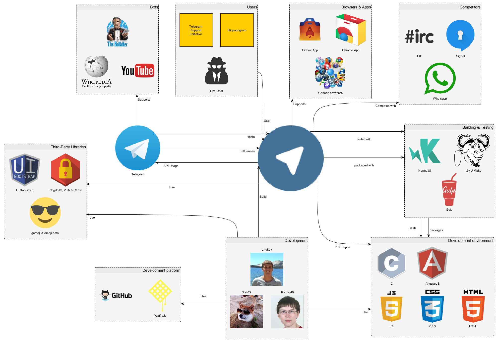
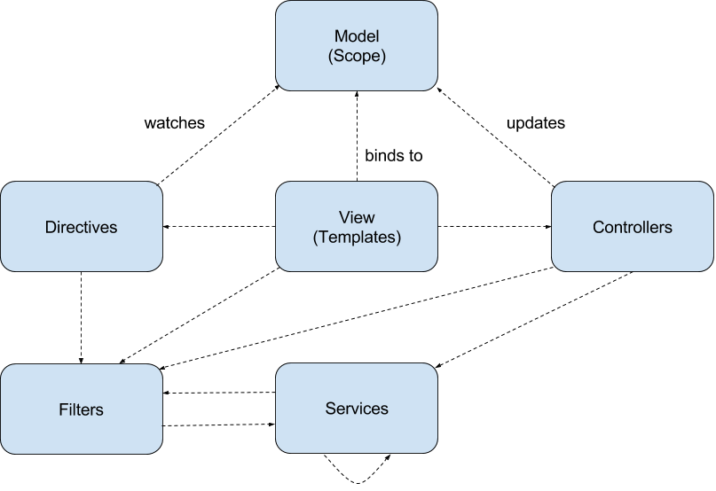
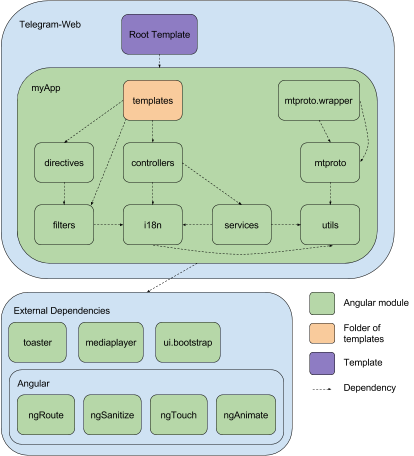
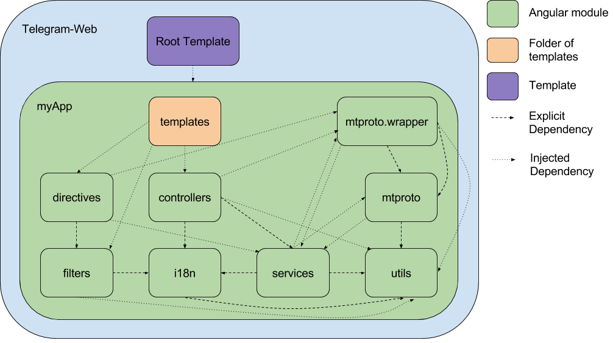
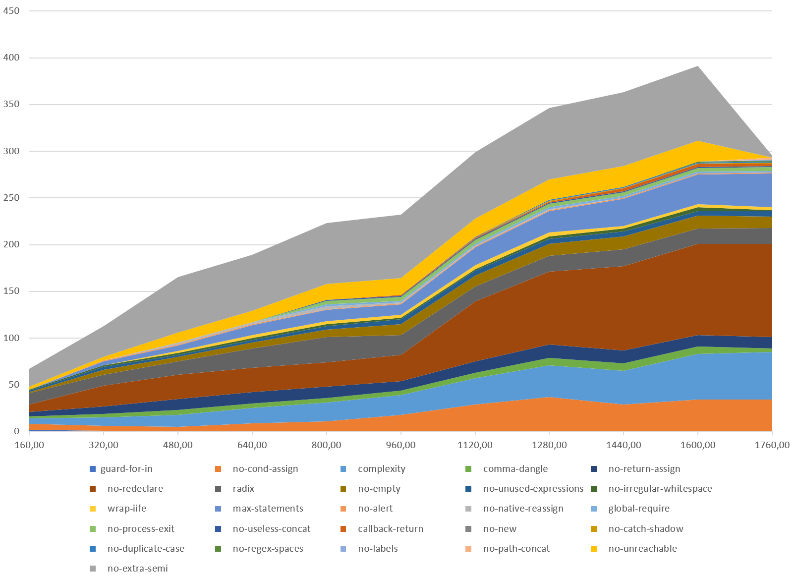

# Telegram-Web

[Kilian Grashoff](https://github.com/kiliangrashoff/), [Bart Heemskerk](https://github.com/bartist/), [Baran Usta](https://github.com/baranusta/), [Michiel Vonk](https://github.com/Stapelpanda/)  

*Delft University of Technology, 2017*

## Abstract
Telegram-Web is a client-side web-application, which uses the Telegram API to enable instant messaging functionality in web browsers. Its sole maintainer is Igor Zhukov, who started the project as a hobby. The application is built using AngularJS, UI bootstrap and CryptoJS. The project contains a lot of technical debt. One form of technical debt is the lack of a modular structure. Also, most of the code is not covered by testing and almost no documentation is present. A plan is proposed to pay off this technical debt, which will make contributing to Telegram-Web easier.

## Introduction
Instant messaging applications offer real-time transmission of text over the internet. They allow for effective communication, because a recipient can almost instantly see a received message. Because of their text-based nature they can also be used in many settings. Telegram is a free, cloud-based instant messaging application with a focus on security and speed. It offers a well defined public API to enable developers to implement their own systems. There are official Telegram clients for various mobile and desktop platforms, and an official web client. All of Telegram's official clients are open source projects.

Telegram-Web (a.k.a Webogram) is the official web client of Telegram. It is hosted on [web.telegram.org](http://web.telegram.org) and also packaged as Chrome and Firefox extensions. Telegram-Web started as a hobby of its creator, Igor Zhukov, and was an unofficial client at first. Later, it became the official web-client for Telegram. In this chapter, Telegram-Web's architecture is analyzed. First its features and stakeholders are discussed. Then its architecture is discussed by means of a context, development, and deployment view. The deployment view is relevant, because the deployment of Telegram-Web is somewhat unconventional. Telegram-Web is further investigated from the internationalization perspective. This perspective is interesting because Telegram-Web supports multiple languages, and a strict procedure is used to guarantee the quality of translations. Finally technical debt in the project is analyzed. Telegram-Web suffers from significant technical debt, so a plan is proposed to pay off this debt.

## Stakeholder Analysis
The stakeholders involved in the development of Telegram-Web were analysed in several ways. First, ten recent issues and ten recent pull requests were investigated. Pull requests and issues that had extensive discussion were selected for analysis. Pull requests that contained major changes to the project were also selected. This selection gave information on relevant stakeholders, and how they interact. Secondly, the [GitHub contribution statistics](https://github.com/zhukov/webogram/graphs/contributors) were analysed. This second analysis helped to make sure that no relevant stakeholders were missed in the first analysis. The involved stakeholders were categorized as described by Rozanski and Woods. [[13](#rw)]

- **maintainer** and **assessor**: _Igor Zhukov_ started the project, and is its sole maintainer. This can be concluded from the fact that he is the only one that merges pull requests and closes issues on GitHub. He also assumes various other roles in Telegram-Web's development (see below). Since he is the sole person who controls what is approved to merge into Telegram-Web, he is regarded as assessor as well.
- **acquirer**: _Telegram Messenger LLP_ was founded by Pavel Durov, Nikolai Durov and Axel Neff. [[15](#reuters-russias-zuckerberg)] Telegram Messenger LLP develops the core Telegram service and its API. Although Telegram-Web is the official web client for Telegram, Igor Zhukov's relationship to Telegram Messenger LLP is unclear. The reason for this is that Telegram Messenger LLP is highly secretive, after its founders left Russia for political reasons. [[12](#nyt-once-celebrated)] However, Igor Zhukov used to work for the same company as the Telegram founders (VKontakte). [[10](#linkedin-zhukov)] For that reason, is assumed that he is either employed by Telegram Messenger LLP, or has close ties to it. Therefore, Telegram Messenger LLP, represented by CEO Pavel Durov, is regarded as acquirer.
- **system administrator** and **suppliers**: due to Telegram's secretive nature, it is unclear who administrates the deployment of Telegram-Web, therefore the system administrator is unknown. It is also unclear who supplies the hardware that runs this deployment, so the **suppliers** are unknown too.
- **communicators**: the analysis of GitHub issues showed that _[@stek29](https://github.com/stek29)_ and _[@Ryuno-Ki](https://github.com/Ryuno-Ki)_ reply frequently to issues, therefore acting as communicators. Markus Ra is the press contact for Telegram Messenger LLP, so he acts as communicator as well. The people in the _[Telegram Support Initiative](https://core.telegram.org/tsi)_ are the final group of communicators. They are volunteers who answer questions by other users using Telegram itself.
- **developers**: the analysis of pull requests and the [GitHub contributors graph](https://github.com/zhukov/webogram/graphs/contributors) showed that _[@stek29](https://github.com/stek29)_ and _[@Ryuno-Ki](https://github.com/Ryuno-Ki)_ are the only people who have recently contributed significant changes, so they are the main active developers besides Igor Zhukov.
- **production engineer** and **tester**: _[@Ryuno-Ki](https://github.com/Ryuno-Ki)_ set up a framework for testing and created some initial tests for Telegram-Web, so he is regarded as having both these roles.
- **users**: every user of Telegram-Web is considered a stakeholder. Telegram-Web can be used in four ways:

  1. Chrome app;
  2. Firefox app;
  3. hosted online (http://web.telegram.org and Github pages on https://zhukov.github.io/webogram);
  4. self-hosted.

The following additional types of stakeholders were also identified. The explanation for each type describes why these groups are relevant stakeholders in addition to the stakeholders described above.

- **candidate developers**: _submitters of pull requests yet to be merged or rejected_ indicate interest in a feature to the developers and maintainer. Despite their work not being merged, they influence the development of Telegram-Web. This influence is evident in the analyses for pull requests [#330](https://github.com/zhukov/webogram/pull/330) and [#1306](https://github.com/zhukov/webogram/pull/1306).
- **reviewers**: reviewers actively influence the development of Telegram-Web by reviewing the work of candidate developers. _[@zhukov](https://github.com/zhukov)_ acts as reviewer, since he reviews the works by all contributors before deciding if he will merge their work. _[@stek29](https://github.com/stek29)_ and _[@Ryuno-Ki](https://github.com/Ryuno-Ki)_ also voluntarily review pull requests on GitHub.
- **translators**: _volunteer translation teams_, led by _Markus Ra_, influence Telegram-Web by making the translations used by Telegram. This process will be explained in-depth in the [internationalization perspective](#internationalization-perspective).
- **maintainers of derivative works**: these maintainers have an interest in the development of Telegram-Web, since they can pull in any work that happens to Telegram-Web into their own work. Since Telegram-Web has many forks, the GitHub network graph functionality could not be used to find derivative works. A script was written, which calculates the number of diverging commits for each repository on GitHub. Two major derivative works were found:
  - [hippopogram](https://github.com/I-hate-farms/hippopogram) by [@I-hate-farms](https://github.com/I-hate-farms) with his own added features like markdown support. [[9](#hippopogram)]
  - [TWebogram](https://github.com/rubenlagus/webogram) by [@rubenlagus](https://github.com/rubenlagus) is a version of Telegram-Web with additional functionality to help with the Telegram Support Initiative. [[14](#twebogram)]
- **competitors**: competitors are interested in the development of Telegram-Web since they have a competing service. _WhatsApp_ and _Facebook messenger_ are the two chat clients with the most users worldwide, both are owned by Facebook, Inc. [[11](#st-popular)] They have a web-version that competes directly with Telegram-Web. _IRC_ and _Signal_ compete based on specific features that are advertised both for them and Telegram. IRC is known for having a large ecosystem of bots, which Telegram has too. Signal is known for its privacy features, Telegram advertises this also.

### People contacted
Igor Zhukov was contacted, since he is the person with the most influence and knowledge about Telegram-Web. Questions were asked about what the best way was to make small contributions to Telegram-Web and how he came to start Telegram-Web. He replied that any contributions would be helpful, but that he did not have suggestions besides the issues on GitHub. He confirmed that he started Telegram-Web as a hobby.

While submitting pull requests with tests ([#1355](https://github.com/zhukov/webogram/pull/1355) and [#1362](https://github.com/zhukov/webogram/pull/1362)), a request to review was sent to [@Ryuno-Ki](https://github.com/Ryuno-Ki), since he set up the Telegram-Web testing framework. He made some helpful suggestions, which were incorporated in our pull requests.

## Context View
This section will discuss the relationships between Telegram-Web and external entities. Telegram itself will be treated as a black box.

### System Scope
Telegram-Web is an application built against the Telegram API to allow mobile and desktop users to use Telegram without installing an application. On some platforms (Firefox OS and Chrome OS) this application can even be installed since there are no native apps available on those platforms. The scope of this chapter is limited to Telegram-Web, so the Telegram API is considered an external entity.

### History
Messaging has been around even before the Internet by using postal and other services. When the internet came around there were multiple ways to communicate, some looked like sending a letter to each other (email). There were also message boards and public chat channels in which (like IRC) even had private messaging.

Telegram itself is more comparable to either MSN messenger, or more recent mobile applications such as Whatsapp or Facebook Messenger. What these applications offer is a service to communicate with other persons, either alone or in group-chats. Telegram tries to differentiate from this service by providing more secrecy and the ability to create bots, these bots are programs which allow the user to play a game and or provide integration with third party services. [[6](#ref-telegram-bot)]

Telegram-Web has mainly been developed by [@zhukov](https://github.com/zhukov). It started as a hobby and since 13-11-2014 it is adopted as the Official web client of Telegram. [[8](#ref-un-to-official)] Over time other contributors tried to help out [@zhukov](https://github.com/zhukov) by issuing a pull request with their contribution. As can be seen in table [1](#contributors-over-time) [@zhukov](https://github.com/zhukov) is still the lead developer of this application.

| Time period                                                                                                | Time period (exact)      | Contributors                                                                                                                                     |
|------------------------------------------------------------------------------------------------------------|--------------------------|--------------------------------------------------------------------------------------------------------------------------------------------------|
| [first week](https://github.com/zhukov/webogram/graphs/contributors?from=2014-01-05&to=2014-01-12&type=c)  | 5 - 12 Jan               | only [@zhukov](https://github.com/zhukov)                                                                                                        |
| [first month](https://github.com/zhukov/webogram/graphs/contributors?from=2014-01-05&to=2014-02-05&type=c) | 5 Jan - 5 Feb            | help from: [@paulmillr](https://github.com/paulmillr) for setting up the repo and [@imangani](https://github.com/imangani) for a small MIME fix. |
| [first year](https://github.com/zhukov/webogram/graphs/contributors?from=2014-01-05&to=2015-01-05&type=c)  | 5 Jan 2014 - 5 Jan 2015  | 22 contributors which totaled to 58 commits vs 158 commits by [@zhukov](https://github.com/zhukov)                                               |
| [second year](https://github.com/zhukov/webogram/graphs/contributors?from=2015-01-06&to=2016-01-06&type=c) | 6 Jan 2015 - 6 Jan 2016  | 25 commits by contributors, 423 commits by [@zhukov](https://github.com/zhukov)                                                                  |
| [remainder](https://github.com/zhukov/webogram/graphs/contributors?from=2016-01-07&to=2017-03-31&type=c)   | 7 Jan 2016 - 31 Mar 2017 | 21 commits by other contributors and 254 commits by [@zhukov](https://github.com/zhukov)                                                         |

 Table 1: commits done to Telegram-Web over time 

### Context Diagram

Figure 1: Context Diagram

### Context Model
The context-diagram as seen in figure [1](#fig-context-diagram) is an overview of the components connected to Telegram-Web. The following subsections will start at the bottom of the diagram, then review the top part and finally the interconnection and reason why Telegram itself is also included.

#### Development
At the bottom five groups are visible. Together they represent the development of Telegram-Web:

 - **third-party libraries:** the third party libraries which can be found at the [Telegram-Web GitHub page](https://github.com/zhukov/webogram#third-party-libraries);
 - **development:** the main developers selected from the pull request, issue and fork analysis, as described in the [stakeholder analysis](#stakeholder-analysis);
 - **development environment:** the languages used in the project, AngularJS is the framework upon which the whole application is built and thus classified as part of the development environment.
 - **development platform:** to aid the development process, a central code and issue location is needed. In this case [GitHub](https://github.com) is used in combination with [Waffle.io](https://waffle.io) to show the current issue status.
 - **building & testing:** some tools are used to build Telegram-Web, by creating a standardized build process using make and gulp no steps can be forgotten

#### Users and Competitors
Excluding the Bot group the top parts consist of:

 - **users:** which consist of the end-users and two special groups which run their own fork: [TSI](https://github.com/rubenlagus/webogram) with some additional branding and [Hippopogram](https://github.com/I-hate-farms/hippopogram) a derivation with some additional features;
 - **browsers & apps:** which shows the cross-browser version and the packaged apps for both Chrome and Firefox;
 - **competitors:** which show widely used chat apps with comparable functionality.

#### Telegram API
The Telegram-Web application cannot exist without the Telegram API, since Telegram-Web is only a client that needs the data stored behind the Telegram API.
The external services and bots accessed through the Telegram API are a big influence on the development of Telegram-Web. One example of this is the **Youtube bot**. For usability a thumbnail returned from the bot is embedded into the chat. Telegram-Web has functionality to handle this.

## Development View
This section describes the architecture of Telegram-Web. The development view helps to support the development process. Its concerns are common design approaches, module structure, and codeline organization. Each of these concerns will be discussed in this section. [[13](#rw)]

### Common design model
Common design approaches and design constraints are helpful to keep the system coherent. Each developer has to follow the AngularJS patterns that are used in the project. Additionally, security is an important concern of Telegram. Therefore, Telegram-Web has to adhere to strict constraints while interacting with the server. [[18](#auth-message-delay),[19](#securitycheckfail),[20](#security-1)]

#### AngularJS design patterns
Telegram-Web is designed as a [Single Page Application](https://en.wikipedia.org/wiki/Single-page_application) and uses the AngularJS 1 framework. AngularJS was specifically developed to make building single page web applications easy, which is probably why it was used for Telegram-Web. It's based on the Model-View-Controller design pattern, which structures an application in three parts:

- **model:** the data (also called state) of the application;
- **view:** the interface of the application, which shows the data in the model. The view is defined in HTML-based Template files;
- **controller:** component that updates the model when the user makes a change to the view. This is the place where business logic such as validation of the user input happens.

There are some additional types of components in AngularJS:
- **directives:** updates part of the view when the model changes;
- **filters:** functions that format data for display to the user;
- **services:** reusable business logic that is independent of views.

Figure [2](#components) shows the (possible) dependencies between these different types of components. An arrow `A->B` indicates that components of type `A` can depend on components of type `B`.

Figure 2: the model of different components of AngularJS

### Module structure model
The module structure model defines the organization of the system’s source code. It specifies the modules into which the individual source files are collected and the dependencies among these modules. [[13](#rw)]

Figure [3](#module-structure) shows the Telegram-Web modules, as defined using AngularJS modules and explicit dependencies between them. Injected dependencies will be discussed later.

Figure 3: Telegram-Web module structure

The main module of the Telegram-Web is called myApp, and depends explicitly on all modules that are part of it, as well as all external modules. The only functionality that the myApp module itself provides, is to specify the controllers that AngularJS injects for three different URL's: `/`, `/login`, and `/im`. Those three controllers in turn trigger loading of the templates that contain the needed components for the page to be displayed.

#### Internal Modules
Each of the component types (controllers, directives, filters, services, and templates) function as described in the section on the [AngularJS component structure](#angularjs-design-patterns). The recommended way to use modules in AngularJS is to make a module for every individual feature and reusable component in the application. [[2](#an-modules)] However, Telegram-Web only has a single module per component type except for the following separate modules:

* `i18n` is the internationalization module. It provides functionality to show the interface in one of the languages that Telegram-Web supports.
* `utils` provides several functionalities. It mainly consists of services to write, read and transfer data to local storage and over the web.
* `mtproto` implements the low-level functionality of the MTProto protocol that Telegram-Web uses to connect to the Telegram-API.
* `mtproto.wrapper` uses the functionality provided by MTProto to provide high-level functionality that is used in other modules.

#### External modules
The myApp module depends on external modules, that can be used by any of the modules within myApp. Telegram-Web depends on the following external modules:

* `Toaster` provides a way to show notifications on the webpage itself;
* `Mediaplayer` provides an easy way to play media from inside AngularJS applications, by wrapping the &lt;audio&gt; and &lt;video&gt; HTML tags in a directive;
* `ui.bootstrap` implements the [Bootstrap](https://getbootstrap.com/) user interface elements in AngularJS directives;
* finally `ngRoute`, `ngSanitize`, `ngTouch` and `ngAnimate` are modules for specific functionalities that AngularJS provides.

#### Injected dependencies
The explicitly defined dependencies of AngularJS modules only determine the order in which AngularJS constructs different components. These components are free to specify arguments that they need outside of their module, which are injected by AngularJS. This means that the dependencies as listed in figure [3](#module-structure) are far from complete, in fact almost all modules in Telegram-Web reference most of the other modules. Figure [4](#module-structure-inject) is an overview of injected dependencies between components in internal modules.

Figure 4: Telegram-Web module structure with injected dependencies

#### Layering rules
Because the dependencies between modules in Telegram-Web are unmanaged there is no clear grouping of modules into layers possible. Since there are no layers, there are also no layering rules.

### Codeline model
The codeline model specifies the organization of files and the interaction with external tools. First, the directory structure and configuration files are specified. Then, the tools that are used for building and testing are documented. Finally, the strategy for source code management is explained.

#### Directory structure and Configuration
The root folder contains the project files such as:

* `package.json`, which gives information about the package/application;
* `gulpfile.js`, which allows building a distributable version;
* `LICENSE`, `README.md`, and `CONTRIBUTING.md`, which give repository information and explain how someone can contribute.
* `Dockerfile`, specifies how the application runs a Docker container.

The folder structure then boils down to:

* `.tx` Transifex configuration;
* `app/`, application files such as a manifest and the start file: `index.html`;
* `app/fonts`, Google fonts;
* `app/img`, project image files;
* `app/js/lib`, mainly non AngularJS files;
* `app/js`, mainly AngularJS files;
* `app/less`, LESS Stylesheet;
* `app/nacl`, *Native Client* C files, which compile to a `pexe` file;
* `app/partials`, HTML views;
* `app/vendor`, third-party libraries;
* `scripts`, external scripts for downloading Google fonts, country name translation and emojis;
* `test/unit`, unit tests.

All configuration parameters and constants must be put in the `config.js` file. When forking Telegram-Web an `API_id` and `API_hash` must be retrieved at [https://my.telegram.org](https://my.telegram.org).

#### Building and testing
The Telegram-Web project is based upon JavaScript and AngularJS. The package manager `yarn` is used to download all dependencies. Recently the test runner `KarmaJS` and test framework `Jasmine` were added. Using the configuration in `karma.conf.js` the tests can be run by executing `gulp karma-single` for a single run or `gulp karma-tdd` for continuous testing. In continuous testing mode `KarmaJS` watches for file changes and then reruns the test.

The building process is based on `Gulp` and has a list of tasks, specified in `gulpfile.js`. These tasks are named according to the goal of the task (e.g. copy-images). There is also a `Makefile` which can be used to call several *Gulp* and *Transifex* tasks together to perform common actions. For example, using the command `make package` will execute gulp to build the software, remove unnecessary files, and package it as a zip file.

#### Source management
The Telegram-Web repository is located on [GitHub](https://www.github.com/zhukov/webogram). The main developer ([@zhukov](htps://www.github.com/zhukov)) uses one branch for software development and one for the GitHub pages hosted version.

When users want to contribute it is recommended to open an issue for the proposed changes before starting development. This helps to prevent unnecessary effort. Telegram-Web uses the forking workflow. [[5](#forking-model)] In the forking workflow the user forks the repository and makes their changes in a separate branch. When they have completed their work, they can request the code to be merged into the main repository by issuing a pull request. After a pull request is issued, Igor Zhukov reviews it. He decides whether to merge the contribution, request changes to it, or reject it.

## Deployment view
Althought the name of Telegram-Web would suggest it's a web application most of the processing power is needed at the Telegram API, which is out of scope for this chapter. Therefore only the packaging and distribution of the client-side application will be discussed.

### Packaged Apps
All versions of Telegram-Web can be treated as a packaged app, through a market place or from the [Webclient](http://web.telegram.org). The package is the same for different platforms, although they look at different files to execute the application:

 - `webogram.appcache`: hosted version of Telegram-Web;
 - `manifest.webapp`: Firefox Packaged App;
 - `manifest.json`: Chrome Packaged App.

The `webogram.appcache` is a list of files which are downloaded to the users browser cache. The other two are comparable to each other, the Firefox version has more options (custom permission messages and activity references).

### Dependencies
In the packaged manifests permissions are given to give the user control over the app. The Chrome/Firefox app manifest asks permission on installing, while the hosted version asks permission whenever needed. The manifest contains the following permissions:

 - `notifications`, `push`, and `desktop-notification`: these permissions are needed to get notified on events like receiving a message;
 - `webview` and `fullscreen`:  the webview is needed to "embed guest content", since the app is a package webpage, and must be able to go fullscreen to give the user a full app experience;
 - `{"fileSystem": ["write"]}`, `storage`, `unlimitedStorage`, and `device-storage:{music,pictures,sdcard,videos}`: to store received images;
 - `contacts`: to start a chat with a known contact.

Most of these permissions are soft dependencies. For example: a user can only send or receive a picture if they access to their storage. The same holds for contacts. In addition, if a user denies push access he/she cannot receive notifications.

### Throughput needed
Since the packaged apps are served through either the Chrome or Firefox Marketplace the only infrastructure needed, is for the hosted variant. The webcache consists of the files specified in the [webogram.appcache](https://zhukov.github.io/webogram/webogram.appcache). These files are downloaded from the server (if caching is allowed) when a user starts the app for the first time or when the application is updated. All packaged versions are the same and consist of 5,65 MB of data. When removing the manifests and files not specified in the `webogram.appcache` 5,44 MB is used, divided over 84 files.

Two better known hosted versions of Telegram-Web are:

 - [Telegram-Web](https://web.telegram.org)
 - [Github Pages - Zhukov](https://zhukov.github.io/webogram)

For the Github pages the NGINX webserver is used with a Content Delivery Network (CDN) to distribute load across the globe. The Telegram-Web headers show that the webserver used is NGINX 1.6.2. a server which, depending on hardware and configuration, can handle over 500.000 requests/sec. [[1](#ref-lowlatencyweb)] It is more likely that the server runs out of bandwith before it reaches its requests threshold. Using the network bandwidth available and dividing it by the size of a package, a rough number of users simultaneous updating is calculated. The results of this calculation are shown in table [2](#bandwith).

| Speed | Updates / second |Updates / Hour|
|------:|------:|---:|
|1Gb/s  | 23   |82800|
|10Gb/s | 235  |846000|

Table 2: number of updates possible per network bandwith

It is hard to judge whether the current infrastructure is sufficient to allow all users to update in a timely fassion. No one besides the hosting party knows what the current demand is during updates. Using a CDN like the GitHub pages does mitigate this problem.

## Internationalization Perspective
Rozanski and Woods [[13](#rw)] describe the internationalization perspective as "the internationalization perspective ensures the system’s independence from any particular language, country, or cultural group". The Telegram app is used by milions of users all around the world. That's why the internationalization perspective played a significant role designing the system. This section discusses how the internationalization perspective affected the system.

### Internationalization of Project
As stated earlier, the project is hosted by GitHub and a number of developers contributed who are from all around the world such as Argentina, India, Taiwan and many more. [[7](#contributors)] To enable people across the world to contribute easily the language used in the code, in the discussions under issues, and in the PR's is English.

### Localization
Telegram Messenger LLP aims to serve all the users in the most convenient way for them. This is why they aim to provide the service in their own language. Currently Telegram-Web has six different languages support. The default language of the app is English. However, when the app is visited and a language has not been set before the browsers default language is checked. If languages is supported, the app is configured and shown in this language. Besides these supported languages some language translations are under development. For the translation [Transifex](https://www.transifex.com/telegram/telegram-web/), which will be discussed in detail below, is used. Telegram-Web also supports different accents in some languages. That is why the necessary characters that are used in those accents are defined manually in 'config.js' file as 'Config.LatinizeMap' variable.

#### Transifex
Transifex is a third party service that provides a collaborative localization platform. It is used for each of the client projects of Telegram. [[21](#transifex-all-repo)] This service has been used for translations since Telegram-Web became the official web app for Telegram. [The project](https://www.transifex.com/telegram/telegram-web/) is managed by both Igor Zhukov and the Telegram Head of Support, Markus Ra. In order to add support for a new language in official Telegram-Web, it has to be approved and translated completely. There are currently seven languages that are being translated by volunteers selected by Telegram Support Team. These languages are for example: Turkish, Korean and Chinese.

#### Translation Guideline
As a policy Telegram relies on volunteers for many services to keep the Telegram free. [[22](#translation-guideline)] Translation is one of these services. The Telegram Messenger LLP expects each client's translation to follow similar principles to provide a pleasant service to the users. Translations must be:
- consistent: should be consistent in all platforms;
- natural: instead of translating word by word, it should reflect the culture;
- default: similar to the language that other popular apps uses;
- beautiful: should look like the app is built in that region;
- looks good: words must not cause any problem with UI.

## Technical Debt
Technical debt is the difference between how a project is run currently and how it should be run in an optimal way. [[17](#tech-debt)] In this section the technical debt of the Telegram-Web project will be dissected and discussed. The debt will be discussed in three forms: architectural debt, testing debt, and documentation debt. The evolution of the technical debt will be examined and a solution/working method is proposed to pay off the debt.

### Architectural Debt
Architectural debt occurs when the architecture of a software system is not optimized, making development more difficult. The [Module Structure Model](#module-structure-model) shows that Telegram-Web suffers from architectural debt. This is because most of the code is not split up into modules. Instead Telegram-Web contains only a few very large modules. Examples are the files ``controllers.js`` (2796 LOC) and ``directives.js`` (1927 LOC)[[22](#cc-cov)], both part of the MyApp module. This is not how the AngularJS module system is meant to be used. The system's intention is that every component that implements a feature is made into an individual module. [[2](#an-modules)]

Comparing the current master to the [oldest version of the Telegram-Web source on GitHub](https://github.com/zhukov/webogram/tree/0993489bafdcfb42e568bc69d459bc5a3597c720) shows that most of the module structure remained unchanged. Because the project was a lot smaller back then, this was not as much of a problem as it is now.

Splitting the large modules into smaller modules would not fix the dependency management, because AngularJS does not impose restrictions on module connectivity. Migrating to Angular 2 would solve a part of that issue because it is more strict and offers more tools on module management. [[3](#JS2A)]

#### SOLID Violations
Both the Single-responsibility principle and the Open-closed principle are violated due to the lack of module structure. [[16](#solid)] The lack of module structure leads to a lack of consideration of dependencies, causing many components to depend on many others. Because there are no modules with well-defined interfaces, all code is open to modification. It is also not possible to depend on the functionality of a single module, meaning that the code is closed to extension.

Because Telegram-Web is not programmed using object-oriented principles, the Liskov substitution principle, Interface segregation principle and Dependency inversion principle do not apply. [[16](#solid)]

### Testing Debt
Code needs to be tested in order to assure the quality and code needs to conform to a style in order to improve the readability of the code. Whenever code is not tested or does not conform to a code style it creates testing debt. The testing debt of Telegram-Web will be examined and discussed below.

#### Code Testing
Libraries for testing JavaScript code are present since pull request [#1293](https://github.com/zhukov/webogram/pull/1293).  Because this pull request is merged recently, it lacks proper coverage by unit testing or any other testing as can be seen in table [3](#code-coverage).

|File             |  % Stmts | % Branch |  % Funcs |  % Lines |
|-----------------|----------|----------|----------|----------|
| js/             |     7.51 |     0.83 |     1.98 |     7.52 |
|  controllers.js |     7.09 |     1.31 |     6.47 |     7.12 |
|  directives.js  |     4.65 |        0 |     0.46 |     4.66 |
|  filters.js     |      9.7 |    16.67 |    17.65 |      9.7 |
|  services.js    |     7.93 |     0.12 |     0.77 |     7.93 |
|  templates.js   |      100 |      100 |      100 |      100 ||

Table 3: Code coverage since <a href="https://github.com/zhukov/webogram/pull/1362/commits/fc87ea450ffbd52d2fbd69e063af16f58678ff56">latest addition of tests</a>. templates.js is generated by gulp and is fully tested via testing directives.js

Table [3](#code-coverage) shows that the project doesn't have any UI or End-to-End testing, because no testing framework for these kind of tests are added to the project. It is argued in PR [#1293](https://github.com/zhukov/webogram/pull/1293) that most of the code is tied to UI. Testing UI would enable developers to check if UI changes still conform to certain guidelines, like the one that may be enforced on the main developer by Telegram. The exact guidelines are unclear since none were found. However, based on issue [#1357](https://github.com/zhukov/webogram/issues/1357), it is more likely that style is based on the main developers best judgement.

#### Code Style
[@zhukov](https://github.com/zhukov) added [StandardJS](http://standardjs.com/) to the project on the 28th of June, 2016, saying "_for now it doesn’t pass well, but that’s a start_". However, it is not strictly required that contributions do not add StandardJS errors to the code. The result is a large amount of errors in several files: 1145 errors in ten non-library files and 24414 errors in library files. Most of the later errors are found in app/js/lib/config.js: 23506 errors, most of which are spacing errors and the usage of double quotation marks for strings.

### Documentation Debt
Documentation is a vital part of software development. It increases the quality of the software by helping developers to follow the same rules. This also increases the maintainability of the software.

There is no documentation that describes the architecture of Telegram-Web. There is also very little technical documentation with information about the code. There is [some info](https://github.com/zhukov/webogram/blob/master/app/js/locales/README.md) about localization. Another existing document which can be considered technical documentation is the projects [GitHub page](https://github.com/zhukov/webogram).

However, there is no documentation associated with the source code. For example there is no document on the data structures used or explanation of the complex functions. AngularJS provides an example of how JSDoc can be used for documentation. [[4](#AJS-doc)] However, the Telegram-Web code contains no documentation comments, so no documentation can be generated using these tools.

### Evolution of Technical Debt
For checking the evolution of technical debt the CodeClimate CLI tool is run on branches over a period of time, starting at commit 160 and increasing by 160, as can be seen in table [3](#commits). These are saved as JSON files which can then be processed by any common scripting language, in this case PHP.

|Commit Hash|By|Date|Message|
|---|---|---:|---|
|8743a5d|*Bart Heemskerk*|2017-02-21 17:06:13 +0100|Removed npm libraries from Code Climate Testing|
|5cf067a|*Igor Zhukov*|2016-06-13 15:23:25 +0300|Added tooltip|
|2e994c1|*Igor Zhukov*|2015-11-29 21:12:40 +0300|Updated changelog|
|3c55bed|*Igor Zhukov*|2015-07-10 19:36:24 +0300|Improved mobile UX|
|a317a5b|*Igor Zhukov*|2015-03-19 02:44:49 +0300|Bump to 0.4.1|
|17e79e7|*Igor Zhukov*|2014-12-28 20:54:42 +0100|disabled own fonts|
|6653fe7|*Igor Zhukov*|2014-10-27 20:31:00 +0300|Fixed $timeout|
|441e7ef|*Igor Zhukov*|2014-09-15 14:46:11 +0400|Fixed search messages bugs|
|b996717|*Igor Zhukov*|2014-06-09 20:45:32 +0400|Test cache manifest update|
|b9b7c11|*Igor Zhukov*|2014-03-19 15:25:53 +0400|Update Makefile to support gulp publish|
|e999975|*Igor Zhukov*|2014-01-23 17:49:24 +0400|File download improvements|

Table 3: Evaluated commits

#### CodeClimate
CodeClimate is a code analysis tool which has a lot of different configuration and so-called engines. Each engine can test the code for a different aspect. Based on the number of issues the engines finds in a code project, that project will get a code between 0 and 4, with 4 meaning that the project has no issues.

CodeClimate was configured to run three engines over each commit:

 - **CSS-Lint**: which validates css;
 - **ES-Lint**: which is a pluggable Javascript linter;
 - **Fixme**: which checks the comments for words indicating a 'to do' like *TODO*,*BUG*,*FIXME* or *XXX*.

#### Graph
The result of running CodeClimate on the selected ten commits can be found in figure [5](#image-debt-evolution). On the horizontal axis of this graph the number of commits is shown instead of time. This is to take into account that there were more active and less active periods in the development period.

Figure 5: Evolution over time, sorted by <a href="http://eslint.org/docs/rules/">ES-Lint</a> and <a href="https://github.com/CSSLint/csslint/wiki/rules">CSS-Lint</a> errors

### Proposal for paying off technical debt
In order to pay off the technical debt discussed in this section, the following steps are proposed:

1. **Improve test coverage**: as it stands there is not enough test coverage to guarantee that the functionality will remain the same when drastically changing the architecture. This step has been initiated by [some contributions](https://github.com/zhukov/webogram/pulls?utf8=%E2%9C%93&q=%20test%20is%3Apr%20author%3Abartist%20), which have added seven tests for the controllers.
2. **Split larger files into dedicated, smaller files**: the project consists of a few, large files, each file representing one module of the system (like controllers.js and directives.js). By splitting these modules into smaller modules, where each module has its own file, the project will be more comprehensible. Each file can also get its own dedicated documentation.
3. **Refactor Code smells**: CodeClimate has found several code smells, like duplication, over-complex functions and functions with too many statements. Refactoring the code to eliminate these smells makes the code more maintainable.
4. **Migrate to Angular 2**: Angular 2 has better support for managing the architecture and dependencies of the modules than AngularJS. Migrating to Angular 2 will improve maintainability, because it has stronger reinforcement of architectural principles (usage of modules).
5. **Add continuous intergration**: at this point a CI service should be linked to the project, to assure no new technical debt will be introduced.

## Conclusion
Telegram-Web was studied in this chapter by analysing its architecture through several views and perspectives. The development view shows that Telegram-Web lacks a good module structure. Further analysis of technical debt revealed that a lack of documentation and testing are also issues for this project. These issues undermine the development process by slowing down developers who want to add features or fix bugs. They also discourage new developers that want to contribute to the project. The cause of this debt can be attributed to the evolution of Telegram-Web, which started as an unofficial client. Because the end-user does not notice the debt directly and due to practical constraints, fixing it is a low priority for the maintainer. However, paying some of this debt would help Telegram-Web, by making it significantly easier for new developers to contribute to the project. A [plan](#proposal-for-paying-off-technical-debt) is proposed to help start this process. Several [contributions](https://github.com/zhukov/webogram/pulls?utf8=%E2%9C%93&q=%20test%20is%3Apr%20author%3Abartist%20) have been made to implement the first steps.

## References
1. 
500,000 Requests/Sec – Modern HTTP Servers Are Fast, https://lowlatencyweb.wordpress.com/2012/03/20/500000-requestssec-modern-http-servers-are-fast/. Accessed 19-03-2017.
2. 
AngularJS Developer Guide: Modules - Recommended Setup, https://docs.angularjs.org/guide/module#recommended-setup. Accessed 06-03-2017.
3. 
 AngularJS to Angular Quick Reference, https://angular.io/docs/ts/latest/cookbook/a1-a2-quick-reference.html. Accessed 29-03-2017
4. 
 AngularJS: Writing documentation, https://github.com/angular/angular.js/wiki/Writing-AngularJS-Documentation. Revision 21
5. 
Atlassian: Forking Model, https://www.atlassian.com/git/tutorials/comparing-workflows#forking-workflow. Accessed 06-03-2017.
6. 
Bots: An introduction for developers, https://core.telegram.org/bots Accessed 02-04-2017
7. 
Contributors list, https://github.com/zhukov/webogram/graphs/contributors. Accessed 01-04-2017.
8. 
GitHub Compare README.md, https://github.com/zhukov/webogram/commit/05a0ddca0e070216933df81cbaa35c42f8237bee Accessed 31-03-2017
9. 
I-hate-farms/hippopogram GitHub repository, https://github.com/I-hate-farms/hippopogram. Accessed 27-02-2017.
10. 
LinkedIn Profile Igor Zhukov, https://www.linkedin.com/in/igorzhukov/. Accessed 27-02-2017.
11. 
Most popular mobile messaging apps worldwide as of January 2017, https://www.statista.com/statistics/258749/most-popular-global-mobile-messenger-apps/. Accessed 27-02-2017.
12. 
Once Celebrated in Russia, the Programmer Pavel Durov Chooses Exile, https://www.nytimes.com/2014/12/03/technology/once-celebrated-in-russia-programmer-pavel-durov-chooses-exile.html. New York Times, 2014. Accessed 27-02-2017.
13. 
Rozanski,Nick and Woods,Eoin. Software Systems Architecture: Working with Stakeholders using Viewpoints and Perspectives. Addison-Wesley, 2012.
14. 
rubenlagus/TWebogram GitHub repository, https://github.com/rubenlagus/webogram. Accessed 27-02-2017.
15. 
Russia’s Zuckerberg launches Telegram, a new instant messenger service, http://www.reuters.com/article/idUS74722569420130830. Reuters, 2013. Accessed 27-02-2017.
16. 
SOLID principles, https://scotch.io/bar-talk/s-o-l-i-d-the-first-five-principles-of-object-oriented-design. Accessed 29-03-2017
17. 
Technical Debt, https://github.com/delftswa2017/course-info-2017/blob/master/slides/04-technical-debt.pdf. Accessed 29-03-2017
18. 
Telegram API: authentication guide, https://core.telegram.org/api/auth. Accessed 06-03-2017.
19. 
Telegram API: security guideline, https://core.telegram.org/mtproto/security_guidelines. Accessed 2017-03-06.
20. 
Telegram API: MTProto protocol, https://core.telegram.org/mtproto/. Accessed 06-03-2017.
21. 
Telegram Translation Repositories at Transifex, https://www.transifex.com/telegram/public/. Accessed 01-04-2017.
22. 
Telegram Translation Guideline, https://core.telegram.org/translating_telegram. Accessed 01-04-2017.
23. 
Test coverage of Telegram-Web, https://codeclimate.com/github/bartist/webogram/coverage.  Accessed Build \#7
24. 
Used 3rd party libraries by Telegram-Web, https://github.com/zhukov/webogram/blob/master/app/vendor/README.md. Accessed 06-03-2017.
