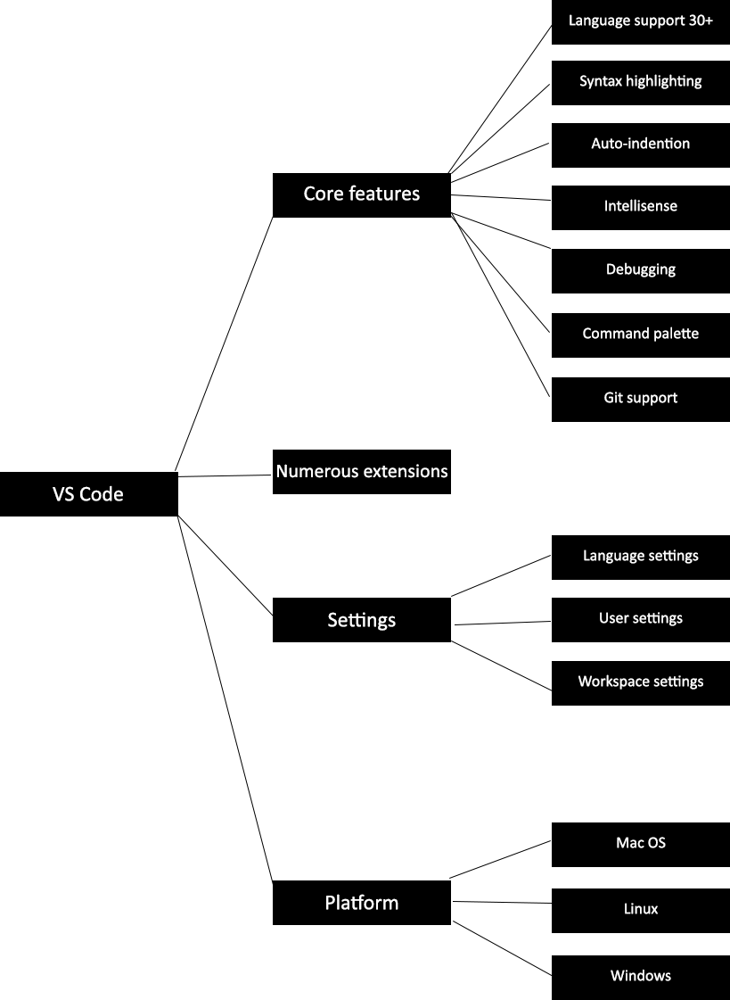
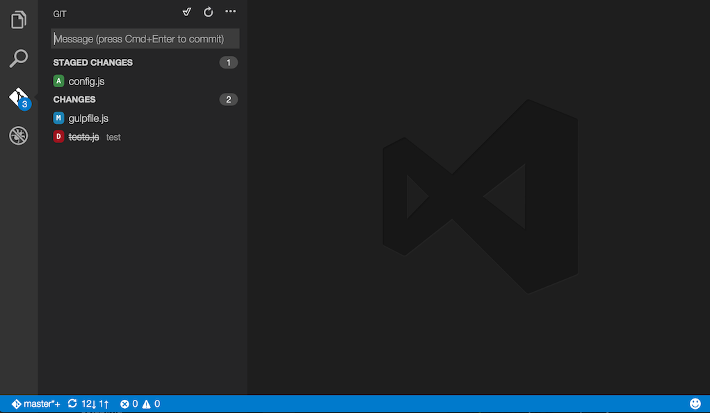
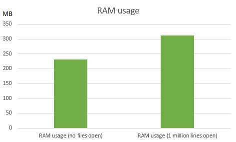
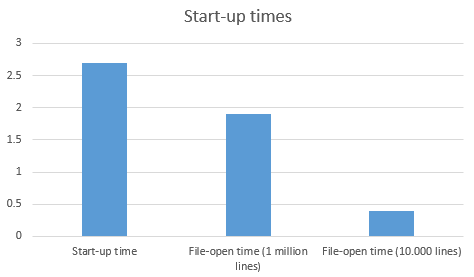

# Visual Studio Code

**By [Daan Schipper](https://github.com/daanschipper), [Julian Faber](https://github.com/julianfx), [Rick Proost](https://github.com/rpjproost) and [Wim Spaargaren](https://github.com/wimspaargaren).**  
*Delft University of Technology*

[Visual Studio Code](https://code.visualstudio.com/) is a lightweight open source text editor developed under Microsoft and can be contributed to through the GitHub repository [`vscode`](https://github.com/microsoft/vscode).
Extra functionality for Visual Studio Code is provided by means of extensions, which can also be developed by third party developers.
This chapter gives an overview of several software architectural views and perspectives, and describes the structure of the project.
First the stakeholders of Visual Studio Code are discussed and the results of an interview with one of those stakeholders is shown.
After this, the people, system and other external entities with which Visual Studio Code interacts is detailed. 
Next, the software development process is described and the functional elements of Visual Studio Code are examined.
Moreover, the performance of Visual Studio code is analysed, and lastly the included features of Visual Studio Code are discussed.

## Table of contents
- [Introduction](#introduction)
- [Features](#features)
- [Stakeholders](#stakeholders)
- [Integrators](#integrators)
- [Context view](#context-view)
- [Development View](#development-view)
- [Functional View](#functional-view)
- [Performance and scalability](#performance-and-scalability)
- [Conclusion](#conclusion)
- [References](#references)

## Introduction

This chapter will give an overview on the architecture, structure, workflow and testing in the development environment of Visual Studio Code.
[Visual Studio Code](https://code.visualstudio.com) is a new type of tool that combines the simplicity of
a code editor with what developers need for their core edit-build-debug cycle. 
Visual Studio Code provides comprehensive editing and debugging support, an extensibility model, and lightweight integration with existing tools.
Visual Studio Code is updated monthly with new features and bug fixes. It can be downloaded for Windows, Mac and Linux on the [Visual Studio Code's website](https://code.visualstudio.com/Download). The [`vscode`](https://github.com/microsoft/vscode) repository is where developers can contribute by adding issues or making pull-requests.
Visual Studio Code is developed and made open-source by Microsoft, because there was no lightweight alternative provided by Microsoft for their more complex, fuller featured IDE, Visual Studio. Visual Studio Code therefore comes without compilers to stay lightweight, but can still utilize them by installing extensions.
In this chapter, the Visual Studio Code environment is described in several different perspectives. 

## Features
This section gives an overview of the different features of Visual Studio Code.
In Figure 1 an overview of the different features of Visual Studio Code can be found.

_Figure 1: Visual Studio Code feature overview._

Out of the box, over 30 different [programming languages](https://code.visualstudio.com/docs/languages/overview) are supported. 
For these languages Visual Studio Code provides syntax highlighting, auto-indention and code completion by using [IntelliSense](https://code.visualstudio.com/docs/editor/intellisense). 
IntelliSense includes a variety of code editing features such as code completion, parameter info, quick info and member lists which can be seen in Figure 2.

_Figure 2: IntelliSense auto completion in Visual Studio Code._

Visual Studio Code also provides an interactive [debugging tool](https://code.visualstudio.com/docs/editor/debugging), which makes users able to step through source code and inspect variables for example. The debug screen can be seen in Figure 3.

_Figure 3: Debug support in Visual Studio Code._

Visual Studio Code also has integrated [Git](https://git-scm.com/) support, for the most common git commands. 
In Figure 4 an overview of the git support is shown.

_Figure 4: Visual Studio Code git integration._

Third party developers can also write extensions for Visual Studio Code to provide extra functionality to the core program. 
These extensions can be installed by users through the [Extensions Marketplace](https://marketplace.visualstudio.com/). 

## Stakeholders

Stakeholders are the people, groups or entities with an interest in an organization. 
Visual Studio Code is a large open-source project in which many stakeholders are involved.
Rozanski and Woods [[1](#references)] classify multiply stakeholders, the most important for Visual Studio Code are described below.

### Developers

Developers are defined as the stakeholders who construct and deploy the system from specifications (or lead the team that do this). 
The development teams located in Zürich and Redmond are the main developers of Visual Studio Code. 
These are the developers which can be assigned to issues and merge pull requests on the Microsoft Visual Studio Code GitHub repository. 
The developers of Visual Studio Code try to process the issues on GitHub, which improves the program with new features or bug fixes.

### Users

Users are defined as the stakeholders who define the system's functionality and ultimately make use of it. 
Users of Visual Studio Code are software developers. 
The interest of users in Visual Studio Code is that it is a lightweight tool, and is free to use. 
Visual Studio Code provides the simplicity of a code editor with what developers need for their core edit-build-cycle. 
Users can influence the system by requesting new features and reporting bug fixes on GitHub.

### Support staff

Support staff is defined as the stakeholders who provide support to the users for the product or system when it is running.
Visual Studio Code provides support to users in four different ways. 
Coding questions can be asked on Stack Overflow. 
Bug reports and new feature requests can be done via issues on GitHub. 
For other feedback Twitter is used and it is also an option to send an e-mail with comments or questions.
The different types of support can be accessed through the following links:

- [Stack Overflow](http://stackoverflow.com/questions/tagged/vscode)
- [GitHub](https://github.com/Microsoft/vscode/blob/master/CONTRIBUTING.md)
- [Twitter](https://twitter.com/code)
- [opencode@microsoft.com](mailto:opencode@microsoft.com)

## Integrators

In this section the Visual Studio Code workflow is described.
It explains how newly written code gets placed in production, whether it is written by a Visual Studio Code developer, or a contributor. 
It also gives insight on how large software projects can handle overhead of having a lot of developers and contributors.

Integrators are the ones that decide whether new code, or changes to old code, can be merged with the actual code in production. 
The tasks and challenges which these integrators have, are therefore analyzing pull requests and review them by making comments or even suggestions. 
When code is approved by the integrator, or multiple integrators, it can be merged to production code. Often the integrators also have a lot of involvement in the planning and road map, so they prioritize issues at hand, but also discuss new features.
In short, integrators will deal with importance, as well as feasibility of issues, coding standards, such as commenting and naming conventions, and make sure code is in line with software architecture or discusses refactoring if needed. Also, large features that influence the architecture of the code base, or user interface, are only assigned to the development team.

  

  _Figure 5: Pull-request workflow_

Figure 5 depicts the actual workflow of adding newly developed code to the project.

### Integrators Visual Studio Code

It is hard to really determine every integrator in the Visual Studio Code team, because everyone in the team can be assigned as reviewer. 
Although everyone of them can review, not everyone of them can integrate or in other words merge. 
The most interesting part found during the pull request analysis is that there are different integrators for different parts of the system. 
The Visual Studio Code team also automated the assigning process of integrators to pull requests by having a bot analyze the history of the changed files.
The integrators then spend 2-3 hours a day to give advise or merge pull requests, told by [@egamma](https://github.com/egamma) in the interview.
Coding guideline and continuous integration are also used in the process of reviewing, these are discussed further in the chapter.

### Feasibility

Integrators of Visual Studio Code accept small changes from the community fairly quick. 
The integrators also warn contributors when they are in over their heads, or just may need to invest a lot of their time if they continue on the selected issue. 
The bigger features and tasks are at request in Visual Studio Code, and normally only distributed to the Visual Studio Code team. 
The integrators at Visual Studio Code mostly have an idea on how a solution must be to fit in the architecture, so the integrators will also deny workarounds and tell you upfront when another bigger solution is expected.

## Context view

The context view of a system defines the relationships, dependencies, and interactions between the system and its environment.
The environment in the context are the people, the systems, and external entities with which the system interacts [[1](#references)].
The context view diagram in Figure 6 shows the identified entities and in what way they relate to Visual Studio Code and each other.

_Figure 6: Context view diagram_

The project is built using Electron, which takes TypeScript, JavaScript, CSS, and HTML and builds it into executables for the different operating systems.
The website for Visual Studio Code then distributes these built executables for each of the operating systems.
Next to distribution the website also gives documentation such as the API, docs, updates on new versions, and a blog.

Another important element in the context of Visual Studio Code are extensions.
These extensions are generally developed by external developers to give extra functionality to Visual Studio Code and to personalize the experience for each user.
An example is an extension that provides supplementary programming language support, like syntax highlighting and debugging.

GitHub is used to manage the code and track issues provided by users and developers, which can then be solved through contribution.
The GitHub repository also includes a wiki which describes among other things how the project is structured, how you can contribute, and links to resources.

The main stakeholders included in this diagram are the acquirer Microsoft, the developers, and the competitors.
The users and developers are treated as the same entity, because they perform similar roles in the context of Visual Studio Code.
Some of the competitors that are identified are Atom, Sublime, Vim, and Neovim, but many other similar editors are available.
These are competitors because all of them strive to be lightweight text-editors and provide extra functionality besides just editing text.
An IDE like IntelliJ, for example, is not considered a competitor, since it is more complex in use and not as lightweight.

## Development view
This section describes the architecture that support the software development process, the way the code is structured and the standardization of design and testing.

### Module organization
Visual Studio Code consists of a layered and modular core that can be extended using extensions as seen in Figure 7. Extensions are run in a separate process referred to as the extension host, which utilises the extension API.

_Figure 7: Module organization_

#### Target environments
The core of Visual Studio Code is fully implemented in TypeScript. 
Inside each layer Visual Studio Code is organized by the target runtime environment. 
These layers will be explained in detail in the next section.
This ensures that only the runtime specific APIs are used. In the Visual Studio Code project, the following target environments have been distinguished:

- _common_: Source code that only requires basic JavaScript APIs and run in all the other target environments.
- _browser_: Source code that requires the browser APIs like access to the DOM.
- _node_: Source code that requires Nodejs APIs
- _electron-browser_: Source code that requires the Electron renderer-process APIs
- _electron-main_: Source code that requires the Electron main-process APIs

The code is organized this way because of the API-like architecture the Visual Studio Code team applied. 
The layered way of splitting the project means that the base does not depend on anything else then the base. 
The API-like architecture means, that configurations/services/extensions can inject almost all kind of data that Visual Studio Code relies on. 
Outside developers can thus make modifications to Visual Studio Code without learning the whole system.
Developing new extensions also becomes more attractive, since a service or lots of data can easily be injected.
The editor layer of Visual Studio Code, is also a stand-alone editor, called [Monaco Editor](https://github.com/Microsoft/monaco-editor), and therefore a very modular part of the project.

### Codeline organization
The core of Visual Studio Code is partitioned into the following layers:
- _base_: Provides general utilities and user interface building blocks
- _platform_: Defines service injection support and the base services for  Visual Studio Code 
- _editor_: The "Monaco" editor is available as a separate downloadable component
- _workbench_: Hosts the "Monaco" editor and provides the framework for "viewlets" like the Explorer, Status Bar, or Menu Bar, leveraging Electron to implement the Visual Studio Code desktop application.
Next the layers are detailed and the functionality of each is explained.

#### The base layer
The code present is the base layer is used throughout Visual Studio Code. The common environment provides amongst others the structure to handle errors in Visual Studio Code, processes the events and declares the URI and UUID.
In the common environment the code ranges widely from simple functions to reduce code duplication, such as returning a hash value for an object, to complex code which handles asynchronous processes.
Also, the structure to handle errors is declared in the common environment, as well as event handling and declaration of URIs and UUIDs.

In the node environment functionalities are present that read the configuration files, handle the checksum for encryption, character encoding and decoding, directory and file manipulation and network handling. 
The imported modules are related to operating system-related utility methods, such as reading and writing of files, on the system on which Visual Studio Code runs on. 
Network modules are also imported in this module to interact with the web.

Besides the standard environments `browser`, `common` and `node`, the base layer also contains the `parts` and `worker` environments. 

The parts environment consists of three parts. 
The first part is `ipc`, which stands for inter-process communication. As the name suggest, this handles the communication between processes in Visual Studio Code.
Next is the `quickopen` part, this handles the functionality of the quick open file menu.
Lastly is the part called `tree`, which is the base of the implementation of the DOM tree of Visual Studio Code. This includes the data the tree contains and the frequently used code to render the tree.

The final environment is the worker environment. A worker is a script that runs in the background, independently of other scripts without affecting the performance of the page. In this environment the implementation of a worker is present as well as a worker factory.

#### The platform layer
The platform layer defines service injection support and the base services for Visual Studio Code.
The Visual Studio Code project is organized around services of which most are defined in the platform layer. 
Services is able to reach the clients via constructor injection.

A service definition consists of two parts: the interface of a service, and a service identifier. 
The latter is required because TypeScript doesn't use nominal but structural typing. 
A service identifier is a decoration and should have the same name as the service interface.

The platform layer builds upon the base layer, it creates instances and registers services for almost all things you see and do not see in Visual Studio Code. 
Commands through the developer pallette, keybindings, clipboard are all handled by the platform layer, but also the visible parts, like searchbar, markers are all handled here. 
The workbench layer in its turn builds upon the platform layer, which initializes much more details, like CSS, that are not handled in the platform. 

Extensions are all instantiated and registered through the platform layer, which give the extensions a lot of power over the Visual Studio Code system.

#### The editor layer
The editor layer is the part of the system that handles the functionality and displaying of the [Monaco Editor](https://github.com/Microsoft/monaco-editor).
It handles everything from syntax highlighting for different languages to user input like copying, pasting and selecting text.

Also services are defined in the editor layer, which can be used by the controllers to fetch certain data.
One of these services is TextMate, which interprets grammar files for the use of text highlighting.

The final part of the editor layer is contributions. Contributions are separate components that extend the functionality of the editor.
The functionalities are for example hiding and unhiding (block)comments, code indentation, and the usage of links.
The contributions have styling elements included where applicable (e.g. link highlighting), and in some cases their own tests.

#### The workbench layer
The workbench layer hosts the [Monaco Editor](https://github.com/Microsoft/monaco-editor) and provides the framework for viewlets. These viewlets are for example the explorer, status bar and menu nar and make use of the [Electron](https://electron.atom.io/) framework.

The common environment has one component, namely the editor. The different editor components implement the `baseTextEditorModel` from the `editor` module. Furthermore there are components like `panel`, `options` and `viewlet`. All of these components provide interfaces for common environment of the workbench.

The electron-browser environment implements the actual GUI of the workbench, which is based on the Electron framework. An overview of this component is shown in figure 8. The `main` component fires up the workbench. First the `shell` component is called. The `shell` component contains the different components from which the actual workbench is build. The shell makes use of five components. 
- `crashReporter`: handles the workbench in case of a crash.
- `nodeCachedDataManager`: saves the settings of the workbench.
- `command`: handles the different keybindings which can be use in the workbench.
- `extensionHost`: handles the different extensions installed in the workbench.
- `actions`: handles all sorts of actions which can be done in the workbench, such as zooming in/out, switching from window and opening a new window.

_Figure 8: Workbench electron-browser component_

The `parts` environment contains all components which together compose the Visual Studio Code workbench. There are at the moment of writing twenty eight different parts. Examples of parts are `git`, `search` and `output`.

A set of rules have been defined which each part must obey:
- There cannot be any dependency from outside vs/workbench/parts into vs/workbench/parts.
- Every part should expose its internal API from a single file (e.g. vs/workbench/parts/search/common/search.ts).
- A part is allowed to depend on the internal API of another part (e.g. the git part may depend on vs/workbench/parts/search/common/search.ts).
- A part should never reach into the internals of another part (internal is anything inside a part that is not in the single common API file).

### Standardization
Visual Studio Code is a code editor used by over four million active users that welcomes developers to contribute. 
Without standardization of code and testing, contributions are not properly developed and the code base becomes a disaster. 
Contributors can submit bug reports, suggest new feature, build extensions, comment on new ideas, or submit pull requests.

Visual Studio Code has a [wiki](https://github.com/microsoft/vscode/wiki) where developers can find information about the code base and instructions on how to build Visual Studio Code from the source. 
A detailed explanation on how you can contribute is also listed in the wiki. [Coding guidelines](https://github.com/Microsoft/vscode/wiki/Coding-Guidelines) are also listed on the wiki which define how code should be written in order to keep every file readable and maintainable. 

Visual Studio Code uses tools, called linters, to enforce the [coding guidelines](https://github.com/Microsoft/vscode/wiki/Coding-Guidelines). 
These tools have configuration files and are set-up in the git root of Visual Studio Code. 
By installing these linters as extensions in Visual Studio Code, developers get notified by visualized errors and other kind-of messages in the editor. 
The linters perform static analysis over written code, following the rules in the specified config files.

Furthermore, Visual Studio Code is tested with the use of the JavaScript testing framework [Mocha](https://mochajs.org/). 
Also a [smoke test](https://github.com/Microsoft/vscode/wiki/Smoke-Test) is performed before each release. 
This Smoke test is carried out to make sure all major functionality works as intended.

Lastly, Visual Studio Code uses [Travis CI](https://travis-ci.org/) and [Appveyor](https://www.appveyor.com/) for continuous integration on GitHub. 
Travis CI is used for testing if the build runs on Linux and Mac OS. AppVeyor runs the build test on Windows.

### Technical debt
Technical debt, also known as design debt or code debt, is a concept in programming that reflects the extra development work that arises from wrong implementations. When code that is easy to implement in the short run is used instead of applying the best overall solution, adjustments need to be made in the long run. The overall best solution stems from the architecture used and followed for the system being developed, so identifying technical debt requires knowledge of the used architecture and implementation of existing code. Technical debt can also arise from different usage of multiple different syntaxes in one programming language. This causes readability of code to decrease and maintaining code gets more difficult.

#### Identifying technical debt
As mentioned in the standardization section, Visual Studio Code make use of linters. Rules for naming conventions, type casting, and code styles are written here to ensure that contributors to Visual Studio Code do not create an increase in technical debt. Whenever the contributor does not install these linters, they get notified by the pre-commit checks which Visual Studio Code offers. If these checks fail, it means there is some sort of technical debt which must be fixed before being able to commit and push the desired contribution.

In the development view the layers of Visual Studio Code were identified. One reason for the layered structure was the low dependency in the layers. [MaDGe](https://github.com/pahen/madge) is a tool for checking dependency between Javascript files and can be used to test the previously mentioned low dependency. The conclusion can be drawn after running the tool that no technical debt can be found by inspecting dependency here.

#### Identifying testing debt

At the moment of writing, 2832 unit tests are written for Visual Studio Code. The unit tests can be easily run through the command line, which takes about fourteen seconds to carry out. Visual Studio Code provides a way to generate a [coverage report](https://github.com/Microsoft/vscode/blob/master/test/README.md), as described on their wiki page. This coverage report generates an HTML website which include test coverage of every component. In Figure 9 the overall code coverage result is shown. 

_Figure 9: The overall code coverage of Visual Studio Code._

The generated [report](https://github.com/delftswa2017/team-vscode/tree/master/deliverables/d3/coverage) divides test quality in three different categories: `bad`, `medium` and `good`. At the moment of writing, the overall code coverage of Visual Studio Code has a medium code coverage.

This testing debt can be improved by simply adding more tests. This could be done by just hiring extra developers whose primary task is to expand the amount of tests. Also various [testing tools](http://www.softwaretestinghelp.com/most-popular-web-application-testing-tools/) are available to automate this process. 

A possibly better way, would be to let contributors test. Letting contributors improve the testing debt which can be done as follow. 
Test cases could be added as issues on GitHub for contributors to implement, since this is not done currently. 
Another possibility is to demand unit test for each contribution. 
This way code which is added by contributors outside of the Visual Studio Code core development team is automatically tested.

#### Discussion about technical
The discussion of technical debt is mostly present on GitHub. A label 'debt' exists to mark related issues and in the monthly iteration plans developers can be assigned to work on an issue related to technical debt.
On GitHub the monthly iteration plan is presented, of which some tasks are categorized as technical debt.

Also TODO mentions are present in the source code, of which most are assigned to a specific developers. This ensures that the problem is not left as is.

## Functional view
The Functional view of a system defines the architectural elements that deliver the system’s functionality [[1](#references)].
The view shows the key functional elements, the external interfaces, and the internal structure of the system.

### Functional capabilities
Functional capabilities define what the system is required to do and what it is not required to do [[1](#references)].
Since Visual Studio Code strives to be a lightweight code editor, the main functionalities that it needs to have coincide with that.
Table 1 shows the core functionalities required of Visual Studio Code and describes what their responsibilities are.

| Functionality     | Description   |
| -------------     | ------------- |
| Editor            | The main component of the system is the editor itself, which Visual Studio Code calls the Monaco editor. Its main responsibilities are showing the text from files, syntax highlighting, and the editing of the text in the file. |
| Search            | The search functionality enables the user to search for occurrences in files. It also gives the functionality to replace these occurrences. |
| Explorer          | The file explorer displays the folder structure of an opened folder and shows the contained files. Next to this it also has the functionality to change between editors and show the open editors. |
| Debugging         | The debugging component allows for debugging applications written in Visual Studio Code. Using breakpoints and a debugging environment, the code of the program being debugged can be analyzed. |
| Marketplace       | The marketplace provides a way to install new extensions and provide information on these extensions. |
| Use extensions    | The system enables the use of external extensions to change how certain parts of Visual Studio Code work. It makes changes by being a connection between the extensions and the program. |
| Git               | The git component allows the user to make use of git version control in Visual Studio Code itself. |

*Table 1: Functional capabilities*

For a text editor it is clear what it is not required to do, for example IDE's can compile the written code and a text editor should not.
Since Visual Studio Code is more than just a text editor there are functionalities that are not part of its responsibilities.
As an example, it should not directly implement the functionalities of external extensions, since this responsibility lies with the extension itself.
From the interview it is know that Visual Studio Code tries to be inbetween text editors and IDE's, such that it takes useful functionalities from the IDE but still keeping the lightweight aspect of editors.
This means that it should not require functionalities to make it a full-blown IDE.

### External interfaces
The external interfaces provided by Visual Studio Code mainly concern functionality to make extension development possible.
Among other things the functionality concerns making changes to the editor, such that syntax highlighting for different languages can be achieved.
Next to that it also allows specific debuggers for languages to be made.
There are too many interfaces to completely list them in this report, so for a full list of available external interfaces refer to the [API](https://code.visualstudio.com/docs/extensionAPI/vscode-api).
As an example of what is provided, table 2 shows a few of the accessable interfaces.

| Namespace         | Description   |
| -------------     | ------------- |
| window            | The window namespace deals with the current window of the editor, it shows messages to user and keeps track of open editors. |
| extensions        | Provides the ability to get extension by their id and can then activate them, this way extensions can make use of other extensions. |
| CommentRule       | Holds the properties of how line and block comments for a language work. |
| TextDocument      | Represents a text document, such as a source file. It holds properties for the filename, the uri of the file, and the number of lines. It also provides functionality for getting the text from the document and saving the file. |
| TextEditor        | Represents the text editor that is attached to a document, it holds the selected text and it can perform edits and decorate text. |

*Table 2: Examples of external interfaces*

### Internal structure
In the section on the development view the different environments of Visual Studio Code are described, namely the base, code, editor, platform, and workbench environments.
Each of the different functionalities belong to different environments, which are as follows:

-   The search, explorer, debugging, marketplace, and git functionalities are a part of the workspace environment.
-   The use of extensions is a part of the platform environment.
-   The entire editor funcitonality is the editor environment.

## Performance and scalability

Performance and scalability are important factors in big software projects. 
These factors should be kept in mind from the start, while performance regression in an early level might not be noticeable, but when scaling to many users, or to large files, in the case of Visual Studio Code, the system should still be working properly.

### Desired quality

The desired quality of Visual Studio Code is to be a lightweight code editor, which supports developers in their core edit-build-debug cycle. To satisfy this, Visual Studio Code should perform well in both real and perceived performance. To effectuate this, Visual Studio Code tries to let the user experience be lightweight as well. And to keep up the performance of Visual Studio Code, feature owners need to agree with any architectural impact a change may make.

### Applicability

Since Visual Studio Code is lightweight the [requirements](https://code.visualstudio.com/docs/supporting/requirements) to run Visual Studio Code are that it should run on recent hardware. It is recommended to use a processor of 1.6GHz or faster and at least 1 GB of ram. Though the performance of Visual Studio Code itself is tested and known, there are elements from which the performance is unknown. Namely the extensions which can be installed from the marketplace, since these extensions are developed by third party developers. 

### Concerns

One of the biggest concerns for Visual Studio Code is the response time. It's important that users do not have to wait considerably long for opening files, since this reduces the time they are able to develop software. This response time can be combined with the peak load behavior when large files are opened. This causes peak load behavior, since the whole file needs to be loaded.  
To reduce these concerns Visual Studio Code tries to tackle the predictability concern, by providing stable releases every month.

### Activities

To visualize performance of Visual Studio Code, practical testing is needed. 
It is difficult to determine good practical tests, while Visual Studio Code can be used in many ways. 
This is why practical tests gives the developer insight of performance on specific scenarios and not project wide performance.

The next practical tests are performed for performance measurement, all on the same hardware run three times:
- Start-up time of VS Code
- File-open time while VS Code is already open
- RAM usage

For the practical testing a small script was written to generate a text file with one million lines.

<i>Figure 10: RAM usage in MB and start-up times in seconds</i>

Figure 10 depicts that the usage of RAM does not increase rapidly when opening big files. 
A file with one million lines does not give that much of an impact on the memory of Visual Studio Code.
For opening the file however there is a significant increase in loading time, from 0,39 seconds to 1.90. 
Because developers open and edit many files in a project, this can be an important metric for the Visual Studio Code development team. Since improving these loading times ensures that the system does not slow down its users.
Visual Studio Code does not allow opening a file with more than ten million lines, displaying the message `The file will not be displayed in the editor because it is very large`. 
Opening the one million lines file did not seem to have such an impact on the resources, so this is probably precaution against automatic opening of project files.

### Tactics

Another way Visual Studio Code tries to optimize processing is by spending a entire week after a release to try and optimize the implementation. It may occur that some parts of the code have been rushed in order to ship it with the release.
Processing is not really prioritized, but since Visual Studio Code depends on certain frameworks such as IntelliSense keeps working until files are too large. To minimize the use of shared resources, modules are divided in different layers such as base and common. Finally Visual Studio Code uses asynchronous processing in the form of a worker. As discussed in the development view workers can be used to run desired processes in the background which do not affect performance of the current page of Visual Studio Code.

## Conclusion

The goal of this chapter was researching the open-source project Visual Studio Code and presenting a detailed description on the software architecture, aswell as the factors it depends on to be a success.
These factors are determined in the development view, performance perspective, technical debt and by interviewing [Erich Gamma](https://github.com/egamma).
In the chapter is concluded that the architecture is divided in different layers and that continuous integration tools and linters are used for maintaining code quality. 
Visual Studio Code development is driven by the community, prioritization of features comes from issue tracking and every week a feature is implemented and optimized by the internal development team.
The chapter indicates the importance of a structured workflow that can ever be improved so that code quality can be maintained, even with many developers contributing. 
There is still room for improvement in technical debt, like TODO's which are forgotten and test coverage what is lacking behind. 
Most of the development environment however is taken good care off what is shown in the chapter.
Visual Studio Code now has over four million users and delivers a new version every month.

## References

1. Nick Rozanski and Eoin Woods. 2011. Software Systems Architecture: Working with Stakeholders Using Viewpoints and Perspectives. Addison-Wesley Professional.
