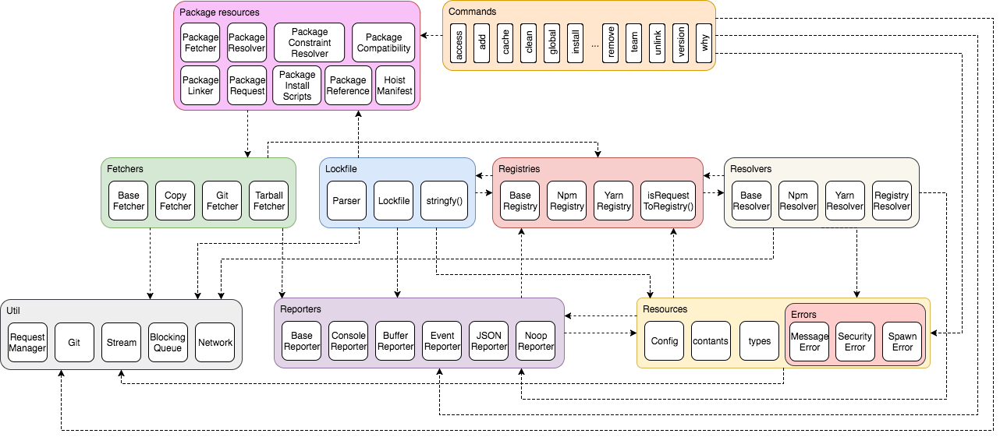

# Yarn

*Delft University of Technology*

**Abstract**

Yarn, an alternative client for the existing npm registry, went open-source at October 11th 2016.
Yarn started as an internal project at Facebook.
Now Google, Exponent and Tilde are collaborating.
For this chapter, the architecture of Yarn was analyzed in detail.
Furthermore, technical debt has been identified and solutions were proposed.
Some of these solutions were implemented and provided to the development team as contributions.
The Yarn project looks very promising, and is already used by a lot of people.
More and more projects are choosing Yarn over npm, and this will only increase as bugs are resolved and additional features roll out.

## Introduction
Over the past years, the growth of JavaScript (an implementation of  [ECMAScript](https://www.ecma-international.org/publications/standards/Ecma-262.htm)) has exploded.
It is used in almost every segment of programming, from [front-end](https://facebook.github.io/react/) to the world of [embedded](http://shop.oreilly.com/product/0636920041504.do) devices.

To be able to manage all components, libraries and frameworks written for all these applications, [Isaac Z. Schlueter](http://izs.me/) started work on the [npm](https://www.npmjs.com/) package manager and [npm registry](https://docs.npmjs.com/misc/registry).
Like JavaScript itself, the growth of the registry seems to have no ceiling.
In [Figure 1](#figure-1), the growth of the npm registry is displayed.

    

Figure 1. Diagram showing the growth of the npm registry. Source: modulecounts.com

But, the explosive growth of this ecosystem also brings on challenges.
[Facebook](https://www.facebook.com/) in particular had issues dealing with the growth of npm modules in their [React.js](https://facebook.github.io/react/) project.
This was due to the npm client's way of handling sub-dependencies, and the non-determinism of their install algorithm.

To solve these issues, Sebastian McKenzie([@kittens]), a Facebook employee, started work on [Yarn](https://yarnpkg.com/lang/en/) on [Jan 23rd 2016](https://github.com/yarnpkg/yarn/commit/086c2ecceb280b15cbece9337c1b588899a4a08c).
Soon after, [Exponent](https://blog.expo.io/), [Google](https://google.com), and [Tilde](http://www.tilde.io/) joined to collaborate on the project, discussing features, strategies and architecture.
Ten months later, the first [official release](https://code.facebook.com/posts/1840075619545360) of Yarn was public.

While the big issues with the npm client were resolved by Yarn, the speed of development and the ever-changing ecosystem for which Yarn is built resulted in new challenges.
Managing technical debt, dealing with open source development and keeping up with the demands of users are the biggest challenges for Yarn, in order to stay successful.
In this chapter, that process is analyzed, and meaningful contributions are provided and described.

## Stakeholder Analysis
As described before, one of the main reasons that Yarn was created, and thus exists, is Facebook and their product React.js.
They are two of the most important parties involved with Yarn, also known as stakeholders.
A stakeholder analysis was conducted to identify all the stakeholders of Yarn, according to the categories described in Rozanski and Woods (2012)  [[1](#rw)].
This section is dedicated to elaborating on this analysis.
The most significant and important stakeholders will be provided, together with a description of their role in the Yarn project.

### Acquirers
The incentive of creating Yarn started from Facebook, as they ran into problems with consistency, security, and performance with npm  [[2](#yarnfb)].
Yarn was launched by Facebook [[2](#yarnfb)] and most members of the core development team are employees of Facebook.

### Assessors
The complete Yarn project team is in a sense an assessor of Yarn, as all developers oversee the project and try to make sure that it conforms to standards and quality.
This is reinforced by their Code of Conduct, which states: "[They are responsible] for clarifying the standards of acceptable behavior and are expected to take appropriate and fair corrective action in response to any instances of unacceptable behavior" [[3](#coc)].
Three individuals stood out from this group: [@bestander], [@daniel15] and [@wycats].

- **[@bestander]** is an employee of Facebook.
He, at the time of writing, is the second highest contributor of the repository.
But more importantly, he takes an active role in [the GitHub repository](https://github.com/yarnpkg/yarn/) by overseeing and starting discussions and reviewing almost all the (recent) issues and PRs.
He is also very active on the [RFC GitHub](https://github.com/yarnpkg/rfcs), a place dedicated for the Yarn project team to discuss about important aspects of Yarn.
The RFC process is elaborated upon in [Release Management](#release-management).

- **[@daniel15]** is also part of Facebook.
He is, like [@bestander], also highly active on the GitHub repository.
He does a lot of explaining in issues and pull requests, helping external contributors with their improvements.

- **[@wycats]** is not an employee of Facebook.
He was approached due to his experience with application-level package managers ([Bundler](https://bundler.io/) for [Ruby](https://www.ruby-lang.org/en/) and [Cargo](https://crates.io/) for [Rust](https://www.rust-lang.org/en-US/)) and now part of the Yarn project team [[4](#wycats)].
Although his contributions in the form of lines of code are relatively low, his main importance comes from elsewhere.
He is actively involved on the [RFC repository for Yarn](https://github.com/yarnpkg/rfcs), and plays an important role in the discussion and decisions on features and the overall design of Yarn.

### Communicators
Communicators are described as parties which "provide training for support staff, developers, maintainers, and so on, and create manuals for the users and administrators of the product or system" [[1](#rw)].
To identify communicators, the history of various documents in the project have been looked into.
Examples are the `CONTRIBUTING.md`, a guide on how to correctly contribute to the Yarn project, the `README.md`, and the `CODE_OF_CONDUCT.md`.
In the history of these files, we have searched for people who have made significant contributions to these files with the purpose of guiding or helping other users.
Using this method, [@kittens], [@cpojer] and [@thejameskyle] were identified as communicators.
Not surprisingly, they are all members of the Yarn project team.

Next to these people, there are also all the contributors to the [GitHub repository of the website of Yarn](https://github.com/yarnpkg/website).
Their work is of significant value to other stakeholders, as the website contains startup guides, installation guides, manuals and more information about Yarn.

### Competitors
Before Yarn, two package managers for web development ecosystem existed.
At first [Bower](https://bower.io/) was seen as the early alternative to npm, then Yarn was created as an improvement over npm.
Following the announcement of Yarn [[2](#yarnfb)], Bower suggested its users to use Yarn instead of Bower despite the dropped support of Bower in Yarn [[5](#boweryarn)].
That left npm and Yarn as competitors of each other on the field.
Specifically, the npm client is the competitor of Yarn, as npm is also a supplier of Yarn due to its connection with the npm registry.

### Developers
For the developer stakeholders, the decision was made to split the category and define additional sub-types of developers.
The sub-types and their respective criteria are defined as follows:
_Core developers_, who have write access to the repository and contribute frequently,
_external contributors_, who do not have write access to the repository, and offer pull requests from forks of the repository.

- The _core developers_ of Yarn are [@kittens], [@bestander], [@daniel15], and [@cpojer].
These are the parties that started development before Yarn became open-source.
Not surprisingly, they are all part of the Yarn project team.
[@kittens] is by a significant difference in commits the top contributor to the Yarn project, as well as the creator of Yarn.

- Other developers that contributed significantly to the repository of Yarn, but are not part of the Yarn project team, are _external contributors_.
Currently, 232 contributors are listed on GitHub.
Together, they form the developers of the _Yarn community_.

### Suppliers
Suppliers are parties which "build and/or supply the hardware, software, or infrastructure on which the system will run" [[1](#rw)].
For Yarn, only npm was identified as a supplier.
This relation results from the reliance of Yarn on the npm registry [[2](#yarnfb)].
Although Yarn is created to replace the existing workflow of the npm client, thus being a competitor, it emphasizes the compatibility with the npm registry [[2](#yarnfb)].
As this registry is built, maintained and provided by npm, npm is classified as a supplier.

### Users
Besides Facebook, important users of Yarn are Exponent, Google and Tilde.
They were heavily involved in the design and creation of Yarn [[2](#yarnfb)].
The [Polymer](https://www.polymer-project.org/) team is another important user.
Polymer was approached by Facebook, asking what requirements they had for using Yarn [[6](#polymerVid)].
Other than Polymer, the Yarn team reached out to [Ember](https://emberjs.com/), [Angular](https://angularjs.org/) and [React.js](https://facebook.github.io/react/) to make sure that Yarn would be a good fit for projects that are using these frameworks [[4](#wycats)].
Last, but not least, there is the Yarn community.
Part of them, the developers, were already mentioned.
Not all of the community are developers, but every person in the community is a user of Yarn.
They define what they expect of Yarn, mainly through GitHub issues, and ultimately form and make use of Yarn.

## Context View

The context view ([Figure 2](#figure-2)) shows the interaction between Yarn and its environment.
The most important stakeholders are represented in the view.
The user base of Yarn is slowly growing as people and projects are trying it out as a substitute for npm.
Yarn lists Bundler, Cargo and npm as inspiration in the readme of their GitHub page [[7](#yarn-github)].
Bundler is a manager for Ruby application's gem dependencies.
Cargo is the package manager for Rust and npm is the preceding JavaScript package manager.

  

  Figure 2. Diagram displaying the context of Yarn.
  

Yarn is implemented in JavaScript that runs on [Node.js](https://nodejs.org/en/).
The packages a user can install are retrieved from the npm registry.
[Flow.js](https://github.com/flowjs/) is used to typecheck the code.

For continuous integration (CI), [Travis CI](https://github.com/travis-ci), [CircleCI](https://github.com/circleci) and [AppVeyor](https://github.com/appveyor) are used.
These three services are not only used for continuous integration, they are also functioning as separate integration tests to check compatibility.
The community of Yarn exists on [Twitter](https://twitter.com/yarnpkg), [Facebook](https://www.facebook.com/yarnpkg), [Discord](https://discord.gg/yarnpkg), [GitHub](https://github.com/yarnpkg) and on their [own site](https://yarnpkg.com/lang/en/) (where the documentation also exists).

Official support of the Yarn project is given by numerous projects, these include Angular, Polymer, React.js and Bower.
Bower even went as far as mentioning Yarn as their successor [[5](#boweryarn)].

## Performance Perspective

Performance is one of the key features of Yarn, prominently displayed on the [homepage](https://yarnpkg.com/lang/en/) (see [Figure 3](#figure-3)).
In this section, the architectural decisions made to ensure high performance are listed.

  

  Figure 3. Performance advertised as one of the key features of Yarn.
  

One of the primary usecases for Yarn is the performance feature compared to the npm.
In the initial blogpost of Yarn [[2](#yarnfb)], the developers point out that by parallelizing operations the installation of dependencies is significantly faster via Yarn compared to npm.
The most known usecase is [React Native](https://facebook.github.io/react-native/).
Concrete benchmarks are published [on the Yarn website](https://yarnpkg.com/en/compare) for which different configurations of Yarn are compared against the npm client.
These benchmarks show that the installation process of Yarn is an order of magnitude faster.

### Architectural Support for Performance
The parallelization of Yarn's installation process occurs in three different phases [[2](#yarnfb)]:

* Resolution of dependencies
* Fetching dependencies
* Linking(/Copying) dependencies

These three different phases correspond to the package structure, as described in [the functional view](#functional-view-1).
For each dependency, the first step is to resolve the package in the registry.
This step will include discovery of its sub-dependencies.
First, all resolutions are done in parallel.
Then, if there are any sub-dependencies, they are asynchronously added to the set of dependencies.
Finally, once all dependencies are resolved, the resolution phase is finished.

Every resolved dependency is saved and written to a `yarn.lock` lockfile.
The lockfile of Yarn locks down a resolved version, which means that consecutive installations do not require resolution.
Memory and storage is therefore sacrificed in favor of preventing network requests to resolve dependencies.

Once all dependencies are resolved, or read from the lockfile, the content of each dependency is fetched.
Yarn maintains a global cache on the users machine, in which one installation per version exists for every package.
In other words, there will be one instance of `A@1.0` and once instance of `A@2.0` in the global cache.
When a dependency is fetched, the fetcher first checks this global cache.
If a package already exists there, then no network request is triggered.
Else, a network request is spawned and the content of the dependency is inserted in the global cache.
Finally, the dependency is copied into the local `node_modules/`.
This architectural approach ensures that re-installation of common packages does not unnecessarily delay the install process.

Every step for each dependency is fully asynchronous in the Yarn architecture, which allows full parallelization of every installation step.

## Architecture
The architecture of a system is dependent on the processes and workflows of the development team, as well as the project itself.
To illustrate this, this section first explains the high-level package structure, then identifies key design patterns.
Next, an analysis of the testing practices of the development team is discussed.
Finally, the Yarn release process is analyzed.

### Package Structure
Yarn has several distinct functional elements performing various functions.
The aim of this section is to identify these elements, and describe their responsibilities and interaction.
For this, the top-level packages from the folder with the main functionality, `src/`, are used.
These packages are the most representative for the elements in the project, as they group the underlying modules by functionality.
In the end, [Figure 4](#figure-4) shows a diagram displaying the overall structure.

Almost every package exports all functionality in an `index.js`, to ease the importing of classes in this package.
Moreover, it allows developers to restructure a package later, without breaking the usages of the APIs exposed in the package if they would directly reference the source files.

#### Starting The Process
The main interaction between Yarn and its users is via the cli commands.
Whenever a user issues a command, it will trigger a corresponding process.
The details of this process are described in the corresponding command file in `Commands`.
The whole process is then orchestrated using the `Package Resources`.
One of the major processes is the installation process, which will be covered step for step in this section.

#### Resolving Dependencies
The first step in this process is to resolve all the dependencies of the user.
Resolvers are responsible for resolving the location of the packages specified by the user.
Based on the incoming package name and version, the resolver determines where the actual source code/distribution of the dependency is stored.
Several implementations are available in the `resolvers` package, which can resolve to external sources such as GitHub.

After obtaining the location of a package, the resolver puts all the information inside a registry.
`Registries` are responsible for retrieving information of packages from the global npm registry.
Several registry strategies are implemented in this package.

#### Fetching Dependencies
After resolving all the dependencies, all the registries containing their information are received by `Fetchers`.
Fetchers are used to retrieve the content of external dependencies from their respective sources.
Multiple extensions of the base class are implemented for the specific sources.

#### Linking Dependencies
The last step of this process is to link everything together, after fetching all the dependencies from their respective sources.
This is done in in the project folder of the user.
Essential in this process is the `Lockfile`.
The lockfile, as its name suggests, is responsible for locking down the package versions of all dependencies from a project.
The functionality of parsing and writing the lockfile is implemented in this element.
Details of this process are provided in the [performance perspective](#performance-perspective).

#### Common Resources
The above process is described with the main workflow as a common thread.
Due to this, some elements are not touched upon, as they are mostly used for tasks outside of the main scope. Here, these elements are listed and described.

- **Reporters.** Yarn can report its status via various reporters.
The primary implementation of `BaseReporter` is the `ConsoleReporter`, which has its own subfolder `reporters/console/`.
This package also handles localization in the `reporters/lang/` package.
- **Util.** The biggest package thus far is `util`, which contains numerous files with specific functionalities which would not fit in a different package.
This package also contains classes that implement functionality that is used by multiple other packages.
There does not seem to be a cohesive organisation in this package with one other than `index.js` exposing the other classes.
- **Top level resources.** The top level package contains several resources, including config and types for the application.
Moreover, it contains the errors used to report to the user and logic to handle package content.

[Figure 4](#figure-4) displays the relations between the elements that are described in the whole process above.
An arrow from package A to B indicates that A depends on B.

  

  Figure 4. Diagram displaying the package structure of Yarn.
  

### Identifying Key Design Patterns

Keeping a piece of software maintainable, stems in having a great baseline architecture.
Part of this architecture is the proper application of design patterns.

#### Strategy Pattern in Fetchers and Resolvers
Since packages that can be installed by Yarn can come from different sources, it is important to consider these different paths.
For example, resolving a request for a package can go through the npm registry most of the time, but for some packages this does not hold.
An example is internal packages hosted on the organization's GitHub.

To summarize from Yarn's announcement blog [[2](#yarnfb)], the installation process of a package is:

1. Recursively resolve all dependencies of a package.
2. Fetch the package by first checking if it is already downloaded, and if not, download it from the source.
3. Link everything together by copying the files from the global cache into the `node_modules` directory.

These steps ensure a deterministic install.

The first two steps make sure the packages can come from a wide range of sources.
To achieve this, Yarn employs a strategy pattern.
Yarn analyzes the `lockfile` and `package.json`, and retrieves all names and/or [git](https://git-scm.com/) repositories from all packages listed.
By resolving these dependencies through the corresponding resolvers, it is possible to support many sources in a stable and governed way.

If a package is not already cached locally, it needs to be fetched.
Again, depending on where the package is hosted, Yarn employs a different strategy to actually fetch the package.
Some sources provide compressed archives, others are git repositories that need to be cloned, while even others may simply exist on the filesystem.
These different strategies are all very neatly implemented, extending from a base class to deduplicate common logic.
A caveat we encountered was that some functions were defined in the base class, to instantly reject the `Promise` returned.
This is done because JavaScript does not have abstract classes, allowing the forced implementation by a subclass.
With the current size of these classes, it is still manageable to catch these methods by hand.
It should be noted that is not an ideal solution.
This is a direct limitation of both the language and the typechecker used by Yarn.

#### Adapter Pattern for the JSON Reporter
The reporters can distribute the output for Yarn commands to various destinations in various formats.
Among other use cases, this is primarily used to be able to report to users in the console, as well as save reports during CI processes.
The [JSON](http://www.json.org/) reporter [[8](#json-reporter)], for example, writes all reports to a JSON structure, which is saved to a file.
Since most of the messages can be handled in the same way, most methods in this reporter do the exact same thing: call the `_dump` method with the type of message and the details.
That method then writes the object to the file.
Because its job is to translate from one system to the other, this is an adapter pattern that transforms the workflow of the reporters to that of a file writer.

### Testing Strategy

Testing is an integral part of the review process for Yarn.
For every bug fix and feature addition, tests as well as a test plan are required.
There are multiple practices for testing code.
First of all, every bug fix requires a unit test that reproduces the original issue and (once the fix has been applied) verifies the issue is resolved.
The unit test also serves as a regression test, to make sure that the original bug is not reintroduced after other changes are made to the system.
Secondly, feature additions are tested with integration tests.
Examples of such integration tests can be found in the test suite for CLI commands in `__tests__/commands/`.

Tests are run via `yarn test`, essentially bootstrapping Yarn's functionality to invoke scripts to also execute the tests.
The actual tests are run by [Jest](https://github.com/facebook/jest), a testing framework also developed by Facebook.
Jest can run tests concurrently, to speed up the build and also test potential concurrency issues for Yarn.
When running the tests, several coverage metrics are also measured.
The overall coverage can be inspected after all tests are executed.
[@kittens] indicated that [obtaining near 100% coverage](https://github.com/yarnpkg/yarn/issues/510) is a goal of the development team.
At the time of writing, the coverage is around 60%, which could be improved.

#### Ensuring Continuous Code Quality
One notable thing on the Yarn GitHub page is the usage of three different CI services, namely Travis CI, CircleCI and AppVeyor.
Normally, one service is enough to check whether all tests succeed.
In the case of Yarn, however, every CI service has additional functionality as a platform test.
If the build fails on one of the services, this could indicate a platform specific bug.
In practice, it often occurs that one of the CI services fails.
This is caused by timeout errors that we also experienced locally.
The failing test suite probably depends on an active internet connection and a slight delay in this has a probability to fail the test.

### Release Management

In [#376](https://github.com/yarnpkg/yarn/issues/376), [@kittens] asks [@bestander] and [@wycats] suggestions for a regular release process.
[@wycats] suggests a six week release cycle, as used in Rust and Ember (acquired from [Chrome](https://www.google.com/chrome/) and [Firefox](https://www.mozilla.org/en-US/firefox/products/)), which means that every six weeks a new major version is released.
Bugfixes can still be released as fast as possible, but under strict CI.
At the point of writing, the focus of Yarn lies mainly at fixing bugs and resolving issues, and less on adding new functionalities.
Despite this, new substantial features are still welcome.
For this, developers are directed to follow the Request For Comments (RFC) process happening in the [yarnpkg/RFCs](https://github.com/yarnpkg/rfcs) repository.

The intention of the RFC process is the control of new features that people suggest to add to the project.
This process is meant for people that want to suggest "substantial" changes to Yarn or its documentation.
A few examples of these changes are:
- A feature with a new API surface area that requires a feature flag (described in [feature flag](#feature-flags) section below).
- The removal of one or more features that are already shipped as part of a release.
- Introduction of new idiomatic usage or conventions, even when it includes no code changes to Yarn itself.

>The RFC process is a great opportunity to get more eyeballs on your proposal before it becomes a part of a released version of Yarn. Quite often, even proposals that seem "obvious" can be significantly improved once a wider group of interested people have a chance to weigh in. Source: [Readme RFCs repository](https://github.com/yarnpkg/rfcs/blob/4928eabd3f673bee4700039a3a8dd328c6daec21/README.md#when-to-follow-this-process)

All development to the Yarn project happens via pull requests, forcing the run through CI.
The master branch must always have a succeeding CI run.

After the first major release, the focus is kept on closing issues as fast as possible.
When that slows down, the six-week major release cycle will be adopted.
This slow down has not yet happened at the time of writing.

The fast release process is largely automated by [@bestander].
The master branch is taken and a new version-stable branch is created along with a tag.
CI is triggered and builds a .tar file, that is deployed to GitHub releases.
Then, [@bestander] tests it on internal Facebook repositories.
Any bugs found will be reported in issues.
When fixes for these bugs are merged into master, they are added to the version branch.
After that, the changes are added to npm, and the CI builds and deploys the new version.

#### Feature Flags

As mentioned before, before adding a new feature, the RFC process is followed.
When a new feature is being developed it is wrapped in a feature flag.
This means that this feature is not used by default in the Yarn application, but can be enabled by enabling the corresponding flag.
When a feature is stable enough, the decision can be made to enable this feature by default and therefore disabling the feature flag ability for this feature.

## Technical Debt
Technical debt is "a metaphor for tasks that were left undone, but that run a risk of causing future problem if not completed" [[9](#techdebtseaman)].
Identifying technical debt is therefore an interesting task to measure the maintainability and stability of Yarn.

To analyze the technical debt of Yarn, several inspections tools were run on the source code.

### Code Smells
[JSInspect](https://github.com/danielstjules/jsinspect) provides a report in the console of the matches it found.
A match consists of the detected common source code and the files between which this code is shared.
Additionally, the diff between these files is also provided, highlighting the differences and similarities.

    

    Figure 5. Result of a JSInspect run on the Yarn `src/` folder.

At the time of writing, an execution of `jsinspect` on the `src/` folder of the Yarn project resulted in 32 matches found across 123 files (see [Figure 5](#figure-5)).
Not all of them, however, are actual code smells, as JSInspect looks for any similarity between source code and matches onto that.
The correctly identified code smells are mostly duplication, such as three instances of the same error reporting function in one file.
The risk involved with this is the [Shotgun Surgery](https://sourcemaking.com/refactoring/smells/shotgun-surgery) code smell, where modifications require changes at multiple locations.

### Code Maintainability
[Plato](https://github.com/es-analysis/plato), a JavaScript tool with the purpose of visualizing source complexity of JavaScript files and projects, was also used to analyze the project.
Running Plato creates a detailed report focusing on Maintainability, Source Lines of Code (SLOC), Proneness to Errors and Complexity of the code.

  

  Figure 6. Maintainability score of each individual source file in Yarn.
  

Overall, Yarn receives a maintainability index of 68.94 and has an average of 136 SLOC per file.
The maintainability index is based on a combination of factors, namely cyclomatic complexity, halstead volume and lines of code  [[10](#maintainindex)].
The index ranges between 0 and 100 [[10](#maintainindex)], indicating the relative ease of maintaining the code, with a high value indicating better maintainability.
Observing the indices of all the individual source files, (see [Figure 6](#figure-6)), it can be seen that all the files are close to the overall index of the project.
With the exception of `src/reporters/lang/en.js`, no significant outliers are present in the project.
Manual inspection shows that `src/reporters/lang/en.js` is only used to declare message constants, explaining the very low maintainability index.
As no real maintenance can be performed on this file, this low index can safely be ignored.

  

  Figure 7. Source lines of code of each individual source file in Yarn.
  

As mentioned before, the average source file of Yarn contains 136 SLOC.
A more informative metric would be to see the relation of this metric between files.
Therefore, the SLOC for every individual source file in the Yarn project is shown in [Figure 7](#figure-7).
Contrary to the maintainability index discussed before, a large amount of variation in SLOC can be observed between the source files of the project.
Two files stand out significantly from the rest in terms of SLOC, namely `src/cli/commands/install.js` and `src/util/fs.js` with 800 and 769 lines respectively.
Both of these files are susceptible of large functions and classes, and containing too many responsibilities.
Consequently, these files have a below average maintainability index, 61.54 and 61.61 respectively, and are at risk of becoming a [God Class](https://sourcemaking.com/antipatterns/the-blob).

### Current Code Coverage
Testing is an integral part of the workflow of the Yarn core team.
Issue [#510](https://github.com/yarnpkg/yarn/issues/510) shows that the team is actively aware of its code coverage and aims to increase the overall coverage.
The code coverage of Yarn is integrated in the test runner Jest per the [`--coverage`](https://facebook.github.io/jest/docs/cli.html#coverage) CLI option.
A `coverage/` folder is created which shows a webpage (see [Figure 8](#figure-8)) with the coverage per folder, file and even per line.

  

  Figure 8. Diagram displaying the code coverage per folder.
  

Initially the coverage report did not show the coverage for completely uncovered files.
A [pull request](https://github.com/yarnpkg/yarn/pull/2892) was submitted to trigger the coverage for all files in the source folder.
The total statement coverage is therefore at the moment of writing 67,18%.
Primarily the `cli/commands/` folder is largely untested, with a lot of commands 0% covered.
There is no apparent reason, however in the pull request that introduced a lot of the commands, [@kittens] noted that [tests will be deferred to a new PR](https://github.com/yarnpkg/yarn/pull/235#issuecomment-241946099).
Up to this moment, these tests are non-existent and therefore a clear example of technical debt.
Other folders (apart from `cli/`) are significantly better covered; the majority of them has a coverage of 80% or higher.

### Mitigation of Technical Debt
In order to mitigate as much technical debt as possible, Yarn makes use of the issues and pull requests of GitHub.
By reviewing each others work in pull requests, technical debt is prevented as much as possible.

Issues on GitHub are used a lot: on March 11th 2017 more than 700 open issues exist and over 1200 issues are closed.
The big issue at the moment is that more issues are opened than closed in the same timeframe.
Because of this, it is becoming more and more difficult to monitor all issues.
A lot of these issues should have probably been closed, but as the amount is so big, keeping track is difficult.

In order to guide external developers trough the process of contributing, [CONTRIBUTING.md](https://github.com/yarnpkg/yarn/blob/19eb5007510f039c61630948b01a491c3ccdde23/CONTRIBUTING.md) lists five steps to follow before opening a pull request:

> 1. Fork the repo and create your branch from `master`.
> 2. If you've added code that should be tested, add tests.
> 3. If you've changed APIs, update the documentation.
> 4. Ensure the test suite passes.
> 5. Make sure your code lints.

Testing and documentation play a role in these steps, contributing to the mitigation of technical debt.
Every opened pull request is reviewed by at least one core developer, and if needed, more developers are notified and asked for an opinion.
It seems that the core developers have distributed categories of contributions, which can be seen in who replies to a pull request.
For example, [@bestander]'s main focus is on contributions related to implementation, while [@daniel15] is more focused on reviewing project related contributions.

When someone wants to submit a "substantial" change, the Yarn team requests an additional design process through the yarnpkg/rfcs repository.
The description of a substantial change is described in [the README of the RFCS repository](https://github.com/yarnpkg/rfcs/blob/4928eabd3f673bee4700039a3a8dd328c6daec21/README.md#when-to-follow-this-process).
In the section [Release Management](#release-management), the RFC process is explained.
This process is used to "produce consensus among the Yarn core team".

A great example of the complete contributing process can be found in [#2836](https://github.com/yarnpkg/yarn/pull/2836).
Quoting the reaction of [@bestander] on this pull request:
> Great job on pushing through the whole feature from RFC to great implementation with tests and docs, [@dguo]!

## Conclusion

With the speed Yarn was brought to market, the challenges it faces in the ecosystem, and the dependency on the npm registry, it is maneuvering in a difficult space.
However, Yarn has a solid foundation with multiple big companies expressing interest and contributing their time to make sure it is a qualitatively excellent tool.
Beyond that, the open source community is very vocal about their issues, needs and desires.

In this chapter, we have analyzed Yarn's architecture from different viewpoints, including the package structure and inter-dependencies.
Here, we found that Yarn is ready for growth, with an open structure to add more functionality.
We identified technical debt in the codebase, and how Yarn deals with this debt.
For some of the issues identified, we have been able to propose fixes by opening several pull requests.

With the adoption of Yarn in the ecosystem, the transparent RFC process, and the solid core team, we are confident Yarn can overcome its challenges and will continue to be a key player in the JavaScript ecosystem.

## References
<!-- Stakeholders -->
1. 
Nick Rozanski and Eoin Woods. Software Systems Architecture: Working with Stakeholders using Viewpoints and Perspectives. Addison-Wesley, 2012.
2. 
Sebastian McKenzie, Christoph Pojer, James Kyle. Yarn: A new package manager for JavaScript. https://code.facebook.com. 2016.
3. 
Contributor Covenant Code of Conduct. https://github.com/yarnpkg/yarn/blob/12ff2bca446f2173de8c0861cb61b075fbf726f9/CODE_OF_CONDUCT.md. 25 Aug 2016.
4. 
Yehuda Katz. Why I'm Working on Yarn. http://yehudakatz.com/2016/10/11/im-excited-to-work-on-yarn-the-new-js-package-manager-2/, 11 Oct 2016.
5. 
Ben Mann. Using Bower with Yarn. https://bower.io/blog/2016/using-bower-with-yarn/. 12 Oct 2016.
6. 
Google Chrome Developers. What's New in Polymer Tools (Polymer Summit 2016). https://youtu.be/guYHn0P8bKQ?t=17m10s. 18 Oct 2016.
<!-- /Stakeholders -->
<!-- Context View -->
7. 
Yarn README.md. https://github.com/yarnpkg/yarn/blob/19eb5007510f039c61630948b01a491c3ccdde23/README.md. February 27, 2017.
<!-- /Context View -->
<!-- Architecture -->
8. 
https://github.com/yarnpkg/yarn/blob/89f181491e1258032c2b0365855ee2f1c37a913d/src/reporters/json-reporter.js. March 6, 2017.
<!-- /Architecture -->
<!-- Tech debt -->
9. 
Measuring and Monitoring Technical Debt, Carolyn Seaman, University of Maryland Baltimore County https://pdfs.semanticscholar.org/81c0/8b976f959b092f3768c74c4c307cba55a853.pdf. March 27, 2013.
10. 
Maintainability Index Range and Meaning. https://blogs.msdn.microsoft.com/codeanalysis/2007/11/20/maintainability-index-range-and-meaning/. November 20, 2007.
<!-- /Tech debt -->

[@arcanis]: https://github.com/arcanis
[@bestander]: https://github.com/bestander
[@cpojer]: https://github.com/cpojer
[@daniel15]: https://github.com/daniel15
[@dguo]: https://github.com/dguo
[@keraito]: https://github.com/keraito
[@kittens]: https://github.com/kittens
[@thejameskyle]: https://github.com/thejameskyle
[@timvdlippe]: https://github.com/timvdLippe
[@wycats]: https://github.com/wycats
